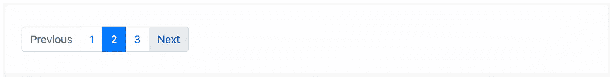
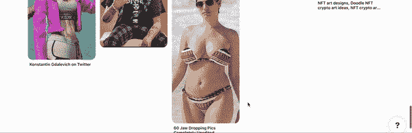
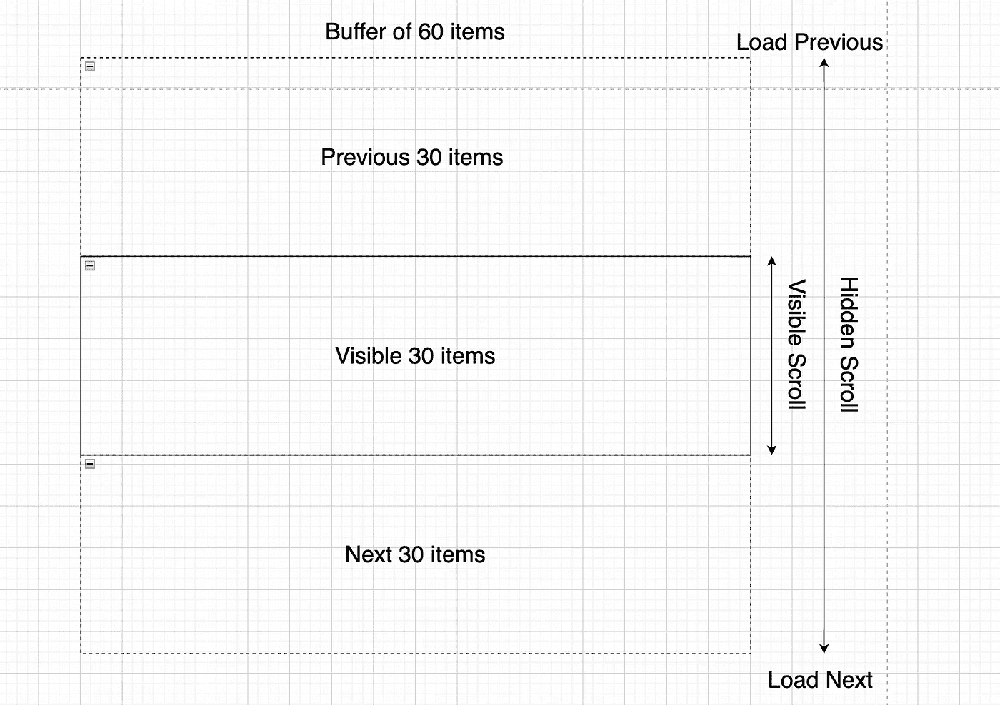

# ⚛️建筑反应虚拟滚动在 5 分钟-替代分页和无限滚动

> 原文：<https://itnext.io/%EF%B8%8F-building-reactvirtual-scroll-in-5-min-alternative-to-pagination-and-infinite-scroll-515e0e329e76?source=collection_archive---------0----------------------->

## 结合分页和无限滚动的优点，增强用户体验和性能


# 内容

*   [**简介**](#83ba)
*   [**3 选项优化性能长列表**](#01b8)
*   [**1。**分页](#d5dd)
*   [**2。无限卷轴**](#45a4)
*   [**3。虚拟卷轴**](#b05f)
*   [**建筑虚拟卷轴使用**](#95d8)
*   [**GitHub 链接**](#2a1c)
*   [**结论**](#0894)
*   [**了解更多**](#f9b1)

# 介绍

每个开发人员，尤其是前端人员，在编写代码时都必须考虑到性能。你不能纯粹使用普通的 js 来编写 web 应用程序，这可能太耗时了，所以你必须在流行的框架中做出选择。大多数框架，如 React 和 Angular，已经考虑了开发过程中可能发生的性能问题。如果您有兴趣阅读更多关于 React 性能的内容，可以查看这篇文章:

[](/️-top-7-tweaks-and-tricks-to-improve-react-performance-8957bab33266) [## ⚛️提高 React 性能的 7 大调整和技巧

### 如果您还没有看到性能问题，并不意味着它们不存在😄

itnext.io](/️-top-7-tweaks-and-tricks-to-improve-react-performance-8957bab33266) 

因此，我们也将讨论性能，但主要焦点是数据的**渲染长列表**。在数据驱动的 web 应用程序中，这是一个非常常见的用例。当后端产生太多数据，所以前端可能很难呈现。我们将通过不同的例子来说明如何优化列表的呈现性能。最后实现了**虚拟滚动模型。它可能非常普通，但我们将在展示中使用 React。**

# 优化长列表性能的 3 个选项

我们将比较最流行的列表渲染模型。每个模型都有自己的优点和 CONS。并且由开发人员为特定的用例选择正确的。这将取决于要求和限制。因此，我们可以考虑以下选项:

*   **分页** —经典分页，基于*偏移*和*限位*；
*   **无限卷轴**——也是非常受欢迎的机型，最好的例子可能是[Pinterest](https://www.pinterest.com/)；
*   虚拟滚动是一个替代模型，它结合了分页和无限滚动用户体验的优点，我们将使用 React 实现这个模型

所有的模型都是基于相同的原则，不要渲染客户端视图中没有的元素。说完这句话，我们开始吧。

# 1.分页

嗯，这个渲染模型不需要太多解释。大多数开发人员在其职业生涯中至少遇到过一次。最常见的设计基于两个变量**偏移**和**限制:**

*   **限制** —它与每页的项目数**相同**，即我们希望每个 API 调用请求多少个项目。
*   **偏移** —光标的**当前位置**。例如，如果我们有 100 个索引从 0 到 99 的项目，并且限制为 20 个，那么第一个调用将看起来是`limit=20&offset=0`(它将给出索引从 0 到 19 的项目列表)，而下一个调用(下一页)将是`limit=20&offset=20`(范围是 20 到 39)

此外，该请求可以包含页面数据，页面数据可以包括:页数、总项目数以及下一页是否存在。页面数据输出可能因实现方式而异。



让我们转到下一个模型。

# 2.无限卷轴

无限卷轴使用了同样的**偏移，限制**的方法，不同的是视觉设计和用户体验。最初，我们只加载由**限制**定义的数据缓冲区。当我们向下滚动并到达(或接近)列表底部时，我们调用下一个数据块，并在等待时显示一些加载指示器。加载一个新的块后，我们把它添加到列表的尾部。以后我们可以继续滚动并重复同样的动作，这就是为什么这种方法被称为**无限滚动**。



这种模式有一个缺点。每次我们加载和追加新数据时，我们的**列表将继续增长**。我们滚动得越多，它就越大。这可能效率不高，因为我们必须将所有数据保存在内存中，并且在大多数实现中，还要将数据保存在 DOM 中。浏览器无法呈现如此大量的数据后，性能将会降低。另一个问题是追加列表**不包括新数据**，它缓存状态。与**分页**相反，其中您可以浏览页面，如下一页和上一页，并获得刷新的数据。

无限滚动模式的用户体验更加自然，并且考虑到了移动优先(与**分页**相比)。这就是它被广泛应用于 Instagram 或脸书 feeds 等现代网络应用的原因。

但是有一种方法可以优化无限滚动，通过分页特性来增强它。

# 3.虚拟卷轴

无限滚动缺少分页使用的一项功能，即上一页和下一页导航以加载新数据。此外，我们不需要将所有新数据保存在内存中，我们可以只保存缓冲区，并在最近的 API 调用后更新它。但是，我们如何才能保持与 Infinity scroll 相同的用户体验呢？又来了一个模型——**虚拟卷轴**。该模型具有以下特征。

*   使用相同的偏移、限制模式；
*   我们保留缓冲区中的最大项数，等于 **limit * 3** (例如:如果 limit 为 20，则最大缓冲区为 60)**；**
*   只有**有限**数量的项目在视窗中可见(例如限制为 20)；
*   这个概念类似于一个有 3 个记录的**双向链表**:上一个限制、当前限制和下一个限制。你也可以把它想象成一扇推拉窗；
*   如果我们滚动到列表的底部，加载新的 next 并更新缓冲区:previous(丢弃) **- > x** current(新的上一个) **- >** next(新的当前) **- > +- >新的 next；**
*   如果我们滚动到顶部，加载新的 previous 并更新缓冲区:**新的 previous****->+->**previous(新的当前) **- >** 当前(新的下一个) **- > x** 下一个(丢弃)；
*   当加载一个新的块时，我们需要显示一些加载指示器；

如果到目前为止还没有意义，不要担心，我们将浏览示例并实现它，这样一切都变得更清楚了。



听起来这可能很难实现，因为我们需要控制滚动并确保缓冲区被正确更新。

让我们挑战它，建立虚拟卷轴原型。

# 使用 React 构建虚拟滚动

此时，我们将尝试构建一个虚拟卷轴来演示这个概念。我们将在示例中使用 React。

首先，让我们使用 create react 命令和 typescript 选项生成一个 React 应用程序:

```
npx create-react-app react-virtual-scroll --template typescript
```

现在让我们打开`App.tsx`文件并创建一个模拟 API 调用。它将只接收两个参数:**偏移**和**限制。**

```
const callApi = (offset: number, limit: number) => {
  return new Promise((resolve) => {
    const items = [] as any
    for (let index = offset; index < offset + limit; index++) {
      items.push('label ' + index)
    }

    setTimeout(() => {
      resolve(items)
    }, 2000)
  })
}
```

它将向我们返回字符串数组`label ${index}`，其中索引是当前光标位置。稍后，我们需要初始化`App.tsx`中的常量和状态

```
function App() { 
  const limit = 100
  // the number of items that we want to keep in memory - 300
  const buffer = limit * 3
  // the number of items that we want to cache when new chunk of data is loaded 
  const cache = buffer - limit
  const [items, setItems] = useState([])
  const [isLoading, setIsLoading] = useState(false)
```

我们需要第一次调用 API 来初始化`useEffect`中的数据

```
useEffect(() => {
    setIsLoading(true)
    callApi(0, buffer).then((res: any) => {
      setItems(res)
      setIsLoading(false)
    })
  }, [])
```

然后，我们将实现两个回调，一个是当滚动到达列表包装的顶部时，另一个是当滚动到达列表包装的底部时。让我们看看它是什么样子的:

```
 const prevCallback = (newOffset: number) => {
    setIsLoading(true)

    return callApi(newOffset, limit).then((res: any) => {
      const newItems = [...res, ...items.slice(0, cache)] as any
      setItems(newItems)
      setIsLoading(false)
      return true
    })
  }

  const nextCallback = (newOffset: number) => {
    setIsLoading(true)

    return callApi(newOffset, limit).then((res: any) => {
      const newItems = [...items.slice(-cache), ...res] as any
      setItems(newItems)
      setIsLoading(false)
      return true
    })
  }
```

> *当我们到达顶部时，我们加载先前的块，将其添加到头部并丢弃尾部。否则，当我们到达底部时，我们附加到尾部并丢弃头部。*

现在，让我们渲染列表并将其包装到`UiVirtualScroll`组件中，我们将在下一步实现它:

```
 return (
    <div className="App">
      <UiVirtualScroll
        buffer={buffer}
        rowHeight={39}
        height="50vh"
        limit={limit}
        onPrevCallback={prevCallback}
        onNextCallback={nextCallback}
      >
        <>
          {items.map((item: any, index: number) => (
            <div style={{ padding: '10px' }}>
              {isLoading ? <>Loading...</> : item}
            </div>
          ))}
        </>
      </UiVirtualScroll>
    </div>
  )
```

我们需要`rowHeight`来计算列表更新时滚动的正确位置。和`height`来应用*覆盖层*。

现在，让我们继续前进，最终实现`UiVirtualScroll`组件。

让我们初始化状态:

```
const UiVirtualScroll: FunctionComponent<UiVirtualScrollProps> = ({
  offset = 0,
  buffer,
  limit,
  rowHeight,
  height,
  onPrevCallback,
  onNextCallback,
  children,
}) => {
  // create overlay reference to trigger the change scroll position
  const overlayRef: any = useRef<any>(null)

  // create two cursors of lower and upper boundary of cached items indices
  // initial upper boundary index is 0
  const [upperBoundary, setUpperBoundary] = useState(offset)
  // initial lower boundary index is 300-1 = 299
  const [lowerBoundary, setLowerBoundary] = useState(buffer - 1)
  const [isLoading, setIsLoading] = useState(false)
  // current scroll position starting with 0
  const [currentScrollTopPosition, setCurrentScrollTopPosition] = useState(0)
```

然后，呈现包装的列表项(我们将在下一步实现`handleScroll`):

```
return (
    <div
      ref={overlayRef}
      style={{ height, overflow: 'scroll' }}
      onScroll={(e: any) => handleScroll(e.target)}
    >
      {children}
    </div>
  )
```

现在我们移到了最有趣的部分，我们需要处理滚动，触发上一个和下一个回调，更新边界并将滚动移动到新的位置。看起来是这样的:

```
const handleScroll = (target: any) => {
    // ignore the scroll if data is loading
    if (isLoading) {
      return
    }

    // get the current position of the scroll
    const scrollTop = Math.round(target.scrollTop)
    // extracting the client height and scroll height to calculate the top scroll maximum position
    // where is highest scroll position is scrollHeight = clientHeight + scrollTop
    const clientHeight = Math.round(target.clientHeight)
    const scrollHeight = Math.round(target.scrollHeight)

    // defining if we currently scrolling up or down
    const isUp = scrollTop < currentScrollTopPosition

    if (isUp && scrollTop === 0) {
      setIsLoading(true)

      onPrevCallback(upperBoundary - limit).then(() => {
        // update boundaries to move indices - limit
        setUpperBoundary(upperBoundary - limit)
        setLowerBoundary(lowerBoundary - limit)

        // move scroll position to 1 limit height
        if (overlayRef !== null) {
          const scrollPos = limit * rowHeight
          overlayRef.current.scrollTo(0, scrollPos)
        }
        setIsLoading(false)
      })
    } else if (!isUp && scrollTop + clientHeight >= scrollHeight) {
      setIsLoading(true)

      onNextCallback(lowerBoundary).then(() => {
        // update boundaries to move indices + limit
        setUpperBoundary(upperBoundary + limit)
        setLowerBoundary(lowerBoundary + limit)

        if (overlayRef !== null) {
          const scrollPos = limit * rowHeight
          // move scroll position to 2 limits height
          overlayRef.current.scrollTo(0, scrollPos * 2)
        }
        setIsLoading(false)
      })
    }
    // update the current cursor position
    setCurrentScrollTopPosition(scrollTop)
  }
```

这就是所有的实现，您可以通过浏览注释来跟踪每一行在做什么。

这是最终的工作原理:


您也可以通过下面的链接直接从 GitHub 克隆实现。

# GitHub 链接

[](https://github.com/Vitashev/react-virtual-scroll) [## GitHub-Vitashev/react-虚拟滚动

### 这个项目是用 Create React App 引导的。在项目目录中，您可以运行:在…中运行应用程序

github.com](https://github.com/Vitashev/react-virtual-scroll) 

# 结论

我们已经完成了虚拟滚动实现，以后可以扩展以满足您的需求。希望您现在已经清楚了分页和无限滚动之间的区别，并且已经了解了结合这两种模型优点的替代解决方案。选择越多越好，因为不同项目的需求会有很大的不同。*命中👏如果你今天学到了新东西。还有别忘了* ***关注*** *和* ***订阅*** *不要错过新内容。*

[](https://easy-web.medium.com/subscribe) [## 每当维塔利·舍甫琴科发表文章时，就收到一封电子邮件。

### 每当维塔利·舍甫琴科发表文章时，就收到一封电子邮件。通过注册，您将创建一个中型帐户，如果您还没有…

easy-web.medium.com](https://easy-web.medium.com/subscribe) 

# 了解更多信息

[](/️-top-7-tweaks-and-tricks-to-improve-react-performance-8957bab33266) [## ⚛️提高 React 性能的 7 大调整和技巧

### 如果您还没有看到性能问题，并不意味着它们不存在😄

itnext.io](/️-top-7-tweaks-and-tricks-to-improve-react-performance-8957bab33266) [](https://levelup.gitconnected.com/top-3-react-tricks-pros-like-to-use-to-reduce-the-size-of-component-980900370505) [## 🔥前 3 名 React 技巧专家😎喜欢用来减小组件的大小

### 不要让您的 React 组件成为一个科学怪人

levelup.gitconnected.com](https://levelup.gitconnected.com/top-3-react-tricks-pros-like-to-use-to-reduce-the-size-of-component-980900370505) [](https://levelup.gitconnected.com/building-react-micro-frontends-monorepo-with-state-management-using-nx-in-2-min-b8b04f9afee0) [## 🔥使用 NX 在 2 分钟内构建⚛反应微前端 Monorepo 和状态管理😅

### 甚至你的祖母也可以用 NX 构建 react 微前端

levelup.gitconnected.com](https://levelup.gitconnected.com/building-react-micro-frontends-monorepo-with-state-management-using-nx-in-2-min-b8b04f9afee0)