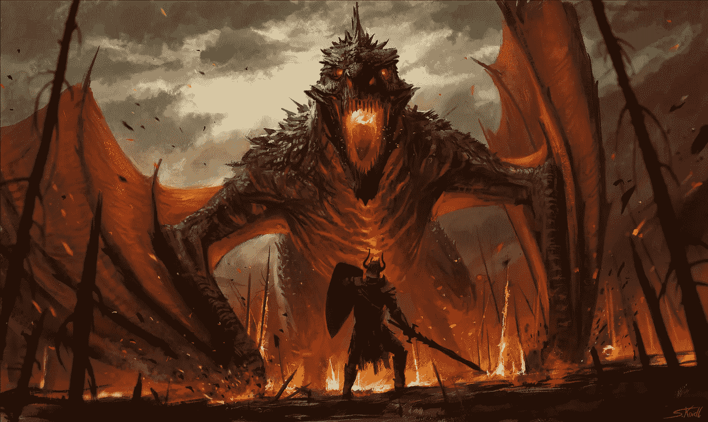
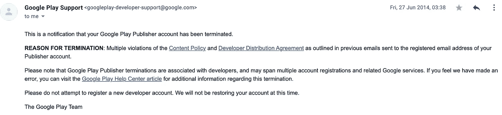
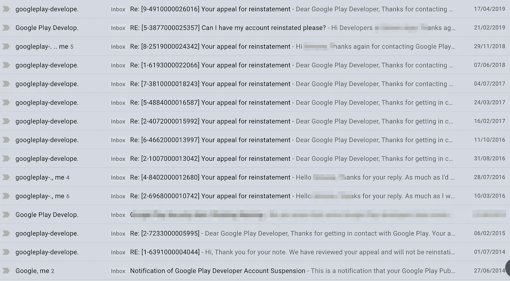
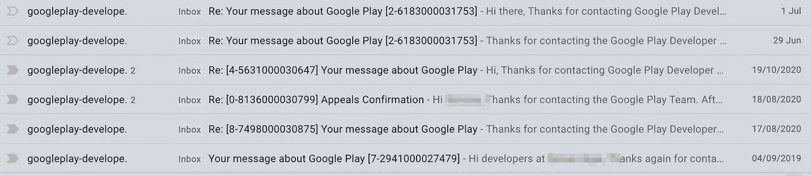
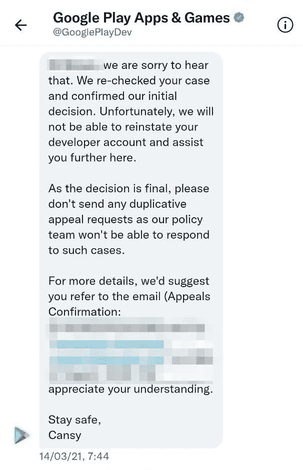
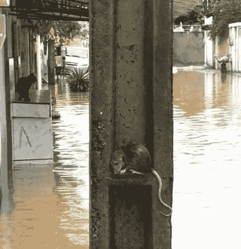

# ⛔️谷歌终止了你的 Play Store 开发者账户？

> 原文：<https://itnext.io/%EF%B8%8F-google-terminated-your-play-store-developer-account-2e7dc828a8af?source=collection_archive---------2----------------------->

没人会来救你。

谷歌终止了你的 Play Store 开发者账户，没人会来救你。

这是一封致 Android 社区的公开信，特别是致谷歌 Google Play Apps 游戏总监 [*普尔尼玛·科奇卡*](https://www.linkedin.com/in/purnima-kochikar-a66b062b) *。*

迪士尼、飞利浦、Dropbox、国际足联和微软。
这些只是我作为 Android 开发者在收到账号暂停后合作或工作过的一些公司。

我在 2014 年 6 月收到了停职通知。我记得那一天，糟透了。我当时已经是一家大公司的 Android 开发人员，收入还不错。当电子邮件到达时，我震惊了。
我所有的应用都是业余时间开发的，我所有的下载都没了。

Google Play 开发者账户暂停通知。

从那天起，一场无休止的磨难开始了。我一次又一次不懈地尝试上诉。

我上诉了很多次。

一次又一次。

大多数时候，收到的回复来自布鲁斯，无情的谷歌机器人，提供录音电子邮件。

> 尽管我很想帮忙，但我无法提供更多的信息。
> 问候，
> 布鲁斯

我还试图用 Twitter 联系 Google Play 开发支持。得到的回应总是一样的:这是最终决定，我的账户不会恢复。

我用 Twitter 联系了 Google Play 开发支持部门。

在 LinkedIn 上，我联系了以下人员，解释了我的情况，希望他们能帮上忙:

[**莎拉·卡拉姆**](https://www.linkedin.com/in/sarahkaram/)**——**Google Play 应用伙伴关系总监。
[**Pietro Maggi**](https://www.linkedin.com/in/pietromaggi/)——谷歌的合作伙伴开发者代言人。
[**Nicolas Bortolotti**](https://www.linkedin.com/in/nbortolotti/)——谷歌技术项目经理 engEdu。
[**保罗·金兰**](https://www.linkedin.com/in/paulkinlan/)——谷歌网络和 Chrome 开发者关系主管。

七年后，理解到像谷歌这样的公司采取如此不公平和心胸狭窄的对策，真的让我心碎。
**人是可以改变的。**
**人可以变好。**

我已经在很多方面为 Android 社区及其生态系统做出了很多贡献。有可能每两台 Android 设备中就有一台会安装我编写的软件。你能想象这有多令人兴奋吗？但与此同时，这也十分荒谬。

谷歌的非官方座右铭一直是简单的一句话“不要作恶”

在我空闲的时候，我想开发一些可访问的应用程序来帮助有特殊需求或有学习障碍的人，而且完全免费。我有太多的想法，不幸的是我不能追求☹️.

有几次，我不得不拒绝在发布阶段帮助其他开发人员，因为正如 Nate 在[的帖子](https://nateshoffner.com/blog/2019/09/google-play-developer-account-termination/)中指出的

> “当你有几个账户为一个客户/公司工作，其中一个账户被终止时，这可能会导致巨大的多米诺骨牌效应”

# 👀还有其他人有同样的情况吗？

是的，可能比你想象的还要多。

我有理由相信他们的故事不能在搜索结果中获得可见性，因为它们被谷歌搜索背后的算法遮蔽了。

要获得更准确的结果，您可以尝试两个选项:

1.  使用[必应](http://bing.com/)并尝试搜索 [**Google Play 账号终止**](https://www.bing.com/search?q=google+play+account+terminated&qs=HS&pq=g&sc=8-1&cvid=CD754BA9D3E6451CA3B5CAE49A60CBFC&FORM=QBLH&sp=1) **。**
2.  在[Google.com](https://www.google.com/search?q=play+account+terminated+site%3Amedium.com&sxsrf=AOaemvLCgOdIxo3nVjJCCJ8yu_S9xkbJ5Q%3A1630431530849&source=hp&ei=KmkuYdyPMcKO4-EPyb2r0Ac&iflsig=ALs-wAMAAAAAYS53OvzCJjb3RbqvSLdelgDi_M2NVCNw&oq=play+account+terminated+site%3Amedium.com&gs_lcp=Cgdnd3Mtd2l6EAM6BwgjEOoCECdQ4EFY4EFghkloAXAAeACAAU2IAU2SAQExmAEAoAECoAEBsAEK&sclient=gws-wiz&ved=0ahUKEwjczOXh5tvyAhVCxzgGHcneCnoQ4dUDCAg&uact=5)中搜索，但是通过在关键字“*播放账户终止*”之后附加命令“ *site:medium.com* ”来强制算法仅显示媒体上的故事。

# 📦打开潘多拉的盒子

如上所述做一项新的研究将会让你发现一系列全新的结果。揭示了这个决定是多么残酷和极端。在 Medium 上，成千上万的用户讲述着他们梦想破灭的故事，这是他们在无休止的工作后的失宠。

 [## Google Play 如何无缘无故“终止”一个开发者

### 一位 Android 开发者致 Google Play 团队以及 Android 开发者和用户社区的公开信

medium.com](https://medium.com/@tokata/how-google-play-terminated-a-developer-for-no-reason-e4d760e9f472)  [## 人们可能会死，因为谷歌的机器人删除了 AdventureSafely 应用程序

### 这是 AdventureSafely，Inc .给 Android 社区，特别是给 Purnima Kochikar 的一封公开信——…

medium.com](https://medium.com/@adventuresafely/people-may-die-because-googles-bots-removed-the-adventuresafely-app-6362e14c6622)  [## 联想到不相关的开发者，我的 Google play 暂停故事

### 致 Google play 团队，尤其是 Google Play 应用和游戏总监 Purnima Kochikar 的公开信。

mujtabafr.medium.com](https://mujtabafr.medium.com/associating-to-unrelated-developers-my-google-play-suspension-story-aafa6c3f09b9)  [## 我们的 Google Play 帐户被终止了——这让我们的团队在疫情中束手无策

pulkit-jain.medium.com](https://pulkit-jain.medium.com/our-google-play-account-is-terminated-leaving-our-team-helpless-in-the-middle-of-the-pandemic-6fbb13089673)  [## 谷歌如何通过终止我们的 Google Play 开发者账户来摧毁我们的创业公司

### 首先，任何阅读这篇文章的人，我祝愿你和你所爱的人在疫情这个艰难的时刻身体健康。

medium.com](https://medium.com/@sixacegames/how-google-destroyed-our-startup-by-terminating-our-google-play-developer-account-6a8cca09ea88)  [## 谷歌如何玩“把我们印度人当乞丐”没有审判只有死刑。

### 一位 Android 开发者致 Google Play 团队以及 Android 开发者和用户社区的公开信

snjkmrkr33.medium.com](https://snjkmrkr33.medium.com/how-google-play-treat-we-indians-as-beggars-no-trials-only-death-punishments-e4d201f968e6)  [## 谷歌刚刚永久终止了我的 Google Play 开发者账户

### 你是一名 Android 应用程序开发人员还是想成为一名开发人员？读读这个故事，也许对将来会有帮助。

medium.com](https://medium.com/@antaresone/google-just-terminated-my-google-play-developer-account-forever-f62d6362b6ac)  [## 谷歌突然终止了我们的初创企业 Google Play 开发者账户——下一个可能就是你的了！

### “连坐罪”如何扼杀了我们的 Google Play 开发者账户和移动应用开发初创企业。

deniz-guney.medium.com](https://deniz-guney.medium.com/google-suddenly-terminated-our-start-ups-google-play-developer-account-and-yours-could-be-next-b065dfc258cb)  [## 新帐户的 Google Play 帐户终止。

### 6 月 27 日，我收到了来自 Google Play 支持团队的一封电子邮件，称我的帐户已被终止，原因是之前…

medium.com](https://medium.com/@davidkibzodari/google-play-account-termination-on-a-new-account-7160dbdd4784)  [## 在忠诚服务了 10 年之后，谷歌在一个小时内终止了我的 Google Play Publisher 账户

### 一位谦逊的 Android 开发者给 Android 社区，特别是给 Purnima Kochikar 的公开信，他是……

medium.com](https://medium.com/android-news/google-just-terminated-my-google-play-publisher-account-in-one-hour-after-10-years-of-loyal-service-7e3185c217b)  [## Google 已经终止了我的活动和 Google Play 开发者账户

### 如果你是一个 Android 应用开发者或者想开始这项活动，你必须阅读这篇文章。

medium.com](https://medium.com/@julianinho/google-has-terminated-my-activities-and-google-play-developer-account-7a89e6699f07)  [## 谷歌终止了我的开发者账户，开始了与之竞争的业务——这是一个应用中立的例子

### 我是一个游戏&应用工作室的唯一创始人和唯一开发者，不为所动。我有一个关于谷歌 Play 商店的私人游戏…

medium.com](https://medium.com/@pekkasipila/google-terminated-my-developer-account-and-started-a-competing-business-a-case-for-app-neutrality-570750c8a8f) 

# ☝️的注意事项

互联网上有大量的建议，有些很好，但其他的在我看来应该完全避免，所以我决定列出一个全面的清单。

## ✅从不投降

绝不投降。
从来没有。
一个公司不应该永远有发言权。

## ✅请愿

在 Change.org 的请愿书上签名，停止对开发商的终身禁令。

## ✅分享你的故事

在媒体和 [r/androiddev Reddit](https://www.reddit.com/r/androiddev/) 上发布你的故事。

## ✅了解 Google Play 政策

从你的错误中学习，学习[开发者内容政策](https://play.google.com/about/developer-content-policy.html)。
然后加入 Google Play 学院，参加关于 Google Play 政策的[课程。](https://playacademy.exceedlms.com/student/collection/263275)

## ❌开设了一个新的开发者账户

不要试图开一个新的开发者账户，那只会让你的情况变得更糟。有些指南解释了如何使用 VPN 和新密钥库以新名称创建新的开发人员帐户。**不要这样做！**

谷歌开发的算法经过了微调，可以发现这种企图。
谷歌不希望你开设新账户。句号。你必须尊重这一点。

## ❌买了一个新账户

不要试图在黑市上购买新的开发者账户。

这是一个严重的不当行为，会对你的上诉和复职产生巨大影响。
即使你一开始能够发布应用，当下载量增加时，你也无法通过审查。

## ✅:要有礼貌，遵守规则

当谷歌代表与您联系时，请始终保持礼貌。很可能他们无法帮助你，我完全理解这有多么令人沮丧，但这不是粗鲁或不尊重的借口。你是那个打破规则的人，即使这些规则在过去并不是很清楚，并且遵循这些规则的信息也很少。

## ✅提出上诉

谷歌会让你通过论坛上诉。限制为 1000 个字符，因此要精确但简洁。这种可能性很小，很有可能你会收到一个千篇一律的回复。

# 🧭:我有什么选择？

这个真的要看你现在的情况。有了十几年开发 Android 应用的经验，我很难再考虑别的了。作为一名安卓工程师，我有饭吃，有房贷要还，有家庭要养。

谷歌和苹果实际上已经建立了双头垄断，所以没有太多的选择。

谷歌和苹果实际上已经建立了双头垄断，所以没有太多的选择。

苹果发布应用程序的费用略高，每年 99 美元，但他们审查应用程序的过程更有条理，更多的人与人互动，更少的机器人。

与 Play 商店相比，其他可以发布 Android 应用的商店相对较小:

*   [亚马逊应用商店](https://www.amazon.com/gp/mas/get/amazonapp) —来自最著名的在线零售商的应用和游戏。
*   [Aptoide](https://aptoide.com)——一个主要面向游戏的移动应用在线市场。
*   [F-Droid](https://www.f-droid.org/) — F-Droid 是一个适用于 Android 平台的自由和开源软件应用的可安装目录。我喜欢这个想法，这个商店绝对建议学习和检查应用程序背后的源代码。
*   [华为 AppGallery](https://appgallery.huawei.com/) — AppGallery 是来自[华为](https://en.wikipedia.org/wiki/Huawei)的新商店，预装在所有华为智能手机和平板电脑上。

在 Android 官方开发者网站的[替代分发](https://developer.android.com/distribute/marketing-tools/alternative-distribution)部分可以找到其他分发应用的方法。最有可能的是，如果你是谷歌拒绝邮件的老手，这个链接就不会是什么新鲜事了。

# 🕯隧道的尽头会有光明吗？

真正的答案是“**没人知道**”。

谷歌需要为已经改变的开发者制定一个康复计划。

人类的错误。

有了更透明的政策和更多的信息来支持开发者，谷歌可以极大地改善他们的生态系统和应用程序的质量。他们已经投入了大量资金，打造一个更好、更具解释性的页面。对于那些已经被解雇的人，谷歌应该给他们第二次机会。几年前，有关他们政策的信息要简洁得多，有些部分甚至令人困惑。我意识到我犯了一些错误，为此我感到非常抱歉。

我希望有一天，基于宽大处理的考虑，我的上诉能被有条件地接受。

❤️，我真的很感谢所有支持我的开发人员，以及那些读过这篇文章的人。

真的。发自内心的:**谢谢**。

如果你想分享这篇文章，并给予它的能见度，这将极大地帮助我。

如果你有建议或反馈，请在评论中告诉我。

我会分享更新，让你知道我的情况是否会改变。

对于所有同样情况的 Android 开发者，如果你想分享你的故事，请不要犹豫，联系我，我很乐意为你提供帮助，给你能见度:[fragmenteddeveloper@gmail.com](mailto:fragmenteddeveloper@gmail.com)。

💪注意安全，保持良好状态。

***2021 年 9 月 1 日更新***

我在 Reddit 上分享了我的故事的链接，它似乎引发了很多讨论。谢谢大家的支持和赞美。这是**令人敬畏的 Android 社区**让 Android 变得伟大！

*你知道为什么你的账户被终止了吗？*

很多读者围绕这一点提出了问题，我感谢他们对我如此坦诚。有些人甚至已经开始推测最糟糕的事情，因此我迫切需要澄清我终止合同背后的原因。

那个时候的 Play store 大不一样，规则不像今天这么清晰，有 app 比如:

*   “放屁按钮”——点击一个红色按钮，让你的智能手机放屁。
*   “iPhone 主题”——某著名智能手机搭配一款水果的主题。
*   “最没用的应用程序”——这个应用程序什么也不做，如果你不这么认为，请随意离开 1 start。
*   “x 光看裸女”——嗯……你懂了。

我不想为我的错误辩护，但我只是想给你一些背景。

一个帐户通常会被终止三击。最初我没有分享更多关于我罢工的细节，因为我仍然为此感到羞愧。

我因“*侵犯版权*”受到两次打击，因为两个应用程序包含苹果标志和其他受版权保护的材料。这两款应用试图模仿 iPhone 4 和 iPhone 5 著名的“滑动解锁”屏幕。

第三次罢工是“*违反性内容政策*”，该项目是与一位想要推广她的作品的艺术家共同努力的结果，我们决定做一个简单的应用程序来阅读和回答带有自定义背景的 SMSs。

背景是这张图片。

我今天看了这幅画，我意识到它可能已经越界了，但当时的政策要宽松得多，play store 里到处都是类似的图像。

即使在今天，这也可能是主观的。你怎么想呢?

虽然我同意这三个有问题的应用违反了政策规定，但我认为终身禁止一个开发者是不公平的。

除了终止一个开发者的生命之外，一定还有别的方法。

请不要误解我，我知道这些应用程序应该被删除。但我的观点是生命的终结太极端了。

我希望这能对这个话题有所启发。

❤️谢谢大家