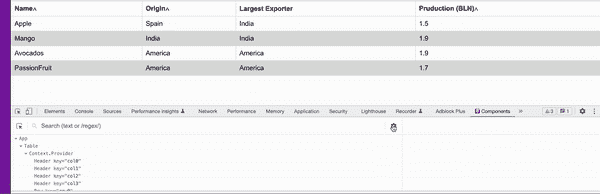
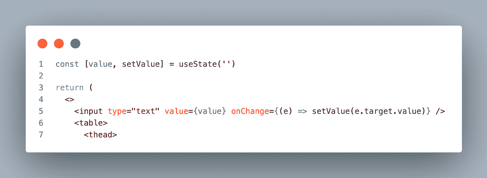
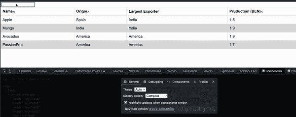
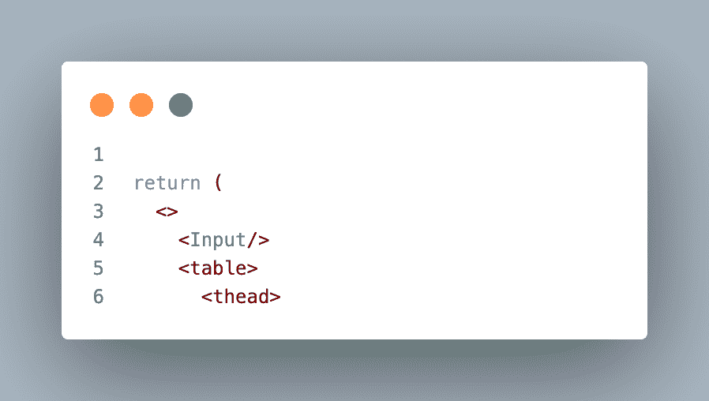
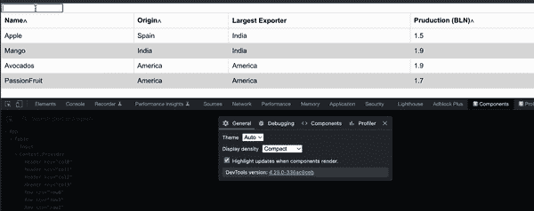

# ⚛️提高 React 性能的 7 大调整和技巧

> 原文：<https://itnext.io/%EF%B8%8F-top-7-tweaks-and-tricks-to-improve-react-performance-8957bab33266?source=collection_archive---------0----------------------->

如果您还没有看到性能问题，并不意味着它们不存在😄


# 内容

*   [**简介**](#ecaa)
*   [**1。冗余重卷机**故障排除](#d081)
*   [**2。通过拆分组件**](#3bc7) 减少重新渲染
*   [**3。什么是实例再创建，如何避免？**](#31a7)
*   [**4。不要懒加载**](#6b0f)
*   [**5。为什么以及何时使用 React 片段？**](#f6f3)
*   [**6。避免在列出的元素中使用索引作为关键字**](#0d12)
*   [**7。避免传播道具**](#2170)
*   [**结论**](#b5d6)
*   [**了解更多**](#7a38)

# 介绍

一些刚开始学习 React，或者从其他框架转到 React 的开发人员，在开始时可能不会太关注性能。因为发现新学习的框架的性能下降需要一些时间。后来，由于缺乏经验，这样的开发人员在编写代码时会犯一些小错误，这些小错误最终会积累起来，导致性能下降。此外，他们将很难解决问题。*在这里，我们将探讨 7 种调整和技巧，它们将有助于避免构建任何类型的应用程序时出现的大多数 React 性能问题。*

# 1.冗余重卷机故障排除

我们大多数人都知道虚拟 DOM 是如何工作的，但最重要的是检测树比较何时被触发。当我们可以跟踪它时，我们可以控制组件的重新呈现，并最终防止意外的性能流。令人惊讶的是，它并不那么难抓。首先，将 [React Devtool 扩展](https://chrome.google.com/webstore/detail/react-developer-tools/fmkadmapgofadopljbjfkapdkoienihi?hl=en)添加到浏览器中。

1.  然后打开浏览器开发者工具(在 Chrome 中是 **Option + ⌘ + J** (在 macOS 上)，或者 **Shift + CTRL + J** (在 Windows/Linux 上)。
2.  选择**组件**
3.  点击设置图标
4.  以及复选标记“组件渲染时高亮显示更新”



就是这样，现在，当我们与 UI 交互时，它会在当前重新呈现的元素上显示绿色边框。了解了这一点，我们就可以分析我们的任何 React 组件并重构它们，以避免不必要的重新呈现。

# 2.通过拆分组件来减少重复渲染

如果我们能够减少意外重新呈现元素的数量，它将涵盖 React 中很大一部分性能问题。但我们必须先回答这个问题:*“是什么触发了重新渲染？”*。答案很简单——**状态改变**。每次组件状态发生突变，都会唤醒树比较，也称为**协调、**并重新呈现**状态上下文的元素。状态上下文** —是初始化这种状态的组件。也就是说，如果我们有一个巨大的组件，它有很多状态(不一定相互依赖),其中一个状态改变了，它将重新呈现整个组件元素🤯。这绝对不是我们想要的。

那么解决办法是什么？解决方法是通过将组件的一部分和它的一些状态移动到它自己的子组件中来分离状态上下文，让我们看一下这个例子:

假设我们有一个带有搜索过滤器的表格组件。搜索过滤器是一个受控输入，其状态在输入文本更改后更新。这是它的样子:



当我们开始在搜索输入字段中输入时会发生什么？



是的，它将重新呈现整个表格元素。这是因为输入状态上下文与表组件共享相同的上下文。现在，让我们尝试我们的解决方案，将 input 元素及其状态移动到一个单独的组件中，并将其注入到 table 组件中。



神奇的🧙，表格组件不再被渲染。当我们希望输入影响表元素时，我们可以通过从输入向控件发出事件来增强这个特性。

> 好的做法是拆分组件以分离状态上下文，从而避免冗余的重新呈现器

# 3.什么是实例再创建，如何避免？

我们已经发现状态更改会触发组件重新呈现，但是我们需要考虑另一个重要的副作用。当状态改变并且**协调**发生 **—** 时，它将重新初始化整个组件实例，并保持新的状态值。对我们来说，这意味着在**协调期间，**所有功能实例将被重新创建，以便能够考虑新的状态值。我们不需要它，而且在大多数情况下，函数可以只依赖于几个状态。我们不想重新创建函数实例，因为它不依赖于已更改的状态。

这是一个提高绩效的机会。我们有几个解决方案:**使用回调**和 **useRef** 。让我们看看这个例子:

```
const {someState, setSomeState} = useState('')
const {otherState, setOtherState} = useState('')const foo = () => {console.log(someState)}
```

这是最常见的例子。我们有 **foo** 依赖于状态 **someState。当 **someState** 发生变化时，它将重新创建 **foo** 的新实例。这段代码的问题是，即使其他状态发生了变化，比如 **otherState，**foo**也会被重新创建，这是我们实际上不想要的。我们可以使用 **useCallback** 来告诉 React 我们的函数状态依赖是什么，以便在重新创建实例时更加明确:

```
const {someState, setSomeState} = useState('')
const {otherState, setOtherState} = useState('')const foo = **useCallback**(() => {console.log(someState)}, [**someState**])
```

在这个例子中，我们将依赖数组传递给 **useCallback** 钩子。更好的是， **foo** 将避免**其他状态**变化**。**

另一种选择是使用 **useRef** 。 **useRef —** 你可以把它想成和 **useState、**一样，但是不触发组件 re render(UI 不会更新)。 **useRef** 没有依赖列表，所以我们需要将 **someState** 作为 **foo** 属性传递:

```
const {someState, setSomeState} = useState('')
const {otherState, setOtherState} = useState('')const foo = **useRef**((**currentSomeState**) => {console.log(**currentSomeState**)}).current;
```

在这种情况下，我们不会重新创建 **foo** 实例。结论:

> 使用 **useCallback** 和 **useRef** 控制功能实例的重新创建

# 4.不要懒加载

默认情况下，React 同步渲染组件。这意味着组件将在呈现它自己之前等待它的子组件被呈现。没有必要等待，尤其是当一些子组件没有耦合时。这可能会导致页面挂起。假设我们点击了某个导航链接，它会把我们重定向到另一个页面。导航将一直等到所有的页面组件都呈现完成重定向。这将影响用户体验，人们不会等待，只会离开你的网站。我们需要让页面内容异步呈现，这样就不会损害导航。解决方案是将您的页面组件包装到`React.lazy(()`中，并告诉 React 完成导航，然后等待页面组件完成呈现:

```
const PageComponent = React.lazy(() => import('./PageComponent'));
```

稍后我们可以通过使用`<Suspense/>`展示一些当页面组件还没有准备好时的加载动画

```
<Suspense fallback={<div>Loading...</div>}>
   <PageComponent />
</Suspense>
```

这并不意味着我们必须在任何地方都使用惰性加载组件，当我们在不太损害性能的地方使用它时，可能会导致过度工程化。另一种场景是一些组件可能默认隐藏在 UI 中，所以我们不必等待。例如模式窗口、对话框、抽屉和可折叠侧板。

> 延迟加载页面组件和隐藏的 UI 组件

# **5。为什么以及何时使用 React 片段？**

这种情况经常发生，当我们在 JSX 构建一些布局并想要对我们的元素进行分组时，在大多数情况下我们使用`<div>`标签。或者，举例来说，我们有父子 HTML 标签，我们想移动到一个单独的组件:

```
<ul>
    <li>Item 1</li> <--- | Want to move it to child <Li> |
    <li>Item 2</li> <--- |                               |
</ul>
```

因此，当我们将`<li>`移动到单独的组件中时，比如:

```
const **Li** = () => {
    return (
        <div>
            <li>Item 1</li>
            <li>Item 2</li>
        </div>
    )
}
```

并改变它:

```
<ul>
    <**Li**/>
</ul>
```

渲染后会是这样的:

```
<ul>
    <div>
        <li>Item 1</li>  
        <li>Item 2</li>    
    </div>
</ul>
```

这将创建一个我们不需要的额外的`<div>`节点。这将使我们的 DOM 树更加嵌套，从而减慢**协调**过程。相反，`<div>`我们可以将子元素包装到片段中。最初，Fragment 让你对 DOM 元素进行分组，插入后只会导致一次 [**重排**](https://developers.google.com/speed/docs/insights/browser-reflow) **。**在**中**做出反应，碎片也会让你减少不必要的节点。当你想对元素进行分组时，你唯一需要做的就是使用 Fragment 而不是`<div>`:

```
const **Li** = () => {
    return (
        <> /* or <React.Fragment>, or <Fragment>*/
            <li>Item 1</li>
            <li>Item 2</li>
        </>
    )
}
```

就是这样，就这么简单

> 如果要对元素进行分组以减少节点数量，请使用片段

# 6.避免在列出的元素中使用索引作为键

所有人都知道，如果不是这样，Eslint 会强制执行😜在列出的元素中使用**键**，例如:

```
<ul>
    <li key="1">Item 1</li>  
    <li key="2">Item 2</li>    
</ul>
```

React 中的**键**是惟一标识符，帮助 React 指向列表中正确的元素并更新正确的元素。如果我们使用一个索引作为列表中的一个键，比如:

```
<ul>
    {[1, 2].map((val, **index**) => <li **key={index**}>Item {val}</li>)}  
</ul>
```

我们将元素映射到它的索引。但是如果我们进行排序，列表中元素的顺序可能会改变，初始键将不再指向正确的元素。它会引起一些意想不到的副作用，你可以在这里阅读更多。

> 在列出的元素中总是使用唯一的 id 作为键，如果对象没有它，你可以使用外部库显式地赋值，比如 [uid](https://www.npmjs.com/package/uid)

# 7.避免传播道具

这是今天的最后一个调整，已经很多了😓你肯定见过，或者更惨的是你自己做过——铺道具。类似于:

```
const Input = ({ onChange, ...props }) => (
    <input {...props} onChange={e => onChange(e.target.value)}/>
);
```

这不仅迫使您猜测`input`实际收到了什么属性，还在`input`元素中创建了一堆您不一定需要的属性。

使它显式，并且不要害怕传递您需要的尽可能多的属性，您总是可以将它们分组到某个对象中:

```
const Input = ({ onChange, inputProps: {value, type, className} }) => (
    <input className={className} type={type} value={value} onChange={e => onChange(e.target.value)}/>
);
```

很好，现在可读性更好了。

> 不要分散道具，分开传递每个道具

# 结论

好吧，可能你已经知道了一些由 Eslint 执行的调整。但是现在你知道为什么遵循它们是重要的了。此外，您还可以对代码进行性能分析，这将为您提供改进的空间。希望你喜欢阅读并学到了新的东西，鼓掌👏在 medium 上跟我学，这样你就不会错过任何学习的机会。

[](https://easy-web.medium.com/subscribe) [## 每当维塔利·舍甫琴科发表文章时，就收到一封电子邮件。

### 每当维塔利·舍甫琴科发表文章时，就收到一封电子邮件。通过注册，您将创建一个中型帐户，如果您还没有…

easy-web.medium.com](https://easy-web.medium.com/subscribe) 

# 了解更多信息

[](https://levelup.gitconnected.com/top-3-react-tricks-pros-like-to-use-to-reduce-the-size-of-component-980900370505) [## 🔥前 3 名 React 技巧专家😎喜欢用来减小组件的大小

### 不要让您的 React 组件成为一个科学怪人

levelup.gitconnected.com](https://levelup.gitconnected.com/top-3-react-tricks-pros-like-to-use-to-reduce-the-size-of-component-980900370505) [](https://levelup.gitconnected.com/building-react-micro-frontends-monorepo-with-state-management-using-nx-in-2-min-b8b04f9afee0) [## 🔥使用 NX 在 2 分钟内构建⚛反应微前端 Monorepo 和状态管理😅

### 甚至你的祖母也可以用 NX 构建 react 微前端

levelup.gitconnected.com](https://levelup.gitconnected.com/building-react-micro-frontends-monorepo-with-state-management-using-nx-in-2-min-b8b04f9afee0) [](https://levelup.gitconnected.com/top-3-ways-to-style-react-components-like-pro-in-2022-9d210bacb98f) [## 🔥2022 年设计 React 组件(如 Pro)的三大方式

### 对于那些不想花几天时间对齐 div 的人

levelup.gitconnected.com](https://levelup.gitconnected.com/top-3-ways-to-style-react-components-like-pro-in-2022-9d210bacb98f)