# 🏋️用这些游戏提高你的网页开发技能🎮

> 原文：<https://itnext.io/%EF%B8%8F-train-your-web-dev-skills-with-online-games-9400fd73440?source=collection_archive---------1----------------------->

## 通过有趣的游戏保持你的前端技能！

瑞安·昆塔尔在 [Unsplash](https://unsplash.com/s/photos/video-games?utm_source=unsplash&utm_medium=referral&utm_content=creditCopyText) 上拍摄的照片

学习自己编写代码可能会让人不知所措，不仅是因为这门学科的难度，也是因为要努力不要迷失在网上大量的教程和文档中。幸运的是，有一些资源可以让事情变得更简单和有趣，提供游戏化的教育内容。

作为参考，你可以看看我最近发表的文章，关于[通过网络游戏学习 CSS 概念](/train-your-css-skills-with-online-games-11067129338a)。

事后，我接到很多类似游戏的询问，学习 web 开发和 javascript。下面是我的研究结果。

# 检查 0

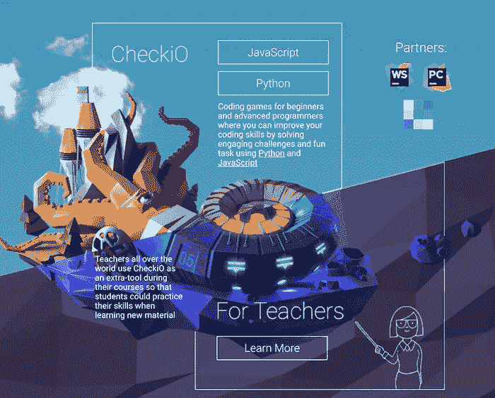

Checki0 允许通过解决不同的问题和在虚拟世界中的“浮动岛屿”之间移动来学习 Javascript 或 Python 的基础知识。每个岛收集了大约 40 个挑战，难度不断增加。

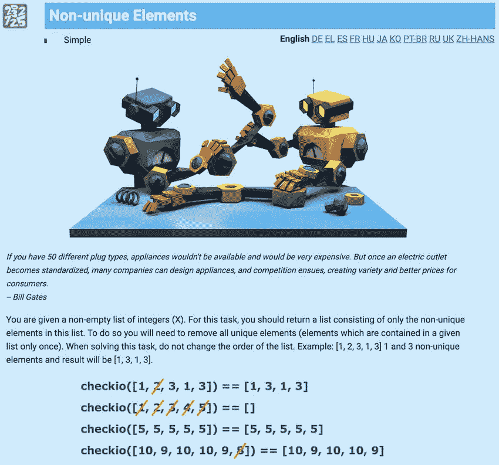

**免费** [我们来玩](https://checkio.org/)

# 电梯传奇

在电梯传奇中，你必须用 JavaScript 写一个程序来设计电梯的运动。目标是以最有效的方式运送人员。取决于你做得有多好，你可以在更困难的挑战中前进。

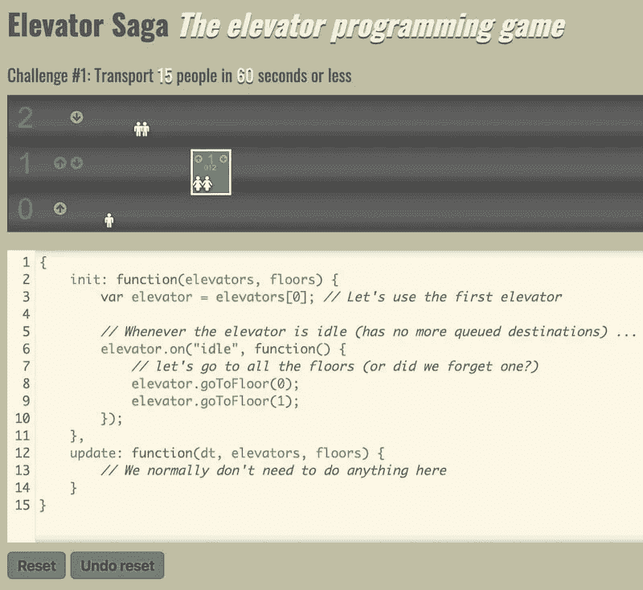

帮助和文档部分将帮助您在这个有趣的游戏中迈出第一步。

**免费** [我们来玩](http://play.elevatorsaga.com/)

# 编码游戏

CodinGame 提供免费游戏，你可以在这里解决谜题和算法问题。有可能在广泛的选择中选择学习哪种语言:JavaScript、Ruby、Java 和 C#，仅举几个例子。为了让事情变得更有趣，你可以邀请朋友在线玩，如果你想增加挑战，你还可以参加国际编程比赛。

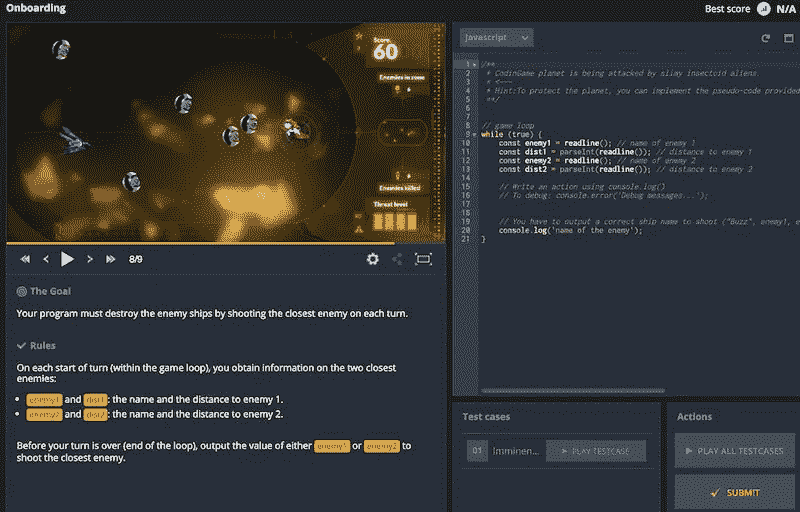

每种编程语言都有许多平台，你可以在不同的难度等级中进行选择，这样你就可以按照自己的速度进行。

# Screeps

Screeps 是 MMO 为已经有一些经验的程序员准备的沙盒。标题代表“脚本爬行”。该游戏为玩家提供了广泛的选择，并以有趣的方式实践现实生活中的代码。

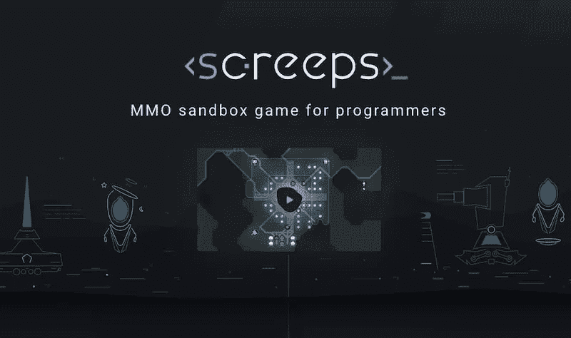

> Screeps 是一款大型多人在线即时战略游戏。每个玩家都可以在一个所有玩家共享的世界中创建自己的殖民地。这样的殖民地可以开采资源，建造单位，征服领土。随着你征服更多的领域，你在游戏世界中的影响力也在增长，你扩大自己影响的能力也在增长。
> 
> *然而，这需要你付出很多努力，因为多个玩家可能会瞄准同一个领域。
> 与其他 RTS 游戏不同，你在 Screeps 中的单位可以在没有你参与的情况下对事件做出反应——前提是你已经对它们进行了适当的编程。而且，与其他 MMO 不同的是，你不必不停地玩 Screeps 才能玩得好。偶尔检查一下是否一切顺利就足够了。*

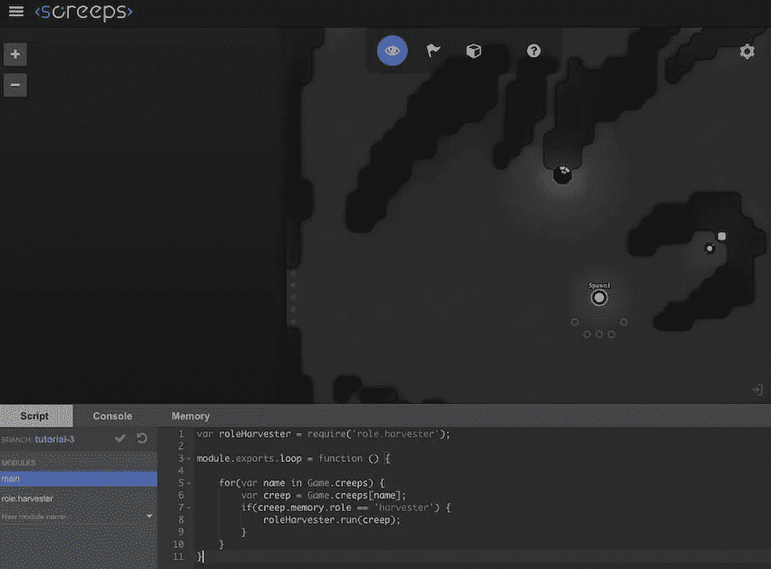

**免费** [我们来玩](https://screeps.com/)

# 代码战争

CodeWars 是一个门户网站，提供了大量的语言供您选择。

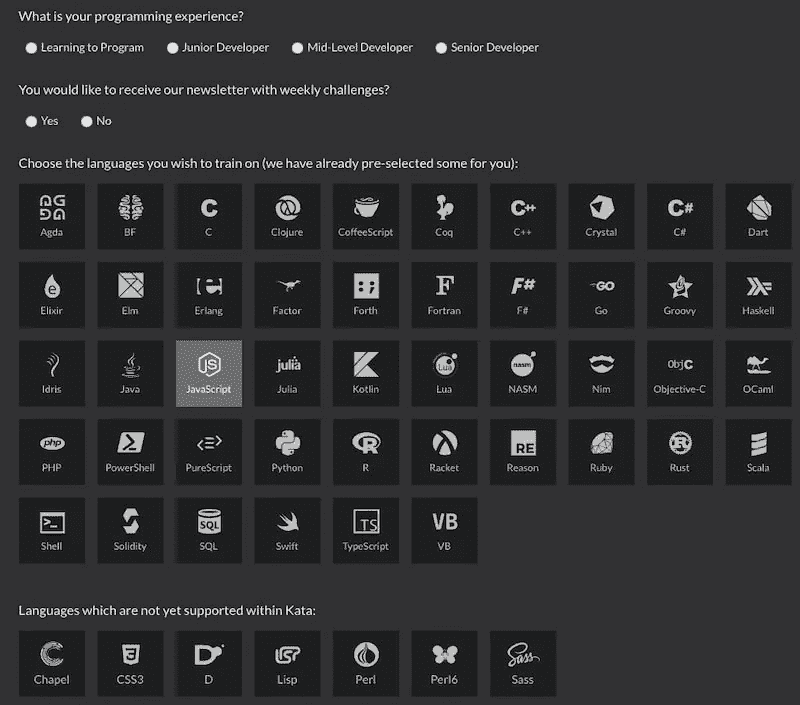

在一个初始和简单的测试之后，将要求您确认您感兴趣的编程语言，并选择从哪个级别开始您的培训(从绝对初学者到高级开发人员)。您通过解决不同的挑战获得分数，每个挑战涵盖不同的编码原则，并与其他开发人员竞争记分牌上的最高位置。

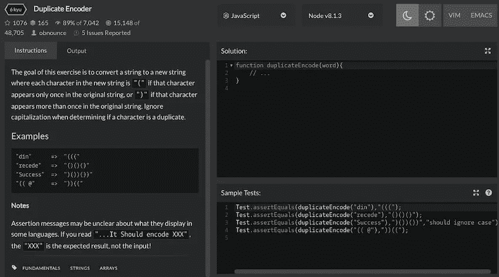

**免费** [我们来玩](https://www.codewars.com/)

# 不可信

《不可信》是一款冒险游戏，你需要运用你的 JavaScript 技能来解决故事发展过程中出现的问题。为了在关卡之间引导主角(Eval 博士，屏幕上的绿色@符号)，您在右侧面板上输入 javascript 指令，让他逃离当前阶段。

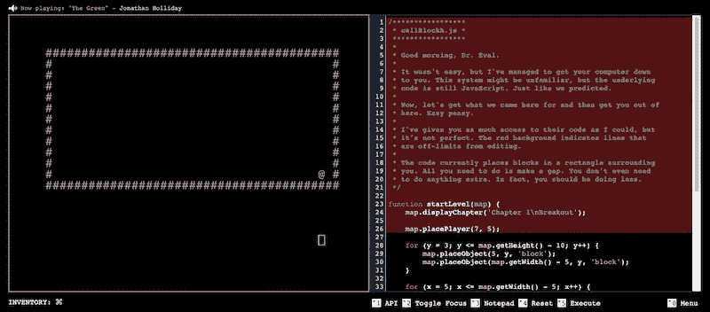

**免费** [我们来玩](https://alexnisnevich.github.io/untrusted/)

# 红宝石战士

你引导一个骑士通过不同的关卡，编码他的动作，并一路学习 Ruby。你可以在容易或中等难度中选择。

**注:**游戏开始，音乐开启！所以，如果你在办公室或学校打开这个链接，一定要小心😄

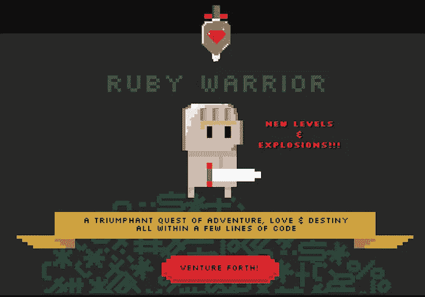

**有空** [我们来玩](https://www.bloc.io/ruby-warrior#/)

# 地下城与开发者

很多开发者喜欢 RPG 游戏(我也是😄)和数字网络机构 352 Inc 就利用这一相位创建了《地下城与开发者》。

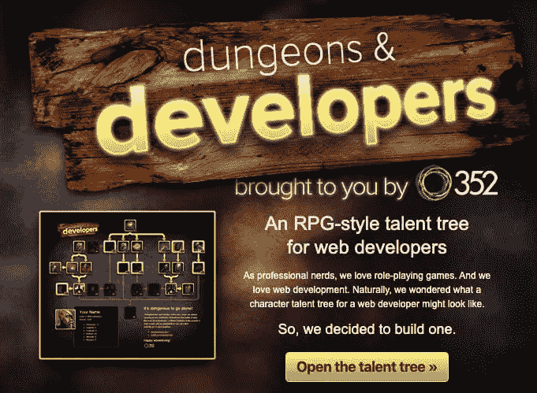

这不完全是一个游戏，但它提供了非常酷的画面，值得一看。你建立了一个*天赋树*，跟随经典的 RPG 树技能。每一层都有一组链接重定向到不同的主题(CSS，Javascript，SEO 等)。)，在掌握它们之后——也就是说，你
在每一步都研究参考文件——你解锁下一套技能，给你的角色添加特性点(力量、智慧或魅力),就像在经典 RPG 游戏中一样。

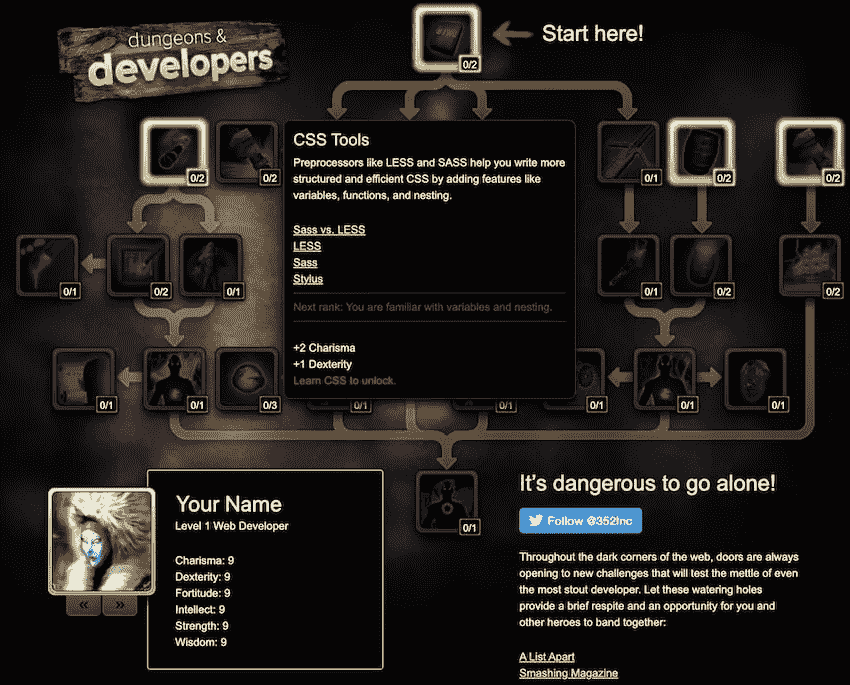

来自创作者:

> *我们想出了地下城&开发者作为一种有趣的方式来评估、推广和学习设计和开发优秀网站所需的技能。*

*原发布于 2019 年 11 月 27 日*[*https://dev . to*](https://dev.to/paco_ita/train-your-javascript-skills-with-online-games-289m)*。*