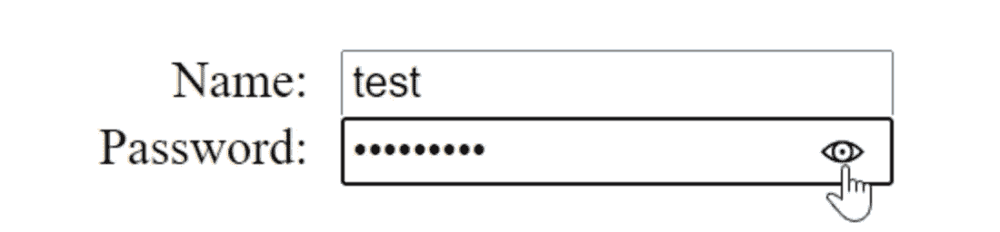
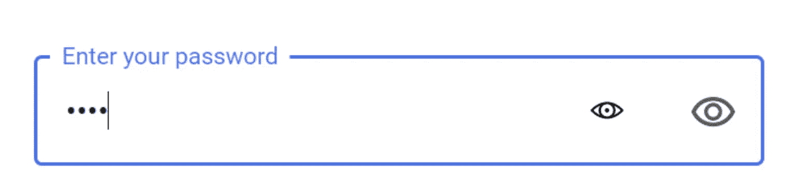

# OMBD#1:使用 JavaScript 测试浏览器对 CSS 伪类的支持

> 原文：<https://itnext.io/1-minute-to-become-a-better-developer-1-54f1fa9db73f?source=collection_archive---------2----------------------->

## 用 JavaScript 进行 CSS 特征检测的一种晦涩但有效的方法。在这个例子中，我们测试了一个只有微软浏览器才有的特性。

欢迎来到第 1 期的**O**ne**M**inute**B**etter**D**developer，在这里，通过阅读简短的知识，每次一分钟，你将成为一名更成功的软件开发人员。

## [🔛](https://jportella93.medium.com/one-minute-to-become-a-better-developer-ombd-5b1a1d37468e)⏭️

我的好友[洛尔·尼古拉斯](https://www.instagram.com/loornicolas/)的插图

## 问题是

一些浏览器有对伪元素的原生支持，而另一些则没有。例如，在微软浏览器(Internet Explorer 和 Edge)中显示/隐藏密码输入字段的小眼睛`::ms-reveal`就是这种情况。

Edge 的原生密码显示功能。

这个原生功能的问题是，如果您的前端有自己的密码泄露功能，您可能会得到这样的布局:

哎呀！Edge 的原生密码显示功能和我们自己的。

## 一个解决方案

一个快速的解决方法是隐藏原生的 reveal 密码:

但是为什么我们这么快就放弃了一个固有的特征呢？他们很棒！最终，这些都是由构建浏览器的同一个团队开发和测试的，可以完美地工作。

## (本地友好的)解决方案

所以在这种情况下，一个好的方法是测试浏览器是否有`::ms-reveal`特性，如果没有，只显示我们自己的。

现在您可以只检查`::ms-reveal`，如果它不存在，您可以滚动自己的！

**如果你喜欢这篇文章，你可能也会喜欢:**

 [## 1 分钟成为更好的开发人员(#2)

### 欢迎来到这个新系列的第 2 期，在这里，通过阅读以下短文，您将成为一名更成功的开发人员…

jportella93.medium.com](https://jportella93.medium.com/1-minute-to-become-a-better-developer-2-5db2e35a7c4a) 

# [🔛](https://jportella93.medium.com/one-minute-to-become-a-better-developer-ombd-5b1a1d37468e) [⏭️](https://jportella93.medium.com/1-minute-to-become-a-better-developer-2-5db2e35a7c4a)