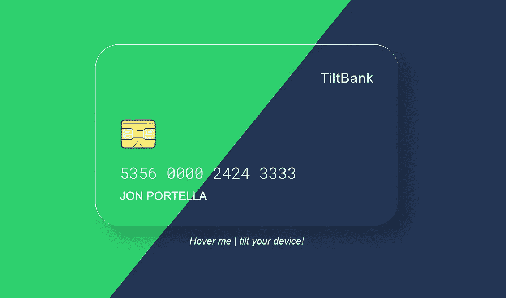

# OMONP#1:用 Vanilla-tilt.js 构建 3D 银行卡

> 原文：<https://itnext.io/1-minute-to-become-a-better-developer-14-a2ff85046b8c?source=collection_archive---------2----------------------->

## 通过这个快速 JavaScript 教程，让你的卡片脱颖而出

欢迎来到问题#1 **O** ne **M** inute，**O**ne**N**PM**P**package，在这里你会发现很酷的 NPM 软件包，以及如何在一分钟内使用它们。

## [🔛](https://jportella93.medium.com/omonp-one-minute-one-npm-package-bea2c9c3636)⏭️



[我们要建什么](https://codepen.io/jportella93/pen/eYBxdzv)

## 问题是

我们网站上的付款表格看起来有点单调。客户感到厌烦，不输入他们的卡的详细信息。我们如何让它更吸引人？

我们无聊的静态卡。

## 一个解决方案

我们将使用 [Vanilla-tilt.js](https://github.com/micku7zu/vanilla-tilt.js/) 让我们的卡在鼠标悬停或倾斜手持设备时在三维空间移动。

这其实很简单:

1.  将其导入到我们的项目中

```
npm install vanilla-tilt
```

或者从 CDN 导入，如下例所示:

```
import vanillaTilt from "[https://cdn.skypack.dev/vanilla-tilt@1.7.0](https://cdn.skypack.dev/vanilla-tilt@1.7.0)";
```

2.将 DOM 元素作为 Vanilla-tilt 容器。第二个参数是[选项](https://github.com/micku7zu/vanilla-tilt.js/#options)对象。

```
const card = document.querySelector("#card");
VanillaTilt.init(card, {
  max: 10,
  speed: 1000,
  perspective: 700
});
```

而且真的是这样！这是我们的最终结果:

我们的时尚弄潮儿 3D 移动卡！让我们花光所有的美元吧！

## 如果你喜欢这个故事，你可能也会喜欢

[](https://medium.com/codex/1-minute-to-become-a-better-developer-20-a6f93db2c180) [## OMONP#2

### 学习如何在一分钟内用 lazysizes 加载图片。

medium.com](https://medium.com/codex/1-minute-to-become-a-better-developer-20-a6f93db2c180) 

## [🔛](https://jportella93.medium.com/omonp-one-minute-one-npm-package-bea2c9c3636) [⏭️](https://medium.com/codex/1-minute-to-become-a-better-developer-20-a6f93db2c180)