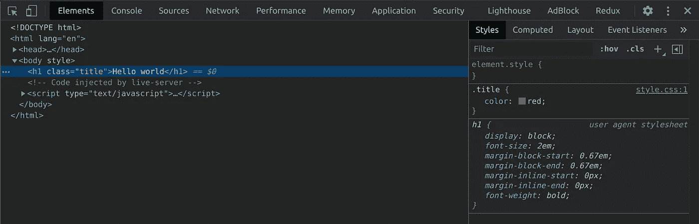
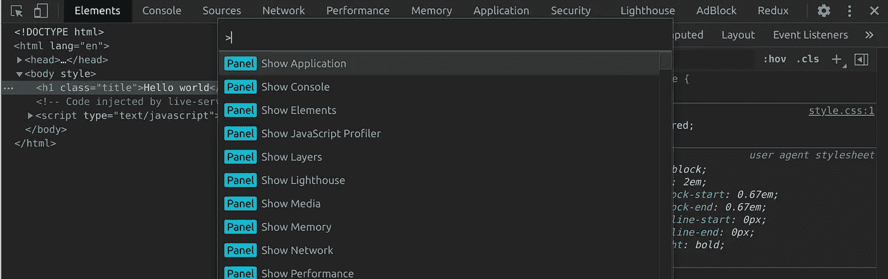
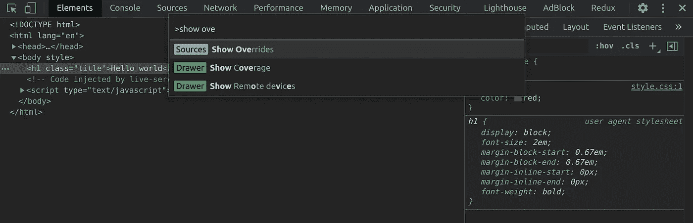
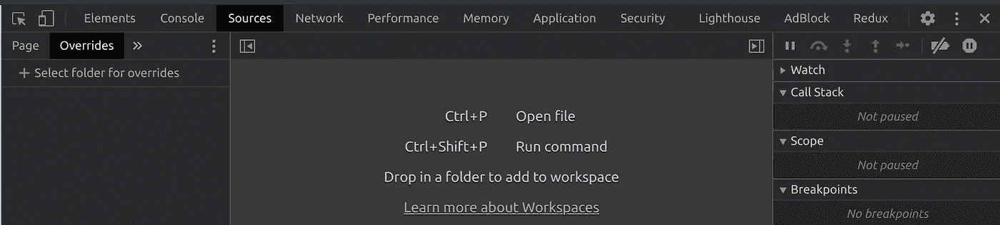
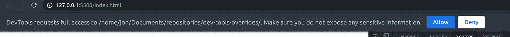
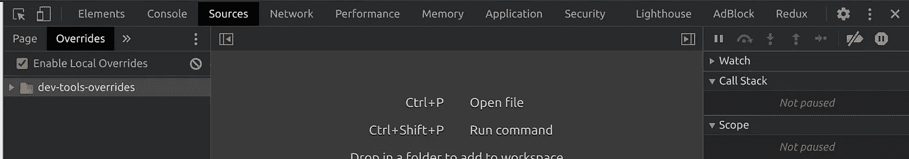
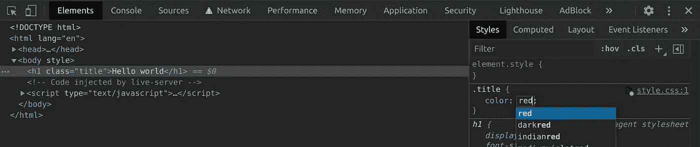
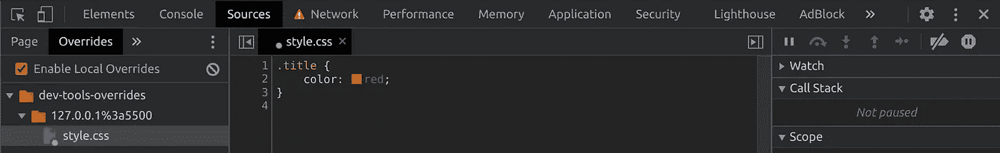
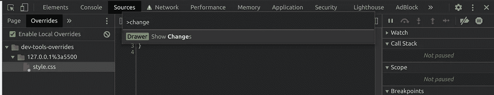
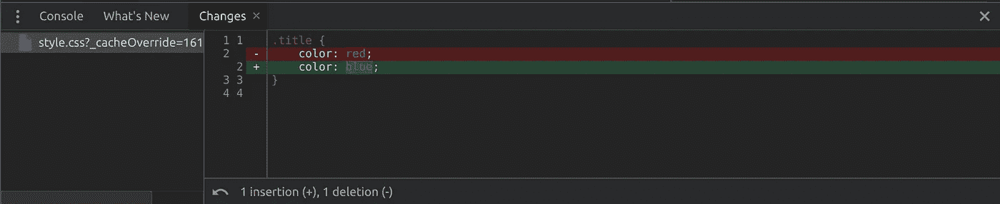

# OMBD#2:持久化 Chrome 开发工具中的 CSS 变化

> 原文：<https://itnext.io/1-minute-to-become-a-better-developer-2-5db2e35a7c4a?source=collection_archive---------2----------------------->

## 避免在意外重新加载浏览器时丢失元素选项卡上的所有更改

欢迎来到第 2 期,**O**ne**M**inute**B**etter**D**developer，在这里你可以通过阅读简短的知识，每次一分钟，成为一名更成功的软件开发人员。

## [⏮](https://jportella93.medium.com/1-minute-to-become-a-better-developer-1-54f1fa9db73f) ️ [🔛](https://jportella93.medium.com/one-minute-to-become-a-better-developer-ombd-5b1a1d37468e)⏭️

我的好友[洛尔·尼古拉斯](https://www.instagram.com/loornicolas/)的插图

## 问题是

使用您的开发工具来修补 CSS 是很棒的，因为您可以获得关于更改的即时反馈。然而，如果页面被刷新，所有的修改都会被遗忘…

## 一个解决方案

这里有一个快速提示，可以在不影响原始源文件的情况下保存这些更改。

1.  打开 Chrome 的开发工具。

2.按 ctrl/cmd + shift + p 显示 [Chrome 的 dev tools 命令菜单](https://developers.google.com/web/tools/chrome-devtools/command-menu)。

3.键入“显示覆盖”。

4.点击左侧的“+选择覆盖文件夹”并选择机器上的一个文件夹。那就是你的覆盖将存在的地方。

5.通过点击搜索栏下方的“允许”栏，允许 Chrome 访问该文件夹。

6.现在该文件夹已经出现在“覆盖”部分。

7.我们试试吧！在“元素”面板中更改一些样式。您将在样式表文件名旁边看到一个略带紫色的点，这意味着它已经保存在本地的 overrides 文件夹中。刷新页面将保留该更改！

8.现在回到“覆盖”选项卡，我们可以看到那些本地覆盖，按 URL 文件夹排序。

9.(奖金！)要查看源代码和本地重写之间的差异，可以在命令菜单上键入“显示更改”。

## **如果你喜欢这篇文章，你可能也会喜欢:**

 [## 1 分钟成为更好的开发人员(#1)

### 欢迎来到这个新的系列，通过阅读简短的知识，你将成为一个更成功的开发人员

jportella93.medium.com](https://jportella93.medium.com/1-minute-to-become-a-better-developer-1-54f1fa9db73f)  [## 1 分钟成为更好的开发人员(#3)

### 欢迎阅读本系列的第 3 期，通过阅读简短的知识，您将成为一名更成功的开发人员…

jportella93.medium.com](https://jportella93.medium.com/1-minute-to-become-a-better-developer-3-1d73b6ffd514) 

## (T0)↓↓️ [↓↓(T3) (T4)↓↓年(T5)](https://jportella93.medium.com/one-minute-to-become-a-better-developer-ombd-5b1a1d37468e)