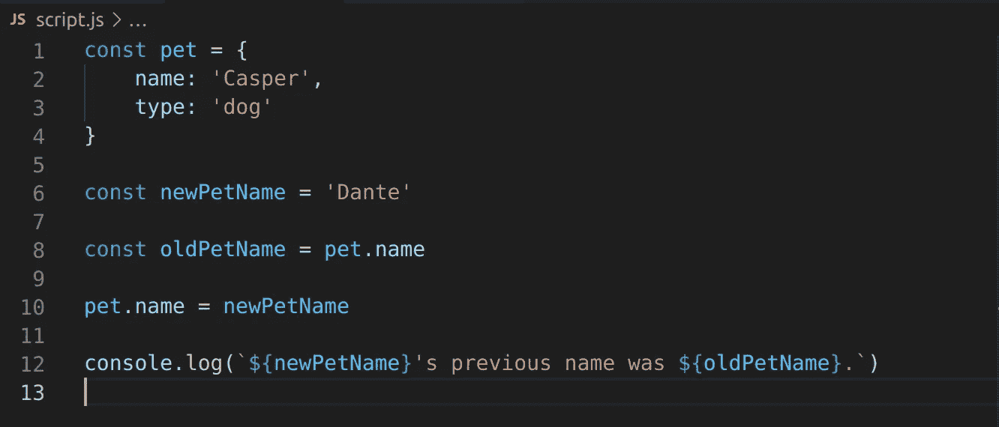
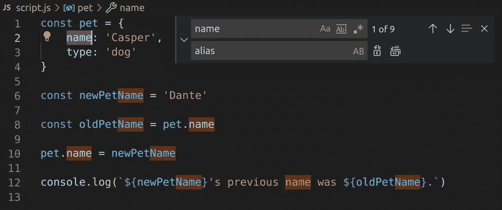
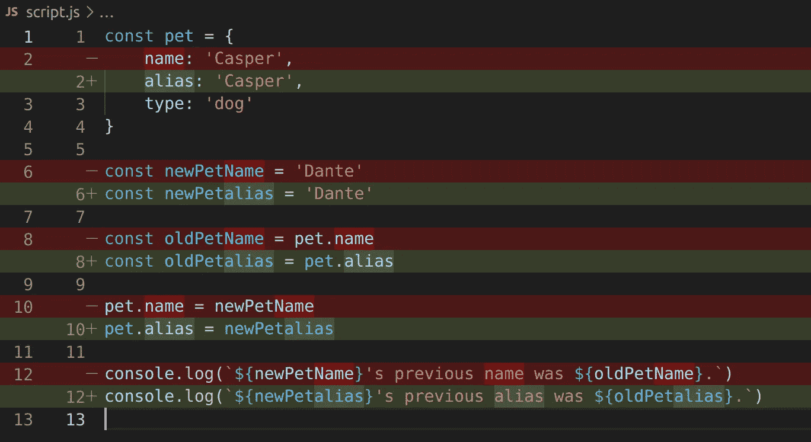
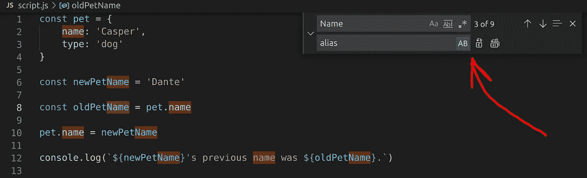
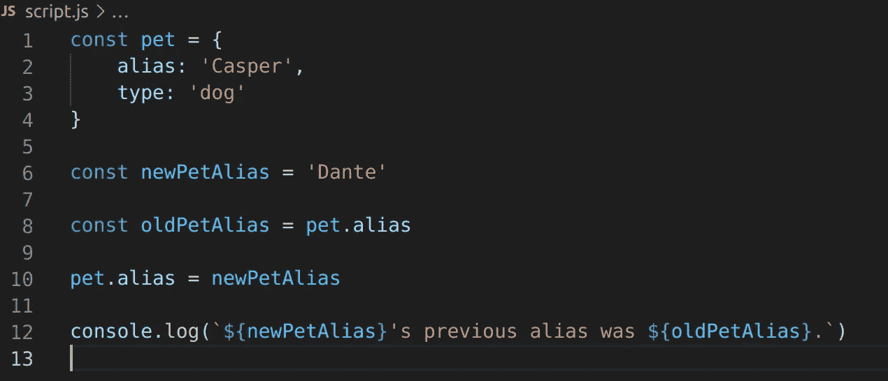

# OMBD#3:快速重构:在 VSCode 搜索+替换中保留大小写

> 原文：<https://itnext.io/1-minute-to-become-a-better-developer-3-1d73b6ffd514?source=collection_archive---------3----------------------->

## 一个简单的 Visual Studio 代码技巧，可以在重构时节省宝贵的时间

欢迎来到第 3 期的《开发者》,通过阅读简短的知识，每次一分钟，你将成为一名更成功的软件开发人员。

## [**⏮**](https://jportella93.medium.com/1-minute-to-become-a-better-developer-2-5db2e35a7c4a) **️** [**🔛**](https://jportella93.medium.com/one-minute-to-become-a-better-developer-ombd-5b1a1d37468e) [**⏭**](https://jportella93.medium.com/1-minute-to-become-a-better-developer-4-aeabd6586396) **️**

我的好友[洛尔·尼古拉斯](https://www.instagram.com/loornicolas/)的插图

## 问题是

我们有一个`pet`对象，我们正在改变它在`name`键下的值。出于日志记录的目的，我们正在保存一个对键`name`指向的旧值的引用。

现在我们意识到我们想把键`name`重命名为`alias`。重构是有必要的。因此，我们通过按 ctrl/cmd + f 调出查找和替换功能。

但是哎呀！由于键`name`也作为其他变量名称`newPetName`和`oldPetName`的一部分在 camelCase 中使用，我们在替换后得到一个大小写不匹配。`newPetalias`和`oldPetalias`不太好看…

## 一个解决方案

我们将通过按下`AB`按钮，使用查找和替换特征上的[保留案例选项来撤销此更改并重复。](https://code.visualstudio.com/docs/editor/codebasics#_advanced-find-and-replace-options)

现在我们已经节省了重构的时间，我们的宠物对它们的别名很满意！

## 如果您喜欢这篇文章，您可能也会喜欢:

 [## 1 分钟成为更好的开发人员(#2)

### 欢迎来到这个新系列的第 2 期，在这里，通过阅读以下短文，您将成为一名更成功的开发人员…

jportella93.medium.com](https://jportella93.medium.com/1-minute-to-become-a-better-developer-2-5db2e35a7c4a)  [## 1 分钟成为更好的开发人员(#4)

### 欢迎阅读本系列的第 4 期，通过阅读简短的知识，您将成为一名更成功的开发人员…

jportella93.medium.com](https://jportella93.medium.com/1-minute-to-become-a-better-developer-4-aeabd6586396) 

## (T0)↓↓️ [↓↓(T3) (T4)↓↓](https://jportella93.medium.com/one-minute-to-become-a-better-developer-ombd-5b1a1d37468e)️