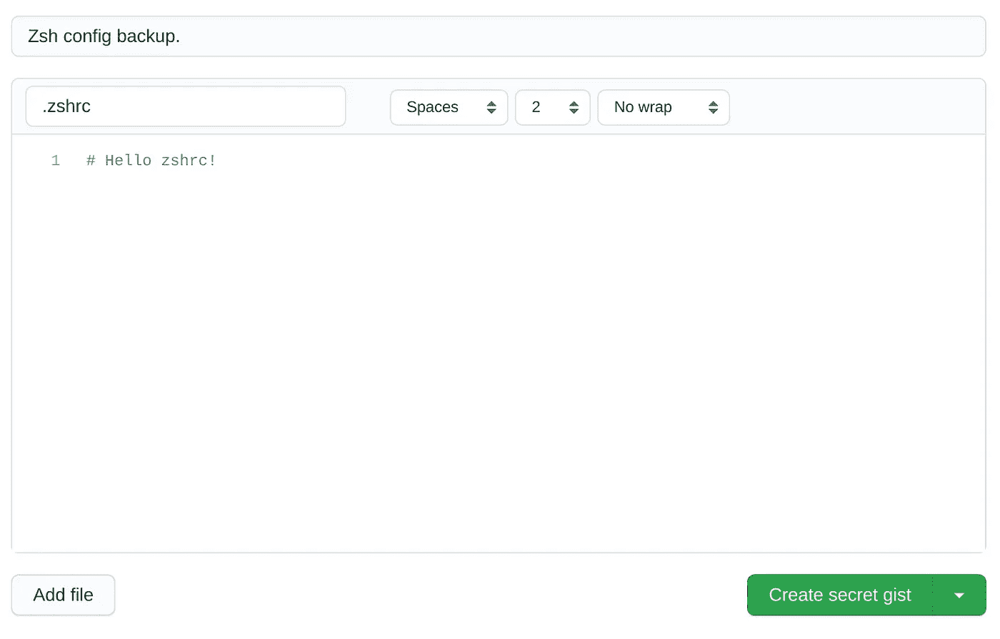

# OMBD#9:在 GitHub Gist 中自动保存你的 Shell 配置

> 原文：<https://itnext.io/1-minute-to-become-a-better-developer-9-43ce61662d72?source=collection_archive---------4----------------------->

## 换电脑不要再输别名了！

欢迎来到第 9 期，通过阅读简短的知识，每次一分钟，你将成为一名更成功的软件开发人员。

## [⏮](https://jportella93.medium.com/1-minute-to-become-a-better-developer-8-31692050f5b8) ️ [🔛](https://jportella93.medium.com/one-minute-to-become-a-better-developer-ombd-5b1a1d37468e) [⏭](https://jportella93.medium.com/1-minute-to-become-a-better-developer-10-bcb2396b6246) [️](https://jportella93.medium.com/1-minute-to-become-a-better-developer-10-bcb2396b6246)


我的好友洛尔·尼古拉斯的艺术作品

## 问题是

你买了一台新电脑，你备份了所有文件，但是…

哦！您忘记备份您的`~/.bashrc`或`~/.zshrc`了，您所有的自定义别名和功能都在那里！现在你需要和他们重新开始…

## 一个解决方案

为了让您不那么头疼，我分享了我的超级有用的自定义别名，用于更新我的 shell 配置，它执行以下操作:

1.  打开您的 shell 配置文件。
2.  将更新文件的副本保存在秘密的 [Github Gist](https://gist.github.com/) 上。
3.  刷新您的 shell 会话，以便您可以立即使用更新的命令。

让我们设置它。

> 本教程假设您正在使用 [zsh](https://www.zsh.org/) 。如果你使用的是 [bash](https://www.gnu.org/software/bash/) ，只需在接下来的命令中将`zsh`和`.zshrc`替换为`bash`和`.bashrc`。您可以通过运行`echo $0`找到您正在使用的 shell。

1.  让我们创建一个秘密的[要点](https://gist.github.com/)来保存我们的配置:



创造秘密[要点](https://gist.github.com/)。

2.从 URL 的最后一部分复制要点标识符。在我的例子中，URL 是`https://gist.github.com/jportella93/616c872593daf91781d6842c9829b1f0`，所以我复制了`616c872593daf91781d6842c9829b1f0`。

3.在你的`~/.zshrc`中包括这一行:

```
alias zshrc="gedit ~/.zshrc && gist-paste -u 616c872593daf91781d6842c9829b1f0 ~/.zshrc && exec zsh"
```

> 我使用`[gedit](https://help.gnome.org/users/gedit/stable/)`作为文本编辑器，但是你可以使用任何其他的，比如`nano`、`vim`或者`code`。然后将要点标识符`616c872593daf91781d6842c9829b1f0`替换为您在上一步中复制的标识符。

4.如果您还没有安装 [gist](https://github.com/defunkt/gist) 以便能够从 CLI 与 Github Gist 交互，在本文中我将解释如何快速完成:

[](https://jportella93.medium.com/1-minute-to-become-a-better-developer-7-6c9c9fa67a9c) [## 1 分钟成为更好的开发人员(#7)

### 欢迎阅读本系列的第 7 期，通过阅读简短的知识，你将成为一名更成功的开发人员…

jportella93.medium.com](https://jportella93.medium.com/1-minute-to-become-a-better-developer-7-6c9c9fa67a9c) 

5.现在你都准备好了！当您想要更新`~/.zshrc`中的别名时，只需在 CLI 中键入`zshrc`，在文本编辑器中进行更改，更改将自动备份到 Gist 中。此外，您可以立即使用更新后的别名！多酷啊。

## 如果您喜欢这篇文章，您可能也会喜欢:

[](https://jportella93.medium.com/1-minute-to-become-a-better-developer-8-31692050f5b8) [## 1 分钟成为更好的开发人员(#8)

### 了解如何在 1 分钟内从命令行找到我们的公共 IP 地址和国家。

jportella93.medium.com](https://jportella93.medium.com/1-minute-to-become-a-better-developer-8-31692050f5b8) [](https://jportella93.medium.com/1-minute-to-become-a-better-developer-10-bcb2396b6246) [## 1 分钟成为更好的开发人员(#10)

### 了解如何在一分钟内改变你的公共 IP 地址。

jportella93.medium.com](https://jportella93.medium.com/1-minute-to-become-a-better-developer-10-bcb2396b6246) 

## [⏮](https://jportella93.medium.com/1-minute-to-become-a-better-developer-8-31692050f5b8) ️ [🔛](https://jportella93.medium.com/one-minute-to-become-a-better-developer-ombd-5b1a1d37468e)⏭️