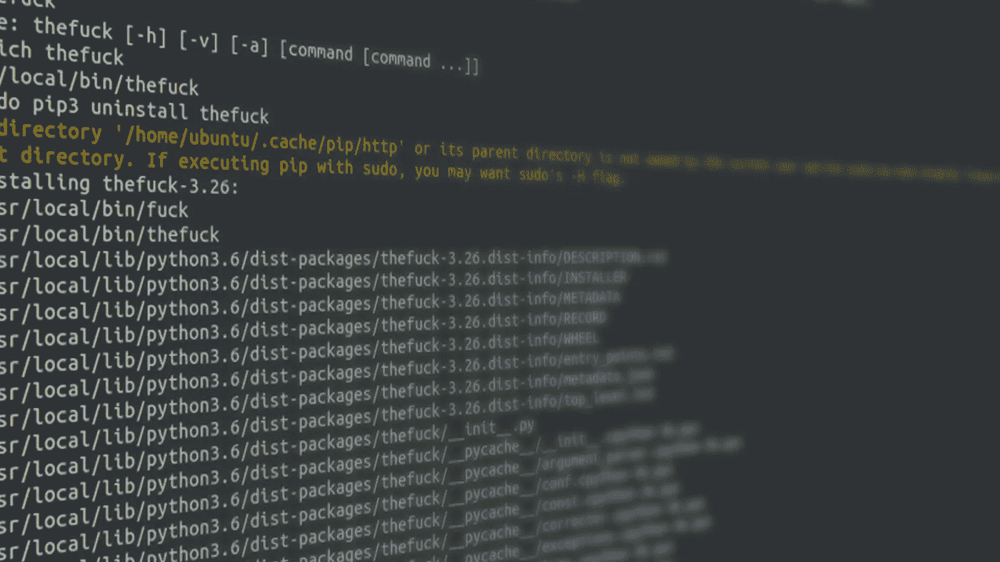
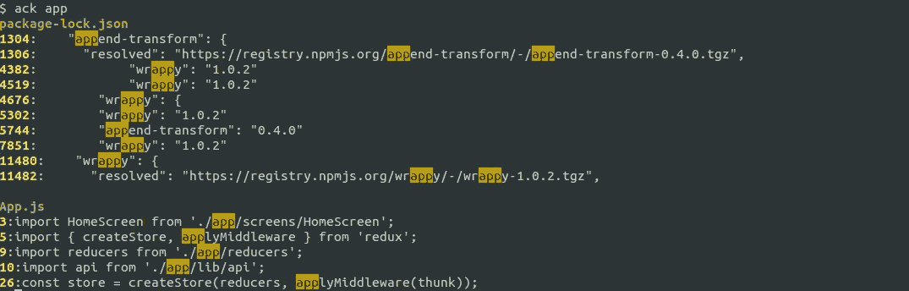
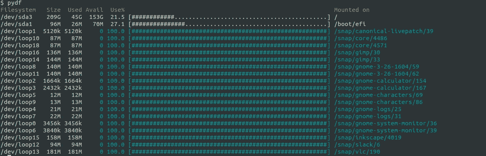
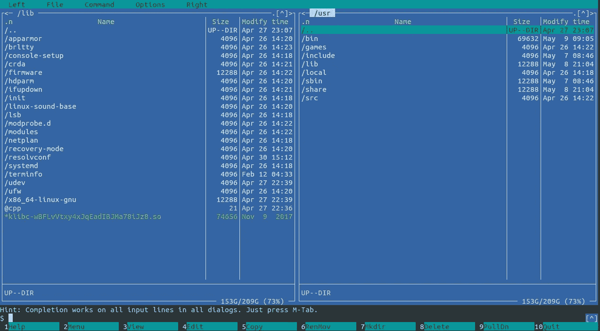

# 您会喜欢的 10 个 CLI 工具

> 原文：<https://itnext.io/10-cli-tools-that-you-will-love-d214bc73d856?source=collection_archive---------0----------------------->



作为一名 web 开发人员，我每天都在使用 Linux。我想分享一些帮助我提高工作效率的 CLI 应用程序。一些工具是现有命令的更好替代，而另一些工具提供了全新的功能。我相信你会喜欢他们的。

所有的安装命令都是在 Ubuntu 18.04 下测试的。

# grep => ack，ag

`ack`和`ag`是比`grep`更好的两个搜索工具。使用`ack`或`ag`，你不需要输入`grep`要求的任何选项来搜索给定的目录。此外，搜索结果包括行号，并且是彩色的，更容易阅读。

它们基本上有相同的特点，所以你可以选择一个你喜欢的。在 Ubuntu 18.04 上，可以使用以下命令安装它们:

```
# Install ack
$ sudo apt install ack# Install ag
$ sudo apt install silversearcher-ag
```

在 Ubuntu 16.04 上，`ack`位于包`ack-grep`中，所以你必须使用`sudo apt install ack-grep`来安装它，但是命令名仍然是`ack`。



# 模糊查找器

是一个强大的文件查找工具，可以快速找到文件、进程、环境变量。与本机自动完成相比，`fzf`可以将完成项目显示为列表，并在您键入命令时过滤列表，这比重复按 Tab 并试图在拥挤的屏幕上找到文件名要容易得多。

它还不是一个 ubuntu 包，所以我们必须从源代码安装它:

```
git clone --depth 1 [https://github.com/junegunn/fzf.git](https://github.com/junegunn/fzf.git) ~/.fzf
~/.fzf/install
```

安装后，您几乎可以在任何地方使用`**<TAB>`来自动完成 fzf:

```
vim **<TAB>    # select files from current dir and edit
vim ../**<TAB> # select files from parent dir and edit
kill -9 <TAB>  # auto complete process to kill
export **<TAB> # auto complete env var to export
<C-R>          # search command line history
```

更多用法见其[主页](https://github.com/junegunn/fzf)。

# TheFuck:命令行拼写纠正程序

当您键入一个很长的命令行，却发现命令中有一个错别字或者只是遗漏了`sudo`时，您是否感到沮丧？那这个混蛋可以帮忙。通过键入以下命令进行安装:

```
$ sudo apt install thefuck
```

然后您需要将这一行添加到您的`~/.bashrc`:

```
eval $(thefuck --alias)
```

重新登录后(或使用`source ~/.bashrc`简单地重新加载`.bashrc`，尝试以下操作:

```
$ **apt install git**
E: Could not open lock file /var/lib/dpkg/lock - open (13: Permission denied)
E: Unable to lock the administration directory (/var/lib/dpkg/), are you root?
$ **fuck**
sudo apt install git [enter/↑/↓/ctrl+c]
Reading package lists... Done
Building dependency tree
```

# top => htop

众所周知，所以我不会谈论太多。

```
$ sudo apt install htop
$ htop
```

# traceroute => mtr

`mtr`是网络故障排除的较好工具。它比原来的`traceroute`更快更容易使用。

```
$ sudo apt install mtr
```

要跟踪路线，只需键入:

```
$ mtr 8.8.8.8
```

这将打开一个 GUI 窗口，显示跟踪路由过程和结果。如果您喜欢 CLI 输出，请添加`-t`选项:

```
$ mtr -t 8.8.8.8
```

# df => pydf

`pydf`能够以一种丰富多彩、易于阅读的方式显示磁盘使用情况。

```
$ sudo apt install pydf
```



# 文件管理器

`mc` (GNU Midnight Commander)是一个很棒的 CLI 文件管理器。它使用双窗格视图进行文件管理，还支持 FTP 和 s FTP。当您需要在不访问 GUI 的情况下进行许多文件操作时，例如在服务器上，这是一个很好的工具。

提示:`mc`使用 F1~F10 功能键。如果您无法访问功能键，例如，当在终端模拟器中使用`mc`时，功能键用于 GUI 操作，请使用`Esc -> 0~9`代替。



# ftp => lftp

虽然 FTP 现在不太流行，但有时我们需要它来访问一些传统资源。`lftp`是一个很棒的 CLI FTP 客户端。与`ftp`相比，它支持支持通配符的`mget`和`mput`命令，以及下载/上传整个目录的强大的`mirror`命令。甚至支持用`torrent`命令下载 torrent！

```
$ sudo apt install lftp
```

# wget => aria2

`aria2`是一款轻量级下载工具，支持 HTTP/HTTPS、FTP、SFTP、BitTorrent，最重要的是多连接下载。由于其多连接下载功能，它的下载速度比`wget`更快。它还可以恢复未完成的下载。示例见 [aria2 主页](https://aria2.github.io/)。

```
$ sudo apt install aria2
$ aria2c https://example.com/ubuntu.iso
```

# nnn:文件分析器

当磁盘空间不足时，我通常做的一件事就是用`du -sh *`找到大文件/目录并删除它们。`nnn`能更好地完成这项工作。只需键入`nnn`并按大写`S`，您将看到所有目录和文件的大小。

```
$ sudo apt install nnn
```

感谢阅读！如果这篇帖子有帮助，请通过推荐分享给你的朋友。