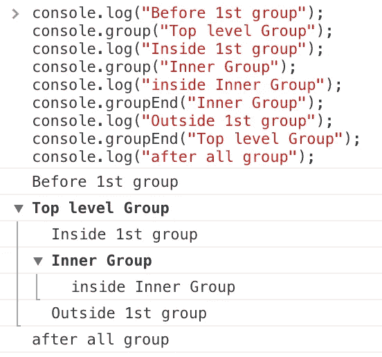
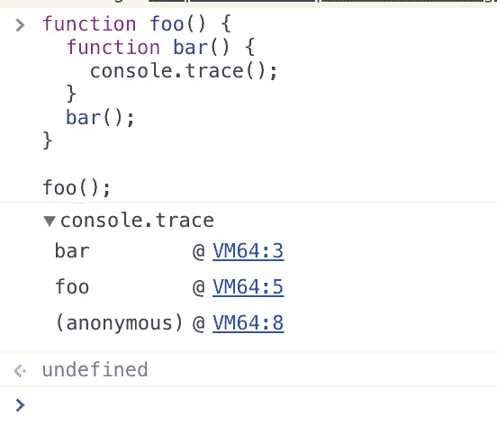
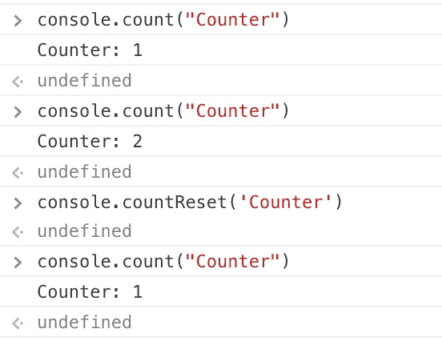
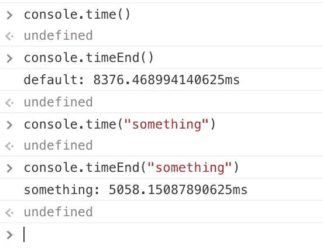
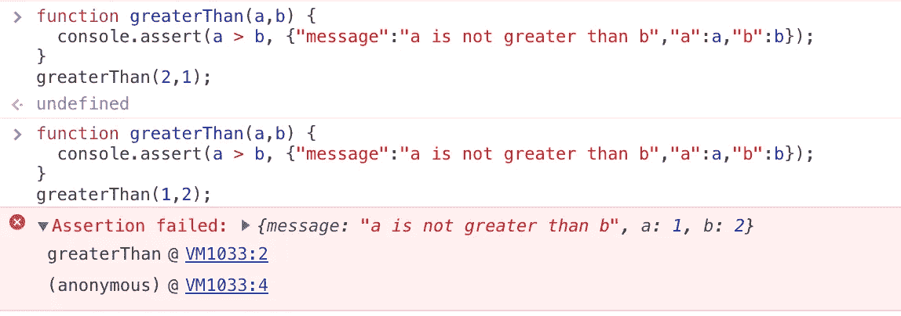
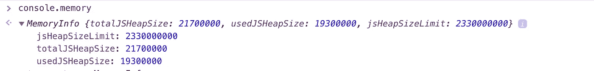
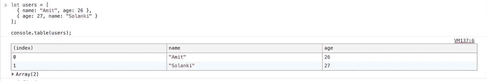

# 10 个控制台技巧，像专家一样调试。

> 原文：<https://itnext.io/10-console-tricks-to-debug-like-a-pro-66ee2225ec57?source=collection_archive---------2----------------------->


好吧，我知道这有点像一个点击诱饵标题，但相信我，你会惊讶于控制台能做什么。先说一些基础的。

## 1.console.group('name ')和 console.groupEnd('name ')

顾名思义，它会将多个日志分组到一个可扩展的组中，如果您想进一步分组，甚至可以嵌套它们。*console . group(' group name ')*启动群组，*console . groupend(' group name ')*关闭群组。还有第三个功能 *console.groupCollapsed* ，在折叠模式下创建组。



控制台.群组演示

## 2.console.trace()

当你需要找到一个函数的整个调用栈时， *console.trace* 是非常有用的，我主要用它来找到回调是从哪里传递的，它会打印整个栈跟踪。让我们举个例子:

```
function foo() {
  function bar() {
    console.trace();
  }
  bar();
}foo();
```



console.trace()的输出

## 3.console.count("counter:")

我经常使用这个，主要是为了找出一个组件在 react 中渲染了多少次。正如您所猜测的，这将记录它被执行的总次数。请记住，如果您更改记录的字符串，它将为该字符串启动一个新的计数器，我们还有一个方便的函数来重置计数器:*console . count reset(' Counter ')*，尽管名称应该匹配。



console.count 和 console.countReset 的输出

## 4.console.time()和 console.timeEnd()

*console.time()* 会启动一个定时器，一旦调用 timeEnd()就会结束，它们大多用在需要做性能检查的时候。你也可以将一个字符串传递给 time 和 timeEnd，它将启动另一个同名的计时器。



## 5.console.assert()

比方说，你需要检查某个表达式/值是否为假，当它为假时，你希望它被记录，现在你通常会包装这是一个 if-else，但不需要这样做。让我们看看下面的例子

```
function greaterThan(a,b) {
  console.assert(a > b, {"message":"a is not greater than b","a":a,"b":b});
}
greaterThan(2,1);
```



## 6.console . profile([标签])

多少次你希望你能在需要的时候开始剖析，而不是从一开始就保持剖析，然后手动找到你需要剖析的点。嗯， *console.profile()* 前来救援。完成分析后，只需调用 console.profileEnd()，让我们举个例子:

```
function thisNeedsToBeProfiled() {
  console.profile("thisNeedsToBeProfiled()");
  // later, after doing some stuff
  console.profileEnd();
}
```

这将记录并添加到**配置文件**面板中。

## 7.console . timestamp([标签])

在录制过程中向**时间线**添加事件。我用它来标记 API 调用返回的位置和数据处理的时间，尽管这有很多用例。

```
console.timeStamp('custom timestamp!');
```

## 8.console.clear()

这很清楚(双关语)，它清除了控制台，这里没什么。

## 9.控制台.内存

这不是一个函数，而是一个存储你的 HeapSize 的属性，当 perf 很棘手，图形很难阅读时，简单地记录内存可能会有帮助。



控制台.内存输出

## 10.console.table(数组)

这是我的最爱。最好的技巧是，它打印了一个光滑的表格，你可以和它交互，你需要传递一个对象数组给它。



控制台.表的输出

继续尝试其中的一些，让我知道你的调试技巧。

请在阿米特·索兰基站和 twitter.com/iamsolankiamit 的 T2 站跟随我