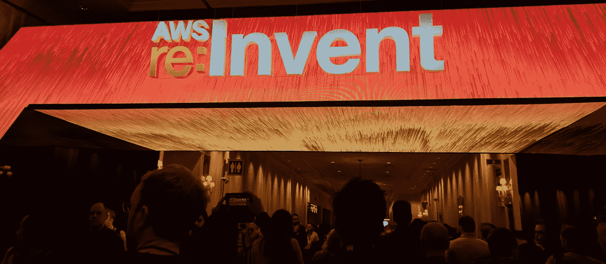
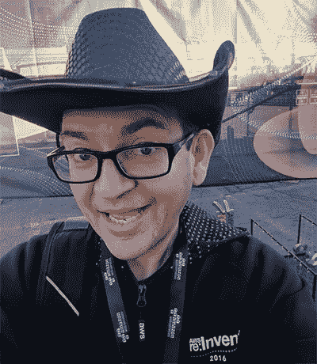
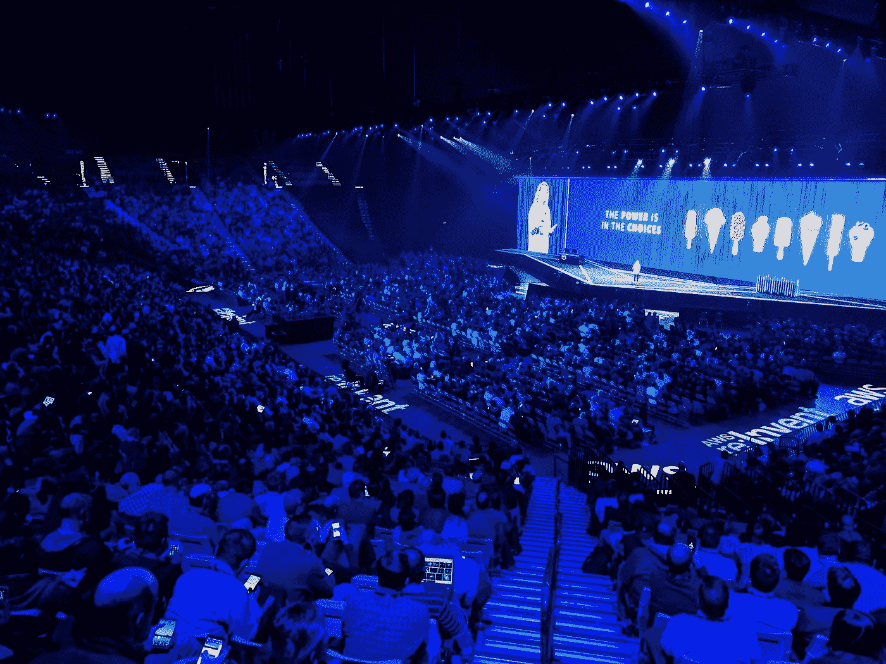

# 给 AWS re:Invent 与会者的 10 个内幕提示

> 原文：<https://itnext.io/10-insider-tips-for-aws-re-invent-attendees-786b76ccacda?source=collection_archive---------2----------------------->

对于新手或老手来说，总有办法重新发明得更好。这里有 10 个快速提示，让你充分利用今年最好的云会议。

如果你以前没有参加过 re:Invent，也没有去过拉斯维加斯，著名的 AWS 忠实用户年度聚会可能是一个不同类型的技术会议。在经历了 4 次重新发明后，这里是我今年朝圣之旅的最佳建议。

*更新:一些伟大的额外提示出现在* [*这个 Reddit 线程*](https://www.reddit.com/r/aws/comments/9rinln/10_insider_tips_for_aws_reinvent_attendees/) *。*

## 1.预订机票、酒店和航班的时间就是现在。

现在还有时间预订会议机票，而酒店和航班已经开始迅速减少。对于酒店来说，一些像 SLS，Hard Rock 或 Elara 这样的酒店可能是平衡成本和活动距离的最佳选择。要注意拉斯维加斯酒店过高的每日度假费用，2018 年大多数超过 40 美元一天。如果你时间很紧，大部分会议在周二到周四举行，所以没必要呆得太久。主题演讲在周三和周四。

## 2.不要把你的时间表排得满满的。

你必须在 re:Invent 网站上预订你的课程，以获得保证名额的最佳机会。但是大多数第一次来的人从早到晚都在忙着开会，这导致了从“地带”的一端到另一端的疯狂冲刺，以及事件之间的精疲力尽的死亡行军。这是一个很长的会议，你可以在会议结束几周后在 YouTube 上看到会议。

专注于某个主题—无服务器、存储、安全性—并参加独特的活动，如研讨会、黑客马拉松或构建者会议。你将从中获得更多，并且在周三之前不会感到会议疲劳！此外，在主题演讲中通常会有令人惊讶的宣布，导致周四出现新的会议。在主题演讲时让笔记本电脑开着是值得的，这样你就可以在人群中提前预订一台(去年我成功地获得了一个深度镜头)。

## 3.认识其他人。

去 re:Invent 的主要原因是为了结识其他人——无论是新接触云计算的人还是老前辈，每个人都在这里。这次活动是一次才华横溢的名人聚会，所以不要错过与尽可能多的人见面的机会。我在这里遇到了一些很棒的人。

我明白——我们身处其中，这是一个内向的职业，人际关系很糟糕。但是走向人们，开始交谈，建立联系，学习一些东西是完全合法的。最坏能发生什么？如果你害羞或者不相信，看看这个家伙…

…那就是我！在 [@jbesw](https://twitter.com/jbesw) 上 Ping 我，我很乐意过来打个招呼。不要错过这个与其他云爱好者会面并了解他们正在构建什么的绝佳机会。

## 4.重塑政党名单。

AWS 有一个传奇的重新播放活动，但在官方议程之外还有几十个其他较小规模的会议。跟踪这些的最好地方是 [re:Invent Parties list](https://twitter.com/reinventparties) ，这是一个非官方但非常有用的指南。这些活动往往发生在赌场周围的酒吧和餐馆，因此有大量的免费食物和饮料。这是拉斯维加斯唯一免费的东西，所以不要错过。

## 5.使用 Twitter。

Twitter 在会议上大放异彩，你可以通过关注[事件标签](https://twitter.com/search?q=%23reinvent2018&src=typed_query)获得实时信息。即使你在现实生活中不使用或不喜欢 Twitter，当有五万人在十几个场馆里跑来跑去时，它也是一个有用的交流工具。如果公共汽车晚点，会议取消，或者刚刚发生了重要的事情，Twitter 会第一时间知道。

## 6.记住:这是拉斯维加斯。

慢慢来——在拉斯维加斯，一周是很长的一段时间。带上你需要的所有东西，比如隐形眼镜、布洛芬、药物、牙膏和耳塞，因为如果你不得不在加沙地带的封闭环境中购买，你会付双倍的钱。还要带上舒适的运动鞋，因为你每天要走好几英里，早早起水泡肯定会让你讨厌这个会议。地点之间的距离是巨大的。

还有，穿的随便点。除非你是个小贩，否则没人指望你看起来很聪明。考虑到经常跑来跑去和多变的天气，你只需要一条牛仔裤和一件 t 恤。你会在售货大厅里买很多免费的 t 恤、袜子和赠品，你可以轻松地穿着免费衣服度过一周。

## 7.基调并不重要。

很高兴看到安迪·杰西和沃纳·威格尔在舞台上直播，但你要和 30，000 人在只有一半大的礼堂里竞争座位。这意味着你需要在开门前至少一个小时排队，这会影响你一整天的精力。主题演讲通过无线线路向其他地点直播。他们也倾向于迟到，这可能会影响随后的会议。

## 8.脱离工作。

回复:invent 是一个内容精彩的沉浸式会议，如果你一直在处理同事的工作问题，你会错过它。在你离开之前设定一个预期，你会离开几天——他们会处理好的，你会从那张 1800 美元的会议门票中提取所有的价值。我看到无数人离开会议，在他们的笔记本电脑上处理中断——这完全是浪费他们的时间，你应该在到达之前尽量减少这些中断。

## 9.找点乐子。

我真的很喜欢 re:Invent——主要是 AWS 的教育内容，但你也可以在拉斯维加斯玩得很开心。对于美食家来说，这里有世界上最好的餐馆，而且不仅仅是在商业街上。查看第一区、麻雀+狼、埃丝特的厨房和其他妈妈的一些你将体验到的最好的餐饮。

如果你想去跳伞、开跑车、开机关枪、乘坐直升机、尝试高空滑索或跳伞，这是一个正确的地方。所有最好的太阳马戏团表演都在这里，游览胡佛大坝是独一无二的体验。不要把自己局限在会议和酒店房间里——每个人都有适合自己的东西。

## 10.一些流言被打破了。

杰夫·贝索斯过去几年都没有参加过。赌场不会把简易吃角子老虎机放在门边。赌博时的免费饮料不是很慷慨。拉斯维加斯不再便宜，而且已经有一段时间不便宜了。不管你在整个过程中听到了什么，你一定会想要回来重新发明。那里见！