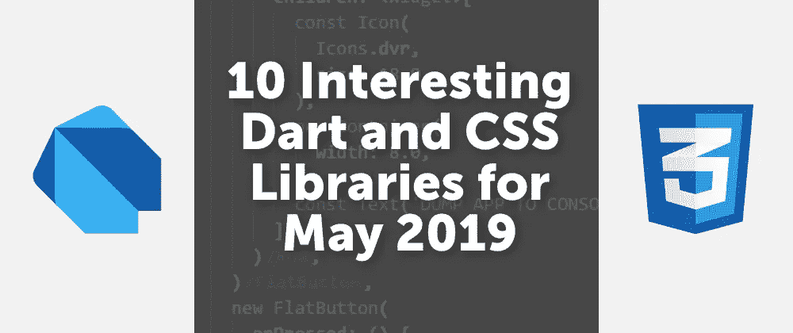

# 2019 年 5 月 10 个有趣的 Dart 和 CSS 库

> 原文：<https://itnext.io/10-interesting-dart-and-css-libraries-for-may-2019-99081f8ff724?source=collection_archive---------5----------------------->

## 您可以立即开始使用这些工具…



*原帖*[](https://creativebracket.com/10-interesting-dart-and-css-libraries-for-may-2019/)

*Dart 最近又取得了一次胜利，根据 StackOverflow 2019 年度开发者调查，它在最受欢迎的语言[中排名第 12 位。有鉴于此，我挑选了 10 个最有趣的 Dart 包，你可以和 CSS 库一起开始工作，你应该把它们列入下一个 web 项目的候选名单。](https://insights.stackoverflow.com/survey/2019#most-loved-dreaded-and-wanted)*

# *1.[迪奥](https://pub.dartlang.org/packages/dio)*

*[**Dio**](https://pub.dartlang.org/packages/dio) 是一个强大的用于进行 HTTP 请求的库。它包装了 Dart 的`HttpClient`类，同时扩展了它的功能，例如拦截器、文件下载、请求取消、超时等等。它可以在全球范围内进行配置，使用起来非常简单:*

```
***import** 'package:dio/dio.dart';

void main() async {
  try {
    **Response** res = **await Dio().get**('https://news.ycombinator.com');
    print(res);
  } catch(e) {
    print(e);
  }
}*
```

# *2. [BulmaCSS](https://bulma.io/)*

*[**布尔玛**](https://bulma.io/) 是一个基于 **Flexbox** 的免费开源 CSS 框架，被超过 **15 万**开发者使用，包括我自己。它提供了助手类，用于设计各种 UI 元素的样式，同时采用移动优先的响应式设计方法。事实上，我和布尔玛在这个系列教程中合作过。*

# *3. [RxDart](https://pub.dartlang.org/packages/rxdart)*

*[**RxDart**](https://pub.dartlang.org/packages/rxdart) 是基于 ReactiveX JS 对应物的反应式函数编程库。它是 Flutter 移动应用中状态管理的首选解决方案之一，尽管它也适用于服务器和 web。RxDart 建立在 Dart 相当不错的 Streams API 之上，具有额外的功能。*

# *4. [Water.css](https://github.com/kognise/water.css)*

*[**Water.css**](https://github.com/kognise/water.css) 是一个 *just-add-css* 风格集合，让简单的网站看起来更好。通过将 CSS 文件粘贴到您的`<head>`部分，可以很容易地激活它:*

```
*<link rel="stylesheet" href="https://cdn.jsdelivr.net/gh/kognise/water.css@latest/dist/dark.css">*
```

# *5. [html](https://pub.dartlang.org/packages/html)*

*[**html**](https://pub.dartlang.org/packages/html) 是一个纯粹的 Dart HTML5 解析器。是 Python 的 html5lib 的一个端口。当[编写网页抓取器](https://creativebracket.com/write-your-first-web-scraper/)时，它有一个简单明了的 API 和一个有用的应用程序。*

# *6. [animate.css](https://daneden.github.io/animate.css/)*

*[**Animate.css**](https://daneden.github.io/animate.css) 提供 *just-add-water* CSS 动画，简单明了！它有反弹，脉冲，震动和其他一些效果。*

# *7.降价销售*

*[**markdown**](https://pub.dartlang.org/packages/markdown) 是一个用 Dart 编写的可移植 markdown 库。它可以在 web 和服务器上将 Markdown 解析成 HTML。谁能把这个和 html 库结合起来，谁就得分。在 https://dartlang.github.io/markdown 试用一下。*

# *8. [DynCSS](https://www.vittoriozaccaria.net/dyn-css/)*

*[**DynCSS**](https://www.vittoriozaccaria.net/dyn-css/) 解析你的 CSS 中的`-dyn-(attribute)`规则，然后通过 JS 对类似`scroll`和`resize`的浏览器事件进行评估。结果被应用到您在`(attribute)` sufix 中指定的 CSS 属性。*

*在大多数情况下，您只需要设置 CSS 属性/值对，但也有一个用于自定义函数的 JS API，可以从 Dart 访问它。这是工作中的[演示](https://www.vittoriozaccaria.net/dyncss-example/)。*

# *9. [pdf](https://pub.dartlang.org/packages/pdf)*

*[**pdf**](https://pub.dartlang.org/packages/pdf) 为 web 和 Flutter 项目创建 pdf 文件。它可以使用 TrueType 字体创建包含图形、图像和文本的完整多页文档。该库提供了一个低级的 PDF 创建实用程序，它负责 bits 的生成，并提供了一个类似于 Flutter 的小部件系统，用于轻松创建高级 PDF。*

```
***final** pdf = **Document()**  ..**addPage**(**Page**(
    **pageFormat**: PdfPageFormat.a4,
    **build**: (Context context) {
      return **Center**(
        child: **Text**("Hello World"),
      ); // Center
  })); // Page*
```

# *10. [Hover.css](http://ianlunn.github.io/Hover/)*

*css 提供了一组 CSS3 支持的悬停效果，可应用于链接、按钮、徽标、SVG、特色图片等。它可以应用于你自己的元素，也可以修改。可在 CSS，SASS 和更少。*

# *分享是关怀*

*如果你喜欢读这篇文章，请通过本页的社交按钮分享。此外，查看并 [**订阅我的 YouTube 频道**](https://youtube.com/c/CreativeBracket) ( *也点击铃铛图标*)获取 Dart 上的视频，包括 *Angular、Vue、React、HTTP、RESTful APIs、MongoDB* 等等。*

*访问[**creativebracket.com**](https://creativebracket.com)获得更多深入的 Dart 教程。*