# 10 个重构提升你的干净代码技能

> 原文：<https://itnext.io/10-refactorings-to-boost-your-clean-code-skills-3a1e142d63f3?source=collection_archive---------0----------------------->

我喜欢重构。我喜欢一点一点清理代码的过程，最终达到一种状态，对以后需要阅读的人来说更容易。重构就是一小步一小步的走，只有这些小步才会有大作为。

【更新 07。2023 年 2 月]如果你有兴趣深入这个主题，我已经创建了[免费在线课程](https://icodeit.thinkific.com/courses/test-driven-development-with-react)，涵盖本文讨论的所有主题以及更多内容。本课程旨在互动、吸引人，并包含实用的技巧和技术。课程结束时，你将对这门学科有一个扎实的理解，并能够在日常生活中运用所学。

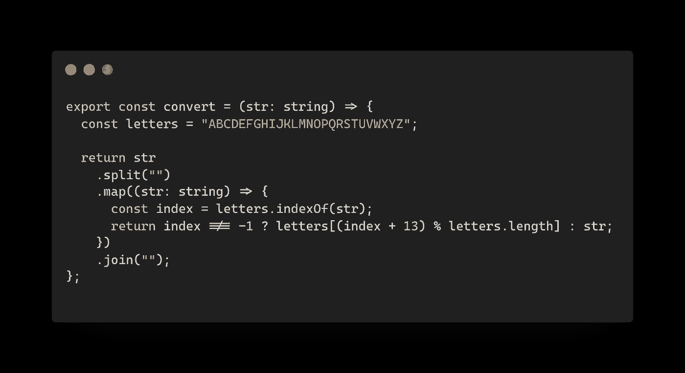

10 次重构

> *构建一个软件设计有两种方式:一种是让它简单到没有明显缺陷，另一种是让它复杂到没有明显缺陷。*
> 
> 霍尔

这种事情在我身上发生过很多次了。最初，代码很复杂，我看不到多少潜在的改进。但是一旦我移动了位，提取了变量(或者稍后内联它)，重命名了函数或者改变了它们的签名，等等。慢慢地，我可能知道如何用更好的设计模式来制作它。

所以糟糕的代码很难理解。它在同一个函数中使用不同层次的抽象，让读者不得不切换上下文。我们都知道代码看起来有多好，就像我们知道代码看起来有多差一样，但问题是:我们如何从不好的代码(我指的是你现在正在开发的代码库)开始变得更好？

对我来说，答案非常清楚:花些时间掌握这些基本的小重构，不要被它们的名字或努力误导。我知道它们中的大多数都非常简单明了，几乎不言自明，看起来也没什么大不了的。但是一旦你掌握了它们并把它们放进你的日常工具箱，你会发现它们的力量。

文章的视频版本

# 我的 10 大重构

大多数开发人员可能都有自己的十大重构，下面是我列出的十大重构。它们分为两大类:提取和移动。一个提取可以用在变量，函数和类型上，而移动我的意思是跨多个文件(像分裂模块到其他文件或内联回来)。

# 1.提取变量

每当你发现某个表达式太长或者需要一个**概念**来保持，你就需要一个变量。我不是正常地把变量、字段和常量当作 JavaScript 或 TypeScript 中的不同重构；唯一的区别是放置它们的范围。

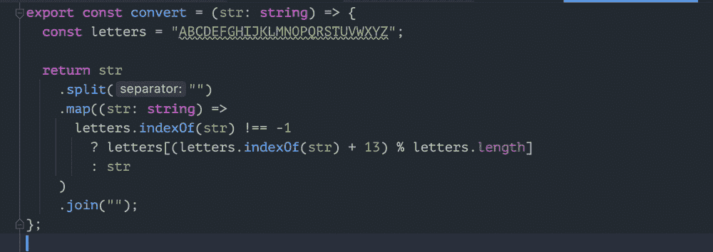

提取变量

对于下面的代码片段，空字符串可以提取为一个名为`separator`的变量，因为这正是它所做的。同样，常数`13`可以提取成`shift`或`offset`来表示其含义。

所以没什么特别的。实际上，干净代码的一个重要方面是它不应该给读者带来任何惊喜。它应该简单明了。

# 2.提取功能

函数是许多编程语言中最重要的组成部分，也是放置业务逻辑和表达式的最佳位置。如果你不密切关注，它很容易变得过大或内部有太多的东西。

虽然函数体有多少行代码没有这样的规律，但我倾向于把它做小。如果它太长，我从一些语句中提取子函数，使它们可读和易于修改。*这里的关键是你如何命名你提取的函数*。

例如，可以将地图内部的匿名函数提取到一个单独的函数中，这反过来会更容易阅读和测试(或者在其他地方重用)。

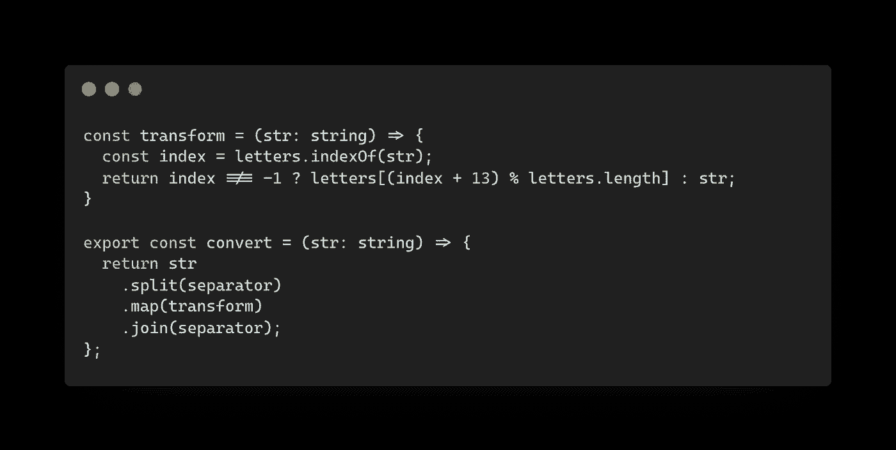

提取功能

# 3.提取参数(更改函数签名)

在函数内部进行大规模重构时，这种情况经常发生。当你需要从外界传入一个内部状态，而你又不想在那个时候使用一个全局常量时，你可以先提取一个参数，然后在调用的地方传入一个变量(可能是一个全局常量)。

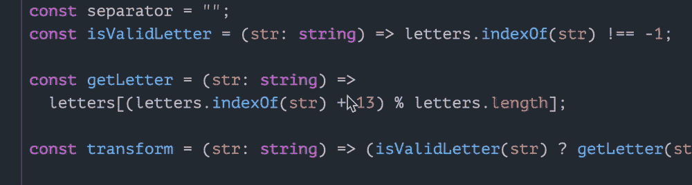

提取参数

# 4.提取类型定义

随着道具列表的增长，阅读变得越来越困难(而且这通常意味着你的组件要么做了太多的事情，要么只是对它的子组件钻道具，这应该通过一些进一步的重构来避免)。

修复相对容易。您在 TypeScript 中将类型提取为类型定义，以便它也可以在其他地方共享(例如，在测试或其他模块中)。我更喜欢在该位置使用它之前提取并放置它。必要时，我会把它移到模块根层的一个`types.ts`文件中。

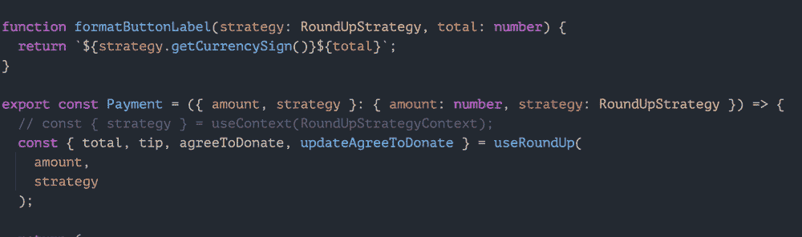

引入新的类型定义

# 5.幻灯片声明

也许这是你能找到的最简单的重构，但有时它会产生巨大的差异。如果你把源代码想象成一个文件，比如把东西放在你的桌子上，或者把书放在你的书架上。

只是想到*魔法石*在你书架上的 *UNIX 网络编程*和 *TCP/IP 指南*之间，你会怎么做？是的，将*魔法石*滑入它自己的部分。我们在代码中也经常看到这种情况，所以幻灯片语句是一种很好的技术，可以使代码读起来更流畅，更连贯。

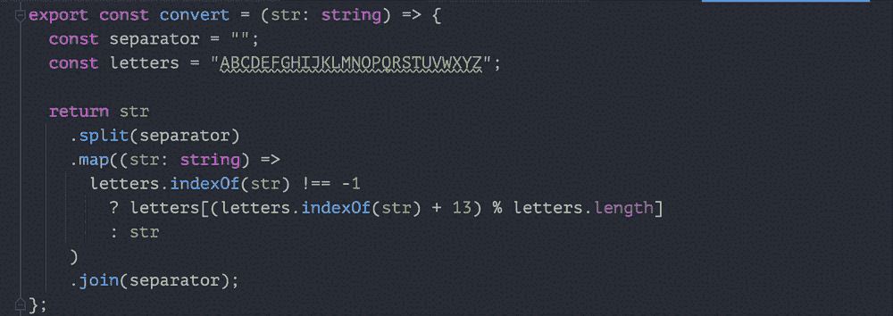

上下滑动语句

此外，一旦将一个或几个语句放入一个组中，就可以更容易地用这些块提取另一个函数。

# 6.更改函数声明

当一个新的行为被添加，或者现有的行为被改变时，我们需要更新函数名以确保函数名仍然反映它所做的事情。

看到一个名为`formatDonationLabel`的函数是一种令人沮丧的体验，但是它的内部做了更多的事情。Change Function Declaration 正是这样做的，它将更新所有的引用，就像在测试或其他模块中一样(事件注释和文档)。

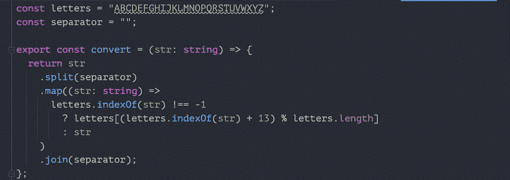

更改函数声明

一个更好的函数名可以在调试时节省大量时间。实际上，一个函数最重要的部分是它封装了**如何**，但只表示**什么**——这样你就不需要在调试上层时深入了解。

# 7.改变变量

同样的事情也适用于变量。很多时候我都想不出一个好名字，所以我会用一个很普通的名字，比如`x`或`segment`作为占位符，一旦我做了更改，对变量的内容有了更好的了解，我就会更改变量名。

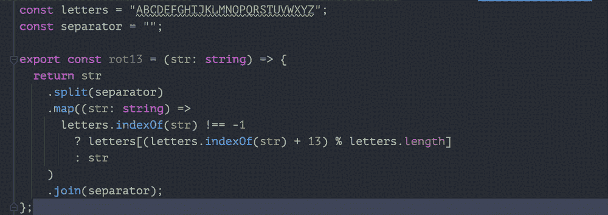

改变变量

# 8.移动字段/常数

通常，当您将语句滑动到更高的范围或提取一些实用函数时，您会很快意识到将它们移动到其他模块也可以使用的地方可能是好的。此外，我发现即使不经常重用，将它们移动到一个单独的文件中也可以使当前的文件简洁明了，从而更容易阅读和理解。

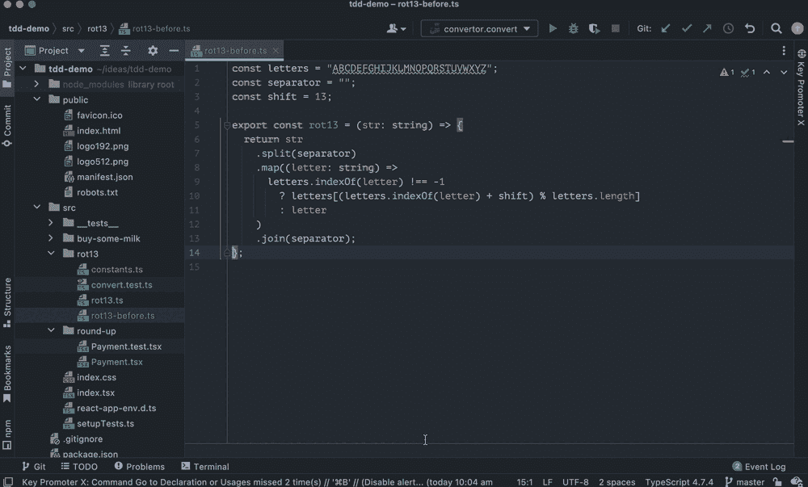

将字段/常数移动到另一个文件

# 9.内嵌变量

这绝对是个牛逼的功能，而且是提取的反向动作。当你改变主意的时候会有帮助，而且总会有 B 计划——反其道而行之。

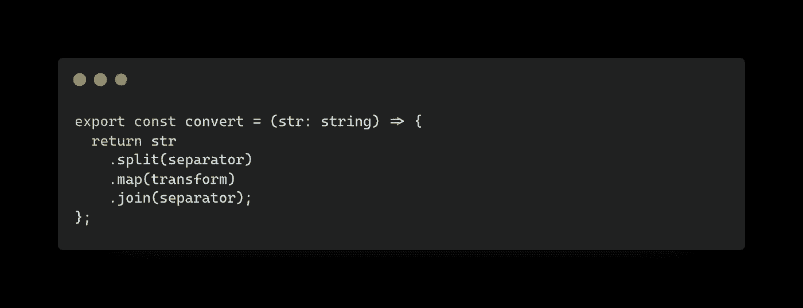

内嵌函数/变量

在其他情况下，当您删除所有重复的内容时，内联是一个很好的选择，并且没有太多的空间让变量来保存一次性表达式。

# 10.更改签名

然后是我们最后但并非最不重要的一个变更签名。它实际上是几种情况的组合:改变参数顺序、添加/删除参数或改变其类型。

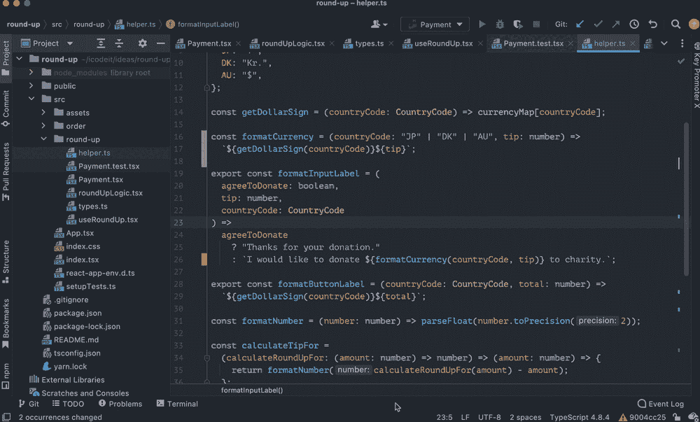

更改函数签名

因为它会更新所有的调用位置，所以如果你用静态类型语言编程，在大多数情况下是安全的。

# 奖金 1: ⌘ + T

当您刚刚开始您的重构之旅时，您可能不知道哪些重构适用于您的案例。问 IDE。

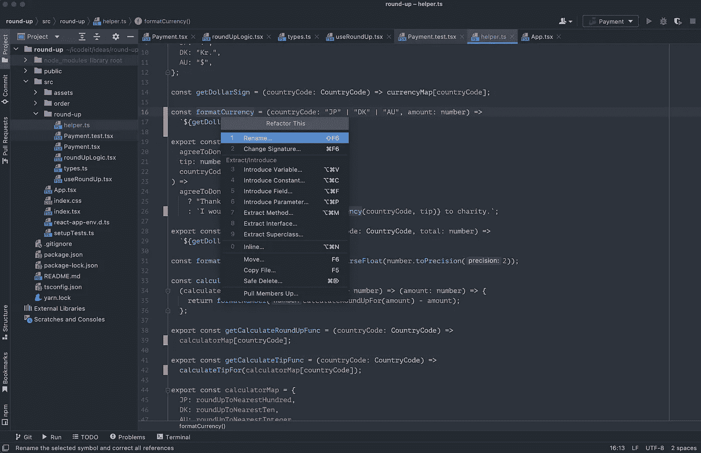

命令 T

# 奖金 2: ⌘ + ⇧ + A

如果您不确定有哪些可用的操作，只需按下`⌘ + ⇧ + A`，然后您就可以搜索要使用的命令。例如，我想从 JSX 提取一个组件，但不确定快捷方式是什么，所以我先输入`⌘ + ⇧ + A`,如果有相关的命令，再输入`extract component`。然后，我可以将它应用于插入符号下的代码。

# 摘要

我列出了你应该掌握的 10 个最常用的重构(最好也记住所有这些捷径)。所有对更复杂代码的重构或重新设计都是基于这些小的、琐碎的重构。大多数时候，在这些微小的重构之后，你会注意到更大的东西，这在当时是看不到的。

我还为此制作了[一本免费的 22 页书](https://icodeit.ck.page/10-refactorings)，你也可以下载[PDF 文件](https://icodeit.ck.page/10-refactorings)。