# 从嘈杂散点图查看相关性的 10 种方法

> 原文：<https://itnext.io/10-ways-to-view-correlation-from-a-noisy-scatter-plot-f744a6527ea6?source=collection_archive---------3----------------------->

散点图对于查看两个变量之间的相关性是一个很好的工具，但是当有太多的噪音时，这可能会变得非常混乱。如何减少图中的噪声，以便更容易地将相关性可视化？

当你的散点图被数据搞得很乱，不清楚相关性在哪里时，你该怎么办？这里是来自 Kaggle 的 [FIFA23](https://www.kaggle.com/datasets/bryanb/fifa-player-stats-database) 数据集的数据来演示这个确切的场景。正如你所看到的，随着球员年龄的增长，到处都有可能与整体正相关的点。这种相关性有多少是噪音，有多少是真实的？我们能不能换个角度来理解大多数球员的年龄差距？

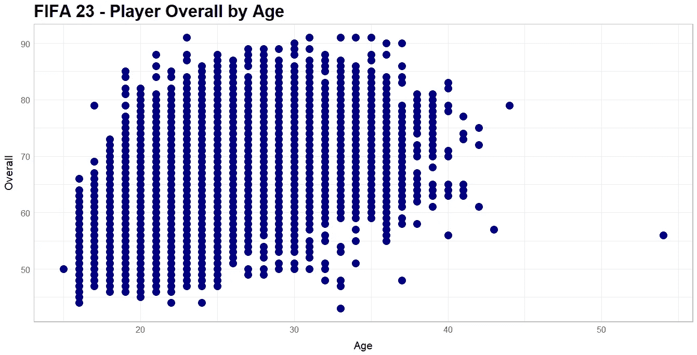

这里有 10 种方法可以查看相同的数据并获得更好的见解。

# 1.抖动这些点

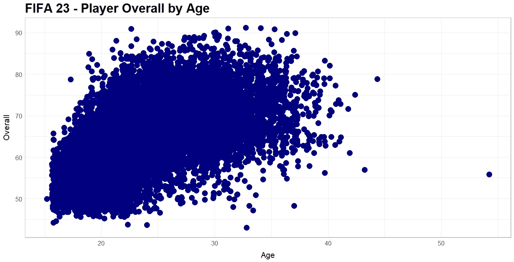

有了这个数据集，两个变量(总体和年龄)都是离散的，我们可以抖动这些点，以便更清楚地看到绝大多数变量在哪里。抖动会将值的微小变化随机分配给每个点，因此位于总体 70 和年龄 30 的点会被微小地改变为总体 70.25 和年龄 29.89。

随着情节的抖动，我们可以看到趋势接近我们之前看到的，然而极端似乎没有以前那么大。有一个更明显的增长，然后平台期。由于抖动提供了更多一点的值，考虑到我们两个值的离散性质，我将在接下来的几次散射变化中保留它。

# 2.点数的大小

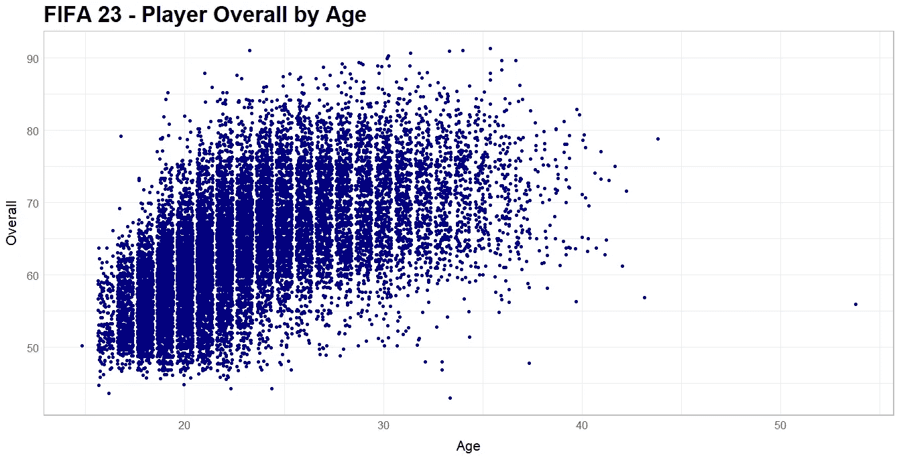

仍然包括抖动，我现在也更新了点的大小。通过较小的点，现在可以更清楚地看到数据流的位置，以及数据开始变薄的位置。在这一点上，看起来有一个非常明显的增长，直到大约 26 岁左右，当它开始平台期，甚至开始弧形下降。

# 3.点的透明度

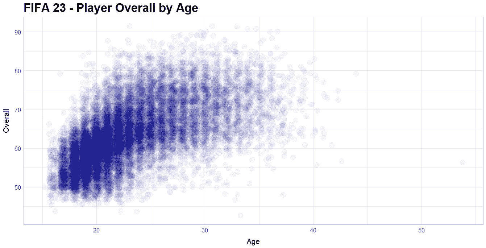

当你看到下一个变化时，我不希望你担心你的视力，它仍然非常好。我只是降低了每个点的透明度。这里的想法是，如果在相同的邻近区域有多个点，这些点将会彼此重叠，因此通过使每个点更加透明，这些点的重叠将变得更加清晰，从而显示大多数值随时间变化的模式。

# 4.添加趋势线

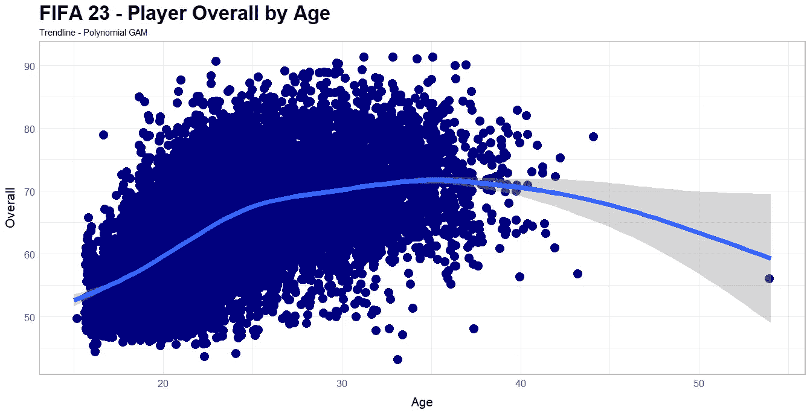

在这一点上，我们将尝试不同的东西。我没有更新数据点来更好地了解趋势，而是添加了一条趋势线，这样我们可以更好地了解数据的形状。趋势线可以遵循几种不同的方法，如线性，逻辑和其他。因为我知道数据不是线性的，并且有某种形式(感谢我们之前讨论过的变化),所以我使用了 gam 形状，这样它将遵循一个更多项式的曲线。我们所看到的趋势线和我们在其他变化中看到的路径相似，先上升到一个平台，然后下降。

# 5.抽样

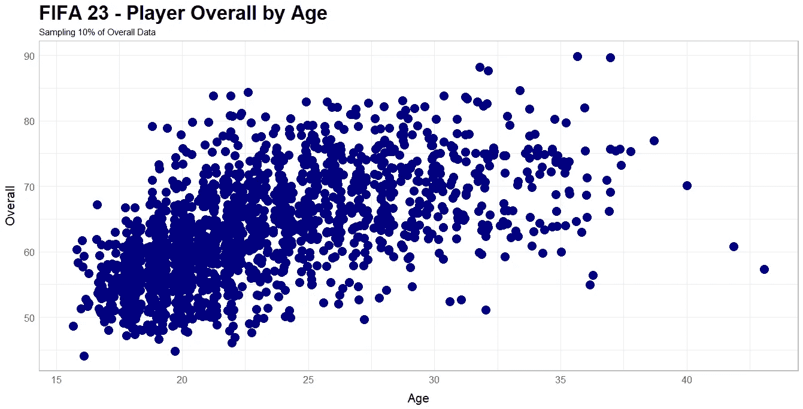

对数据进行采样是透明的反义词。我们不是在视觉上降低每一分的价值，而是减少分数。这里的想法是，通过对数据进行随机采样，构成散点图中所见噪声的那些噪声将会消失，让大多数噪声更容易显示趋势。正如我们在这里看到的，我们之前看到的相同趋势更加明显。

# 6.2D 密度

***地势由线***

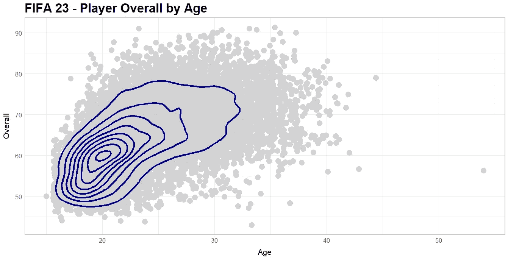

与密度图的工作原理类似，它会查看图表中密度最高的区域(一个位置中最多的点),并在其上绘制一种地形图。就像山一样，海拔越高，圆圈越小，圆圈越大，海拔越低。从这个意义上说，海拔就是密度。正如我们所见，20 岁和 60 岁左右是大多数球员的总得分，然后地形向上移动，在 26 岁左右达到总得分 70，就像我们以前看到的那样。

***地形坡度***

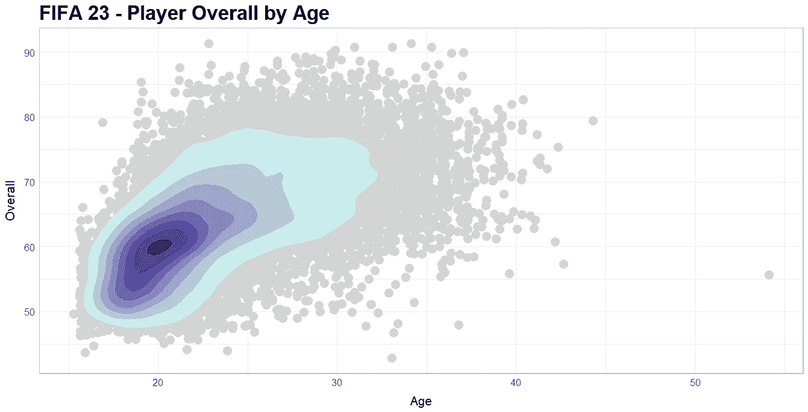

这是和上面一样的图，除了这次用颜色渐变代替了线条。

# 7.矩形宁滨

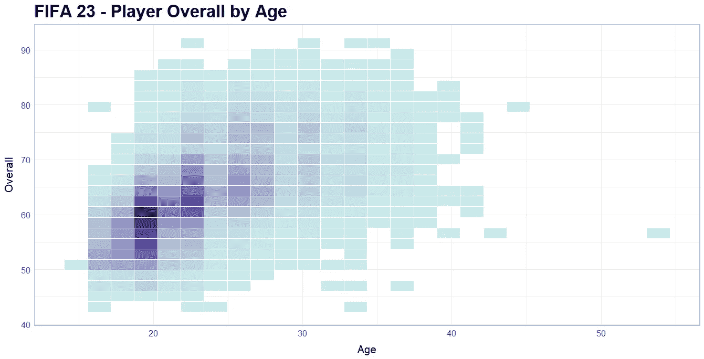

另一种观察地形的方法是通过宁滨，只不过在这种方法中我们把宁滨两个变量放在一起。有点像房子里的平方英尺。我们将多个部分设置成一平方英尺，并计算该位置的玩家数量。

# 8.六角宁滨

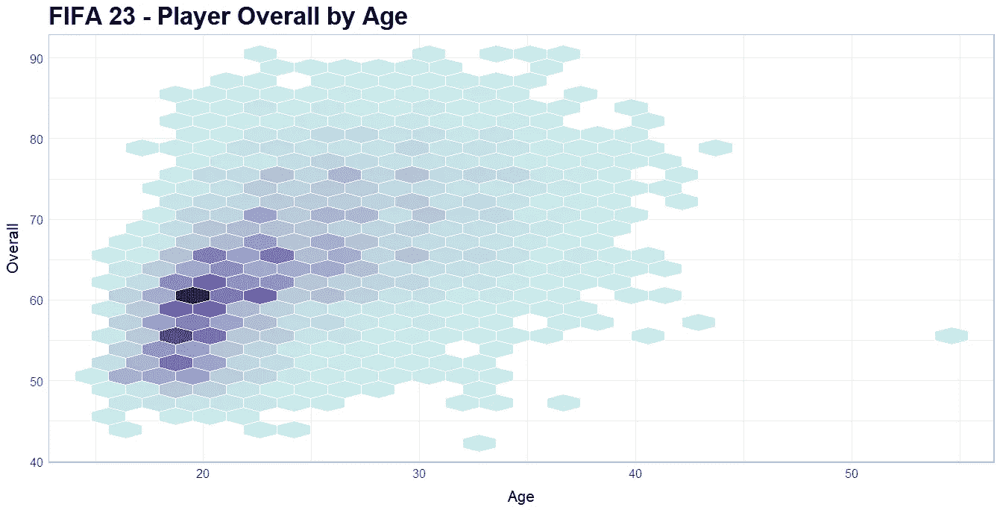

与矩形宁滨相似，此图表以六边形显示条柱。这种形状在自然界中承载了更多的重量，并允许有一个更容易被看到的视觉表现。这些非常有助于了解大多数人在哪里，而不仅仅是所遵循的趋势。

# 9.分级散点图

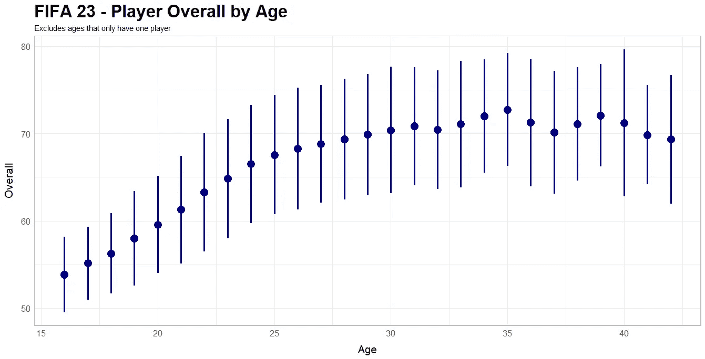

分级散点图实质上是获取数据并对其进行分组。类似于如何用方框图来表示数据，我们能够清楚地看到每个图形的分布，以及工作服的平均值如何随着球员年龄的变化而变化。需要注意的一点是，我们只能为那些有一个以上玩家的玩家创建分组，因为它使用标准差。

# 10.热图

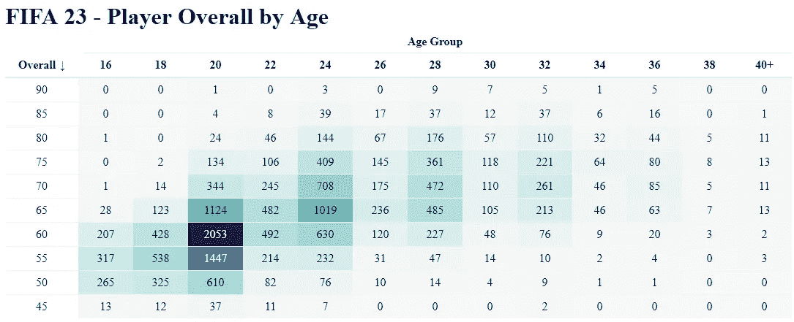

最后是热图。一种清晰、简洁的方式来查看每个分组的计数，上面的颜色渐变有助于直观地显示其流动方式。在这里，我们可以看到 20 岁到 60 岁的人总共有 2，053 名球员，随着时间的推移，他们的人数增加了，并保持在我们之前看到的水平。

# 参考资料:

*   [http://www . sth da . com/English/articles/32-r-graphics-essentials/131-plot-two-continuous-variables-scatter-graph-and-alternatives/](http://www.sthda.com/english/articles/32-r-graphics-essentials/131-plot-two-continuous-variables-scatter-graph-and-alternatives/)
*   [https://towards data science . com/goodbye-scatter plot-welcome-binned-scatter plot-a928f 67413 E4](https://towardsdatascience.com/goodbye-scatterplot-welcome-binned-scatterplot-a928f67413e4)
*   [https://statdoe . com/step-by-step-s 散点图-单因素 r/](https://statdoe.com/step-by-step-scatterplot-for-one-factor-in-r/)
*   [https://kcuilla.github.io/reactablefmtr/](https://kcuilla.github.io/reactablefmtr/)