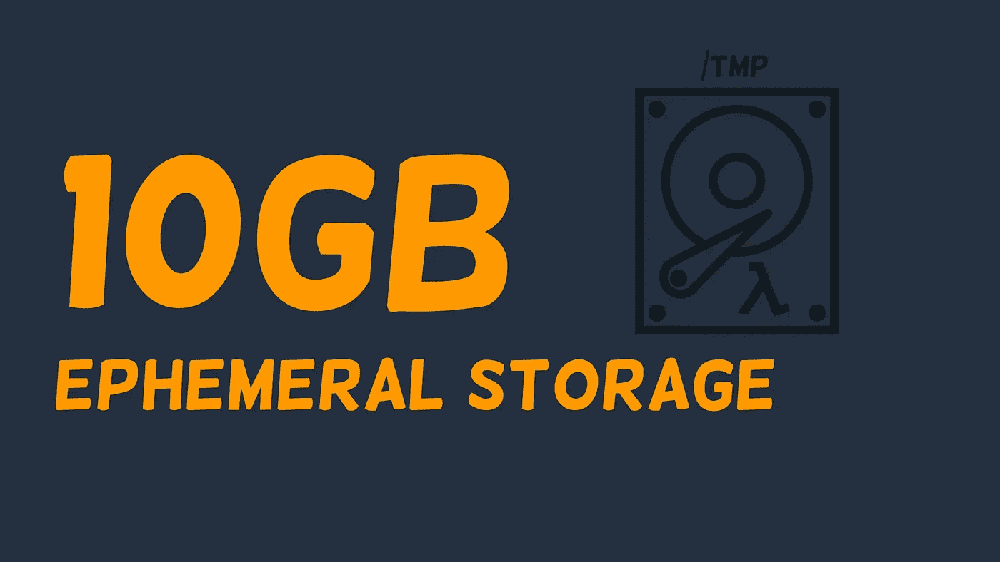
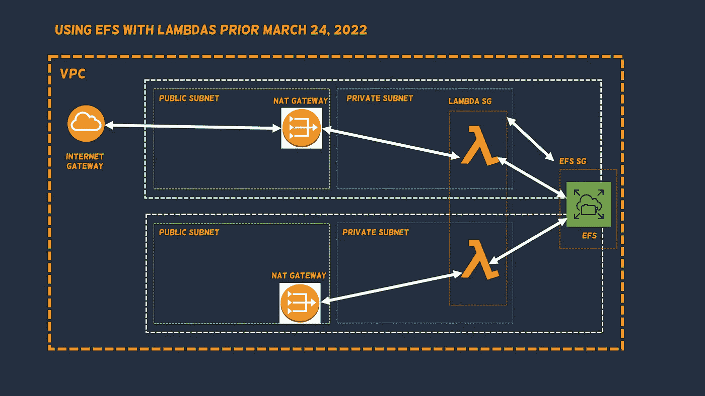
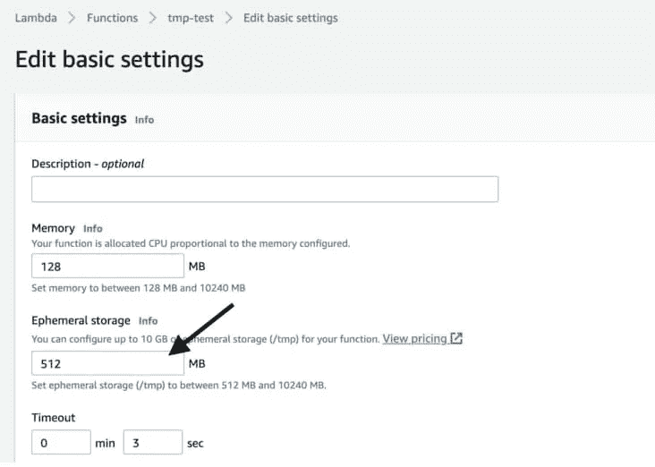
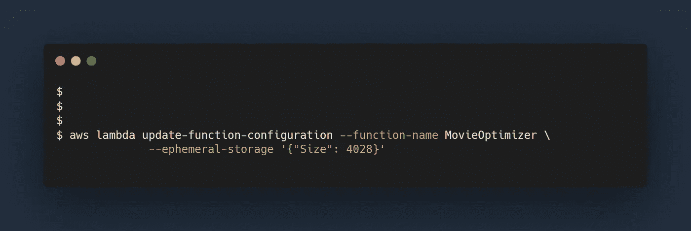
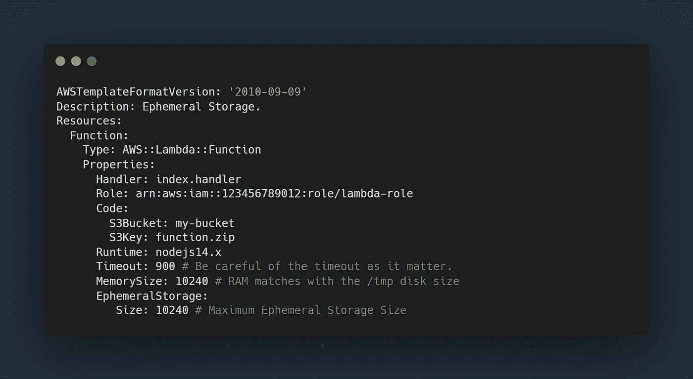
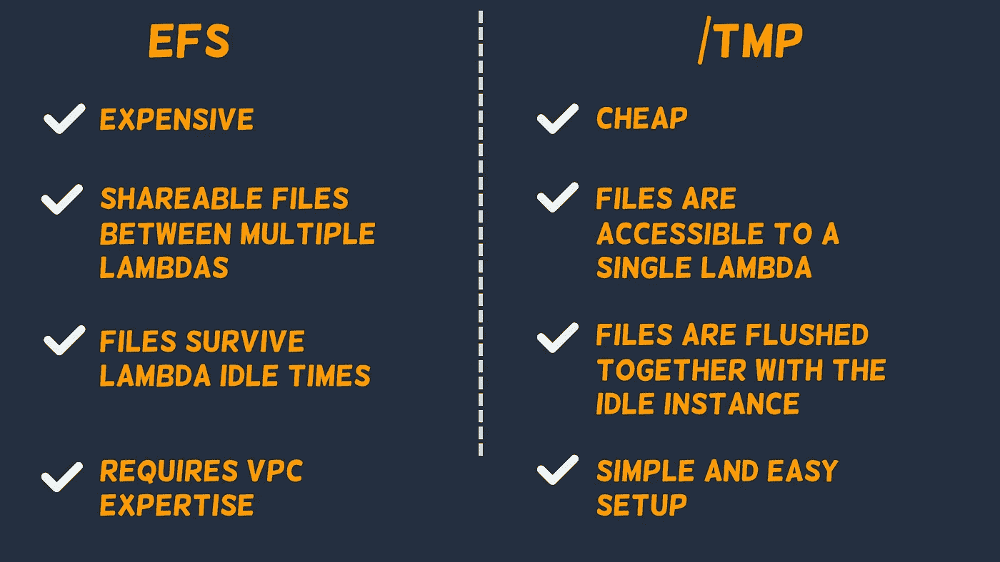

# 用于 AWS Lambda 的 10GB 临时存储

> 原文：<https://itnext.io/10gb-ephemeral-storage-for-aws-lambda-788fad51c99b?source=collection_archive---------1----------------------->

2022 年 3 月 24 日对于 AWS Lambda 消费者来说是一个突破性的日子，他们需要高于之前限制(512MB)的短暂/临时磁盘存储。在此更新之前，为 lambdas (> 512mb)配置大存储需要痛苦地设置 VPC + EFS 或烘焙大功能容器。

AWS 发布了一个更新，使其客户能够为 Lambda 利用 10GB 的短暂存储

# **问题陈述**

在 2022 年 3 月 24 日之前，AWS Lambda 在`/tmp`目录中提供了额外的 512MB 临时存储空间。虽然这个数量对于小规模磁盘缓存使用情形来说是足够且合理的，例如:

*   图像生成(QR 和条形码、头像生成)
*   将压缩文件(ZIP、GZIP、TAR)解压到磁盘。
*   缓存大于 256 MB 但小于 512MB 的 AI 模型
*   大于 256 MB 但小于 512MB 的 Python 包的着陆区

在解决需要使用大量临时磁盘空间的问题语句方面，它仍未达到预期，例如:

*   超过 512 MB 的依赖项(用于 ML 推理的 Python ML 库和 NodeJS 依赖项)
*   大于 512 MB 的 AI 推理模型(PyTorch、Tensorflow、MTCNN)
*   大型媒体文件的着陆区(1080P、2048P 和 4K 电影)
*   高性能计算(HPC)用例需要大量临时数据，如金融计算、用于低延迟计算的大量查找数据、高分辨率时间序列数据生成。

# **他们如何在 2022 年 3 月 24 日之前解决这个问题？**

在发布可配置的临时存储之前，解决后面的用例需要一个设置，该设置将提供对弹性文件系统(EFS)的 lambdas 访问。下图解释了 EFS 如何需要更多的跑腿工作才能让 VPC 内的兰姆达斯接近它:

2022 年 3 月 24 日之前访问大于 512MB 的存储需要设置。

更准确地说，该设置需要以下各项才能发挥作用:

*   1 个虚拟私有云(VPC)
*   至少 2 个可用区域
*   至少 1 个 NAT 网关
*   至少 1 个路由表
*   互联网网关
*   至少 2 个公共子网
*   至少 2 个私有子网
*   AWS Lambda 实例的 1 个安全组
*   1 个 EFS 安全小组
*   如果用例需要到其他网络的私有连接，例如同一帐户中的其他 VPC、其他帐户中的 VPC 和内部集成，这可能会变得更加疯狂。

# EFS 的缺点

将 EFS 与 Lambdas 集成只是提供大磁盘空间访问所需挑战的冰山一角。我们现在能想到的其他缺点是:

*   在 VPC 内运行 Lambda 函数间接导致冷启动。
*   人们可以使用供应的并发性来缓解前面的问题，但这只是通过持续运行 lambdas 24/7 来产生成本。
*   NAT 网关要求我们每月为每个实例支付 32.85 美元，感觉不值得几百次调用。
*   如果你需要把东西放在 EFS 上，我们还需要在网络内部安装 ec2，但对于 T4G.micro 及以下产品，价格可以忽略不计。
*   哦，顺便说一句，当开发人员第一次遇到这种情况时，他们还会有人力成本，ML 工程师真的很讨厌这种情况。
*   EFS 提供了一个多 az 持久 NFS 存储，并不符合短暂的要求，这可能会导致被遗弃的临时数据随着时间的推移而增长。

# **配置短暂存储**

在撰写本文时，有四种方法可以将临时存储集成到 Lambda 函数中。

# **通过 AWS 控制台**

在 AWS 控制台调整临时存储。

# **通过 AWS CLI**

基于 AWS CLI 的 lambda 临时存储调整方法。

# 通过 AWS SDKs

[AWS-SDK 设置临时存储的方式](https://docs.aws.amazon.com/AWSJavaScriptSDK/latest/AWS/Lambda.html)。选择您喜欢的语言(Python、NodeJS、Java、C#、Go)

# 通过云的形成

[基于云形成的](https://docs.aws.amazon.com/AWSCloudFormation/latest/UserGuide/aws-resource-lambda-function.html)短暂存储的配置。

# **EFS vs 短暂存储**

可配置的暂时储存不会让 EFS 过时，两者都有各自的优缺点。可能造成差异的主要因素有:

*   数据共享— EFS 提供跨多个可用性区域和 lambda 函数实例的可共享文件，而/tmp 存储仅限于单个 lambda 实例。
*   持久性——存储在 EFS 中的文件将在 lambda 函数空闲超时触发的刷新后**继续存在(编写时为 15 分钟),而/tmp 文件夹中的文件将会消失。**
*   成本— EFS 通常更贵，因为它需要 NAT 网关和 EFS，而/tmp 文件夹不太便宜，因为它的价格约为每年每 1.166832 美元。
*   易于配置——EFS 更难执行，因为它需要底层网络，这对 ML 工程师来说是一个挑战。

# 结论

最近发布的可配置临时存储被视为改变游戏规则的更新，有助于:

*   简化了在 Lambda 函数中提供临时数据存储访问所需的工作。
*   降低了与 EFS 孤立数据相关的成本和风险。
*   增加 Lambda 函数中客户可以存储数据的地方(Lambda 层、EFS、/tmp 和容器)
*   可配置的临时存储器的大小(10GB)现在与去年引入的可配置 RAM 的大小(10GB)和容器映像大小(10GB)同步

# 进一步阅读

*   崔琰公司写了一篇很棒的文章，提供了关于使用非默认临时存储的其他影响的有趣见解(例如，更高的临时存储对冷启动的影响)，我强烈推荐阅读这篇文章。
*   Channy Yun 写了一篇[文章](https://aws.amazon.com/blogs/aws/aws-lambda-now-supports-up-to-10-gb-ephemeral-storage/)，其中包含了一个关于 lambda 函数可访问的每种存储类型的不同特征&用途的综合矩阵。
*   和往常一样，阅读 AWS [文档](https://docs.aws.amazon.com/lambda/latest/dg/configuration-function-common.html#configuration-ephemeral-storage)来配置临时存储是一个很好的开始。