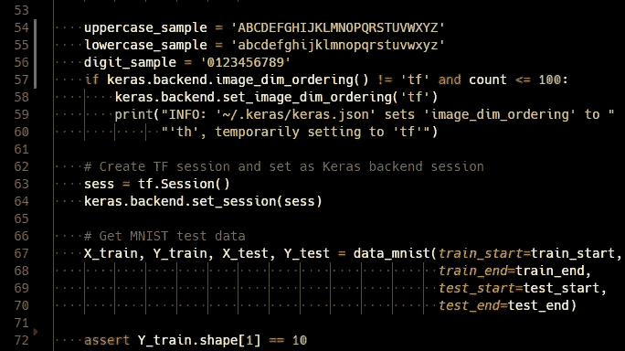
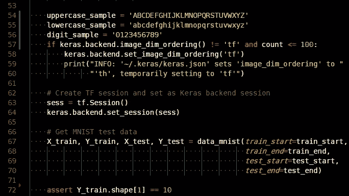
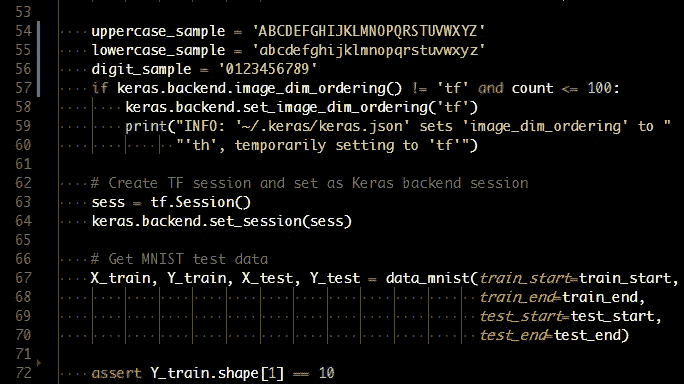
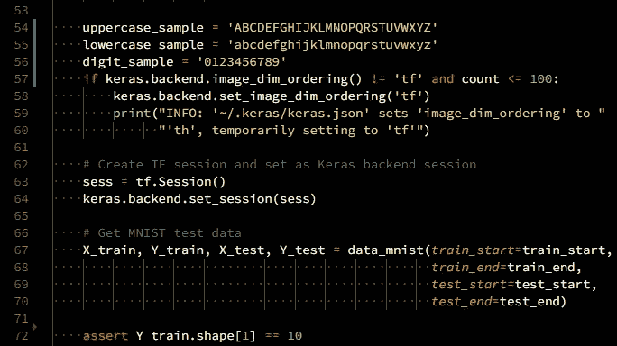
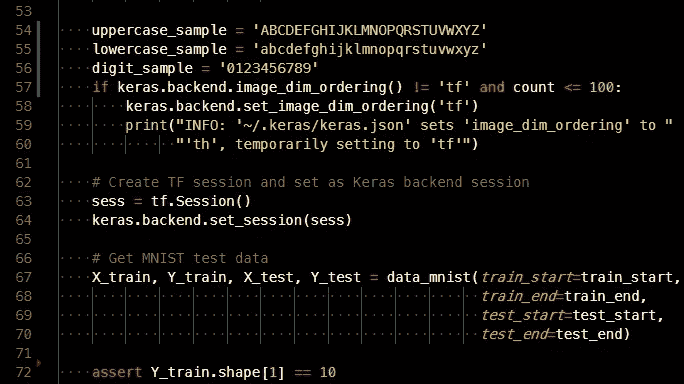
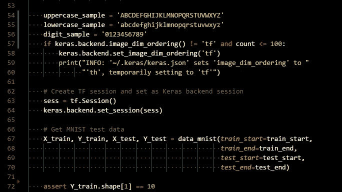
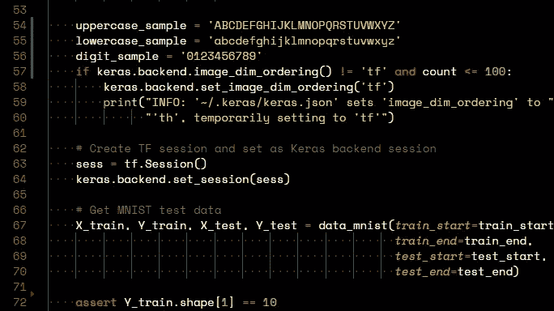
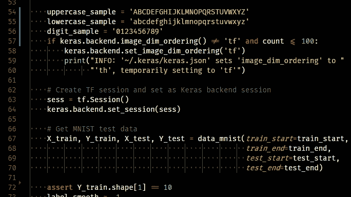
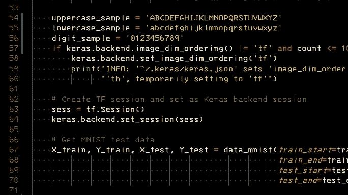
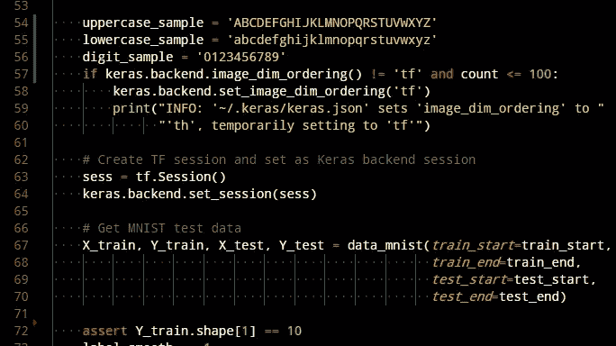

# 11 种最佳编程字体

> 原文：<https://itnext.io/11-best-programming-fonts-724283a9ed57?source=collection_archive---------0----------------------->

有许多比较编程字体的帖子和网站，它们都是令人惊叹的文章。那么，为什么我在这里重复同样的主题呢？因为我总是发现自己迷失在几十种字体中，无法找出哪一种最适合我。所以今天我尝试了很多字体，挑了以下几种字体给你。这些字体很受欢迎，也很容易买到。最重要的是，所有这些字体都是免费的！

我按照以下标准对字体进行了排名:

*   相似字符是否可区分，如`0O`、`1lI`
*   字体样式(线宽、字符宽度/高度)是否易读
*   还有我个人的喜好！

截图都是用来自同一个代码片段的 VSCode 做的。除非特别说明，所有截图都使用相同的设置`"editor.fontSize": 14`。

# 1.砍

[Hack](https://github.com/source-foundry/Hack) 是专门为源代码设计的开源字体，基于 Bitstream Vera 和 DejaVu 项目。`0O`和`1lI`清晰可辨，字体整体易读。具体来说，我喜欢斜线零。



# 2.无单核细胞德雅武

衍生自比特流 Vera，DejaVu 也是一个伟大的免费许可字体。Sans Mono 明确区分了`0O`和`1lI`。与 Hack 相比，`0`里面的点有点小，但总体来说，这种字体让人感觉很舒服。



# 3.摩纳哥

摩纳哥是雪豹之前 OSX 使用的默认字体。人物各不相同，所以很难混淆`0O`和`1lI`。我喜欢这种字体，因为它的特殊风格让我感觉像是又在用 OSX(我现在主要用的是 Ubuntu)。



# 4.源代码专业版

[源代码 Pro](https://github.com/adobe-fonts/source-code-pro) 由 Adobe 设计。总的来说，文本看起来比其他字体更清晰，更不用说它的可识别字符了。



# 5.门洛

Menlo 是 macOS 中 Xcode 和终端的新默认字体。这是一个衍生的德加武无单。就我个人而言，我更喜欢摩纳哥，因为我很久以前就开始使用 OSX，但 Menlo 也是一个很好的编程选择。



*更新* : Menlo 不再是 macOS 中的默认字体。在 macOS High Sierra 中，默认字体已经改成了旧金山 Mono，这也是编程的绝佳选择。感谢[伊万·坎塔里诺](https://medium.com/u/fd0c25fdb49d?source=post_page-----724283a9ed57--------------------------------)和 [p13t3rm](https://medium.com/u/26eeccac6d2b?source=post_page-----724283a9ed57--------------------------------) 。

# 6.康索拉斯

Consolas 是 Microsoft Visual Studio 的默认字体。因为是 Windows 自带的，所以很受欢迎。我个人不太喜欢`l`这个字符，因为它很容易与`1`混淆。



# 7.空间单声道

[Space Mono](https://medium.com/google-design/introducing-space-mono-a-new-monospaced-typeface-by-colophon-foundry-for-google-fonts-84367eac6dfb) 由松香铸造厂设计，是一款很棒的等宽字体。我不喜欢的两个缺点:(1) `l`可能会与`1`混淆(2) `,`在 14pt 字号下与`.`无法区分。



# 8.菲拉科德

[FiraCode](https://github.com/tonsky/FiraCode) 支持字体连字功能。它可以将两个或两个以上的字符合并成一个字符，使读码更加清晰。注意下面截图中的`!=`、`<=`和`==`。虽然我不喜欢连字字体，因为我熟悉原始符号，当看到合并字符时会感到有点困惑，但我相信这种字体会对其他人有所帮助。



注意:在 VSCode 中，必须将以下行添加到 setting 中，以便启用字体连字。

```
"editor.fontLigatures": true,
```

# 9.匿名专家

我喜欢[匿名职业](https://www.marksimonson.com/fonts/view/anonymous-pro)，因为它给人一种打字机的感觉。此外,`<`字符比 Hack 窄，这使它感觉像一个符号。


# 10.IBM 3270

[IBM 3270](https://github.com/rbanffy/3270font) 基于 IBM 3270 终端使用的字体，由 IBM 于 1971 年制造。这种字体对于编程来说非常棒，并且给人一种复古的感觉(虽然我还不太习惯)。



注意，这种字体相对较小，所以我的建议是增加字体大小，降低行高，使其在屏幕上更具可读性。

```
"editor.lineHeight": 20,
"editor.fontSize": 14,
```

# 11.Droid Sans Mono

Droid Sans 是为 Android 创建的，是一种漂亮的字体。然而最大的问题是它没有斜线零，所以`0`和`O`是不可区分的。



*更新* : Droid Sans Mono 有斜线和圆点变体[这里](https://github.com/AlbertoDorado/droid-sans-mono-zeromod)。感谢[霍特·史密斯](https://medium.com/u/5e5d11afdfc5?source=post_page-----724283a9ed57--------------------------------)。

感谢阅读！希望这篇文章能帮助你为你的 IDE 或者终端找到一个新的字体，就像买一件新 t 恤一样！喜欢这篇文章请推荐！

*更新:*

我收到了关于其他编程字体的回复。是的，它们都是很棒的字体，我完全同意你的观点！这篇文章的主要目的是为那些很少使用字体的人提供一个基础，因此我会尽量保持它的最小化，不要让他们不知所措。但是谢谢大家的回复，我愿意在日常工作中尝试一下大家提到的字体。