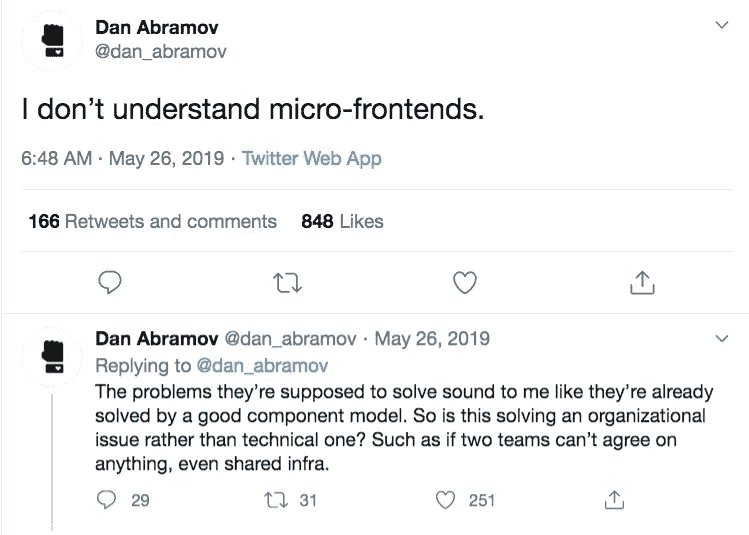
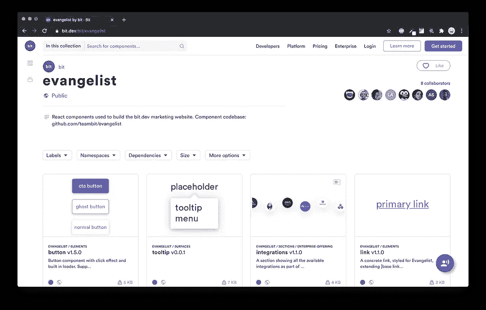
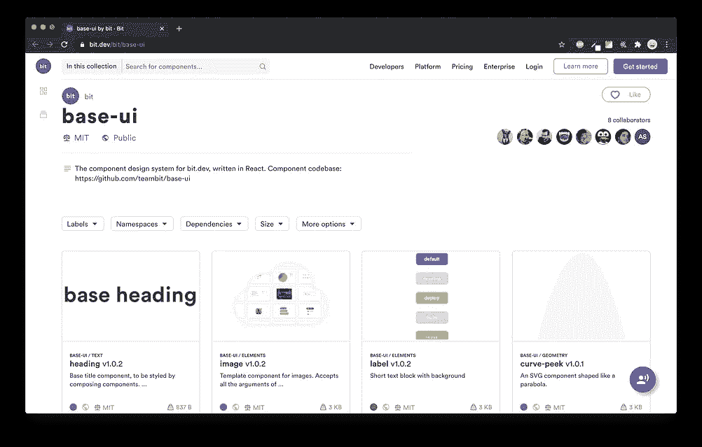
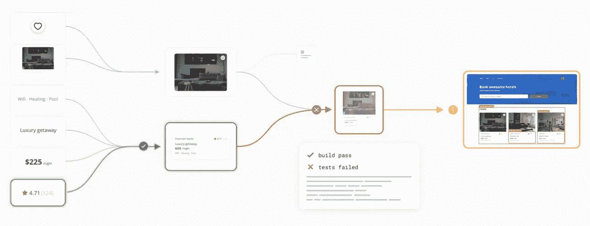
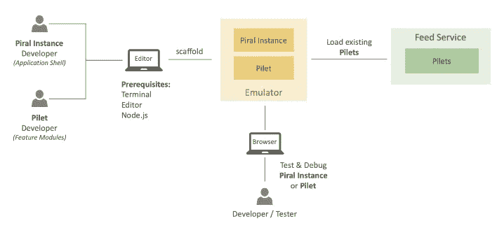
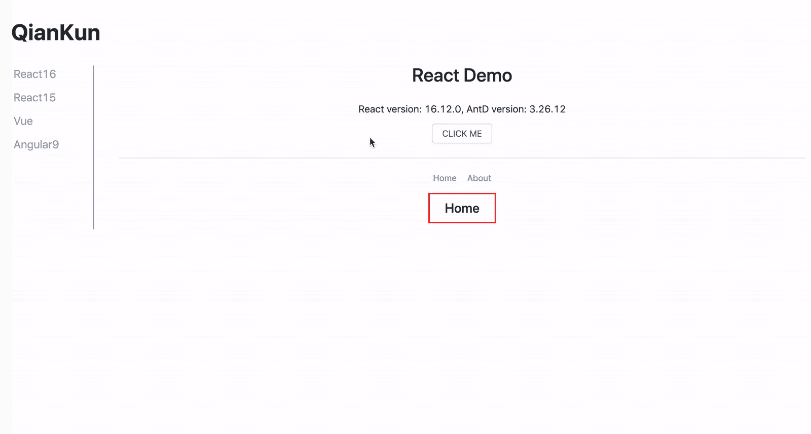
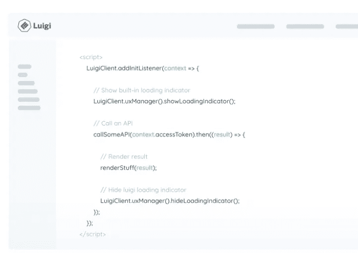
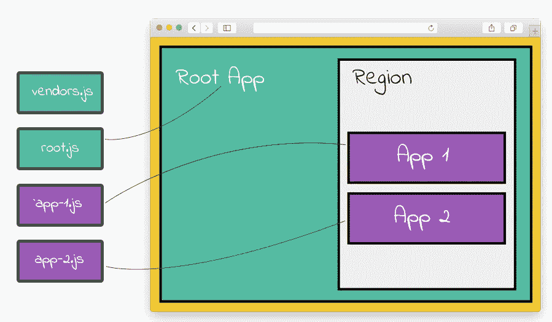
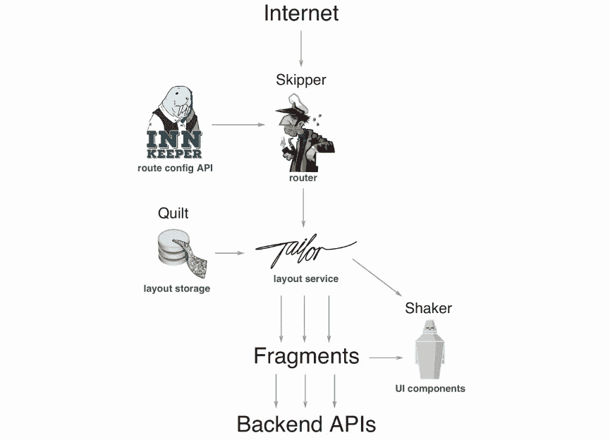
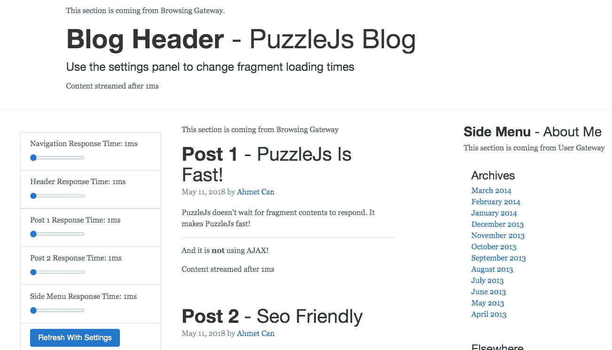

# 你应该知道的 11 个微前端框架

> 原文：<https://itnext.io/11-micro-frontends-frameworks-you-should-know-b66913b9cd20?source=collection_archive---------0----------------------->

## 发现帮助您构建优秀微前端的最佳工具。

将长期存在的后端整体分解为微服务使得后端开发过程获得了新的效率和规模。然而，今天大多数前端应用程序架构仍然是单一的，这使得很难加速和扩展前端开发过程。

微前端的想法是将前端整体分解成更小、更易管理的部分。每个团队可以端到端地拥有自己的功能，在自己的代码库中工作，独立发布版本，不断地交付小的增量升级，还可以通过 API 与其他团队集成，以便他们可以一起编写和管理页面和应用程序。

微前端有许多方法，从组件的智能构建时集成到使用定制路由器的运行时集成。在这个列表中，我收集了最突出的工具来帮助构建微前端。欢迎在评论中添加您的反馈或建议！

# 1.少量

[**位**](https://bit.cloud) 让你从独立的组件组成和管理前端。对于采用微前端来说，这可能是最受欢迎和最适合生产的解决方案。

**阅读:“** [**我们如何构建微前端”**](https://blog.bitsrc.io/how-we-build-micro-front-ends-d3eeeac0acfc)

 [## 我们如何构建微前端

### 构建微前端来加速和扩展我们的 web 开发过程。

blog.bitsrc.io](https://blog.bitsrc.io/how-we-build-micro-front-ends-d3eeeac0acfc) 

如果你看一下 [**bit.dev 主页**](https://bit.dev/) 你会注意到它是由不同团队在不同代码库中构建的独立组件组成的，并且都集成在一起以创建一个有凝聚力的产品。

示例—带 Bit 组件的微前端

Bit CLI 是一个广泛流行的组件驱动开发工具。使用 Bit，您可以将独立的组件构建、集成和组合在一起。

虽然微前端通常被认为是在运行时发生的组合，但 [Bit 让开发人员在构建时](https://blog.bitsrc.io/how-we-build-micro-front-ends-d3eeeac0acfc)有效地组合前端，以享受两个世界的最佳之处:“传统单片”的安全性和健壮性以及微前端的**简单性**和**可伸缩性**。

使用 Bit，不同的团队可以独立地构建、发布和公开他们的组件，同时与其他团队协作，将 web 开发过程转化为功能和组件的模块化组合。

除了用于组件驱动开发的 [OSS 工具](https://github.com/teambit/bit)之外，Bit 还提供了一个[云平台](https://bit.dev)，供团队一起构建变更和协作组件，以便开发流程可以得到有效管理和扩展，同时保持所有团队完全独立自主地交付。

为了确保每个前端都有自己独立和快速的构建过程，Bit 还提供了一个独特的 **CI/CD 过程**，即 **100%组件驱动**，这意味着不同的团队可以安全地集成更改，而不必等待、争夺主控权或破坏任何东西。开发人员可以持续安全地将更改传播到所有受影响的应用程序中的组件。

组件驱动的 CI: X50 更快

**作为**的结果，工作流通过**简单解耦代码库**、**自主团队**、**小型**、**定义良好的 API**、**独立发布管道**和**持续增量升级**得到增强。这里有一个例子:

 [## 我们如何构建微前端

### 构建微前端来加速和扩展我们的 web 开发过程。

blog.bitsrc.io](https://blog.bitsrc.io/how-we-build-micro-front-ends-d3eeeac0acfc) 

如果您的团队正在使用组件进行构建，并且正在寻找一种解决方案来解锁大型应用程序的微前端和模块化工作，请务必查看一下 [**Bit 的 OSS 工具和平台**](https://bit.dev) ，这可能正是您所需要的。

 [## 团队位/位

### 文档*教程*快速入门指南*工作流* bit.dev 组件云*视频演示 bit 是一个开源…

github.com](https://github.com/teambit/bit) 

# 2.Webpack 5 和模块联盟

[模块联盟](https://webpack.js.org/concepts/module-federation/)是 Zack Jackson 发明的 JavaScript 架构，他随后提议为其创建一个 Webpack 插件。Webpack 团队帮助将该插件引入 Webpack 5，该插件目前处于测试阶段。

 [## 模块联盟|网络包

### 多个独立的构建应该形成一个应用程序。这些独立的版本之间不应该有依赖关系…

webpack.js.org](https://webpack.js.org/concepts/module-federation/) 

简而言之，模块联合允许 JavaScript 应用程序在运行时从另一个应用程序动态导入代码。该模块将构建一个独特的 JavaScript 条目文件，通过设置 Webpack 配置，其他应用程序可以下载该文件。

它还通过支持依赖共享来解决代码依赖和增加包大小的问题。例如，如果您正在下载一个 React 组件，您的应用程序不会导入 React 代码两次。该模块将智能地使用您已经拥有的 React 源代码，并且只导入组件代码。最后，如果导入的代码由于某种原因失败，您可以使用 React.lazy 和 react . junction 来提供后备，确保用户体验不会因为构建失败而中断。

这释放了构建微前端的巨大潜力。你可以在这里阅读更多相关内容，并查看本文中的示例:

 [## 利用 Webpack 5、模块联合和 Bit 革新微前端

### 了解即将到来的模块联合插件将如何改变微前端的工作方式

blog.bitsrc.io](https://blog.bitsrc.io/revolutionizing-micro-frontends-with-webpack-5-module-federation-and-bit-99ff81ceb0) 

# 3.单人水疗

[Single SPA](https://single-spa.js.org/) 将自己定义为“前端微服务的 Javascript 框架”。简而言之，它将生命周期应用于每个应用程序。每个应用程序都可以响应 url 路由事件，并且必须知道如何从 DOM 中引导、安装和卸载自己。传统 spa 和单一 SPA 应用程序之间的主要区别在于，它们必须能够与其他应用程序共存，并且它们不是每个都有自己的 HTML 页面。

因此，如果您希望将不同的前端或框架整合到一个 DOM 中，并希望在运行时进行集成，请查看这个有趣的实验。

你可以在这里找到一些[的例子。这个项目是这样的:](https://github.com/react-microfrontends)

 [## 单人水疗/单人水疗

### 加入 Slack 上的聊天捐赠给这个项目建立共存的微前端，可以(但不需要)是…

github.com](https://github.com/single-spa/single-spa) 

# 4.系统 js

[SystemJS](https://github.com/systemjs/systemjs) 不是一个微前端框架，但它确实为独立模块的跨浏览器管理提供了一个解决方案，这是实现 MFs 的关键(实际上也被 single-spa 使用)。

SystemJS 可以被认为是 JS 模块的编排者。它允许我们使用不同的 JS 模块相关特性，比如动态导入、导入映射等。，而不依赖于本机浏览器支持，并且具有接近本机的性能。一些值得注意的特性包括针对旧浏览器的 Polyfill、使用名称的模块导入(通过将名称映射到路径)以及针对多个 JS 模块的单个网络请求(通过使用其 API 将多个模块设置为单个文件)。

它还提供了对其“模块注册表”的简单访问，让您随时知道浏览器中有哪些可用的模块。看一看。

 [## 系统 js/系统 js

### 动态 ES 模块加载程序。通过在 GitHub 上创建一个帐户来为 systemjs/systemjs 开发做贡献。

github.com](https://github.com/systemjs/systemjs)  [## system js/入门

### 任何 URL 都可以用标准的 URL 语法作为一个模块加载:任何类型的模块格式都可以被加载，它将…

github.com](https://github.com/systemjs/systemjs/blob/0.21/docs/getting-started.md) 

# 5.皮拉尔

[Piral](https://github.com/smapiot/piral) 的目标是让你使用微前端轻松构建门户应用。Piral 使您能够创建一个模块化前端应用程序，该应用程序在运行时使用称为 pilets 的解耦模块进行扩展，利用微前端架构。pilet 可以独立开发，附带必要的代码，以及所有其他相关资产。这里有一个现场演示:

先决条件相当不错，作为开发人员，你只需要安装你最喜欢的编辑器、终端、互联网浏览器和 Node.js。 **Piral instance** (应用外壳)和 **pilets** (特性模块)可以在本地开发机器上的仿真器中执行和调试。

在 GitHub 上查看该项目:

 [## 斯马皮奥特/皮拉尔

### 使用微前端轻松构建下一代门户应用程序。Piral 使您能够创建模块化前端…

github.com](https://github.com/smapiot/piral) 

# 6.开放组件

[开放组件](https://github.com/opencomponents/oc)项目宣称其目标是“前端世界中的无服务器”。更具体地说，OC 旨在成为一个微前端框架，在一个地方提供您需要的一切，使它成为一个丰富而复杂的系统，包括从组件处理到注册表到模板甚至 CLI 工具的任何工具。OpenComponents 有两个部分:

*   `[components](https://github.com/opencomponents/oc/wiki#components-management)`是同构代码的小单元，主要由 html、javascript 和 css 组成。它们可以选择性地包含一些逻辑，允许服务器端 node.js 应用程序组成一个用于呈现视图的模型。呈现后，它们是纯 html 的片段，可以被注入到任何 html 页面中。
*   `[consumers](https://github.com/opencomponents/oc/wiki#consuming-components)`是网站或微型网站([小型可独立部署的网站，所有网站都通过前端服务或任何路由机制](http://tech.opentable.co.uk/blog/2015/02/09/dismantling-the-monolith-microsites-at-opentable/)连接在一起)，它们需要组件来呈现其网页中的部分内容。请看这里:

 [## opencomponents/oc

### OpenComponents，前端世界无服务器。OpenComponents 是一个开源框架，允许快速移动…

github.com](https://github.com/opencomponents/oc) 

# 7.钱坤

[钱坤](https://github.com/umijs/qiankun)声明它是“基于[单 spa](https://github.com/CanopyTax/single-spa) 的[微前端](https://micro-frontends.org/)的一个实现，但使其可以生产”。该项目旨在解决由较小的子应用程序组成较大的应用程序的一些主要问题，如发布静态资源、集成各个子应用程序、确保子应用程序在开发和部署期间相互独立并且在运行时隔离、处理公共依赖关系、处理性能问题等。

 [## 乌米斯/钱坤

### 在中国传统文化中，钱代表天，坤代表地，所以就是宇宙。安…

github.com](https://github.com/umijs/qiankun) 

# 8.路易吉

Luigi 是一个微前端 JavaScript 框架，它使您能够创建一个由本地和分布式视图驱动的管理用户界面。Luigi 允许 web 应用程序与应用程序包含的微前端进行通信。为了确保通信顺利进行，您可以配置路由、导航、授权和 UX 元素等设置。

Luigi 由 Luigi 核心应用程序和 Luigi 客户端库组成。它们使用 postMessage API 在核心应用程序和微前端之间建立安全的通信。你自己看看吧。

这里有一个 [**测试平台**](https://fiddle.luigi-project.io/#/home/overview) 可以让你亲身感受它是如何工作的。试试吧，看看 SAP 在 GitHub 上的这个好项目:

 [## SAP/luigi

### 微前端框架。在 GitHub 上创建帐户，为 SAP/luigi 开发做出贡献。

github.com](https://github.com/SAP/luigi) 

# 9.弗林特斯

[FrintJS](https://github.com/frintjs/frint) 是“用于构建可伸缩&反应式应用的模块化 JavaScript 框架”。它允许你加载来自不同捆绑器的应用程序，给你的应用程序一个结构，并处理各种问题，如路由、依赖等。该项目还通过额外的包支持 RN 和 Vue，但它主要是针对 React 进行记录和测试的。

点击 **，**在 [**现场试玩，或访问 GitHub 上的项目了解更多信息。**](https://frint.js.org/repl)

 [## frintjs/frint

### 模块化 JavaScript 框架文档，请访问 https://frint.js.org。关键特性和功能…

github.com](https://github.com/frintjs/frint) 

# 10.马赛克 9

[Mosaic 是一组服务](https://github.com/zalando)、库以及定义其组件如何相互交互的规范，以支持大型网站的微服务风格架构。Mosaic 使用由独立服务提供的片段，这些片段在运行时根据模板定义组合在一起。

它是由一堆处理不同问题的包组成的，比如路由，布局，模板存储，甚至展示用户界面。你自己看看吧。

 [## Mosaic 项目-前端微服务

### Mosaic 是一组服务、库以及定义其组件如何相互作用的规范…

www.mosaic9.org](https://www.mosaic9.org/) 

# 11.困惑

[PuzzleJS](https://github.com/puzzle-js/puzzle-js) 是“一个可扩展的快速网站的微前端框架”。它让您创建网关和店面项目，互相交谈。它的灵感来自脸书的 [BigPipe](https://www.facebook.com/notes/facebook-engineering/bigpipe-pipelining-web-pages-for-high-performance/389414033919/) ，方向是微前端。

PuzzleJs 提供了创建网关或店面(彼此独立)等特性，并通过提供配置文件将它们连接起来。它让你在编译时将 html 模板编译成 javascript 函数。这个操作完全独立于请求，所以 PuzzleJs 可以使用这个函数发送第一个块。它也是 SEO 友好的，是在服务器端准备和渲染的。而且，当一个片段所需的 api 关闭时，PuzzleJs 保证其他页面片段仍然可以工作。这里有一个真实的[例子](https://m.trendyol.com/)。

点击 观看[现场**演示，或者查看下面**:**GitHub 上的项目**](http://178.128.201.193:4444/)

 [## 拼图-js/拼图-js

### 微前端框架可扩展和超快的网站。PuzzleJs 使得创建网关和…

github.com](https://github.com/puzzle-js/puzzle-js) 

## 荣誉奖(评论补充更多)⭐️

*   [**讲台**](https://podium-lib.io) —轻松的微前端服务器端组合

 [## Podium Easy 微前端的服务器端组成

### Podlets(页面片段)是独立开发和运行的 HTTP 服务。Podlets 可以用任何语言编写…

podium-lib.io](https://podium-lib.io/) 

感谢阅读！🍻

特别感谢伊登·艾拉的深入研究。

# 了解更多信息

 [## 我们如何建立一个设计系统

### 用组件构建一个设计系统来标准化和扩展我们的 UI 开发过程。

blog.bitsrc.io](https://blog.bitsrc.io/how-we-build-our-design-system-15713a1f1833)