# JavaScript 中检查回文的 11 种方法

> 原文：<https://itnext.io/11-way-to-check-for-palindromes-in-javascript-85dbfe7dfb5d?source=collection_archive---------0----------------------->

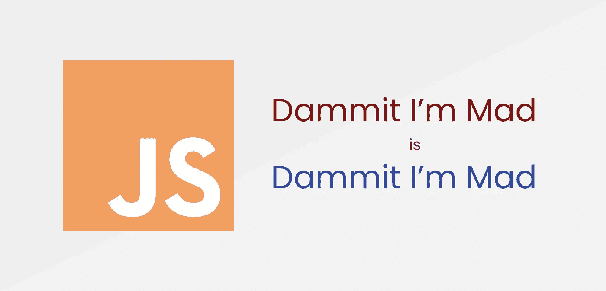

# 挑战

写一个函数，给定一个字符串，如果该字符串是回文，则返回 true，否则返回 false。这是一个经常出现在工作面试和代码挑战中的问题，JavaScript 也不例外。

在这篇文章中，我将介绍 **8** 解决这个算法挑战的不同方法，并谈一谈每种方法的性能和优缺点。

此外，我将介绍 **3** 估算一个字符串有多“接近”成为一个回文的方法——100%是一个完美的回文，0%是尽可能远离一个回文。

# 定义

好的，首先让我们直接得到回文的定义。

> 一个**回文**是一个单词、数字、短语或其他向前和向后读起来一样的字符序列，例如 *taco cat* 或 *madam* 或 *racecar* 或数字 *10801。*
> 
> 当考虑到对大写字母、标点符号和单词分隔符的调整时，可以写出句子长度的回文，例如“一个人，一个计划，一条运河，巴拿马！”，“我看到的是一辆车还是一只猫？”或者“尼克松没有 x”。
> 
> *-* 维基百科

# 设置

根据定义，我们需要去除潜在的非字母数字字符，从而转换成小写字母。
所以在下面的所有解决方案中，我们将使用这个 *clean* 函数来获得一个干净的字符序列

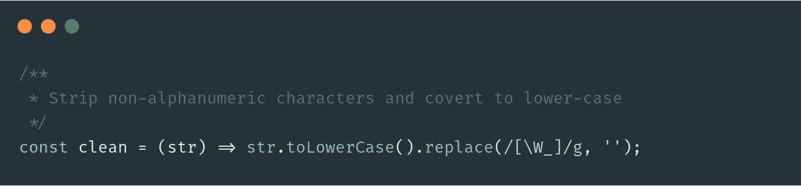

这些解决方案中的每一个都针对 3 种情况进行了性能测试:
-10 个字符的小型回文
-1000 个字符的中型回文
-5000 个字符的大型回文

使用 [performance.now()](https://nodejs.org/api/perf_hooks.html#perf_hooks_performance_now) 在 NodeJS 进程中运行测试

# 1.使用 for 循环

让我们从一个非常简单的方法开始。
解决方案是使用 for 循环遍历字符。
对于位置 *i* 的每个字符，我们从末尾开始与位置 *i* 的字符进行比较。如果这些中的任何一个不相等，我们可以拒绝作为回文的输入，并退出循环，返回 false。

我们也只需要遍历字符串的一半，因为遍历整个字符串将会对每个字符进行两次比较。
因此，我们保证只做 string.length / 2 总迭代。

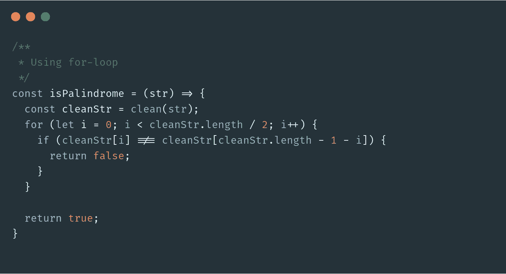

**性能:** 小型:0.0731 毫秒
中型:0.1267 毫秒
大型:0.6272 毫秒

**优点** 表现非常出色，即使是在大型琴弦上。
我们能够在发现第一次违规后立即退货。

**缺点** 在 ES6 和 Bable 的世界里，for 循环已经不是最常用的了，这个解决方案读起来有点“笨拙”。

# 2.用于…的

这个方法与前面的类似，但是我们没有使用常规的 for 循环，而是使用 for…of

使用这种方法，我们将字符串转换成数组，然后遍历每个元素。
对于每个元素，我们使用 *pop()* 移除数组的最后一个元素，然后将当前元素与那个元素进行比较。
同样，如果这些不相等，这不是一个回文，我们退出并返回 false。

由于我们在迭代时使用突变减少了数组，所以我们仍然只进行 string.length / 2 次总迭代。

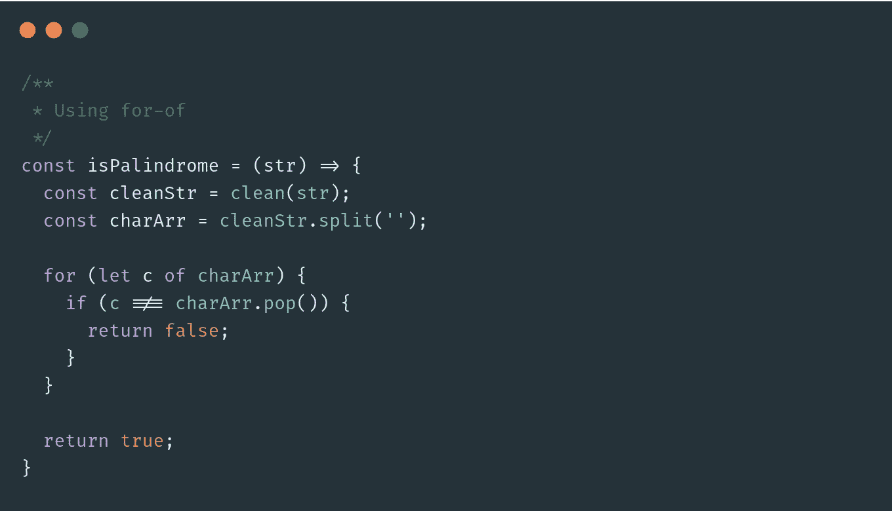

**性能:** 小:0.0415 毫秒
中:0.0966 毫秒
大:0.9997 毫秒

**优点** 表现不错，看起来还算可读。
我们能够在发现第一次违规后立即返回。

**缺点** 我们强制性地改变了数组，这让我们损失了一些性能。

# 3.使用分割、反转和连接

好了，让我们转而使用一些 JavaScripts 的内置方法。
这个解决方案非常直观——我们将简单地反转字符串，并将其与原始字符串进行比较。如果它们相等，这就是一个回文。

在这个解决方案中，我们使用内置的方法 *split()* 将一个字符串拆分成一个数组， *reverse()* 将一个数组的顺序反转， *join* 将数组的元素连接成一个字符串。

**性能:** 小型:0.1633 毫秒
中型:0.1986 毫秒
大型:1.5192 毫秒

**优点
优点**简洁，可读性很强。
很容易理解是怎么回事。

**缺点
不是表现最好的，即在小琴弦上。**

# 4.使用 forEach

该解决方案与解决方案 1 和 2 非常相似。
我们将把字符串转换成一个数组，然后对它应用 *forEach* 。
对于每次迭代，我们都进行与解决方案 1 中相同的比较，但这次我们将从外部范围标记一个变量`*isPalindrome*` ，如果有违反的话。

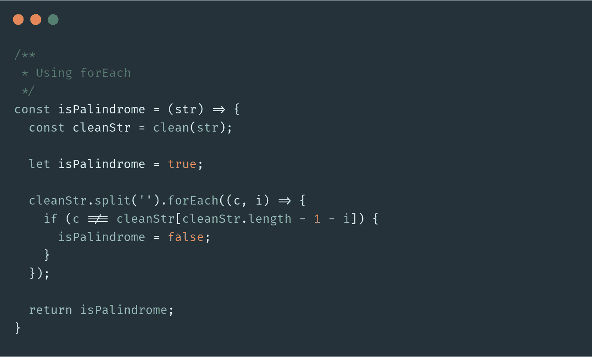

**性能:** 小型:0.0444 毫秒
中型:0.1487 毫秒
大型:1.2537 毫秒

**优点** 使用 ES6 方法加分。
整体可读性更强，容易理解。

**缺点** 与 *forEach* 我们不能中断迭代，也不能保证只做 string.length / 2 总迭代。这让我们损失了一些性能。

# 5.使用地图

这个解决方案有点不同。我们再次将字符串转换成一个数组，但是这次我们在它上面应用了 *map* 。

使用*映射，*我们返回一个新数组，每个元素的*为真*或*为假*，代表这个字符是否从末尾匹配同一个字符。

最后，我们使用 *some* 来检查新数组是否包含一个 *false。*
如果该字符串不为回文，否则不为。

Info: some()将接受一个谓词函数，并在数组中的所有元素上测试它。如果一个或多个元素测试失败，some()返回 false。否则为真。

**性能:** 小型:0.0644 毫秒
中型:0.1560 毫秒
大型:0.9630 毫秒

**优点** 使用 ES6 方法加分。

**缺点** 带*映射*我们不能中断迭代，也不能保证只做 string.length / 2 总迭代。
此外，我们必须创建一个新的列表，这需要额外的内存，并且我们必须遍历这个新列表——有可能——一次额外的时间。这让我们损失了一些性能。

# 6.使用 reduce

这个解决方案类似于使用 *forEach* ，相反，我们使用 *reduce* 。
这里的关键区别在于，我们必须使用 *forEach、*在外部作用域中标记一个变量，我们可以使用 *reduce 将这个标记传递给下一次迭代。*

这允许我们直接返回*减少*的结果。

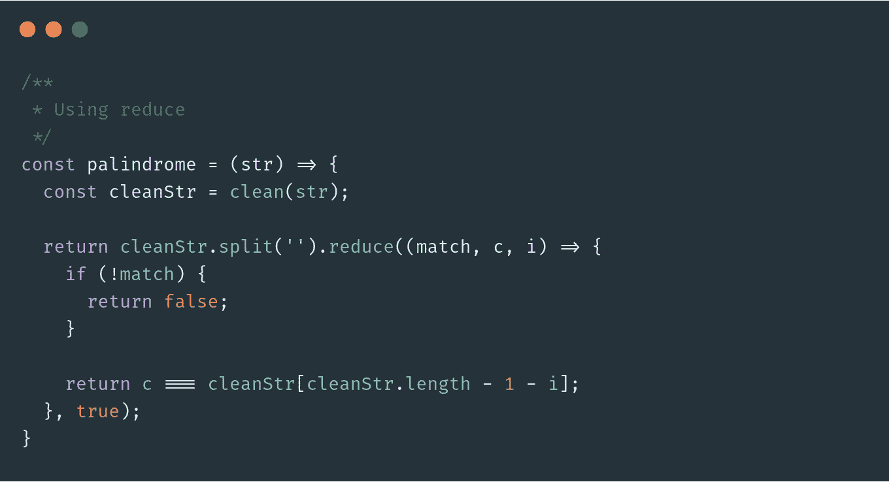

**性能:** 小型:0.0425 毫秒
中型:0.1830 毫秒
大型:0.8459 毫秒

**优点** 使用 ES6 方法加分。

**缺点** 与*减少*我们不能中断迭代，也不能确保只做 string.length / 2 总迭代。
如果检查过早失败，我们继续将 *false* 传递给下一次迭代。这看起来很浪费，尤其是在更大的弦上。

# 7.使用每

这种方法实际上是我个人最喜欢的检查回文的方法。
我们将字符串转换成一个数组，然后对它应用*每一个*。

*信息:every()将接受一个谓词函数，并在数组中的所有元素上测试它。
单个测试一失败，every()立即返回 false。*

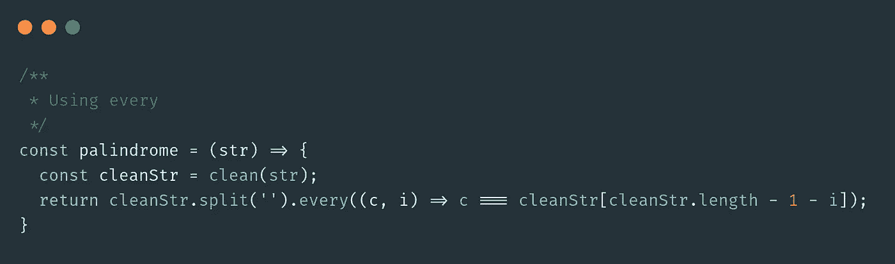

**性能:** 小型:0.0414 毫秒
中型:0.1977 毫秒
大型:1.4204 毫秒

**优点
优点**非常简洁易读。
一个字符不匹配就会早破。

**缺点** 我们不能保证只做 string.length / 2 总迭代次数。
在一个回文的情况下，*每一个*都会继续迭代整个数组。

# 8.使用递归

最后，让我们用递归来解决这个问题。这个想法是比较字符串的第一个和最后一个字符。如果它们相等，我们将创建一个移除了第一个和最后一个字母的子串，并再次将其应用于我们的递归函数，直到我们遇到不匹配，或者我们得到一个空串(或者长度为 1 的串)。

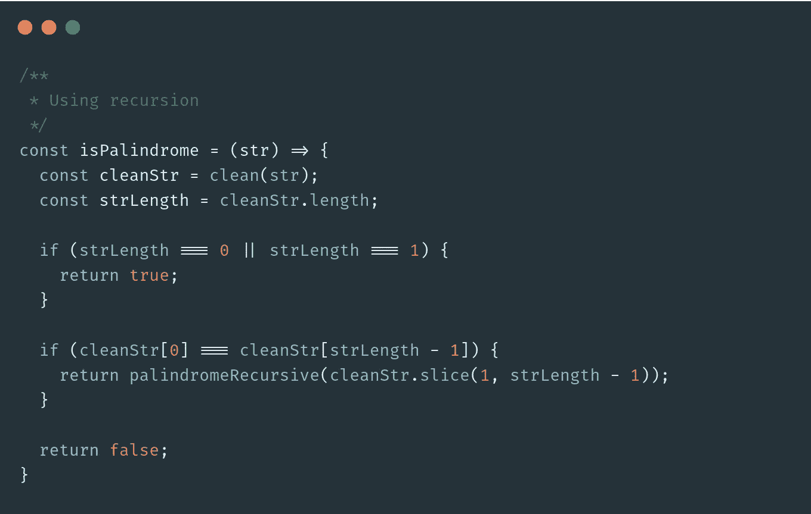

**性能:** 小型:0.0842 毫秒
中型:5.1806 毫秒
大型:108.5716 毫秒

面试官可能会因为你知道如何处理递归而给你加分。
除此之外，这个解决方案可能没什么好的。

另一方面，这里有一些考虑因素。
我们正在开放许多函数闭包，并且正在建立一个——潜在的——大型调用栈。

请注意，与之前的任何解决方案相比，大弦的性能在这里都是惊人的。

现在，让我们想象一下，面试官问你是否有一种方法可以估计一个给定的字符串离一个回文有多近。

这里应该出现的第一个问题是:“接近”是什么意思？
*接近*在正确的位置上匹配吗？
*Close* 我们要交换多少个字母才能得到一个回文？
*接近*字母表中不匹配的字母相距多远？
*接近*就完全不同的东西而言？——这可以有很多种解释。

在这里，我将介绍 3 种解决这个问题的方法。我将使用以下测试字符串进行验证。

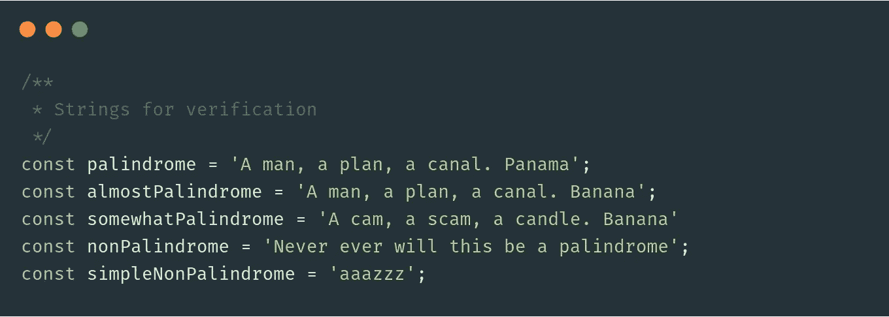

# 计算匹配百分比

还记得我们如何使用*映射*来创建一个*真/假*值的列表，表示给定位置上的字符是否与另一端的相应字符匹配吗？

我们可以使用*过滤器*来统计*假*值的数量，而不是使用*一些*来检查列表中是否有*假*值。
现在我们可以用这个数除以字符串的总长度，得到匹配百分比。

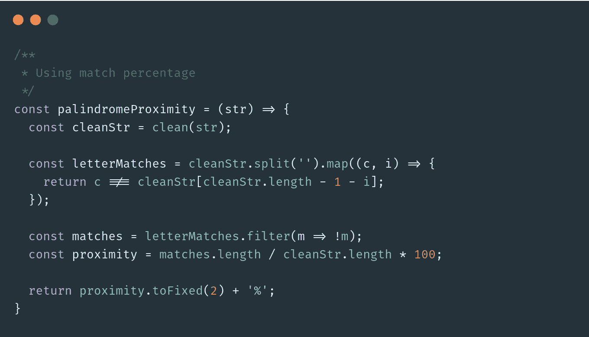

**结果:** 100.00%
80.95%
27.27%
0.00%
0.00%

**性能:** 小型:0.0718 毫秒
中型:0.2233 毫秒
大型:1.4426 毫秒

# 使用余弦相似度

这种方法更高级一点。

这个想法是，我们要把字符串分成两个相等的部分，然后还原其中的一部分。
然后我们将它们转换成它们在 *n* 维度中的矢量表示， *n* 是半弦的长度。然后我们要测量这些向量之间的角度。
角度越大，琴弦之间的不匹配越大。

让我们一步一步地研究这个算法。

**将字符串拆分成两个偶数半字符串**
(如果它们不是偶数，我们可以把中间的字符去掉)

**反转下半串** 反转下半串使用*拆分，反转*和*连接。*

**将两个半字符串转换成向量**
这里棘手的部分是找到一种将字符表示成数字的好方法，这种数字包括字符本身及其在字符串中的位置。
通过这种方法，我使用字符 charCode(减去 96，这样‘a’变成 1，‘b’变成 2，等等。)，然后从该数字中减去数组中的位置。

我减去 96 的原因是，在 [ASCII 表中,‘a’是第 97 个字符。](https://www.w3schools.com/charsets/ref_html_ascii.asp)

**计算两个向量的点积** 我们可以使用以下公式计算点积

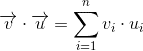

**计算每个矢量的大小** 我们可以使用以下公式计算每个矢量的大小

**计算矢量间夹角的余弦值** 现在，让我们用下面的公式计算矢量间夹角的余弦值

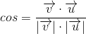

**转换成百分比**
因为角度的余弦在[-1]范围内；1]，我们想把这个转换成百分比，其中-1 代表 0%，1 代表 100%。
我们简单的把余弦加 1 再除以 to，最后乘以 100。

通过使用这种方法，我们可以估计两个半弦有多相似。
由于我们使用 charCode 作为变量，这里考虑了字母表中不匹配字符之间的距离。

如果算法返回 100%，我们就有了一个完美的回文。

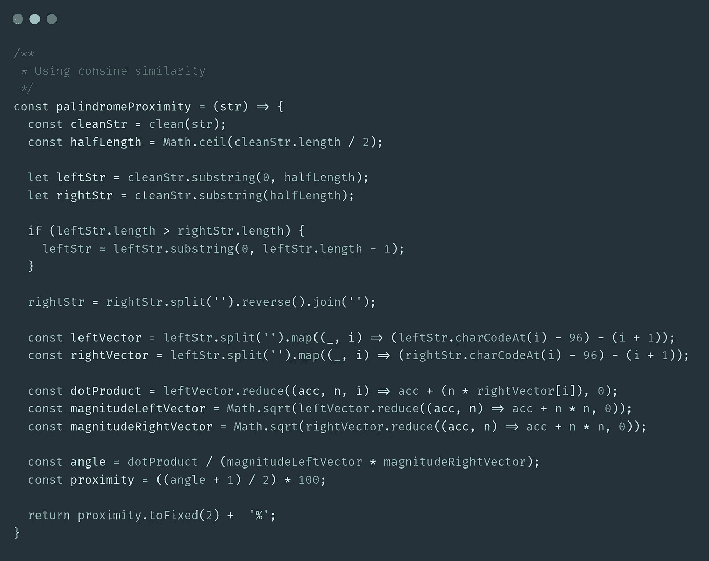

**结果:** 100.00%
90.04%
57.90%
69.17%
12.37%

**性能:** 小型:0.0314 毫秒
中型:0.2597 毫秒
大型:1.5066 毫秒

# 使用 Levenshtein 距离

这种方法也更高级一些，我们需要用到一些数学知识。

就像前面的方法一样，我们首先将字符串分成两个半字符串，然后还原第二个半字符串。

现在，这个想法是计算这两个字符串之间的 Levenshtein 距离，并将其转换为百分比的度量。

**Levenshtein 距离**是将一个单词变成另一个单词所需的最小单字符编辑次数。
我们可以使用以下公式计算 Levenshtein 距离

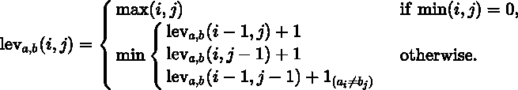

单字符编辑可以是*插入、*替换*或*删除。

例如，如果我们计算“本田”和“现代”这两个词的 Levenshtein 距离，我们得到 *3。*

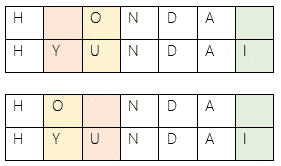

我们需要*删除*中的字母“ *Y* ”，*将*中的字母“ *O* ”替换为“ *U* ”，*插入*an*【I】*，总共 3 次编辑。

让我们来看看这个设置，看看我们如何用它来近似一个字符串的回文。

**将字符串拆分成两个偶数半字符串**
(如果它们不是偶数，我们可以把中间的字符去掉)

**反转下半串** 反转下半串使用*拆分，反转*和*连接。*

**创建一个矩阵** 我们要创建一个大小为*n**n*的矩阵，其中 *n* 是半串长度的大小。

**填充矩阵** 我们将从左上角开始填充这个矩阵。

**统计编辑** 我们遍历矩阵，统计需要我们进行的编辑。
水平和垂直方向的每次“跳转”将分别被计为一次*删除*和一次*插入*。

**换算成百分比** 最后我们将这个换算成百分比。最后一步很简单——我们简单地用半弦的长度除以 Levenshtein 距离。现在我们得到了“倒置的”百分比，所以我们需要从 1 中减去结果。最后，我们乘以 100。

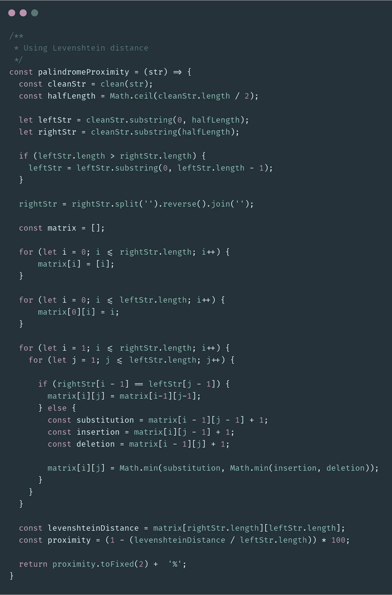

**结果:** 100.00%
80.00%
27.27%
6.67%
0.00%

**性能:** 小型:0.0635 毫秒
中型:32.5343 毫秒
大型:616.9648 毫秒

# 结论

我们现在已经看了 8 种不同的方法来检查一个给定的字符串是否是一个回文，以及 3 种不同的方法来估计一个给定的字符串有多接近一个回文。

就性能而言，检查回文的最佳方式是使用传统的 for 循环或 for…of 循环。

就可读性而言，这取决于偏好。
我的首选是使用 *every 的解决方案 7。* 方案 3 也很干净好看。

就一个回文的近似而言，我们看到它如何高度依赖于我们所说的“接近”一个回文是什么意思，以及我们选择使用哪种算法。当某个东西是完美的回文，而某个东西肯定不是时，我提供的 3 种方法都是一致的。
但是介于两者之间的频谱导致了各种不同的近似值，这取决于实现方式和我们对“接近”的定义。

**感谢您的阅读！如果你喜欢这篇文章，请鼓掌👏扣几下吧！**

**如果你想了解更多关于如何充分利用 JavaScript 的知识，可以看看我的另一篇文章:** [**JavaScript 向导:技巧&技巧**](/javascript-wizard-tips-and-tricks-1b91025a0d62)

你也可以在 [**推特**](https://twitter.com/silindsoftware) **上关注我，我会在那里发布更多类似的内容。**

# 来源

 [## 回文

### 回文是一个单词、数字、短语或其他字符序列，它的前后读起来是一样的，比如…

en.wikipedia.org](https://en.wikipedia.org/wiki/Palindrome)  [## 余弦相似性

### 余弦相似性是内积空间中两个非零向量之间相似性的一种度量

en.wikipedia.org](https://en.wikipedia.org/wiki/Cosine_similarity)  [## 莱文斯坦距离

### 在信息论、语言学和计算机科学中，Levenshtein 距离是一个字符串度量，用于测量…

en.wikipedia.org](https://en.wikipedia.org/wiki/Levenshtein_distance)  [## Array.prototype.every()

### every()方法测试数组中的所有元素是否都通过了由提供的函数实现的测试。它…

developer.mozilla.org](https://developer.mozilla.org/en-US/docs/Web/JavaScript/Reference/Global_Objects/Array/every)  [## Array.prototype.some()

### some()方法测试数组中是否至少有一个元素通过了由提供的函数实现的测试…

developer.mozilla.org](https://developer.mozilla.org/en-US/docs/Web/JavaScript/Reference/Global_Objects/Array/some)