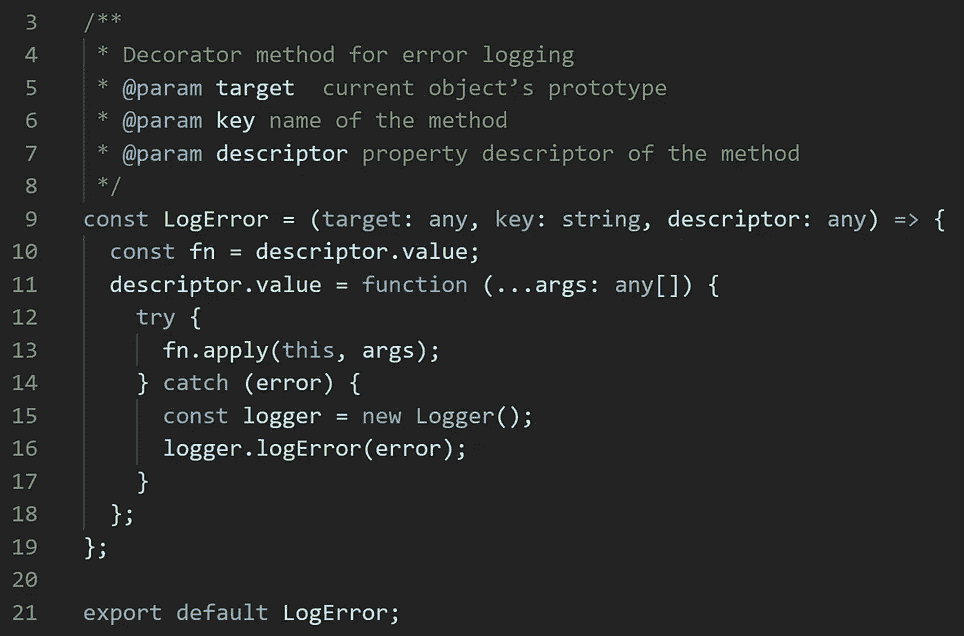
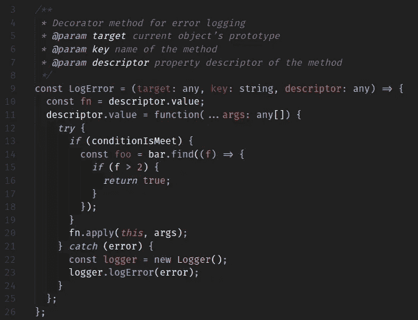
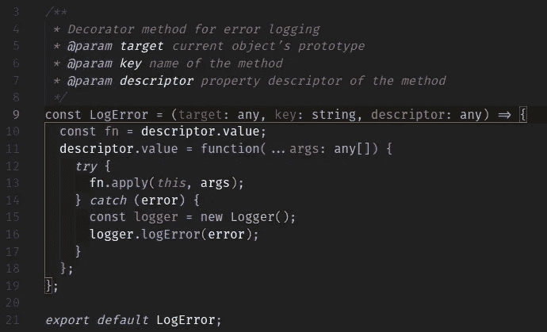
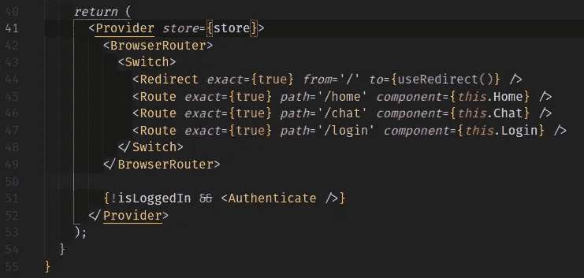
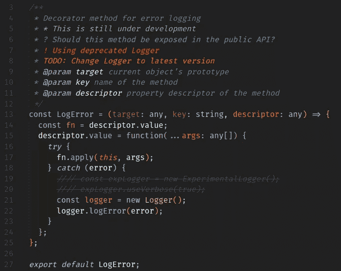
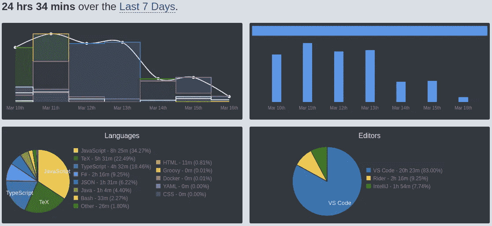
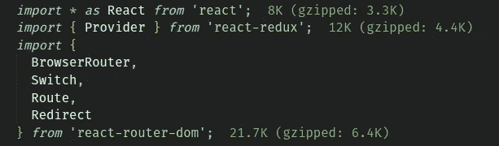

# 您应该考虑使用的 12 个 VS 代码扩展

> 原文：<https://itnext.io/12-vs-code-extensions-you-should-consider-using-4747e6281ee?source=collection_archive---------0----------------------->


Visual Studio 代码是关于 web 开发的 ide 中最受欢迎的选择之一。除了开源和完全免费，它还有一个庞大的社区支持它。
从 VS 代码中，你可以找到数以千计的扩展，无论大小，它们几乎都只需要点击一下鼠标。

在这篇文章中，我将介绍 12 个 VS 代码扩展，我发现它们对工作效率和满意度特别有用。

如果你还没有转换到 VS 代码主义，这是你应该开始的地方😉
去这里，马上免费兑换:【https://code.visualstudio.com/】

# 材料主题

我想提的第一个外延是素材主题。这是迄今为止最流行的主题之一，并且为各种不同的 ide 创建了不同的版本；IntelliJ，Atom，Sublime，当然还有 VS 代码。

这是非常愉快和令人满意的工作，并在不同的颜色不同的口味。就我而言，我几乎在我使用的每一个 IDE 中都安装了这个主题，而且我不打算回头。

在这些示例截图中，您可以将 VS 代码的标准布局与 Material 主题进行比较



标准布局在左边，材料主题在右边

通过访问他们的官方网页，立即开始材料主题:[https://material-theme.site/](https://material-theme.site/)

当你在做的时候，去安装材料主题图标:[https://github.com/PKief/vscode-material-icon-theme](https://github.com/PKief/vscode-material-icon-theme)

你的眼睛将永远充满感激！

# 缩进彩虹

这个简单的小扩展用不同的颜色为每一层的缩进着色。
对于缩进是语言语法一部分的语言来说，这尤其有用。在像 JavaScript 这样的其他语言中，它使得缩进的可读性稍微好一点，因此变得更加赏心悦目。

默认情况下，缩进颜色是彩虹色，顾名思义。就我个人而言，我更喜欢色彩柔和一些，这样看起来会更微妙。

仔细讨论



幸运的是，改变缩进的颜色非常容易。
只需导航至设置，搜索“颜色”，选择外观，然后单击“在 settings.json 中编辑”。

找到或创建属性`indentRainbow.colors`并将颜色添加到数组中。
上例中的颜色如下所示:

```
"indentRainbow.colors": [
  "rgba(16,16,16,0.1)",
  "rgba(16,16,16,0.2)",
  "rgba(16,16,16,0.3)",
  "rgba(16,16,16,0.4)",
  "rgba(16,16,16,0.5)",
  "rgba(16,16,16,0.6)",
  "rgba(16,16,16,0.7)",
  "rgba(16,16,16,0.8)",
  "rgba(16,16,16,0.9)",
  "rgba(16,16,16,1.0)"
],
```

试试这个很酷的小扩展吧:
[https://marketplace.visualstudio.com/items?itemName = oder wat . indent-rainbow](https://marketplace.visualstudio.com/items?itemName=oderwat.indent-rainbow)

# 括号对着色机

这实际上是我最喜欢的 VS 代码可视化扩展之一。该扩展将匹配的括号和圆括号着色，从而突出显示括号所包含的范围。



这个简洁的小工具真的可以帮助你快速浏览你的代码。
当然，您可以配置颜色和匹配的内容，因此这些工具将适合您可能拥有的任何其他视觉扩展/主题。

你一定要试试这个扩展:
[https://marketplace.visualstudio.com/items?itemName = Coen raads . bracket-pair-colorizer-2](https://marketplace.visualstudio.com/items?itemName=CoenraadS.bracket-pair-colorizer-2)

# 突出显示匹配的标签

虽然我们的主题是匹配左括号和右括号，但是您也可以使用这个小工具进行扩展。
这是对 VS 代码已有功能的一个简单增强，即在 HTML 和 JSX 中突出显示匹配的开始或结束标签的能力。
然而，这个扩展比 VS 代码自带的那个更光滑，更可配置。非常简约，但绝对值得一提。

在这个示例截图中，我们看到`Provider`组件被很好地突出显示了出来



看看这个工具的 GitHub repo，看看它的配置有多简单，完全符合你的需求:
[https://github.com/vincaslt/vscode-highlight-matching-tag](https://github.com/vincaslt/vscode-highlight-matching-tag)

# 更好的评论

我想提到的最后一个视觉延伸是更好的评论。
这个扩展帮助你为不同类型的评论使用不同类型的注释，并为你着色



正如我们在这个例子中看到的，我们可以使用不同的注释，如
`*`来突出显示
`?`用于问题 `!`用于警告
`TODO`用于待办事项
`////`用于逐行注释

尤其是警告和待办事项的突出显示，我个人觉得超级有用。当你通读代码的时候，很难忽略它。

我也很喜欢你如何明确地传达某些被注释掉的代码应该被删除，只需要增加两个额外的`//`

# Git 镜头

毫无疑问，这是 VS 代码最强大的协作扩展之一。
在 Git 的扩展中，Git Lens 使用 Git 责备注释帮助你可视化代码作者身份。


请注意我是如何获得关于这段代码的一些真正有价值的见解的。
首先，我看到这个类`HueStore`的作者是我和另外两个人。
其次，在我放置光标的每一行，都会显示关于 git 历史的见解。
如果我将鼠标悬停在这条洞察力线上，会出现更多选项提示。
我可以探索 git 历史，可以导航到远程资源，等等。

事实上，这个扩展是巨大的，为您提供了大量真正有用的选项。如果你还没有安装这个扩展，我强烈建议你马上安装！

查看官方 GitHub 回购，在这里了解更多:
[https://github.com/eamodio/vscode-gitlens](https://github.com/eamodio/vscode-gitlens)

# 瓦卡提时间

现在到了见解这个话题，我真的很想推荐 WakaTime。这个在线工具将直接从您的 IDE 中自动生成关于您的编码活动的有用指标。

只需安装 WakaTime VS Code extension，您的指标就会自动出现在您的个人 WakaTime 仪表板上，您可以通过浏览器访问该仪表板。



我过去 7 天编码活动的指标

您还可以将单个 widget 直接嵌入到您自己的网页中，以防您想要自定义外观或与来自类似服务的其他 widget 融合。
同样，共享指标也变得流畅而简单。

当然，WakaTime 集成了所有主要的 ide，包括 JetBrains IDEs、Sublime 和 VS Code。

马上上手 Waka time:
[https://wakatime.com/](https://wakatime.com/dashboard)
[https://github.com/wakatime/vscode-wakatime](https://github.com/wakatime/vscode-wakatime)

# 进口成本

现在，让我们谈一谈性能。Webpack 的所有优点带来了一个典型的瓶颈——包的大小很快失去控制。
这是一个颇有争议的话题，有各种各样的方法和工具来分析和限制您的发行版的捆绑包大小。
Import costs 是一个非常方便的工具，它会简单地向您显示您导入的第三方包的大小



该信息将在您导入包时出现，并帮助您识别包大小的明显问题。

如果你想更深入地了解为什么这很重要，我建议你读读耶尔·海莫维奇[写的文章](https://medium.com/@yairhaimo)[控制你的包的大小](https://medium.com/wix-engineering/keep-your-bundle-size-under-control-with-import-cost-vscode-extension-5d476b3c5a76)

从进口成本入手再简单不过了。安装该扩展，立即获得关于您的导入的有用见解！https://github.com/wix/import-cost
T2

# ESLint & Airbnb JavaScript 风格指南

在现代编程中，您会想要使用 linter。
linter 是一个工具，它将对你的代码进行分析，帮助你识别有问题的模式，并保持良好的代码卫生。鉴于 JavaScript 等语言的动态和松散类型特性，linter 变得尤为重要。ESLint 是一个开源的 JavaScript 林挺工具，运行在 Node 上，可以动态地执行实时代码分析。
幸运的是，VS 代码已经在一个电子包装器中的 Node 上运行，这使得在 VS 代码中简单地安装 ESLint 扩展变得非常方便，您可以开始了！

[](https://github.com/Microsoft/vscode-eslint) [## Microsoft/vscode-eslint

### VSCode 扩展，用于将 eslint 集成到 VSCode 中。为 Microsoft/vscode-eslint 开发做出贡献，创建一个…

github.com](https://github.com/Microsoft/vscode-eslint) 

ESLint 本身是完全可配置的，可以在项目根目录下的. eslintrc 文件或 package.json 文件中删除和添加规则。
在这里了解更多关于配置 ESLint 的信息:
[https://eslint.org/docs/user-guide/configuring](https://eslint.org/docs/user-guide/configuring)

[Airbnb JavaScript 风格指南](https://github.com/airbnb/javascript)是一组固执己见的 ESLint 规则，定义了 JavaScript 的风格指南。
完整的 Airbnb JavaScript 风格指南非常庞大且非常严格，但很容易覆盖或绕过您或您的团队可能觉得不方便使用的个别规则。
然而，坚持某种风格指导方针有很多很好的理由，尤其是当你和其他开发者在一个 JavaScript 项目上合作的时候。
Airbnb JavaScript 风格指南绝对是最受欢迎的选择之一，通过实施 Airbnb 的风格和实践，您可以获得统一、干净和卫生的代码，并且您还可以从遵守许多其他团队和开发人员选择的风格指南中受益。

无论是独自工作，在一个小团队还是在一个大项目中，我都强烈推荐使用 ESLint 和 Airbnb JavaScript 风格指南。

这个流行的风格指南同时适用于 JavaScript 和 TypeScript(后者使用 TSLint)
[https://github.com/airbnb/javascript](https://github.com/airbnb/javascript)
[https://github.com/progre/tslint-config-airbnb/](https://github.com/progre/tslint-config-airbnb/#readme)

此外，我还创建了自己的 TSLint 配置，其中包括定制的规则，这是其他样式指南库中没有的。
这与 Airbnb TypeScript 风格指南结合得非常好。

你可以在这里找到项目:【https://github.com/Silind/tslint-config-silind】T5

# 较美丽

在谈到坚持某种风格方针时，我还想介绍代码格式化程序，更漂亮的。

简单地说，Prettier 将自动格式化你的大部分代码，以确保它符合给定的规则。
更漂亮的可以单独配置，也可以配置成简单继承 ESLint / TSLint 的规则。

您可以使用以下命令轻松设置文档格式:Ctrl + shift + P -> Format Document。
或者用 Ctrl + shift + P - >格式化给定的选择。

还可以配置漂亮器在保存时执行格式化。我个人觉得这真的很有用，我几乎一直都在使用它。

与 ESLint / TSLint 结合使用，Prettier 是一个非常方便的工具！试一试吧，我相信你不会后悔的

[https://marketplace.visualstudio.com/items?itemName = es benp . prettle-vs code](https://marketplace.visualstudio.com/items?itemName=esbenp.prettier-vscode)

# Chrome 调试器

通常，VS 代码的调试工具被大大低估了。
尽管 VS Code 的内置调试器几乎从一开始就已经存在，但我仍然遇到许多开发人员倾向于在 VS Code 的调试器似乎是更好选择的情况下使用`console.log`或`debugger;`。

老实说，我成为这些开发者的时间还不算长。
但是，VS 代码的调试器随着扩展；Chrome 调试器是迄今为止节省我最多时间和痛苦的发现之一。

如果你仍然在代码中到处使用`console.log`，我强烈建议你花一点时间，习惯使用 VS Code 的调试器和 Chrome 的调试器。

相信我，这绝对值得努力！

如果你想要一个好的起点，请阅读这篇文章，由迈克尔·梅恩撰写的。

# 涡轮控制台日志

当然，在某些情况下，简单地记录某个变量的值要容易得多。

所以，最后我要提一下这个方便的小工具。
Turbo 控制台日志将自动编写有意义的日志消息。
非常简单:突出显示您希望注销的变量，然后按 Ctrl + Alt + l。

您将得到一个`console.log`,它产生一条日志消息，格式如下:

`TCL: functionName -> variableName, variableValue`

此外，你可以通过点击一个按钮来注释掉所有的`console.log`。

所以如果你真的需要`console.log`，这会让你的生活轻松一点。点击这里查看:
[https://github.com/Chakroun-Anas/turbo-console-log](https://github.com/Chakroun-Anas/turbo-console-log)

就是这样！我认为你应该考虑使用的 12 个 VS 代码扩展。实际上很难把自己限制在这个列表中，因为有太多非常好和有用的扩展了。

最后，我想向我们社区中辛勤工作的开发人员致以热烈的欢呼，他们付出了时间和精力，为所有这些好工具做出了贡献！这无疑让我们更有效率，也让我们的工作更令人满意。
非常感谢**！**

**如果你碰巧知道一些你认为值得一提的很酷的扩展，请在下面评论或在 [**Twitter**](https://twitter.com/SimonLH_) **上联系我！****