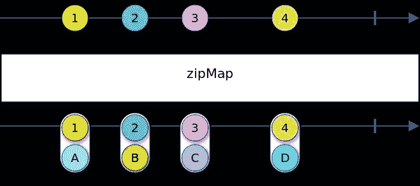
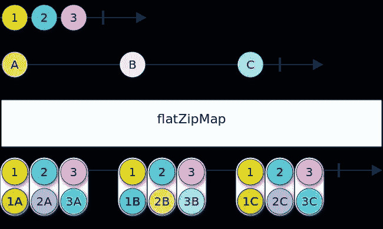
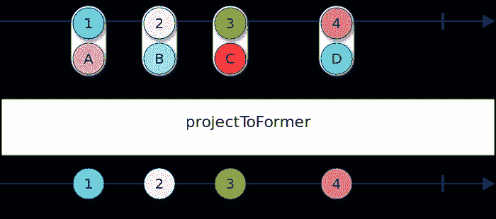
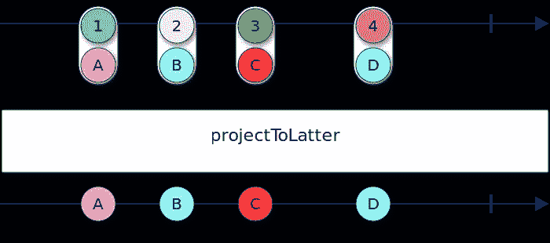
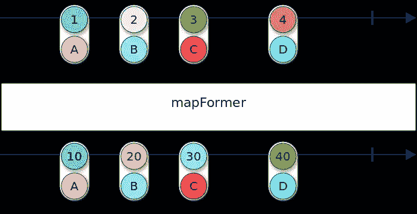
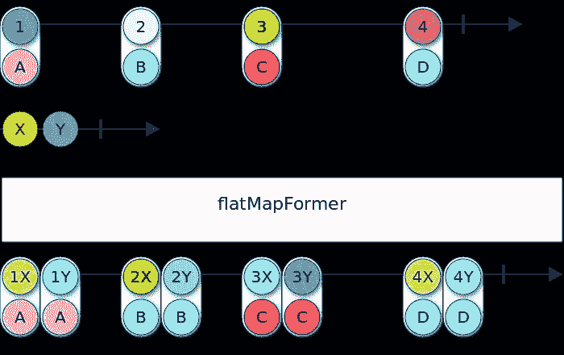
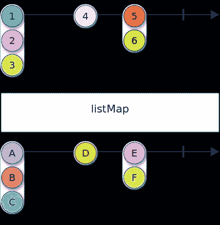
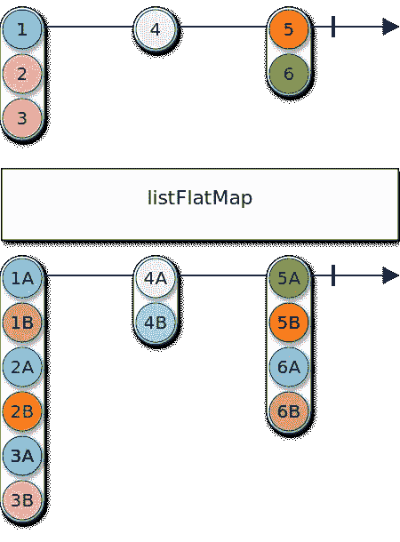
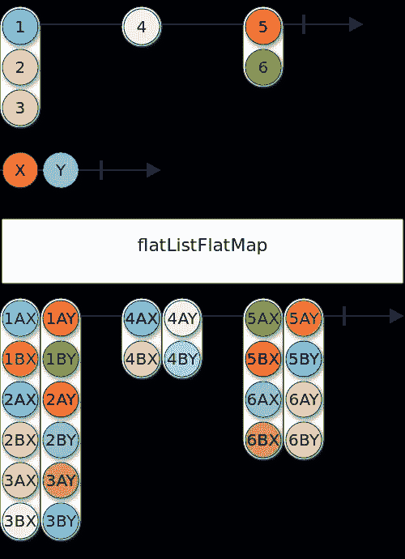

# 13 个方便的 RxJS 运算符

> 原文：<https://itnext.io/13-handy-rxjs-operators-ab5a9a1db60?source=collection_archive---------4----------------------->

## 处理数组和元组


像`map`、`flatMap`和`reduce`这样的流操作符是 Rx 实现如此强大的主要原因。在这方面，RxJS 做得很好，将操作符从可观察类中分离出来，允许社区创建自己的操作符并单独发布。

在本文中，我们将从 NPM 包`[@rxjsx/rxjsx](https://www.npmjs.com/package/@rxjsx/rxjsx)`中引入 13 个 RxJS 操作符来处理数组和元组。有关运营商的完整列表以及更多详细信息，请参考 [Github 报告](https://github.com/rxjsx/rxjsx)。

# TL；速度三角形定位法(dead reckoning)

```
npm install --save rxjs @rxjsx/rxjsx
```

# 目录

*   [背景](#3685)
*   [沙盒](#62ca)
*   [5 基础知识:到元组和返回](#0dfd)
*   [4 个坐标运算符](#393c)
*   [4 列表操作符](#8dc0)
*   [结论](#26de)

# 操作员列表

*   [邮政编码图](#7384)
*   [flatZipMap](#4033)
*   [projectToFormer](#c547)
*   [project to later](#af09)
*   [项目到](#14f9)
*   [地图形成器](#d56c)
*   [地图绘制者](#a897)
*   [平台映射器](#fc64)
*   [平台映射器](#69e2)
*   [列表映射](#5b58)
*   [平面列表图](#b27a)
*   [列表平面图](#2314)
*   [flatListFlatMap](#ee69)

# 背景

在 RxJava 中，流操作符是可观察类的成员。例如，查看 RxJava 的`[Flowable](https://raw.githubusercontent.com/ReactiveX/RxJava/3.x/src/main/java/io/reactivex/rxjava3/core/Flowable.java)`类(flowable 基本上是 RxJava 中 observable 类的重新实现)。这个类很大(大约 20K 行代码),因为所有的操作符都是它的成员。

RxJS 在这里有很大的设计优势。运算符是分开的，并作为函数传递给可观察对象:

然后，`Observable`类实现的唯一东西是`pipe`函数，这使得整个`[Observable](https://github.com/ReactiveX/rxjs/blob/master/src/internal/Observable.ts)`类有大约 500 行代码。这允许用户创建自己的操作员。举以下例子:

阅读代码的人需要一段时间才能意识到`reduce`在做什么。将此代码与以下代码进行比较:

代码看起来更高级。运算符的顶级用法没有太多不必要的细节。或者如罗伯特·c·马丁所说，代码不那么粗鲁。

人们可以定义一堆这样的操作符，并把它们打包成一个 NPM 包。RxJS 扩展`@rxjsx/rxjsx`就是这种情况。

在这篇文章中，我将介绍这个库中的 13 个操作符，它们在处理数组和元组时非常方便。

# 沙箱

下面是一个沙盒环境，用于测试我们将要介绍的操作符。`rxjs`和`@rxjsx/rxjsx`都已经安装。您可以随意更改代码，并对您将要学习的每个操作符进行试验。

一个小沙盒环境，可以和操作者一起玩。请随意弄脏你的手。

# 5 个基础:到元组和返回

与许多语言不同(以 Python 或 Scala 为例)，JavaScript 中的元组基本上是数组。主要原因是没有对数组的所有元素强制类型。

在 TypeScript 中，可以将`[T1, T2]`的类型强加给一个变量，使其成为一个 2 元组。例如，您不能将类型为`string[]`的值赋给类型为`[string, string]`的变量。

只是因为元组是从数组中分离出来的，所以没有得到足够的重视。RxJS 也是如此，它没有对元组流的直接支持。RxJSx 提供了对元组的支持。

以下是在元组和值之间来回移动的运算符。运算符`zipMap`和`flatZipMap`基本上是注入运算符(值到元组)，而`projectToFormer`、`projectToLatter`、`projectTo`是投影运算符(元组到值)。在这 5 个中，前 4 个用于 2-元组。

## zipMap



当希望转换一个值，但又希望保留原始值以供以后访问时，这很有用:

```
import { of } from 'rxjs';
import { zipMap } from '@rxjsx/rxjsx';of(1, 2, 3)
  .pipe(**zipMap**(x => `${x}`))
  .subscribe(([x, s]) => console.log(x, s));
```

代替下面的代码或类似的解决方案来存储可观察的原始值:

```
import { of } from 'rxjs';
import { map, tap } from 'rxjs/operators';let nummericalVal: number;of(1, 2, 3)
  .pipe(tap(x => nummericalVal = x))
  .pipe(map(x => `${x}`))
  .subscribe(s => console.log(nummericalVal, s));
```

[本文](/keeping-original-value-when-transforming-in-rxjs-f4650e12c4cf)关注这个用例:“在 RxJS 中转换时保持原始值”。

## flatZipMap



类似于`zipMap`，当转换返回一个可观察值时使用。

```
import { of } from 'rxjs';
import { flatZipMap } from '@rxjsx/rxjsx';of(1, 2, 3)
  .pipe(**flatZipMap**(x => of(`${x}`)))
  .subscribe(([x, s]) => console.log(x, s));
```

## projectToFormer



将一个对的可观测值，即`Observable<[T1, T2]>`投影到第一个坐标，得到一个`Observable<T1>`。

```
import { of } from 'rxjs';
import { projectToFormer } from '@rxjsx/rxjsx';of<[number, string]>([1, '1'], [2, '2'])
  .pipe(**projectToFormer**())
  .subscribe((n: number) => console.log(n));
```

## projectToLatter



将一个可观察的对，即`Observable<[T1, T2]>`投影到第二个坐标，得到一个`Observable<T2>`。

```
import { of } from 'rxjs';
import { projectToLatter } from '@rxjsx/rxjsx';of<[number, string]>([1, '1'], [2, '2'])
  .pipe(**projectToLatter**())
  .subscribe((s: string) => console.log(s));
```

## projectTo

将元组的一个可观察值，即`Observable<T[]>`，投影到一个自定义坐标上，得到一个`Observable<T>`。

```
import { of } from 'rxjs';
import { projectTo } from '@rxjsx/rxjsx';of([1, 2, 3], [4, 5, 6])
  .pipe(**projectTo**(1)) // of(2, 5)
  .subscribe(console.log);
```

# 4 个坐标运算符

当处理元组流时，在其中一个坐标上进行转换通常是非常麻烦的。如果转换返回一个可观测的自身，它将变得极其肮脏。坐标操作符就是用来解决这些问题的。

## 地图形成器



转换成对可观察的第一个坐标。

```
import { of } from 'rxjs';
import { mapFormer } from '@rxjsx/rxjsx';of<[number, string]>([1, '1'], [2, '2'])
  .pipe(**mapFormer**(x => x * 2)) // [2, '1'], [4, '2']
  .subscribe(console.log);
```

## mapLatter

转换成对可观察的第二个坐标。

```
import { of } from 'rxjs';
import { mapLatter } from '@rxjsx/rxjsx';of<[number, string]>([1, '1'], [2, '2'])
  .pipe(**mapLatter**(y => `${y}+${y}`)) // [1, '1+1'], [2, '2+2']
  .subscribe(console.log);
```

## 平面地图形成器



类似于`mapFormer`，但是工作于流返回转换:

```
import { of } from 'rxjs';
import { flatMapFormer } from '@rxjsx/rxjsx';of<[number, string]>([1, '1'], [2, '2'])
  .pipe(**flatMapFormer**(x => of(x * 2))) // [2, '1'], [4, '2']
  .subscribe(console.log);
```

## 扁平疣

类似于`mapLatter`，但是工作于流返回转换:

```
import { of } from 'rxjs';
import { flatMapLatter } from '@rxjsx/rxjsx';of<[number, string]>([1, '1'], [2, '2'])
  .pipe(**flatMapLatter**(y => of(`${y}+${y}`))) // [1, '1+1'], [2, '2+2']
  .subscribe(console.log);
```

# 4 列表运算符

通常，对于列表/数组的可观测量，人们应该混合使用 JS 数组操作符和 RxJS 操作符。举以下例子:

```
of([1, 2, 3], [4], [5, 6])
  .pipe(**map**(l => l.**map**(x => x*2));
```

那里有两个`map`，第一个是 RxJS 图，第二个是 JS 图。该操作简称为`listMap`:

```
of([1, 2, 3], [4], [5, 6])
  .pipe(**listMap**(x => x*2);
```

RxJS 和 JS `map`中的任何一个都可以是`flatMap`，因此我们得到 4 个这样的操作符:`listMap`、`flatListMap`、`listFlatMap`和`flatListFlatMap`。

为了减少混淆，单词“list”之前的单词“flat”是指 RxJS 运算符的平坦性，而“list”之后的单词是指 JS 的平坦性。

## 列表地图



用列表元素上的映射转换列表的可观察对象:

```
import { of } from 'rxjs';
import { listMap } from '@rxjsx/rxjsx';of([1, 2, 3])
  .pipe(**listMap**(x => x * 2))
  .subscribe(console.log); // [2, 4, 6]
```

## 平面列表地图

使用流返回成员转换来转换列表的可观察对象:

```
import { of } from 'rxjs';
import { flatListMap } from '@rxjsx/rxjsx';of([1, 2, 3])
  .pipe(**flatListMap**(x => of(x * 2)))
  .subscribe(console.log); // [2, 4, 6]
```

## 列表平面图



使用返回列表的成员转换来转换列表的可观察对象:

```
import { of } from 'rxjs';
import { listFlatMap } from '@rxjsx/rxjsx';of([1, 2, 3])
  .pipe(**listFlatMap**(x => [x, x * 2]))
  .subscribe(console.log); // [1, 2, 2, 4, 3, 6]
```

## 平面列表平面地图



使用列表可观察值返回转换来转换列表的可观察值:

```
import { of } from 'rxjs';
import { flatListFlatMap } from '@rxjsx/rxjsx';of([1, 2, 3])
  .pipe(**flatListFlatMap**(x => of([x, x * 2])))
  .subscribe(console.log); // [1, 2, 2, 4, 3, 6]
```

# 结论

使用高级定制流操作符使您的代码可读性更好，也更容易维护。还有，正如孔子所说:[干](https://en.wikipedia.org/wiki/Don%27t_repeat_yourself)。

如果你有更多的运营商想法，或者如果你在做 RxJS 时重复自己，请随意创建一个问题或向[这个库的 Github repo](https://github.com/rxjsx/rxjsx) 提出合并请求。

如果你有进一步的问题，请随时发表评论或[发推文给我](https://twitter.com/MohammadAliEN)。