# 一个 app 15 个主题？背后的故事，我的扑谜黑客提交。

> 原文：<https://itnext.io/15-themes-in-one-app-the-story-behind-my-flutter-puzzle-hack-submission-a23e72799689?source=collection_archive---------3----------------------->

自从我写了关于介质上的 Flutter(或者实际上是用它写代码)已经有一段时间了。但是当我看到最近宣布的 [Flutter Puzzle Hack](https://flutterhack.devpost.com/) 时，我知道我想参加。这个想法很简单，用你能想到的所有想法构建一个类似幻灯片拼图的游戏，无论是制作高级动画还是像 Klotski 一样构建一个不同的游戏，同时保留滑动机制。最终的结果叫做主题拼图，你可以在 https://slide-puzzle-912f7.web.app/的[在线玩。](https://slide-puzzle-912f7.web.app/#/)

我不想花太多时间修改游戏机制。相反，我想让人们玩不同主题的游戏。如果你问有多少主题？嗯，现在是 15 个主题，涵盖了**材质、fluent、Cupertino、skeuomorphism、glassmorphism** 等。能够适应底层平台的 UI，或者在所有平台上保持相同的 UI，正是 Flutter 赋予我们的力量。

现在让我们来看看最初的应用程序是什么样子的(由非常好的风险投资公司在[https://github.com/VGVentures/slide_puzzle](https://github.com/VGVentures/slide_puzzle)开发):

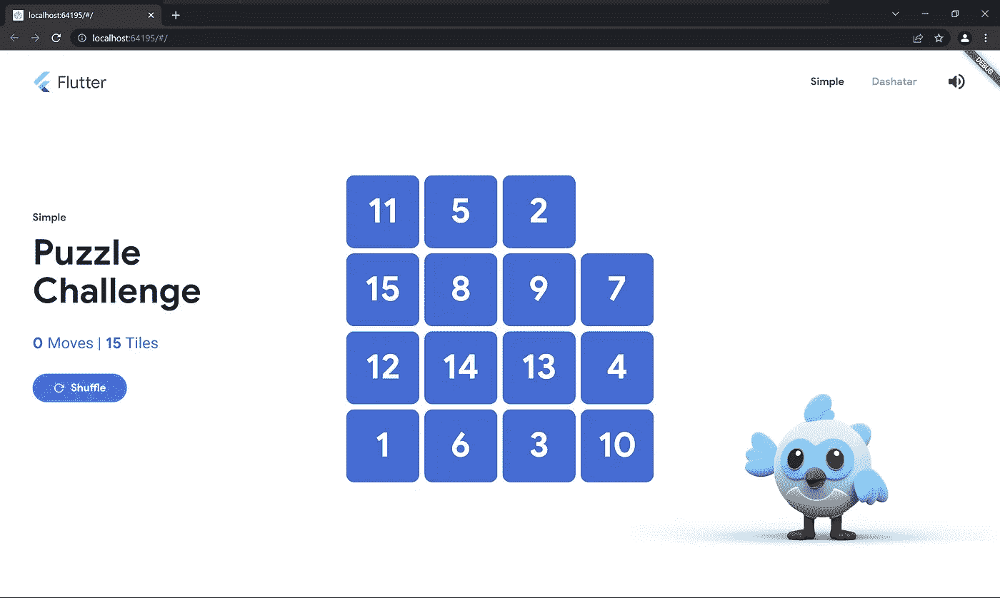

这个简单的主题非常简单，但是拥有一个幻灯片益智游戏的所有组件。还有 dashatar 主题，它使用图像作为瓷砖和更高级动画的背景。我将从简单的主题开始，让 dashatar 主题保持原样。基本上就是想把简单的主题定制到极致。

有了 [animated_styled_widget](https://pub.dev/packages/animated_styled_widget) 和 [responsive_property](http://responsive_property) 包，我可以更容易地实现我的目标。 [animated_styled_widget](https://pub.dev/packages/animated_styled_widget) 包为您提供了一个超级容器小部件，它接受一个类似于 CSS 的样式表，并支持隐式和显式动画。它还允许您使用多个样式表自定义 UI 组件，如按钮、开关、滑块等。 [responsive_property](http://responsive_property) 包允许您定义不同粒度的响应 UI 代码。您可以为不同的屏幕尺寸使用不同的小部件，或者在 GridView 中使用不同的整数值，如 crossAxisCount。然后，对于一个定制的主题，如果需要的话，我只需要设计一个样式表或者响应样式表的列表。

现在让我们看看我设计了什么:

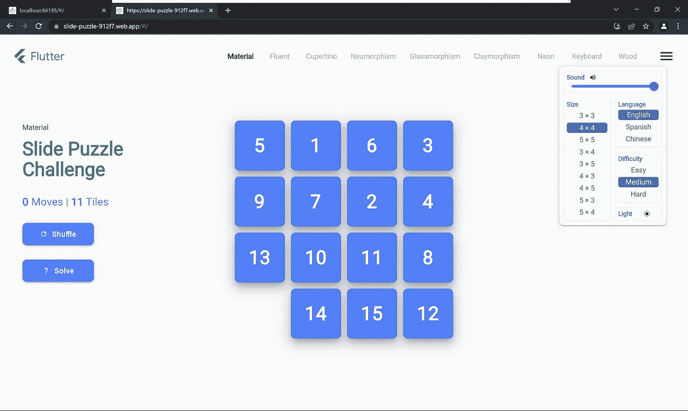

材料

第一个是物质题材。它与简单的主题非常相似，但是在瓷砖上添加了阴影。当您悬停或按下拼图块或按钮时，也会有动画显示。如果你仔细观察右上角的控制面板，你可以看到有一个太阳图标，表明我们正在看一个灯光主题。如果你点击它，应用程序将顺利过渡到黑暗物质主题:

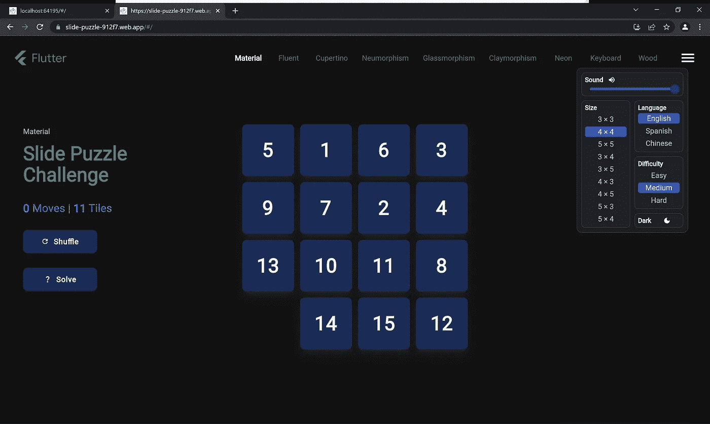

材料深色

接下来是流畅设计，这是微软在 Windows 11 上的最新设计语言:

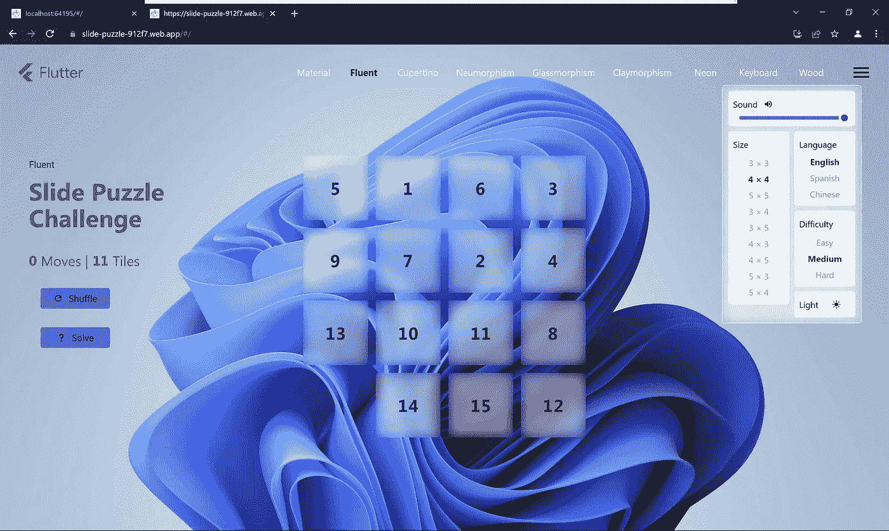

流利的

注意瓷砖和控制面板上的丙烯酸效果。当您悬停或按下磁贴时，还会有一个显示焦点效果，显示由 fluent design 设置的可见边框和发光阴影。音量滑块的风格也调整为与 Windows 11 相同。我们还有黑暗流畅的主题:

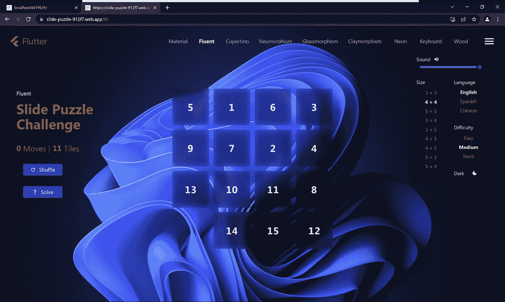

流畅的黑暗

现在是库比蒂诺主题及其黑暗版本:

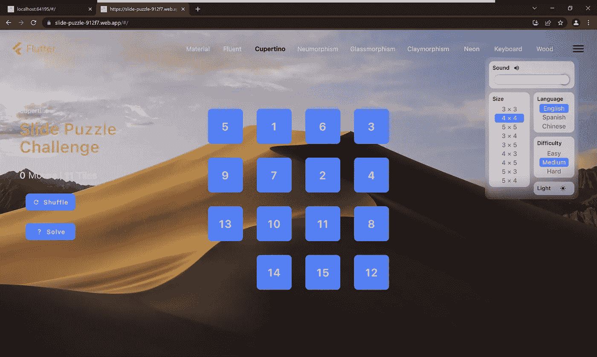

库比蒂诺主题

库比蒂诺黑暗

然后我设计了 2020 年非常流行的 neumorphism 主题:

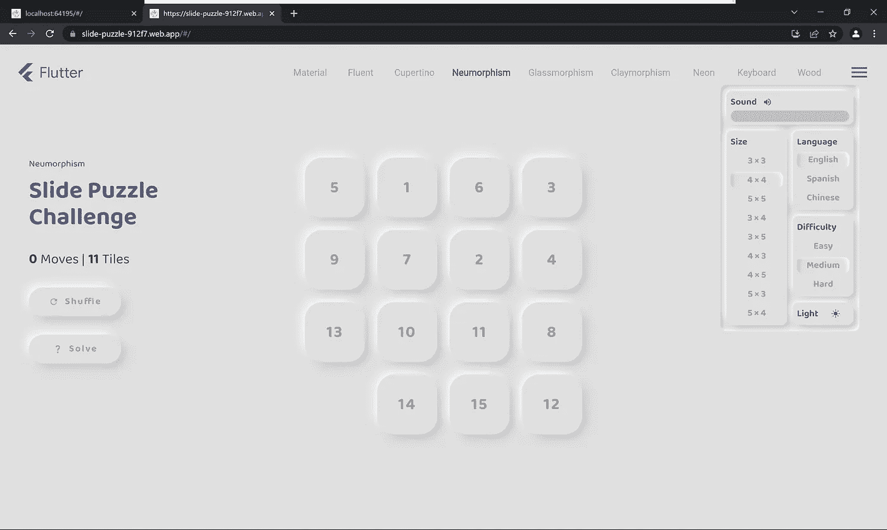

神经形态

当然，还有黑暗版本:

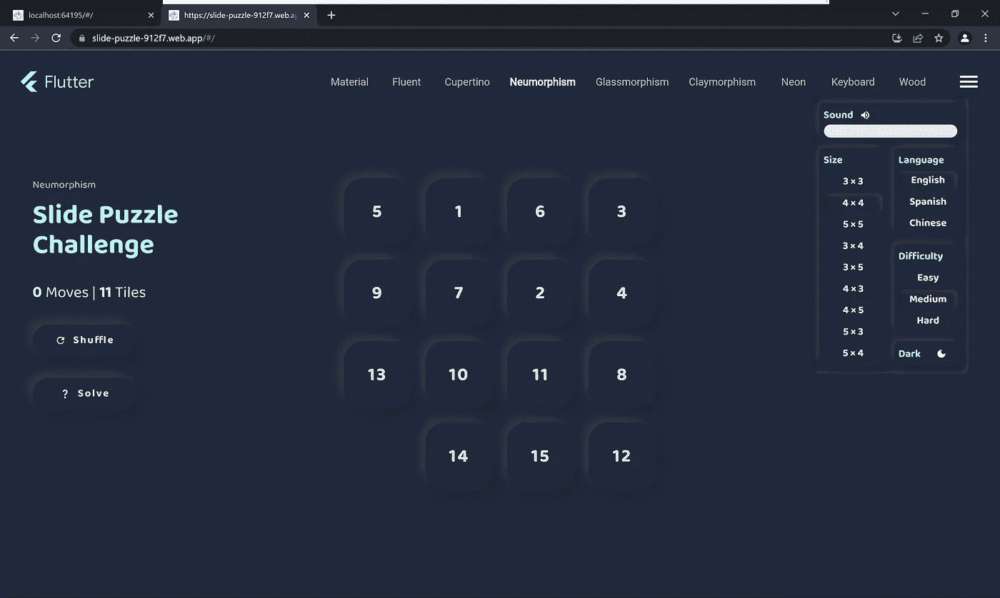

神经形态黑暗

另一个流行的设计趋势是玻璃形态:

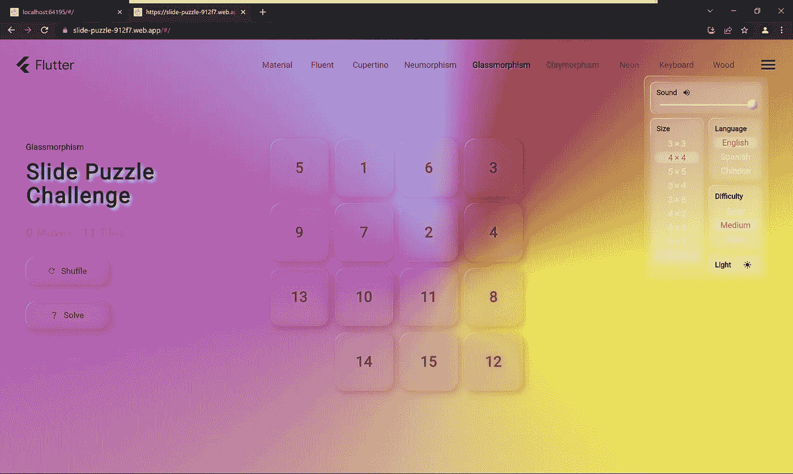

玻璃态

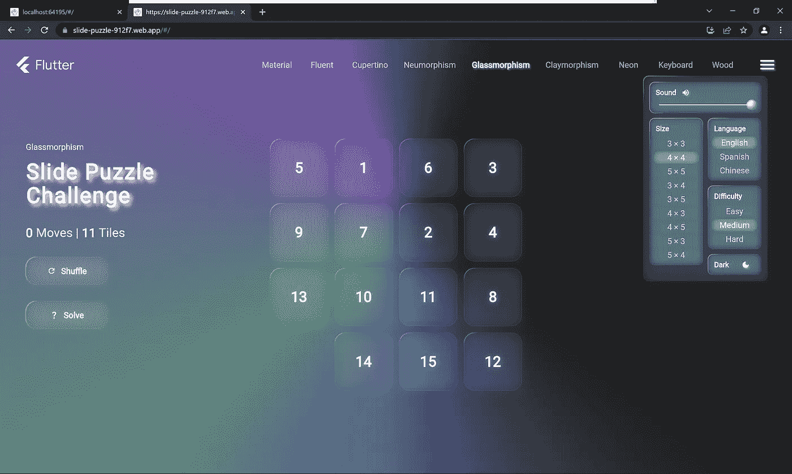

玻璃态黑暗

还有粘土质:

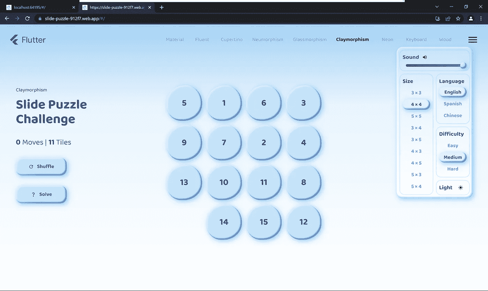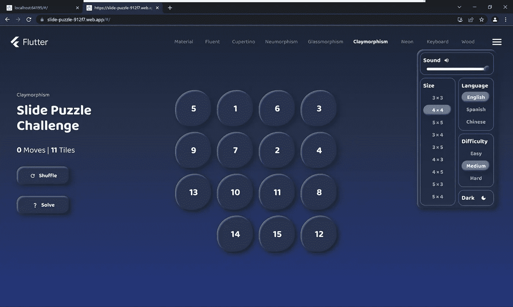

接下来是我认为实现起来很有趣的主题，应该归类到 skeuomorphism 中。

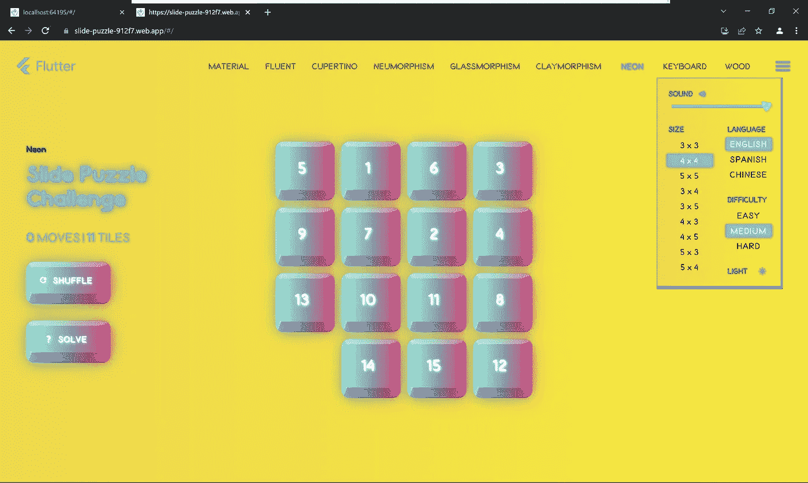

网络朋客

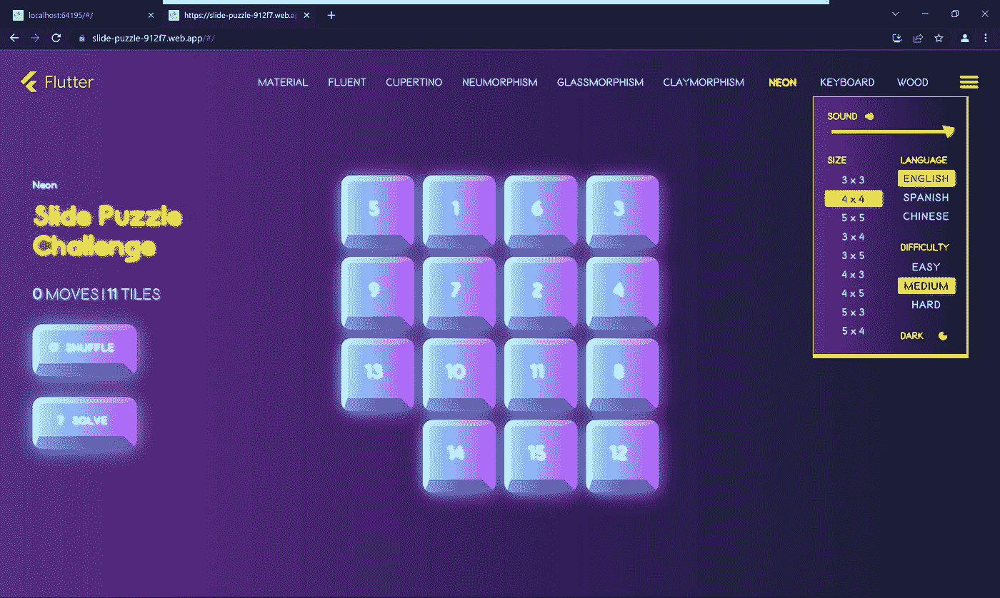

赛博朋克黑暗

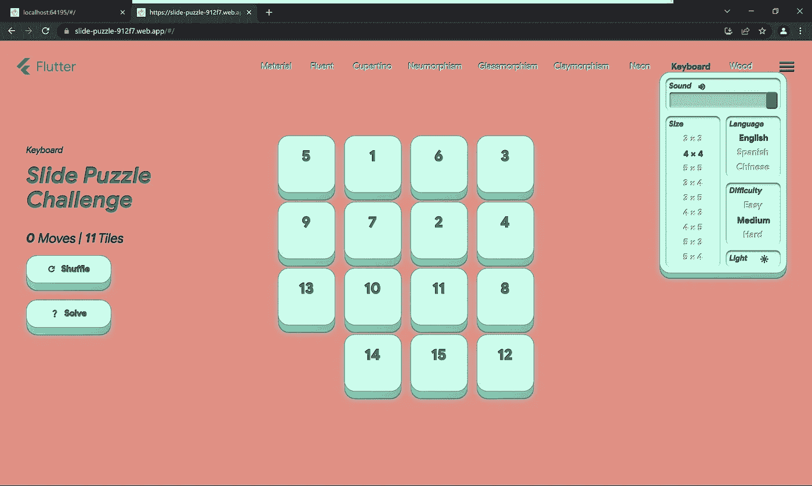

键盘

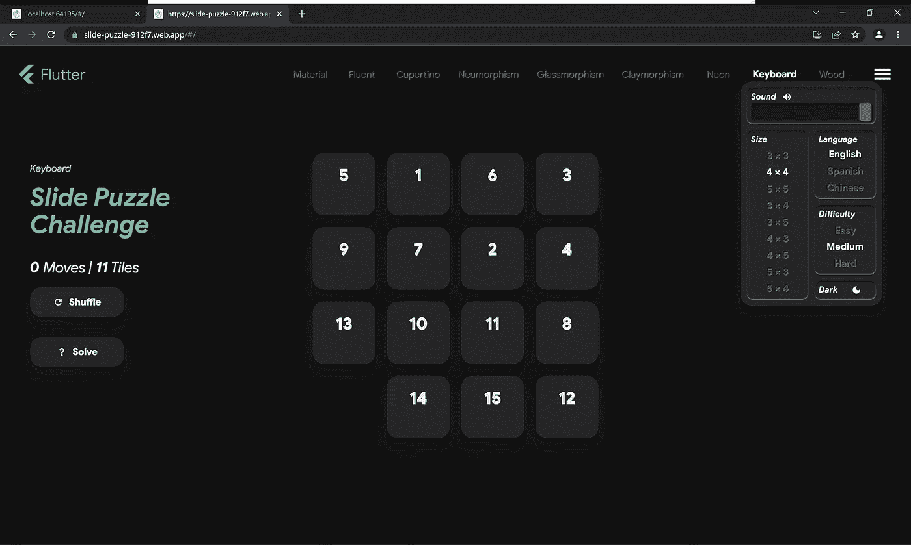

键盘暗

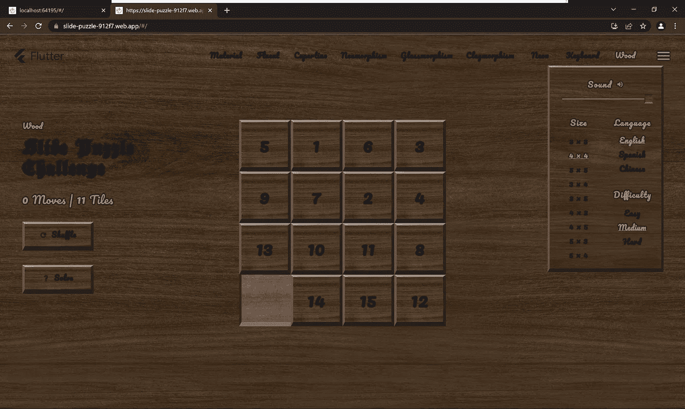

木

我想不出木材主题的两个版本。我想这就是 skeuomorphism 的本质:看起来很美，但很难设计。

如果这些截图让你足够感兴趣，你绝对应该在[https://slide-puzzle-912f7.web.app/](https://slide-puzzle-912f7.web.app/#/)试用这个应用。当你悬停或按下这些瓷砖时的动画也花了我很多时间来开发，只是为了让它们的行为更像真实世界的材料。在不同主题之间切换时也会有动画。其中一些看起来很酷，一些看起来有点滑稽，因为像图像背景交叉渐变这样的东西现在还没有在 Flutter 中实现。

该应用程序的其他功能包括:

1.  支持触摸和键盘输入。你可以使用箭头键来控制瓷砖(由非常好的企业提供)。支持也为不同主题定制的声音效果。
2.  支持多语言。目前支持三种语言(英语、西班牙语和中文)。
3.  拼图可以具有不同的甚至非正方形的尺寸和不同的难度。
4.  您可以通过单击“求解”按钮来自动求解该难题。我将 IDA*算法与部分倒带难题历史结合起来，以便在短时间内生成解决方案，这在 web 上尤其重要，因为异步 compute()方法目前不工作。

我还想强调我实现的额外功能，以实现我想要的视觉效果。它们包括:

1.  图像、渐变和彩色背景之间的交叉渐变/平滑过渡。当前在 Flutter 中的实现在背景过渡期间会有伪像。
2.  嵌入阴影。这也是目前在 FLutter 中所缺少的，但是对于实现变形或雕刻效果是至关重要的。
3.  具有不同宽度边的圆角矩形边框，并且能够将其平滑变形为其他形状的边框。变形算法的实现细节可以在[https://medium.com/p/30e0d33c60a7](https://medium.com/p/30e0d33c60a7)找到。
4.  能够打开相对于另一个小部件(或整个屏幕)定位的对话框。您可以使用它来实现可以在任何方向打开的抽屉或桌面 UI 中的下拉按钮。
5.  玻璃形态主题的动画极光渐变。
6.  平滑动画任何颜色，渐变和图像背景。

这就是我的 Flutter Puzzle Hack 提交的全部内容，themed_puzzle。我对 Flutter 在短短几年内取得的进步印象深刻。这个应用程序是真正跨平台的。我已经在 web、Android、Windows 和 Linux 上测试了它，性能令人印象深刻。它应该也可以在 macOS 和 IOS 上运行，不会出现大问题。我不需要修改一行代码来适应所有这些不同的平台，我想这就是我最初对 Flutter 感兴趣的原因。我还学到了很多关于所有不同的 UI 设计语言、IDA*算法和 flutter_bloc 的知识，这是这个项目中状态管理的选择。总而言之，过去的一个月在这个项目上的工作对我来说是一段真正难忘的时光。我真的很期待明年 Flutter Hackathon 会给我们带来什么。如果你有时间，请考虑在 [devpost](https://devpost.com/software/themed_puzzle) 上为主题谜题投票。谢谢大家！