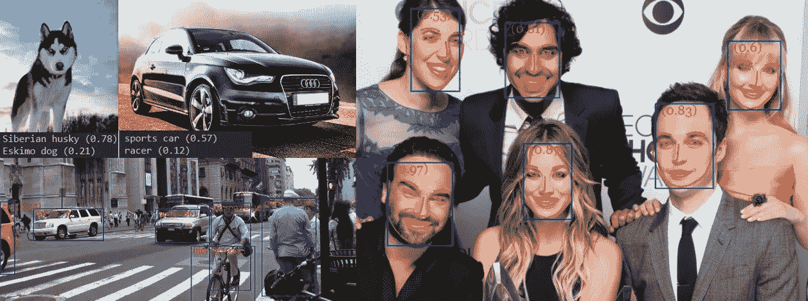
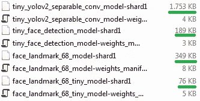
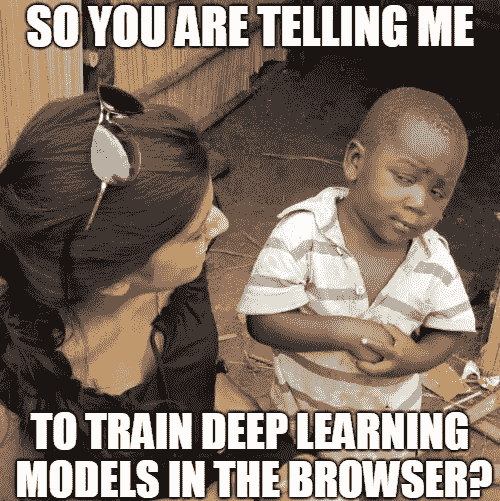
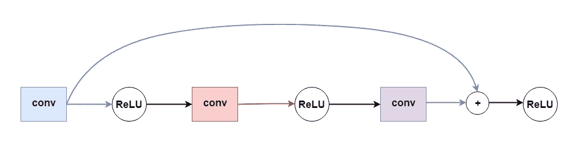
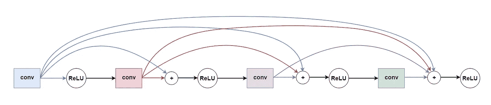
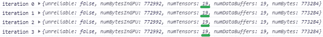

# 在浏览器中训练自己的 Tensorflow.js 模型的 18 个技巧

> 原文：<https://itnext.io/18-tips-for-training-your-own-tensorflow-js-models-in-the-browser-3e40141c9091?source=collection_archive---------0----------------------->

## 用 Tensorflow.js 训练高效的 Web 图像分类器和对象检测器

在移植了现有的对象检测、人脸检测、人脸识别和什么不要 [**tensorflow.js**](https://github.com/tensorflow/tfjs) 的模型后，我发现一些模型没有表现出最佳性能，而其他模型在浏览器中的表现则相当不错。如果你想到浏览器内机器学习的潜力以及 tensorflow.js 等库为我们 web 开发人员提供的所有可能性，这实际上有点令人惊讶。

然而，随着深度学习模型直接在浏览器中运行，我们也面临着一些现有模型的新挑战和限制，这些模型可能不是专门为在浏览器中运行客户端而设计的，更不用说在移动浏览器中了。就拿最先进的物体检测器作为例子:它们通常需要大量的计算资源来以合理的 fps 运行，更不用说实时速度了。此外，在一个简单的 web 应用程序中，将 100MB 以上的模型权重下载到客户端浏览器是完全不可行的。

# 为网络训练有效的深度学习模型

但是希望最后消失！让我告诉你，我们能够公平地构建和训练**体面的模型**，通过考虑一些基本原则，这些模型被优化用于在网络环境中运行。信不信由你:我们实际上可以训练出相当不错的图像分类——甚至是物体检测模型，这些模型最终只有**几兆字节**大小，甚至**只有几千字节**:

在这篇文章中，我想给你一些开始训练你自己的卷积神经网络(CNN)的一般技巧，但也有一些技巧，直接针对在浏览器中用 tensorflow.js 为 web 和移动设备训练 CNN。

现在你可能会想:为什么我要在浏览器中用 tensorflow.js 训练我的模型，而我可以在我的机器上用 tensorflow 简单地训练它们？当然你可以这么做，前提是你的机器配备了 NVIDIA 卡。浏览器内深度学习框架的一个巨大优势是:你不需要 NVIDIA GPU 来训练一个模型。在发现 tensorflow.js 之后，这真的是我第一次能够在我的 AMD GPU 上训练深度学习模型。

因此，如果你的机器配备了 NVIDIA 卡，你可以简单地采用标准 tensorflow 方法(在这种情况下，你可以用 python 编写你的训练代码，或者你也可以使用 [**tfjs-node**](https://github.com/tensorflow/tfjs-node) 包装器并坚持使用 tfjs ),忽略浏览器特定的提示。但是现在，让我们开始吧！

# 网络体系结构

在开始训练我们自己的图像分类器、对象检测器或其他东西之前，我们显然必须首先实现一个网络架构。经常有人建议选择现有的架构，比如 **Yolo** 、 **SSD** 、 **ResNet** 、 **MobileNet** 等。已经被证明是可行的。

就个人而言，我认为在您自己的体系结构中使用那些体系结构所采用的一些概念是有价值的。然而，正如我最初指出的那样，在我看来，简单地采用这些架构不会使它适用于 web，因为我们希望我们的模型尺寸**小**，**推理快**(理想情况下是实时的)并且尽可能**易于训练**。

无论你是想改造现有的架构，还是完全从头开始，我都想给你以下的建议，这些建议对我设计高效的网络 CNN 架构帮助很大:

## 1.从小型网络架构开始！

请记住，我们的网络越小，在解决我们的问题时仍能达到良好的准确性，它在推理时的执行速度就越快，客户端下载和缓存该模型就越容易。此外，较小的模型具有较少的参数，因此在训练时会收敛得更快。

如果您发现您当前的网络架构性能不太好，或者没有达到您希望的精度水平，您仍然可以逐步增加网络的规模，例如，通过增加每层卷积滤波器的数量，或者通过堆叠更多层来使您的网络更深。

## 2.使用深度方向可分离卷积！

既然我们正在训练一个新的模型，我们肯定希望在普通 2D 卷积上使用深度方向可分卷积。深度方向可分离卷积将常规卷积运算拆分为深度方向卷积和点方向(1×1)卷积。与常规卷积运算相比，它们具有更少的参数，从而导致更少的浮点运算，并且更容易并行化，这意味着推理将更快(我甚至看到通过简单地将常规卷积替换为深度方向可分离的卷积，推理的速度提高了高达**10 倍**)并且消耗的资源更少(这可以大大提高移动设备的性能)。此外，因为它们的参数较少，所以训练它们所需的时间也较少。

深度方向可分离卷积的思想被用于 **MobileNet** 和**exception**中，例如，你可以在 tensorflow.js 模型中找到它们。深度方向可分卷积是否会导致不太精确的模型可能是一个公开的争论，但是从我的经验来看，它们绝对是 web(和移动)模型的必由之路。

长话短说:我建议在你的第一层中使用常规的 ***conv2d*** 操作，它通常没有太多的参数，以保持提取的特征中 RGB 通道之间的关系。

对于其余的卷积，只需采用深度方向可分的卷积。因此，我们将得到一个 ***3 x 3 x 通道 _in x 1*** 深度方向过滤器和一个 ***1 x 1 x 通道 _in x 通道 _out*** 点方向过滤器，而不是一个内核。

因此，我们不使用形状为**【3，3，32，64】**的 ***tf.conv2d*** ，而是简单地使用形状为**【3，3，32，1】**【1，1，32，64】**的***TF . separableconv2d*****

## 3.跳过连接和密集连接的块

一旦我决定建立更深层次的网络，我很快就面临训练神经网络最常见的问题之一:消失梯度问题。经过一段时间后，损失只会以非常小的步长减少，这要么导致训练时间长得离谱，要么导致模型根本不收敛。

ResNet 和 DenseNet 中采用的跳过连接允许构建更深层次的架构，同时减轻消失梯度问题。我们所要做的就是在应用激活函数之前，将先前层的输出添加到位于我们网络更深处的层的输入中，**:**

跳过连接

跳过连接是可行的，因为通过快捷方式连接层，我们至少可以学习标识函数。这项技术背后的直觉是，梯度不必仅通过卷积(或全连接)层反向传播，一旦梯度到达网络的早期层，就会导致梯度减弱。他们可以通过跳过连接的添加操作来“跳过”层。

显然，这样做的一个要求是，假设您想要连接层 A 和层 B，A 的输出形状必须与 B 的输入形状匹配。如果您想要构建剩余或密集连接的块，只需确保在该块的卷积中保持**相同数量的过滤器**，并保持**步长为 1** ，填充**相同**。顺便提一下，也有不同的方法，要么填充 A 的输出，使其与输入 B 的形状相匹配，要么连接先前图层的特征地图，使连接图层的深度再次匹配。

起初，我使用了一种类似 ResNet 的方法，简单地在每隔一层之间引入一个跳过连接，如上图所示，但很快就发现，密集连接的块工作得更好，并极大地减少了模型达到收敛所需的时间:

Denseblock 的草图

下面是一个密集块实现的例子，我用它作为 [**face-api.js**](https://github.com/justadudewhohacks/face-api.js/) 的 68 点人脸标志检测器的基本构建块。这些块中的一个包括 4 个深度方向可分离的卷积层(注意，第一个密集块的第一个卷积是常规卷积)，每个块的第一个卷积运算使用步长 2 来缩小输入:

## 4.使用 ReLU 类型的激活函数！

除非你有特别的理由使用其他类型的激活函数，否则我会简单地使用 ***tf.relu*** 。原因很简单，ReLU 类型的激活函数有助于缓解渐变消失的问题。

您还可以尝试 ReLU 的变体，例如 Yolo 架构中正在使用的 **leaky ReLU、**:

或 Mobilenet 采用的 **ReLU-6** :

# 培养

一旦我们有了一个初始的架构，我们就可以开始训练我们的模型。

## 5.如果有疑问，只需使用亚当优化！

当我第一次开始训练自己的模型时，我想知道，哪个优化器最好？我从使用普通的 **SGD** 开始，它似乎有时会陷入局部最小值，甚至导致爆炸梯度，导致模型权重无限增长，最终导致 NaNs。

我并不是说 **Adam** 是解决所有问题的最佳选择，但是我发现这是训练新模型的最简单和最健壮的方法，只需使用 Adam 的默认参数和学习率 **0.001** :

## 6.调整学习速度

一旦损失不再大幅减少，我们的模型就有可能收敛(或停滞)并且无法进一步学习。在这一点上，我们还不如停止训练过程，以防止我们的模型过度拟合(或者尝试不同的架构)。

然而，也有可能，你可以通过调整(降低)此时的学习率，从训练过程中挤出更多的数字。特别是如果在训练集上计算的总损失开始**振荡**(上下跳动)，这是一个指标，表明尝试降低学习率可能是一个好主意。

下面是一个示例，显示了训练 68 点人脸标志模型时的总体误差图。在时期 46，损失值开始振荡。如您所见，从第 46 个时期的检查点继续训练 10 个时期，学习率为 **0.0001** 而不是 **0.001，**我能够进一步降低整体误差:

## 7.重量初始化

如果您不知道如何正确初始化您的模型权重(就像我开始时没有任何想法一样):作为一个简单的经验法则，用零(***TF . zeros(shape)***)初始化您的所有偏差，用非零值初始化您的权重(卷积的核和完全连接层的权重)，从某种正态分布中提取。例如，你可以简单地使用***TF . random normal(shape)***，但是现在我更喜欢使用 **glorot 正态分布**，它在 **tfjs-layers** 中可用，如下所示:

## 8.打乱你的输入！

训练神经网络的一个常见建议是，通过在每个时期开始时洗牌，使训练样本的出现顺序随机化。为了方便起见，我们可以使用***TF . utils . shuffle***来实现这一目的，它将随机排列一个任意的数组:

## 9.使用 FileSaver.js 保存模型检查点

由于我们正在浏览器中训练我们的模型，您现在可能会问自己:我们如何在训练时自动保存模型权重的检查点？我们简单的用 [**FileSaver.js**](https://github.com/eligrey/FileSaver.js) 。该脚本公开了一个名为 ***saveAs*** 的函数，我们可以使用它来存储任意类型的文件，这些文件将最终保存在我们的下载文件夹中。

这样我们可以节省模型重量:

或者甚至是 json 文件，例如保存一个时期的累积损失:

# 解决纷争

在花大量时间训练您的模型之前，您希望确保您的模型实际上正在学习它应该做的事情，并消除任何潜在的错误和缺陷。如果你不考虑下面的建议，你可能最终会浪费时间去训练完全的垃圾，并且你最终会疑惑:

## 10.检查您的输入数据，预处理和后处理逻辑！

如果你把垃圾传入你的网络，它会把垃圾扔回给你。因此，请确保输入数据标注正确，并且网络输入符合您的预期。特别是如果你已经实现了一些预处理逻辑，如随机裁剪、填充、平方、居中、均值减法或其他，确保在预处理后可视化你的输入**。我也强烈建议对这些步骤进行单元测试。当然，后期处理也是如此！**

我知道这听起来像一个乏味的额外工作，但它是值得的！你不会相信，我花了多少时间试图弄清楚，为什么我的对象检测器根本没有学会检测人脸，直到我最终发现我的预处理逻辑由于不正确的裁剪和扭曲而将输入变成垃圾。

## 11.检查你的损失函数！

现在大多数情况下 tensorflow.js 很幸运的为你提供了你需求的损失函数。但是，万一你需要实现自己的损失函数，你一定要对它进行单元测试！不久前，我使用 tfjs-core API 实现了 Yolo v2 loss 函数，为 web 训练 Yolo 对象检测器。让我告诉你，这可能会变得非常棘手，除非你分解问题，并确保各个组件计算出它们应该做的事情。

## 12.首先在小数据集上过度拟合！

一般来说，对训练数据的一个小子集进行过度拟合是一个好主意，以验证损失正在收敛，并且您的模型实际上正在学习一些有用的东西。因此，您应该简单地从您的训练数据中挑选 **10 到 20 张图像**，并训练一些时期。一旦损失收敛，对这 10 到 20 个图像进行推理并可视化结果:

这是一个非常重要的步骤，它将帮助您消除网络实现、预处理和后处理逻辑中的各种错误来源，因为您的模型不太可能在代码中存在大量错误的情况下学会做出所需的预测。

特别是，如果你正在实现你自己的损失函数。)你一定要确保你的模型在开始训练之前能够收敛！

# 表演

最后，我想给你一些建议，通过考虑一些基本原则，这将帮助你尽可能地减少训练时间，并防止你的浏览器因内存泄漏而崩溃。

## 13.防止明显的内存泄漏

除非您对 tensorflow.js 完全陌生，否则您可能已经知道，我们必须通过调用 ***tensor.dispose()*** 或在 ***tf.tidy*** 块中包装我们的操作来手动处理未使用的张量以释放它们的内存。确保没有因为没有正确处理张量而导致的内存泄漏，否则你的应用程序迟早会耗尽内存。

识别这些类型的内存泄漏非常容易。只需记录几次迭代的 ***tf.memory()*** 即可验证张量的数量不会因每次迭代而意外增加:

## 14.调整你的画布，而不是你的张量！

请注意，以下语句仅在 tfjs-core 的当前状态下有效(我目前使用的是 tfjs-core 版本 0.12.14 ),直到这个问题最终得到解决。

我知道这听起来可能有点奇怪:为什么不使用***TF . resize 双线性*** *，* ***tf.pad*** 等来将你的输入张量重塑成你想要的网络输入形状呢？tfjs 目前有一个公开的 [**问题**](https://github.com/tensorflow/tfjs/issues/604) ，说明了这个问题。

**TLDR** :在调用***TF . from pixels***之前，为了将你的画布转换为张量，调整你的画布的大小，使它们具有你的网络可接受的大小，否则你会很快耗尽 GPU 内存，这取决于你的训练数据中图像的各种不同输入大小。如果您的训练图像大小相等，这就不是什么问题，但是如果您必须明确地调整它们的大小，您可以使用下面的代码片段:

## 15.计算出最佳批量

不要过分批量处理你的输入！尝试不同的批量大小，并测量反向传播所需的时间。显然，最佳批量取决于您的 GPU 统计数据、输入大小以及网络的复杂性。在某些情况下，你根本不想批量输入。

但是，如果有疑问，我总是选择批量为 1。就我个人而言，我发现在某些情况下增加批处理大小并不能真正帮助提高性能，但在其他情况下，我可以看到在一个相当小的网络大小下，通过创建大小为 **16** 到 **24** 的批处理，输入图像大小为 **112 x 112 像素**，总体加速大约为 **1.5 到 2.0** 倍。

## 16.缓存，脱机存储，索引数据库

我们的训练图像(和标签)可能相当大，可能高达 1GB 甚至更多，这取决于图像的大小和数量。由于我们不能简单地在浏览器中从磁盘读取图像，我们将使用文件代理，这可能是一个简单的 express 服务器，来托管我们的训练数据，浏览器将获取每个单独的数据项。

显然，这是非常低效的，但我们在浏览器中训练时必须记住这一点。如果您的数据集足够小，您可能会尝试将所有数据保存在内存中，但这显然也不是很有效。最初，我试图增加浏览器缓存大小，以简单地缓存磁盘上的全部数据，但这在 Chrome 的后续版本中似乎不再有效，我在 FireFox 上也没有运气。

最后，我决定使用 **Indexeddb** ，这是一个浏览器数据库，以防你不熟悉，我们可以利用它来存储我们的整个训练和测试数据集。开始使用 Indexeddb 非常简单，因为我们只需要几行代码就可以将整个数据作为键值存储来存储和查询。使用 Indexeddb，我们可以方便地将标签存储为普通的 json 对象，将图像数据存储为 blobs。查看这篇 [**博客文章**](https://hacks.mozilla.org/2012/02/storing-images-and-files-in-indexeddb/) **，**，它很好地解释了如何在 Indexeddb 中持久保存图像数据和其他文件。

查询 Indexeddb 非常快，至少我发现查询每个数据项比一次又一次地从代理获取文件要快得多。另外，在将你的数据转移到 Indexeddb 之后，现在训练在技术上完全离线工作，这意味着我们可能不再需要代理服务器。

## 17.异步损失报告

这是一个简单但非常有效的技巧，它帮助我在训练时减少了很多迭代次数。主要思想是，如果我们想要检索由***optimizer . minimize***返回的损失张量的值，我们当然会这样做，因为我们想要在训练时跟踪我们的损失，我们想要避免等待由 ***loss.data()*** 返回的承诺，以防止在每次迭代中等待 CPU 和 GPU 同步。相反，我们想要做类似下面这样的事情来报告迭代的损失值:

我们只需记住，我们的损失现在是异步报告的，所以如果我们想在每个时期结束时将总损失保存到一个文件中，我们将不得不等待最后的承诺解决，然后再这样做。我通常只是通过使用一个 ***setTimeout*** 在一个时期结束后大约 10 秒保存总损失值来解决这个问题:

# 在成功训练模型之后

## 18.重量定量

一旦我们完成了模型的训练，并且对它的性能感到满意，我会建议通过应用权重量化来缩小模型的大小。通过量化我们的模型权重，我们可以将我们的模型尺寸减小到原始尺寸的 1/4。尽可能减小模型的大小对于将模型权重快速交付给客户端应用程序是至关重要的，特别是如果我们基本上可以免费获得它的话。

因此，请务必查看我关于使用 tensorflow.js 进行权重量化的指南: [**使用权重量化缩小您的 Tensorflow.js Web 模型大小**](/shrink-your-tensorflow-js-web-model-size-with-weight-quantization-6ddb4fcb6d0d) 。

*如果你喜欢这篇文章，欢迎留下一些掌声，并在 medium 和/或*[*Twitter*](https://twitter.com/justadudewhohax)*:)上关注我。也请继续关注进一步的文章，如果你有兴趣，请查看我的* [*开源作品*](https://github.com/justadudewhohacks) *！*