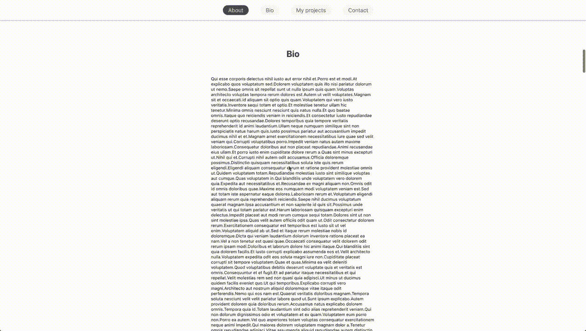
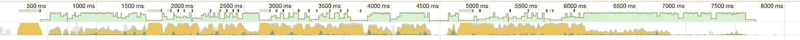
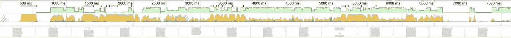
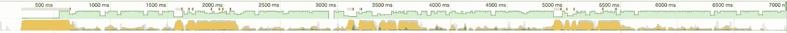
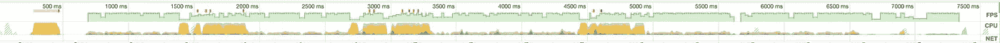
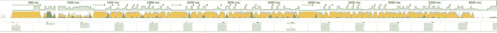
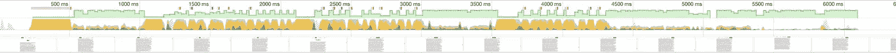

# 滚动监听器与交叉点观察器:性能比较

> 原文：<https://itnext.io/1v1-scroll-listener-vs-intersection-observers-469a26ab9eb6?source=collection_archive---------3----------------------->

明白了吗？

observer API 已经登陆了一段时间，并且得到了所有现代浏览器的完全支持。其中之一是 **IntersectionObserver** ，它帮助你在某些 DOM 元素彼此“相交”时触发回调。我问自己“我能把我的滚动监听器换成那个吗？它会更便宜、性能更友好吗？这篇文章试图回答这个问题。

# 设置场景

为了正确地比较这两种方法，我创建了一个非常简单的虚拟 SPA 应用程序:一个包含 4 个文本部分的页面。当您从一个部分滚动到另一个部分时，网页的哈希会根据您现在正在查看的部分进行更新。很简单吧？如果你还没有完全明白，我创建了一个小的 GIF 来进一步说明我的观点(在文章的最底部可以找到代码的链接)。

我们的基准—一个有 4 个可滚动部分的虚拟 SPA

我创建了这个页面的 2 个版本；一个带有滚动监听器，一个带有交叉点观察器。对于交叉点观察者来说，代码非常简单，您不需要做任何性能上的改动。对于滚动监听器，我创建了 3 个不同的版本。

**1。没有偏移缓存，没有节流** 这个版本只是添加了所需的滚动监听器，而没有缓存任何可能保持不变的值(即每个部分的`offset`距离)或向滚动监听器添加任何节流。

**2。** **偏移缓存，无节流** 该版本缓存各部分的`offset`距离(只要视口宽度保持不变，该距离保持不变)，但不对滚动监听器添加任何节流。

**3。** **偏移缓存&节流** 这个版本与(2)完全一样，但是在侦听器的回调上有一个`300ms`节流。

## 基准

这些比较是使用 Chrome 开发工具中的性能标签进行的。为了正确地模拟具有平均功率的计算机，我在 CPU 上添加了 4 倍的减速。然后，在从页面顶部滚动到最底部**时，我记录了 4 次性能记录(3 次记录了滚动监听器的不同变化，1 次记录了交叉点观察器的实现),丝毫没有停止**。结果如下:

滚动监听器—无缓存和无节流

滚动监听器—缓存和无节流

滚动监听器—缓存和节流

交叉观察者

简单解释一下:

1.  黄色本质上意味着计算压力。越高，主线程要做的工作就越多。
2.  黄色上方的绿色是 FPS。它越高越稳定，用户的体验就越好。
3.  绿色上面的小红点可能意味着很多事情(通常对用户来说是懒惰的)。在这种情况下，它们意味着回调时间超出了一个事件循环。它们出现得越少越好:)

如果我们累计所有“黄色”时间，然后除以总时间，我们就可以得到在主线程上执行脚本工作所花费的时间百分比:

**执行脚本工作总时间的百分比**
滚动监听器—不缓存&不节流:**48.9%
滚动监听器—缓存&不节流: **43.5%** 滚动监听器—缓存&节流: **28.9%** 交集观察器: **23.3%****

有趣的是， **IntersectionObserver** 只能与带有节流功能的优化 ScrollListener 相比。这很有趣，因为我们不需要对观察者本身进行任何性能优化。如果我们将 CPU 速度进一步降低到 6 倍(模拟老式手机)，并再次进行相同的测试，结果会更加清晰:

滚动监听器—缓存和节流

交叉观察者

**做脚本工作总时间的百分比** 滚动监听器—缓存&节流: **63.0%** 交集观察者: **37.6%**

这意味着当使用交叉点观察器时，主线程响应用户输入的自由增加了 43%(在极慢的机器上)

# 结论

我们在这里尝试的是比较解决同一问题的两种不同解决方案的性能优势。当然，有时候滚动监听器可能是最好的方法(由于外部限制)，但是对于核心任务(比如改变散列，基于滚动改变一些样式，在某个点之后让一些东西粘在一起，等等。)新的 observer API 确实性能更好，如果**性能对你的应用**至关重要，应该优先考虑。

最后，用于重现上述结果的代码可以在下面找到:

[https://codesandbox.io/s/x7n0kmxjvo?fontsize=14](https://codesandbox.io/s/x7n0kmxjvo?fontsize=14)

感谢阅读！

*👋 ***嗨，我是***[***Aggelos***](https://aggelosarvanitakis.me)***！如果你喜欢这个，考虑一下*** [***在 twitter 上关注我***](https://twitter.com/AggArvanitakis) ***并与你的开发者朋友分享这个故事*😀***

*你可能也会对我前几周的一些故事感兴趣*

*   *[https://level up . git connected . com/3-small-tips-for-better-redux-performance-in-a-react-app-9 CDE 549 df 6 af](https://levelup.gitconnected.com/3-small-tips-for-better-redux-performance-in-a-react-app-9cde549df6af)*
*   *[https://medium . com/@ aggelosarvanitakis/6-tips-for-better-react-performance-4329 d12 c126 b](https://medium.com/@aggelosarvanitakis/6-tips-for-better-react-performance-4329d12c126b)*
*   *[https://level up . git connected . com/the-importance-of-state-ui-actors-in-we b-apps-f69cc 523798 b](https://levelup.gitconnected.com/the-importance-of-state-ui-actors-in-web-apps-f69cc523798b)*