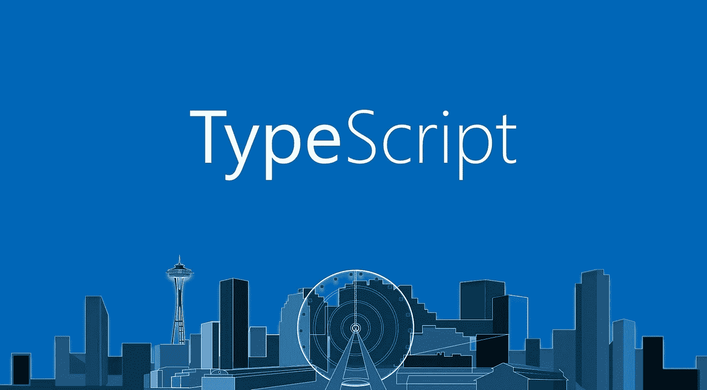

# 2 分钟静态键入的 Typescript！

> 原文：<https://itnext.io/2-minutes-of-statically-typed-typescript-bb97f894e2f9?source=collection_archive---------3----------------------->



我喜欢 TS ❤，我真的认为类型是记录代码的最好方式，它对调试有很大的帮助，甚至当你面前有一个模型时，未来的设计也变得很容易…ts 类型系统很棒，即使使用类型在内存分配/管理方面没有任何意义(例如在 Rust lang 中)。

让我们**简化打字稿定义**:

> [**TypeScript**](https://en.wikipedia.org/wiki/TypeScript) 提供**静态类型**到**类型**注释，使**类型** **在编译时检查**。
> 
> 这是可选的，可以忽略以使用 JavaScript 的常规动态**类型**。

# **名称删除< T > : (terms: T)**

首先是**——什么是类型系统？**

> 一个**类型系统**将一个类型与每个计算出的值相关联，并通过检查这些值的流程，试图**确保**或证明[类型错误](https://en.wikipedia.org/wiki/Type_error)不会发生。

有一套旨在减少错误可能性的规则很酷，不是吗？

**静态类型:**运行前检查的类型**(在转移代码前跟踪 bug..).**

****动态** - **类型:**类型**检查**大多是在**运行时。**(运行时问题如果错过代价更大)。**

**顺便说一句，强力打字和每周打字的混合组合(就像使用*)叫做:**渐进打字*****

*****类型注释:**(只是你熟悉的东西的一个别出心裁的名字..)用于强制类型检查。例如，原样(具有成员的对象)或使用类型/接口声明。***

```
***function** *drive*(driver: {**name**: **string**, **age**: **number**}, 
               car: { **brand**: **string**, **maxSpeed**: **number** }) {
}

*// OR* **type** Driver = {**name**: **string**, **age**: **number**};

*// OR* **interface** IDriver {
  **name**: **string**;
  **age**: **number** }*
```

*****结构分型:*****

***我最近看了***TypeScript:Java script 的静态类型*** t 讲座，主讲人是 ***安德斯·海尔斯伯格*** ，非常好，他将 TS 解释为一个结构类型系统***

> *****结构化**类型化是一种仅仅基于成员来关联**类型**的方式。***

***基于成员关联类型？下面显示了可能的两种不同类型，但两者具有相同的成员，因此可以将一个分配给另一个:***

```
***interface** INode<T> {
  **data**: **string**;
  **parent**: T;
  **children**: INode<INode<T>>[];
}

**type** Item<T> = {
  **data**: **string**;
  **parent**: T;
  **children**: Item<Item<T>>[];
}**let** foo: INode<**null**>;
**let** bar: Item<**null**>;

foo = bar;*
```

> ***TypeScript 的结构类型系统的基本规则是，如果`y`的成员至少与`x.`相同，那么`x`与`y`兼容***

***就这些，我希望你喜欢我 2 分钟的高级静态类型 javascript(使用 typescript)！干杯，***

***利伦。***