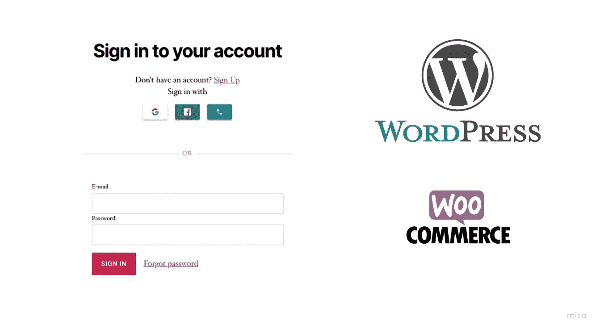
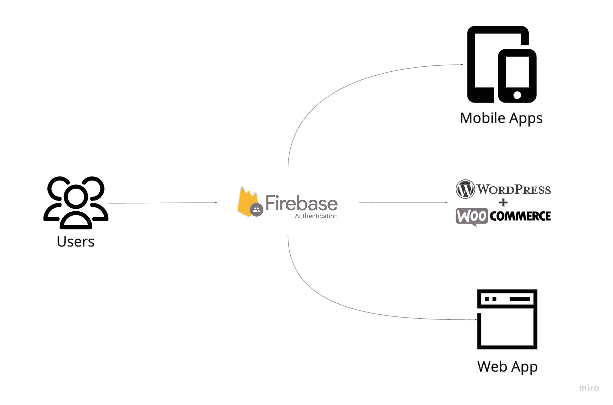
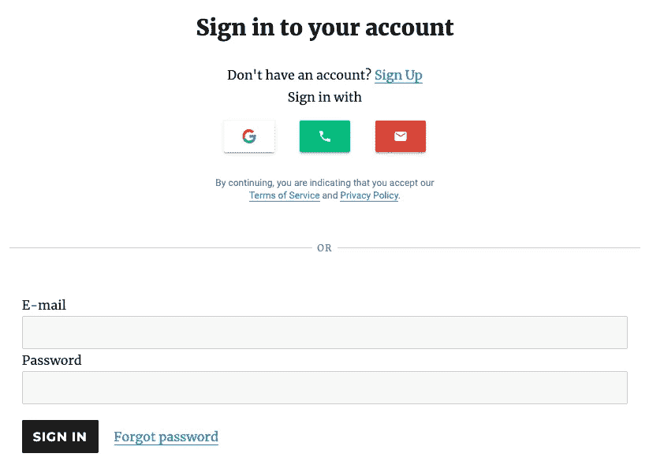

# 向 WordPress & WooCommerce 添加 Firebase 认证的两种方法

> 原文：<https://itnext.io/2-ways-to-add-firebase-authentication-to-wordpress-woocommerce-df500c3b104e?source=collection_archive---------6----------------------->



WordPress & WooCommerce 的 Firebase 社交登录

> 如果你对 Integrate Firebase PRO 版本感兴趣，请阅读完整的更新文档:[*【https://firebase-wordpress-docs.readthedocs.io/】*](https://firebase-wordpress-docs.readthedocs.io/)

**演示:**[**https://wordpress.dalenguyen.me/**](https://wordpress.dalenguyen.me/)

*   文章 1: [如何将 Firebase 整合到 WordPress](/how-to-integrate-firebase-and-wordpress-b017ee274687)
*   第 2 篇:[如何从 Firestore 检索数据并显示在 WordPress 上](/how-to-retrieve-data-from-firestore-and-display-on-wordpress-8638854a762e)
*   第 3 篇:[如何在 WordPress 中使用 Firebase 自定义声明](https://medium.com/@dalenguyen/how-to-work-with-firebase-custom-claims-in-wordpress-aaf83965bd20?sk=85786e3739d42b18c3e2c7344bc5f436)
*   第 4 条:[将数据从 WordPress 保存到 Firebase(实时+ Firestore)](/how-to-save-data-from-wordpress-to-firebase-realtime-firestore-2eda917d01fb)
*   第五条: [Firebase WordPress 用户集成](/firebase-wordpress-user-integration-c18a28e41cbd)
*   第六篇:[如何在 WordPress 仪表盘中管理 Firebase 用户](/firebase-users-management-in-wordpress-dashboard-61b4a1ca066)
*   第 7 篇:[如何将数据从 WordPress 同步到 Firebase](/sync-data-from-wordpress-to-firebase-d6e5860d3a06)
*   第 8 条:[一键登录 WordPress & Firebase 或通过电子邮件链接](https://medium.com/@dalenguyen/one-click-login-to-wordpress-firebase-or-via-email-link-d7610d71cd23)
*   第 9 条:[从 WordPress 上传文件到云存储](https://medium.com/@dalenguyen/upload-files-to-cloud-storage-from-wordpress-e8acc8ce70cd)
*   第十条:[远程 URL 登录到 Firebase & WordPress](/remote-url-login-to-firebase-wordpress-2027fad7c159)
*   第十一条: [2 **添加 Firebase 认证到 WordPress&woo commerce**的方法](https://dalenguyen.medium.com/2-ways-to-add-firebase-authentication-to-wordpress-woocommerce-df500c3b104e)
*   第十二条:[如何将 WooCommerce 购买数据发送到 Firebase](https://dalenguyen.medium.com/how-to-send-woocommerce-purchase-data-to-firebase-8c8b4c8cff39)
*   第 13 条:[从 WordPress](https://dalenguyen.medium.com/create-manage-firebase-database-from-wordpress-13347d8ffb2e) 创建&管理 Firebase 数据库

有几种方法可以在 WordPress 网站上实现 firebase 认证。集成的目的是为您的 web 应用程序或移动应用程序提供一个扩展，您可以在其中构建和管理网站/电子商务网站，而无需过多的管理。

演示:【https://wordpress.dalenguyen.me/social-login-new/ 



集中认证流程

1.  [**集成 Firebase 插件**](https://wordpress.org/plugins/integrate-firebase/) **(免费)**

免费版提供简单的电子邮件认证，所以你可以让用户在你的 WordPress 网站上登录 Firebase。


基本电子邮件认证

用法很简单，你需要做的就是在页面上添加短代码。

```
[firebase_login][/firebase_login]
```

**2。** [**集成 Firebase PRO**](https://firebase-wordpress-docs.readthedocs.io/en/latest/) **(付费)**

这是一个完整的版本，你可以集成这么多:社交媒体登录，电话(OTP)，电子邮件…用户在 Firebase 和 WordPress 之间同步。



Firebase 社交和电子邮件登录

您需要做的是在您的登录页面上添加一个短代码。

```
[firebase_auth redirect="/"]
```

这就是在你的 WordPress 网站上拥有一个 Firebase Social & Email 登录所需要的一切。

更多阅读请点击:[https://firebase-wordpress-docs.readthedocs.io/en/latest/](https://firebase-wordpress-docs.readthedocs.io/en/latest/)