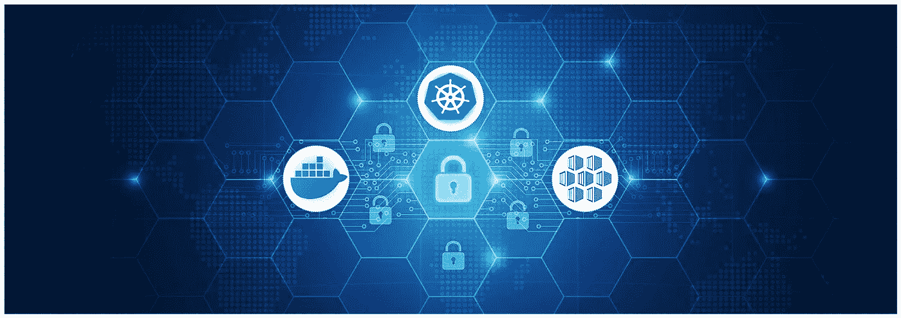
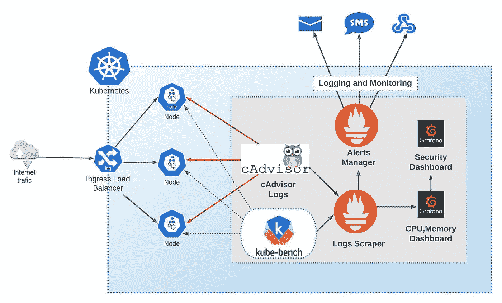

# 针对您的集装箱化环境的 2 种广泛攻击和 7 条预防规则。

> 原文：<https://itnext.io/2-widespread-attacks-on-your-containerized-environment-and-7-rules-to-prevent-it-957aa7dfa5e0?source=collection_archive---------1----------------------->

## 如何应用通用的安全原则以及选择什么工具来防止对 Docker 容器和 Kubernetes 集群的攻击。

## **1。中间人攻击**。

MITM 袭击在库伯内特和多克地区很普遍。这种攻击包括发送数据的组件和接收该数据的组件之间的附加恶意部分。它可以是一个假的容器、服务、中间件，甚至是一个人。例如:

*   [CVE-2020–8554](https://cve.mitre.org/cgi-bin/cvename.cgi?name=2020-8554)—使得攻击者能够通过创建 ClisterIPs 服务来获得对群集的访问权限的漏洞。
*   [Siloscape](https://unit42.paloaltonetworks.com/siloscape/)—windows 容器内的恶意软件。Silocape 创建了整个 Kubernetes 集群的后门，包括敏感数据和 CPU、GPU 以及资源

## **2。密码劫持攻击。**

这种攻击允许攻击者运行恶意代码，以使用 PC 的 CPU、GPU 和内存来挖掘加密货币。示例:

[CVE-2018–15664](https://nvd.nist.gov/vuln/detail/CVE-2018-15664)—以 root 权限访问 docker 系统。

# 介绍

容器本身是一个小操作系统，容易受到恶意代码的攻击。在本文中，我们将讨论

*   你需要做什么来保护你的应用在容器中。
*   安全工具。
*   安全规则、策略。
*   如何应用常见的安全原则来防止攻击。

我考虑将 Docker 和 Kubernetes 作为容器引擎和编排领域的两个领导者。

# 保护码头集装箱的原则和规则

## 1.使用最小特权原则。

这个原则意味着您不应该使用管理员用户来执行容器。您应该创建具有管理员访问权限的用户，并且只能操作这个特定的容器。您也可以让群组在那里添加用户。您可以在[“用用户名称空间隔离容器”](https://docs.docker.com/engine/security/userns-remap/#about-remapping-and-subordinate-user-and-group-ids)中了解更多信息。以下是如何创建用户和组**的示例。**

首先，你应该使用官方验证和签名的图像。要查找和检查图像，您可以使用 [docker trust inspect](https://docs.docker.com/engine/reference/commandline/trust_inspect/) 。

比如*docker trust inspect—pretty Google/API gee-mart-server:1 . 3 . 6。*

Docker 内容信任(DCT)有助于数字签名。

它允许在运行时验证图像和发布者。这个过程基于 [Docker 内容信任密钥](https://docs.docker.com/engine/security/trust/#docker-content-trust-keys)，它在与 DCT 的第一次交互过程中生成几个密钥。

## 2.设置资源限制

您应该为您的 docker 容器设置[内存和 CPU 限制](https://docs.docker.com/config/containers/resource_constraints/#memory)，因为 docker 有一个容器默认没有这个选项。这个原则是防止 DoS 攻击的一种方法。例如，您可以设置一个内存限制来防止您的容器消耗所有内存。这同样适用于 CPU 限制。

还有一个在 Kubernetes 级别上设置资源限制的选项。我在 Kubernetes 安全性一节中讨论了这个主题。

## 3.保护并理解 Docker 网络。

这个原则对于理解 Docker 的网络原则至关重要。你应该了解什么是 [Docker 网络驱动](https://docs.docker.com/network/)，例如:

*   桥梁
*   宿主
*   覆盖物

默认情况下，一个容器网络堆栈不能访问另一个容器。但是，如果您将桥接或主机配置为接受来自任何其他容器或外部网络的流量，您可能会为攻击创建一个潜在的安全后门。您还可以使用 docker 守护进程中的 set 标志 *— icc=false* 来禁用容器间通信。

## 4.添加容器安全监控架构

安全监控对于检测恶意代码和对容器的攻击至关重要。

使用适当的监控工具，您应该能够检测到问题。

该工具允许您:

1.  构建实时仪表板。
2.  设置提醒，通过电子邮件、短信，甚至你喜欢的聊天平台向你发送信息。

要查找 Docker 容器中的漏洞，可以使用

*   [docker 扫描命令](https://docs.docker.com/engine/scan/#how-to-scan-images)。
*   CAdvisor ，这也是一个非常强大的工具来监控你的容器。此外，您还可以在 Kubernetes 集群中运行它。

Docker scan 或 Caadvisor 是一个简单的解决方案，仅适用于一个特定的容器。对于更复杂的场景，例如，当您在 Kubernetes 中运行 50 多个容器时，您需要复杂的监控工具，例如:

*   普罗米修斯和[格拉夫纳](https://grafana.com/)。Prometheus 是一个日志记录组件，它从您的容器中“抓取”信息并将其放入数据源。数据源可以是 SQL、NoSQL 数据存储。此外，普罗米修斯有一个警报管理器组件。它允许用户创建基于规则的警报。Grafana 是一个帮助构建复杂 UI 仪表板的框架。仪表板可以很容易地配置为从 Prometheus 获取数据。
*   [Datadog](http://datadoghq) ，这是一个全面的一体化监控工具，包含测井组件子系统和侧柜。它还包括一个复杂的交互式 UI 框架。
*   [Azure 日志分析](https://docs.microsoft.com/en-us/azure/azure-monitor/containers/containers)。这是一个复杂的工具，可以监控你的容器，尤其是在 Azure 容器注册中心，Azure Kubernetes 服务。如果你有 Azure 云服务下的容器解决方案，这是一个方便的选择，因为它支持开箱即用。

我列出了一些非常流行的解决方案。不过市场上还有很多其他值得一提的，像 [Sysdig](https://sysdig.com/partners/docker/) 、 [Sematext](https://sematext.com/docker/) 、 [Dynatrace](https://hub.docker.com/_/dynatrace) 。

我喜欢用[普罗米修斯](https://prometheus.io/) + [卡迪瓦尔](https://github.com/google/cadvisor) + [格拉夫纳](https://grafana.com/)的组合来“烹饪”。

*   Prometheus 是一个强大的开源选项，用于监控 CPU、GPU、内存、图像和其他指标。
*   CAdvisor 在检测漏洞方面相当。
*   Grafana 擅长构建、配置仪表板和警报，并将所有组件一起导入。

此外，我使用的安全工具 Kube-bench 只涉及漏洞扫描。Kube bench 为您的集群安全监控增加了一层。Kubernetes 有很多安全工具。

## 5.避免将敏感数据放在 Docker 图像中。

这个原则对于将所有敏感数据移出容器非常重要。您可以使用不同的选项来管理您的机密和其他敏感数据:

*   [Docker secret](https://docs.docker.com/engine/swarm/secrets/) 允许您在图像之外存储您的秘密。
*   如果你在 Kubernetes 中运行 docker 容器，你可以使用[秘密](https://kubernetes.io/docs/concepts/configuration/secret/)来存储你的密码、证书或任何其他敏感数据
*   对敏感数据使用特定于云的存储，例如 Azure Key Vault 或 AWS Secret Manager。

## 6.涉及漏洞扫描工具

漏洞扫描工具是检测可能存在安全漏洞的图像的重要部分。此外，您还可以将适当选择的工具集成到 CI/CD 流程中。下面我列举了一些扫描工具:

*   [Dagda](https://github.com/eliasgranderubio/dagda/) 使用静态分析方法来查找病毒、恶意软件、伪造子映像和特洛伊木马。它基于现有漏洞数据库的红帽安全咨询(RHSA)库。
*   Trivy 可以高精度地检测 Alpine Linux 和 RHEL/CentOS、Debian、Ubuntu 等操作系统的复杂漏洞。它非常强大，开源，而且免费。您可以在独立模式或客户机/服务器模式下运行 Trivi。因此，您可以将其添加到您的 CI/CD 流程中。
*   [Clair](https://github.com/quay/clair) 用于对您的图像进行静态分析。它支持基于开放容器倡议(OCI)的图像。您可以构建基于 Clair API 的扫描图像服务。克莱尔使用 [CVE 数据库](https://cve.mitre.org/)来检测漏洞。

您可以在[集装箱招标报告](https://dzone.com/trendreports/containers-1)文章中找到更多信息。

## 7.使用安全的 Docker 注册表

为了保护您的图像，您可以创建额外的安全层，并使用来自受保护注册表的图像，如:

*   [Harbor](https://goharbor.io/) ，这是一个集成了漏洞扫描的开源注册表。它基于应用于 docker 工件的安全策略。
*   [Quay](https://quay.io) ，扫描你的图片寻找漏洞。这是一个由 RedHat 支持的图像注册表。Quay 还提供了一个独立的图像库，你可以在你的组织内部安装和使用。下面你可以看到它是如何扫描漏洞的。

但是如果你已经在使用 Azure Container Registry 或者 Docker Hub 这样的注册中心了呢？你可以在[集装箱趋势报告](https://dzone.com/trendreports/containers-1)文章中找到如何做到这一点。

# 保护 Kubernetes

Kubernetes 安全性是一个大而重要的话题。主要的安全规则是:

*   **网络和网络政策。**你应该了解 kubernetes 网络模型的工作原理。它将帮助您在 pod 之间建立适当的网络通信，并假装创建开放端口或直接访问节点。网络政策可以帮助您组织这种沟通。
*   **保护您的 pod 的进出流量**。在这里，您也可以使用网络策略。您可以使用策略拒绝所有进出流量，然后开始开放。你也可以像使用 [istio](https://istio.io/latest/docs/concepts/what-is-istio/) 一样使用**服务网格**。它增加了额外的服务层，实现了流量自动化，并有助于监控。然而，您应该小心使用**服务网格**，因为它可能会增加额外的复杂性。
*   **传输层安全。如果 TLS 尚未打开，您应该启用它。TLS 应该用于 Kubernetes 集群服务之间的通信。**
*   **限制对 Kubernetes 仪表板的访问。**
*   使用 **RBAC** 并遵循**最小特权原则**。
*   限制对 Kubelet 的访问。您应该启用身份验证和授权来使用该工具。只有管理员才能访问 Kubelet。

docker 容器一节中提到的安全原则也适用于 Kubernetes 集群。

## 检测 Kubernetes 的配置和安全问题

要在 kubernetes 中查找安全性和错误配置，您可以使用以下工具:

*   [Kube-bench](https://github.com/aquasecurity/kube-bench) 它是该部分中最强大的工具之一。其安全检查基于 [CIS Kubernetes 基准](https://www.cisecurity.org/benchmark/kubernetes/)。
*   [Kubeaudit](https://github.com/Shopify/kubeaudit)
*   [Kubesect.io](https://kubesec.io/)

# 结论

安全主题非常重要且复杂，尤其是在 Docker 和 Kubernetes 世界中。本文包含了需要考虑的最重要的建议。你可以在[集装箱趋势报告](https://dzone.com/trendreports/containers-1)中找到更多关于集装箱趋势的信息。