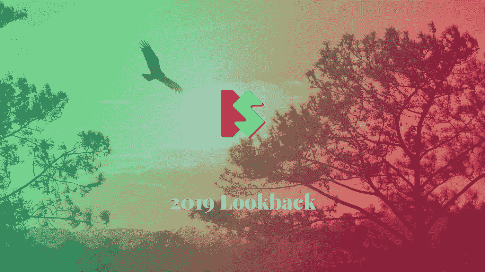

# 对 2019 年网络技术的思考

> 原文：<https://itnext.io/2019-lookback-b7cc67448b75?source=collection_archive---------3----------------------->

## 回望

## 关于网络技术的思考

去年我写了第一篇年度回顾，现在是 2019 年回顾的时候了。

*注意:本文是从技术角度写的，这意味着我写的是今年使用的技术和工具。*

# wordpress 软件

我仍然在做 WordPress 项目。WordPress 不会消失:它的用户是忠诚的，他们不会对如此广泛传播的系统失去信任。他们不应该这样做，因为它仍然很容易使用，而且大多数初学者和高级用户都很熟悉。最显著的优势之一是插件库。几乎所有你能想到的东西都有一个插件，用户真的很喜欢它。

WordPress 不是我最喜欢的系统。然而，我仍然有动力去寻找新的方法来优化和增强 WordPress 网站。当被赋予覆盖默认设置和行为的控制权时，人们可以获得显著的结果，比如从 PageSpeed Insights、Lighthouse 和 WebPageTest 评分工具中获得绿色分数。我有机会优化这样一个实例。我们已经达到了极限，甚至引入了[本地延迟加载](https://web.dev/native-lazy-loading/)，并将整个媒体库转移到 CDN 服务。分数直线上升。🚀

# 静态现场发电机(SSG)

另一方面，静态站点生成器非常快，很少有人关心它的性能。最大的挑战是配置无头 CMS 和构建系统。幸运的是，我们有像 [Netlify](https://netlify.com) 和 [Netlify CMS](https://www.netlifycms.org/) 这样的服务。当谈到 SSG 时，这两个服务是我经常去的地方。

Netlify 支持你能想到的任何东西，甚至更多，从连续部署到分割测试。我所有的客户(和我自己)都在他们的网站上使用 Netlify。我甚至写了一篇关于我最喜欢的网络功能的文章。

 [## 我最喜欢的网络功能🤘售货簿(Sales Book)

### 2019 年做 JAMstack 开发者，让我觉得自己活在仙境里。所有这些现代框架、工具…

www.silvestar.codes](https://www.silvestar.codes/articles/my-favorite-netlify-features/) 

我注意到了一种将网站转移到 SSG 的趋势。今年我接到的大多数询问都是关于盖茨比的。由于我无法生成生产就绪的 React 代码，所以我还没有机会与 Gatsby 一起工作。今年我主要使用 Jekyll、Hugo 和 Hexo。我非常有兴趣了解更多关于盖茨比和十一的事情，因为我无论在哪里都能听到关于它的好消息。

# 购物化

有时，我有机会与 Shopify 合作，这样的机会在今年出现了。我想利用这个机会大声疾呼 Shopify。我无法相信在 2019 年与 Shopify 合作有多难。我们仍然无法设置本地环境或访问后端代码。主题包还不够，我们至少需要 Git 支持。在这样的环境下工作令人沮丧，我开始理解为什么 Shopify 开发者的费率更高。

另一方面，用液体工作有它的优点。有大量的过滤器和标签可以满足大部分需求。但有时你必须非常熟练，并受到启发才能想出解决方案。然而，我发现它是除了本地商店功能之外唯一有用的东西。甚至插件也很复杂，有独立的仪表盘和陡峭的学习曲线。

# 样式参考线

风格指南对我来说是今年的头等大事。我参与的所有大型项目都是使用样式指南构建的，通常是在我的提议下。开发独立的组件有助于在健壮性和可维护性方面创建更好的产品。通过重用重复的部分，它还有助于理解模板和布局。我也给[写了一篇关于风格指南的文章](https://www.silvestar.codes/articles/5-things-to-consider-when-creating-your-css-style-guide/)。

 [## 创建 CSS 样式指南时需要考虑的 5 件事🤘售货簿(Sales Book)

### CSS 样式指南是一套关于如何使用和编写 CSS 代码的标准和规则。它通常包含全球品牌…

www.silvestar.codes](https://www.silvestar.codes/articles/5-things-to-consider-when-creating-your-css-style-guide/) 

但是 styleguide 最显著的优点是能够在一个地方看到所有的定义和组件。如果这是作为一个网站或网络应用程序托管的，那么它很容易从每一个设备访问。这意味着团队的每个成员都可以从一开始就被包括在测试或审查阶段。事实证明，这是我所有项目中最大的好处。

# 最佳化

虽然 SSG 本身很快，但我仍然试图优化和尽可能减少任何字节和毫秒。无论使用哪种系统，都有两个主要问题/限制:

*   可访问性和
*   第三方脚本。

可访问性仍然是一个大问题，因为客户要么没有意识到这一点，要么没有预算。这是一个复杂的话题，我不想太深入，因为我不是专家。我只是想引起注意:尝试添加必要的可访问性特性，比如跳转到内容的链接、输入标签和描述性链接。你真的不需要成为专家来正确地做这些事情。

> 请记住，每一个插件、每一个集成和每一个工具都是有代价的，尤其是当它加载额外的脚本和样式时。无论何时引入一种新工具，你至少可以让你的客户了解潜在的成本。

第二个问题是第三方脚本。这些是最糟糕的。我优化了一个网站，但是结果很糟糕。然后我做了一个简单的测试——我禁用了所有第三方脚本，然后我重新运行测试，结果非常好。如果有第三方脚本，在大多数情况下，我们会受到束缚。我注意到 Lighthouse 引入了新的术语，比如“第一次内容丰富的绘画”、“速度指数”和“互动时间”。这些新指标几乎总是受到第三方脚本的影响，web 开发人员无法影响代码做什么、如何工作以及为什么。这很令人沮丧。

这里有一个建议:记住每一个插件，每一个集成和每一个工具都是有代价的，尤其是当它加载额外的脚本和样式的时候。无论何时引入一种新工具，你至少可以让你的客户了解潜在的成本。

# 辅助项目

尽管这是迄今为止最忙的一年，我还是有时间做我的副业。有时协调我的时间很有挑战性，但我发现兼职项目非常有用。这是一个提高我的技能和测试新技术的地方。

[SPRO(或启动项目 CLI)](https://starter.silvestar.codes/) 是我为每个项目创造吞咽环境的辅助项目。这是一个软件包，它根据问卷调查的答案为您的项目生成安装命令和吞咽任务。首先，系统会提示您一些必须回答的问题。SPRO 为你做一切:从最小化，丑化，林挺和优化你的 HTML，CSS，JS，图形和字体文件，等等。从 WordPress 和 Hugo 到 Shopify 和 Jekyll，我几乎所有的项目都在使用 SPRO。在这个项目中，我学到了很多关于创建命令行界面程序的知识。

[Starter Project](https://starter.silvestar.codes/starter-project/) 是预定义的基于 Gulp 的包，你可以用它作为你新项目的起点。我对它做了很大的改进，使它可以被用作静态站点生成器。它有其局限性，比如构建速度。尽管如此，我发现它在我需要快速建立一个新项目的情况下非常有用。这个项目让我了解最新的吞咽技术。今年我换成了大口 4。

[每日代码行](https://cld.silvestar.codes/)是我每天引入一行新代码的附带项目。它主要涵盖了 HTML、CSS、JS 和 PHP 一行程序。令我非常惊讶的是，它是今年早些时候在产品搜索上推出的。我最近把它[变成了一个进步的网络应用](https://www.silvestar.codes/articles/how-i-built-my-second-progressive-web-app-pwa/)，它也变成了[一个 Chrome 扩展](https://chrome.google.com/webstore/detail/code-line-daily/jfgojeolhopchbgfdgodicnaimmkbpbg)。在开发这个项目时，我学会了如何构建 PWA 和 Chrome 扩展。它在 Starter 项目上运行。

 [## 我如何构建我的第二个渐进式网络应用程序(PWA)

### 工具箱使创建 PWA 变得容易

itnext.io](/how-i-built-my-second-progressive-web-app-pwa-3508c26d8e77) 

最后，今年最具挑战性的兼职项目是导师项目。帮助一个从事非 IT 工作的人成为开发人员是很难的。在过去的几个月里，我与我的学员密切合作，我非常自豪地说，到目前为止一切都进展顺利。我不仅教他如何更好地编码，还教他如何使用所有现代工具。我相信每个专业人员至少应该了解项目管理工具和版本控制系统的基础知识。由于他正在掌握一些高级的东西，如 BEM 和 Sass，我坚信他很快就能开始找工作。

# 博客

像去年一样，我想和你分享一些数据。但是首先我要宣布一件大事:我整整一年都没有重新设计我的网站！我终于对事情的发展感到满意了。

今年我写了 18 篇帖子，其中一些作为客座博文发表在以下网站上:

我仍然会在 [dev.to](https://dev.to/starbist) 、[medium.com](https://medium.com/@malimirkeccita)、 [codementor.io](https://www.codementor.io/malimirkeccita) 和社交平台上分享每一个帖子。除了 Twitter，我在几乎所有平台上的粉丝数量都翻了一番。这就像有人在我的账户上设置了 740 个关注者的限制。🧙‍♂️

所有平台的流量都有显著提高，但我的网站没有这么大。我想我应该在推广上投入更多的时间和资源。总的来说，我对事情的进展很满意。

# 结论

我可以很容易地说，2019 年对我来说是很棒的一年。希望下一部会更好。

让我们把网络变成一个更好的地方！2⃣0⃣2⃣0⃣

*最初发布于*[*https://www . silvestar . codes*](https://www.silvestar.codes/articles/2019-lookback/)*。*