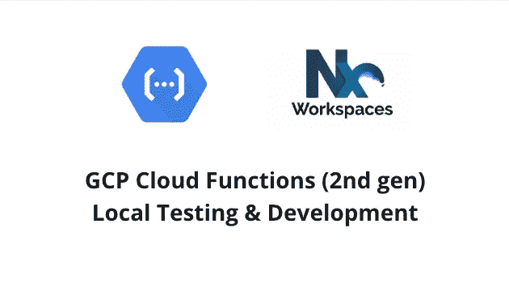
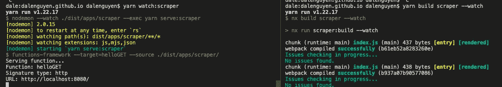
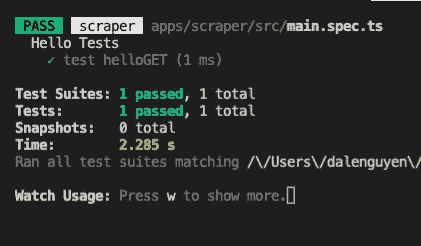

# 第二代云功能本地测试和开发

> 原文：<https://itnext.io/2nd-gen-cloud-functions-local-testing-development-7c518f7bd0b1?source=collection_archive---------0----------------------->



Nx WorkSpace + GCP 云功能(第二代)

> 注意:第二代包含在谷歌云服务条款的[预发布条款](https://cloud.google.com/terms/service-terms#1)中。请避免在产品中使用它，直到它完全发布。

[快速浏览:部署第二代 GCP 云函数与 Nx Workspace](/deploy-2nd-gen-gcp-cloud-functions-with-nx-workspace-5d75fcf21566)[**云函数本地测试&开发**](https://dalenguyen.medium.com/2nd-gen-cloud-functions-local-testing-development-7c518f7bd0b1)[创建 REST APIs 与 Express &第二代 GCP 云函数](https://dalenguyen.medium.com/create-rest-apis-with-express-2nd-gen-gcp-cloud-functions-d244dd9a4717)
[完美匹配:NestJs &云函数(第二代)&Nx Workspace](https://dalenguyen.medium.com/a-perfect-match-nestjs-cloud-functions-2nd-gen-nx-workspace-f13fb044e9a4)
[GCP 云函数(第二代)发布/订阅](https://dalenguyen.medium.com/gcp-cloud-functions-gen-2nd-pub-sub-development-testing-2c498fa4464e)

在之前的[快速浏览](https://medium.com/p/5d75fcf21566)中，我向您介绍了如何使用 Nx WorkSpace 创建&部署第二代云功能。在本文中，我将发现如何进行本地开发&测试第二代云功能。请注意，这只是我在 Nx WorkSpace 中如何做的实验。

在[官方文档](https://github.com/GoogleCloudPlatform/functions-framework-nodejs#configure-the-functions-framework)中，我们有一个本地提供云功能的脚本。

```
"scripts": {
    "start": "functions-framework --target=helloWorld"
 }
```

它将在端口 8080 上查找`index.js`文件&服务本地函数。它在 TypeScript 项目中不能很好地工作。让我们对脚本进行一些修改，以便在 Nx WorkSpace 中支持第二代云函数的本地开发。

这是一个简单的入门功能。

```
// main.tsimport { http } from '[@google](http://twitter.com/google)-cloud/functions-framework'
import 'tslib' // needed until importHelpers is set to falsehttp('helloGET', (req, res) => {
  res.send(`Hello ${req.query.name || req.body.name || 'World'}!`)
})
```

**观看&本地提供云功能**

我们的目标是在本地提供云功能&每次更新文件时都要注意变化。

我将使用 [nodemon](https://www.npmjs.com/package/nodemon) 来监控更改&重新运行脚本。

```
yarn add -D nodemon
```

然后，我将向 package.json 添加一些自定义脚本

```
"watch:scraper": "nodemon --watch ./dist/apps/scraper --exec yarn serve:scraper","serve:scraper": "functions-framework --target=helloGET --source ./dist/apps/scraper/",
```

这个脚本的作用是观察`./dist/apps/scraper`文件夹下的变化，然后执行`yarn serve:scraper`命令。

然后，当您在另一个终端中使用 Nx 命令查看构建时

```
yarn build scraper --watch
```

现在您有了一个可以观察文件变化的环境&动态地服务它们。



在这个阶段，您要么使用 Postman，要么在浏览器上测试 HTTP 功能，而不需要每次做一些更改时都重新运行脚本。

额外收获:如果你更新了你的`serve`目标，那么在调试你的代码时，你会有一个更好的命令。之后，您可以运行`npx run sraper serve`，而不是向 package.json 添加定制命令。

```
// project.json"serve": {
    "executor": "[@nrwl/workspace](http://twitter.com/nrwl/workspace):run-commands",
    "options": {
      "buildTarget": "scraper:build",
      "commands": [
        {
          "command": "nodemon --watch ./dist/apps/scraper --exec functions-framework --target=helloGET --source ./dist/apps/scraper/"
        }
      ]
    }
 },
```

**利用单元测试**

本地开发和测试的另一种方法是利用单元测试。Nx 为使用 Jest 进行测试提供了一个非常好的结构。

```
// main.spec.tsimport { getFunction } from '[@google](http://twitter.com/google)-cloud/functions-framework/build/src/testing'describe('Hello Tests', () => {
  beforeAll(async () => {
    // load the module and get the function
    await import('./main')
  })it('test helloGET', () => {
    // call the function
    const helloGET = getFunction('helloGET') const req = {
      query: {
        name: 'Dale',
      },
    } as any let result
    const res = {
      send: (x) => {
        result = x
      },
    } as any // invoke the function
    helloGET(req, res, () => {}) // check the response
    expect(result).toEqual('Hello Dale!')
  })
})
```

如果你在测试脚本的末尾添加`--watch`。每次更新代码时，测试都会重新运行。

