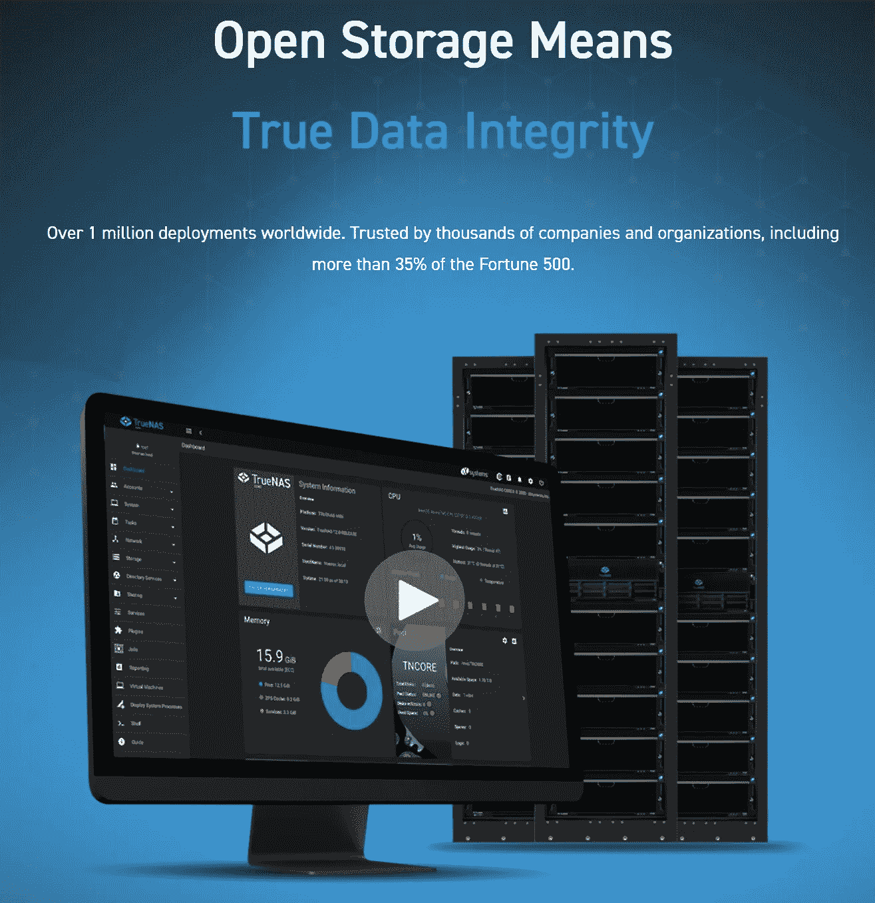
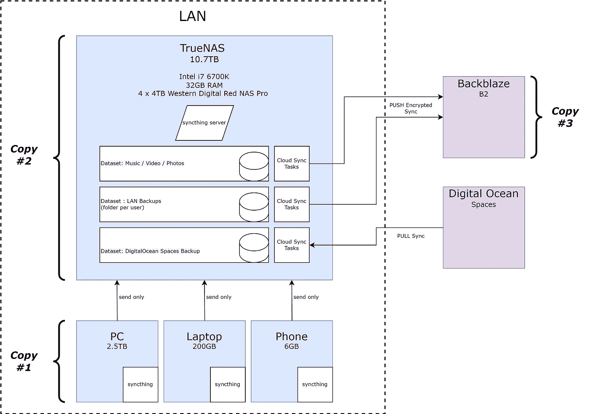

# 3..2..1 个备份！

> 原文：<https://itnext.io/3-2-1-backups-f62305159bdb?source=collection_archive---------2----------------------->

过去的两年改变了我的生活。跨越地球，学习一门新的语言，搬到一个新的城市，买一栋房子！就像水管工的老话一样，管道总是会漏水，作为一名技术专业人员，在这段繁忙的时间里，我会把某些重要的事情放在优先列表的底部。其中之一是备份。幸运的是，没有灾难性的事情发生，但它很容易就可能…

我不会详细解释为什么备份很重要，你可以相信我的话——但是备份应该采取什么形式呢？您如何确保您的备份是可恢复的？如何确保在丢失一个(或两个)磁盘的情况下仍能找回数据？

在过去的几周里，我总结了我在正确的备份解决方案方面的知识(我希望如此……)。虽然有许多选项可供选择，但许多 homelab 设置对大多数人来说都太复杂了，即使他们有设置它的技能。对我来说，家庭网络应该易于维护，同时还能为专业技术人员提供实验能力。与互联网上的许多内容相反，这可以在地下室没有服务器机房的情况下以相当低的预算实现。

# 3–2–1 策略

为了更好地将我提出的解决方案放在上下文中，有一个非常简单的备份策略，是大多数用户推荐的备份解决方案。当然，我稍后还会提出一些警告。

简单来说——3–2–1 原则规定，您应该维护数据的 **3 份副本**，其中 **2 份副本必须存储在不同的位置和/或两种不同的存储设备上，**最后**其中一个位置应该在异地。**

让我们深入了解这意味着什么。

*   拷贝#1 —数据的第一个拷贝是主拷贝。这是您通常保存数据的位置，例如在您的 PC 或笔记本电脑上，或者在连接到您的计算机的外部驱动器上。
*   拷贝#2 —第二个拷贝通常被称为“备份”。对大多数人来说，将所有文件复制到另一个位置被认为是备份。该位置可以是另一个外部硬盘驱动器、网络连接的共享文件夹或一些云服务，如 DropBox 或 OneDrive(请参见下面关于云服务的说明)。这种策略的第二个定位方面通常更难实现。如果你没有自己的生意或者有亲戚可以放一个备份设备，这个选择会很昂贵。稍后将详细介绍。
*   第三份——这份备份对于大多数人来说都是缺失的。人们通常认为 OneDrive 和 DropBox 等服务是很好的备份解决方案。虽然它们可以补充您的备份策略，并且肯定比没有备份要好，但是它们不应该被视为“副本#2”(除非您的备份需求很小，请参见下一节)。至少在我的情况下，我完全否定了云同步服务，并且不认为它们是我的备份解决方案的一部分。

# 备份存储要求

让我们考虑一下两种用户。将照片和纳税申报表保存在电脑上的家庭用户(200GB)和每周生成 100GB 视频的 YouTuber 用户(15TB)。很明显，这两个用户有着非常不同的备份需求，最明显的是存储设备的长期成本，以及需要两倍或三倍主磁盘空间的备份的性质。

同样，你会在网上看到很多标题为*“如何构建 200TB 阵列”的视频。虽然看起来很有趣，但这对大多数凡人来说是不可能的。因此，这就是一个实用的、定制的备份解决方案的用武之地，它不需要倾家荡产。以下是我的一些指导原则:*

*   < 250GB — For backups of this size, the primary device in your laptop or desktop is likely large enough to contain all your files. Moreover, a nice-to-have like OneDrive can provide a further level of assurance. For these users, a full-on NAS solution is probably not worth the cost and effort involved. A portable drive plugged into your computer in addition to OneDrive should be sufficient alongside a Windows backup job. A flash drive can also be used in addition to the portable drive, see the <500GB option for more details.
*   < 500GB — The primary drive on most consumer laptops that are older than a few years will not be able to physically hold all these files. A solution here would be to backup to an attached portable drive and or encrypted flashdrive with a simple Windows backup job while using your cloud storage as in the <250GB option. For safety, rotating out two devices will not only give you some security from having both drives fail at once but also the safety of having an older copy in case something goes wrong. A flash drive that’s encrypted is easy to hang on a keychain, thus providing partial off-site backups too. If it gets lost, a malicious actor won’t be able to get at the data since it’s encrypted.
*   500GB -1000GB — At this point, trying to sync portable drives and flash drives becomes cumbersome. Cloud storage limits on many services in the free tiers stop at around 500GB. If you have a Microsoft account, OneDrive can be a great help as its free tier is up to 1TB. *(注:我不会考虑所有可能的云存储方案，参考我有经验的方案)。*
*   1TB 以上—此时，值得考虑一个独立的备份系统，它可以自动执行上面列出的所有备份任务。这篇文章的其余部分致力于解开这个选项，因为这是我实现的。

# 备份解决方案考虑事项

鉴于上述原则，我开始研究如何建立备份解决方案的所有排列。我是购买现成的产品还是构建自己的解决方案？如果我自己构建，我运行什么操作系统？应该用什么软件？以下是我考虑的选择:

## 购买与构建:

事后看来，我觉得那个选择对我来说很容易。我有一个功能强大的桌面，我不再使用它，它可以完美地作为一个存储设备。我也理解，对许多人来说，这不是一个容易的决定。我认为有两个主要选择:

1.  **现成的消费者 NAS 设备**，如 [Synology](https://www.synology.com/en-global) 或 [QNAP](https://www.qnap.com/nl-nl) 设备。这些解决方案是即插即用的，但是它们确实会将您锁定在特定的操作系统中，并且您会受到这些设备的限制。它们通常只有很少的系统内存，不容易升级，但确实比一些自建选项成本更低，占地面积小，能耗低。对于大多数人来说，这是正确的答案。有用！更重要的是，有大量的在线资料可以帮助你快速入门。
2.  **基于消费者(或服务器，如果您喜欢)部件的定制 NAS 设备**。这里的好处当然是它是根据您的规格构建的，或者是重用现有组件的好方法。由于它是定制的，因此易于升级，并且比选项 1 中的消费类设备提供更高的性能。

就我而言，我选择了选项 2。

## NAS 操作系统:

由于我选择了定制选项，我决定选择一个名为 [TrueNAS](https://www.truenas.com/) 的 NAS 专用操作系统。TrueNAS(以前的 FreeNAS)基于 FreeBSD，是一个久经考验的 NAS 操作系统，在幕后运行 ZFS 文件系统。当然，如果您购买的是消费级 NAS 解决方案，您就只能使用制造商提供的操作系统。

TrueNAS 充满了我仍在探索的强大功能，但最基本的功能很容易在一个小时内上手。FreeNAS 使用的文件系统 ZFS 是“防炸弹”的，是有史以来最可靠的文件系统之一。虽然我不会深入研究 ZFS 的细节，但可以说它为所有磁盘创建了一个 RAID 阵列，称为池。因此，该池是一个很大的聚合存储区块，根据您在创建池时选择的 ZFS 池选项，它可能会遭受磁盘损失。在 *raidz1* 中，一个驱动器用于所谓的奇偶校验，而在 *raidz2* 中，使用两个驱动器。这实际上意味着在 *raidz1* 中，一个驱动器故障可以恢复，而在 *raidz2* 中，这增加到两个驱动器。

TrueNAS 还能够运行虚拟机，因此也可以充当虚拟机管理程序。这是我将在不久的将来使用的功能，但超出了本文的范围。

对于感兴趣的人，我购买了一套新的磁盘，因为我的旧磁盘已经使用了 10 多年，这让我没有信心在如此旧的硬件上运行 NAS 24/7。该系统由以下部件组成:

*   华硕 Z170-A 主板
*   i7–6700k CPU
*   4x8GB 内存，总共 32GB 内存。
    ZFS 可能需要大量内存，因此最好拥有一台不受内存限制的机器。
*   引导驱动器— 128GB M2 驱动器。
    虽然支持在闪存驱动器上运行，但如今 SSD 并不比 USB3.0 闪存驱动器贵多少，也不容易出现故障。
*   4 x 4TB Western Digital Red Pro NAS 驱动器—荷兰亚马逊的€397。
*   功耗:48W 闲置。

***免责声明:本帖并非由 TrueNAS*** 赞助

## 备份软件

对于备份软件，由于其灵活性，我选择了 [syncthing](https://syncthing.net/) 。Sycnthing 是一个有效的 P2P 文件同步工具，很像 OneDrive，但有很多额外的功能，非常适合本地局域网设置。我在所有需要备份的台式机、笔记本电脑(和手机——非常酷)上使用它。我之前提到过，像 OneDrive 这样的文件同步工具不应该被视为真正的备份，那么我怎么可能使用文件同步工具来备份我的文件呢？

答案就在特鲁纳斯。ZFS 支持快照，而在 TrueNAS 中，对可配置 ZFS 快照的内置支持意味着，即使 PC 受到恶意软件的攻击，我的所有文件都被加密并同步到 TrueNAS，我也可以将 TrueNAS 上的加密文件回滚到以前的 ZFS 快照。这让我放心，我的数据是安全的，可以恢复。可以配置快照的频率和保留期，因此您可以决定要将每个快照保留多长时间。

# 把所有的放在一起

鉴于上述所有信息，下面来看看我的备份解决方案的一些更详细的信息。

自下而上，我们有生成备份并通过本地 syncthing 实例将这些备份发送到在 TrueNAS 上作为包运行的 syncthing 实例的网络设备。Syncthing 由 TrueNAS 提供，运行在 FreeBSD 监狱中，增加了非虚拟化性能。需要注意的是，设备只发送数据。换句话说，如果数据在 TrueNAS 上被更改，它不会同步回设备——这是一个重要的数据安全设置。如果您不小心删除了同步目录中的文件夹，您可能不会注意到，直到为时已晚。

将图表上移至 TrueNAS 实例，可以看到许多数据集。对于属于网络上特定用户的设备，每个用户的备份都被发送到 TrueNAS 上特定于用户的数据集。这在家庭网络上适用于有限数量的用户，但是当然，在大型企业环境中，您不会这样设置。ZFS 快照通过 TrueNAS 内置快照功能在这些备份卷上启用。最后，该数据集上的文件子集被发送到 Backblaze，以便使用 TrueNAS 内置的 Backblaze 云同步功能进行异地备份。在复制开始之前，所有发送到 Backblaze 的文件首先会被动态加密。需要注意的是，并非所有文件都发送到 Backblaze。容易从公共互联网上重新获得的文件不需要产生异地备份的成本，尤其是在处理多 TB 数据集时。

截至本文撰写之时，在 Backblaze 中存储 1TB 的数据每月将花费您大约 5 美元(此后每 TB 将花费 5 美元的倍数)，但需要注意的是，下载数据的成本要高得多，因此只应在发生灾难时使用。

由于视频、照片和音乐不托管在网络中的任何设备上，因此不可替代的文件也会被复制到 Backblaze 进行异地备份。

最后，我在 DigitalOcean 上为那些不能(或不应该)在家里托管的东西托管了许多服务。我所有的网站都备份到数字海洋空间——一个 S3 兼容的服务——因此也需要备份。为了满足 3–2–1 原则，我利用 TrueNAS 内置 S3 集成的云同步功能，将这些文件复制回我自己的家庭 NAS。

# 结论

我的备份解决方案仍在发展中，我仍在探索 TrueNAS 的功能，但到目前为止，我对其设置的性能和易用性非常满意。在将数据复制到 TrueNAS 时，我家里的千兆网络 100%饱和，磁盘以差不多一致的 100mb/s(网络连接的容量)写入。根据您需要传输的文件大小和数量，您的里程可能会有所不同。

如果你想知道更多关于我的设置，请叫我一声。