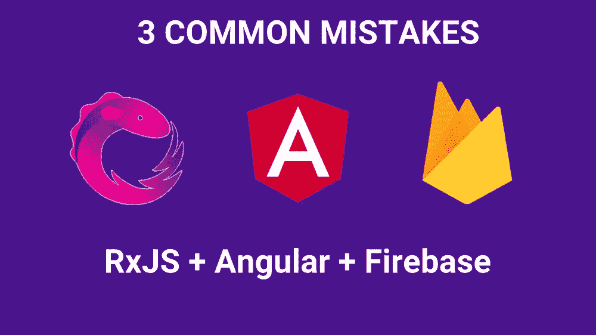

# 使用 Angular + NGRX + FIREBASE 时的 3 个常见错误

> 原文：<https://itnext.io/3-common-mistakes-when-using-angular-ngrx-firebase-9de4e241d866?source=collection_archive---------2----------------------->



在本文中，我将展示一些技术，我们可以使用这些技术来提高 Angular + NGRX + FIREBASE 的性能。

NgRx 对于中等复杂程度的应用程序来说是一个很好的解决方案。Redux 模式结合 RxJs 的强大功能确实适合 Angular 生态系统，添加 Firebase 实时数据库或 Firestore 将使您的应用程序真正快速和反应灵敏。Angular 大量使用 Observables，NgRx 也是用 Observables 和 AngularFire2(也改为@angular/fire)构建的，所以我们可以用我们的数据和状态做很多复杂的事情。然而，对于初学者来说，可观测量并不容易学习，许多人避免使用 NgRx，因为它是样板文件，即使是使用它们的人，他们也会犯错误，导致性能问题和内存问题。

## 错误 1。不退订(一般情况下)

有两种类型可观察值，第一种发出值并完成，第二种发出值并不自动完成。对于大多数发出一个值并完成的观察值，我将调用`finite`，对于一直发出值直到我们手动告诉它们停止的观察值，我将调用`infinite`。当我们订阅一个可观察对象时，我们必须取消订阅，否则会导致内存泄漏和应用程序中的意外行为。

正如我提到的，Angular 大量使用 RxJs 和 observables。其中一个例子是`HttpClient` 提供的 Angular。我们使用 HttpClient 向服务器发出请求，并且可以观察到响应。但是 HttpClient 返回的可观察对象是`finite`，所以我们一般不会，但是可以手动退订。

> 有限的 observables 发出值并自动完成，所以如果您不取消订阅 Http 请求，就不会有问题。

另一件事是无限可观。当我们订阅无限可观测量时，我们必须在某个时候取消订阅。如果我们忘记了，这将导致内存泄漏和我们的应用程序中的意外行为，因为无限可观测量不会自动完成。Angular 中有许多无限的可观察性(路线事件、形态变化)，如果我们不退订，就会有问题。当使用 NgRx 和 Firebase 时，我们会遇到更多的问题。【NgRx 提供的一切实际上都是无限的可观测量，大多数 firebase 查询方法也返回无限的可观测量。在这种情况下，你需要小心，取消订阅。

> 在使用 NgRx(从 store 中选择 state)或 Firebase 时，总是要考虑何时取消订阅

## 错误 2。通过 Firebase 的效果获取数据时，使用平面图(合并图)而不是切换图

当我们使用 NgRx 时，我们应该使用这个状态管理系统提供的所有强大功能。其中一个是`Effects`，用于处理异步操作。例如，如果我们想要将数据加载到我们的组件中，我们将分派一个动作，该动作将在`Effects`中处理。Effect 将获取数据并分派新的动作来更新状态。

考虑以下影响。

```
@Effect()
 loadPosts$ = this.actions$.pipe(
   ofType(LOAD_POSTS),
   pluck(‘payload’),
   flatMap(uid =>
     this.db.getAllPosts(uid).pipe(
     tap(() => console.log(‘Data loaded’))
    ),
   map(posts => new LoadPostsSuccess({ entries: posts }))
   )
  )
 );
```

我们监听`LOAD_POSTS`动作，当发生这种情况时，我们获取用户的 uid 并从 firebase(它给出了`infinite observable`)获取数据。现在考虑以下场景。我们在一个组件 **A** 中，这个动作在`ngOnInit()`中被调度，然后我们导航到另一个组件 **B** ，然后返回到 **A** (再次被调度)，然后是 B，如此反复几次。现在，当我们的数据库发生变化时，因为我们订阅了这些变化，所以我们会看到`LoadPostsSuccess`动作被分派了许多次(取决于我们返回组件 **A** 的次数)。原因是因为我们使用了 ***flatMap*** 运算符。每次我们打开页面 **A** (组件被初始化)，效果就会起作用，并添加另一个对 db 变更的订阅。解决这个问题最简单的方法就是使用 ***switchMap。*** 如果有以前的订阅，该操作符将取消订阅，因此当我们导航到另一个页面并返回时，我们将只有一个活动订阅。

> 如果你想了解更多关于像 flatMap 或 switchMap 这样的操作符，请阅读[这篇文章](https://blog.angular-university.io/rxjs-higher-order-mapping/)。

## 错误 3。不退订 Firebase 的效果

尽管在上面的例子中，我展示了如何在使用 switchMap 时避免多次执行代码，但仍然存在一个问题。因为 firebase 查询方法提供了无限的可观察性，即使当我们导航到另一个页面时，我们仍然在监听数据库的变化。考虑上面带有 switchMap()的示例。我们在组件 **A** 中，动作`LOAD_POSTS` 被分派。在获得数据后`LoadPostsSuccess` 动作被分派。现在我们导航到组件 **B** 。我们操纵数据库中的数据，因为我们仍然订阅这些更改，我们将再次看到`LoadPostsSuccess` 动作被调度。当我们导航到组件 **A** 时，我们将会看到`LOAD_POSTS` ，然后`LoadPostsSuccess` 被分派。所以你可能会问问题出在哪里？问题是，在这种特殊情况下，当我们不在组件 **A** 中时，我们不需要继续监听来自数据库的`LOAD_POSTS` ，因为无论如何，当我们导航到组件 **A** 时，这个动作(`LOAD_POSTS`)将再次被调度。

这不是一个大问题，但是当您不在负责从 firebase 呈现数据的组件中时，您可能希望取消订阅 firebase stream。您可能会执行数据转换，甚至更复杂的操作。没有必要一直监听那个流，因为模板中不会显示任何内容。

我们可以使用`take(1)`仅从 firebase 获取第一个发出的值并取消订阅，但是在这种情况下，我们不会对 firebase 进行实时更改。如果我们在组件 **A** 中，我们实际需要的是来自 firebase 的实时更改，而当我们不再在组件 **A** 中时，我们可以取消订阅。没有这样做的标准机制，我们可以使用许多技术。我发现最简单的方法是使用带有主题的服务。

> 主体是一种特殊的混合体，可以同时充当被观察者和观察者。

服务很简单。(subscription.service.ts)

```
@Injectable({
 providedIn: ‘root’
})
export class SubscriptionService {
 public unsubscribeComponent$ = new Subject<void>();
 public unsubscribe$ = this.unsubscribeComponent$.asObservable();
}
```

我们有两个公共领域。`unsubscribeComponent$`应该用在组件中的和 `unsubscribe$`应该用在效果中的。

修改效果文件，将此服务包含在构造函数中，并添加`takeUntil(this.subService.unsubscribe$)`以在离开组件时取消订阅。

```
**constructor( private subService: SubscriptionService)**
@Effect()
 loadPosts$ = this.actions$.pipe(
   ofType(LOAD_POSTS),
   pluck(‘payload’),
   **switchMap**(uid =>
     this.db.getAllPosts(uid).pipe(
       **takeUntil(this.subService.unsubscribe$)**
    ),
   map(posts => new LoadPostsSuccess({ entries: posts }))
   )
  )
 );
```

现在，在我们调度这个动作的组件中，我们需要注入这个服务，并在`ngOnDestroy()` 方法中调用`unsubscribeComponent$`主体的`next()`方法。

```
**//A.component.ts****constructor( private subService: SubscriptionService)**ngOnDestroy(): void {
  this.subService.unsubscribeComponent$.next();
}
```

现在，当我们在组件 **A** 中时，我们会看到来自 firebase 的所有实时更改，但当我们导航离开时，我们将不会再听到这些更改，当我们再次激活组件 **A** 时，动作将被分派，我们将再次看到实时更改。

感谢阅读全文。你可以用 Angular+ RxJs + Firebase 做更多更酷的事情，这将在下一篇文章中介绍。