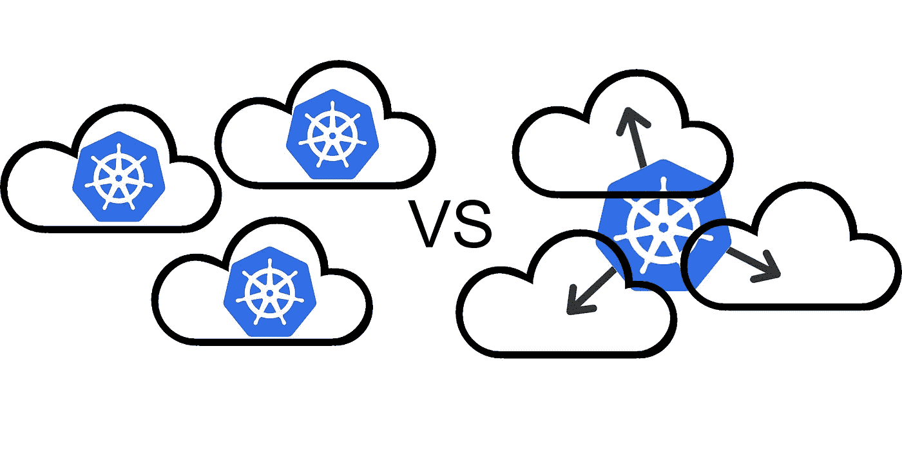

# 选择宽集群而非 Kubernetes 多集群的 3 个理由

> 原文：<https://itnext.io/3-reasons-to-choose-a-wide-cluster-over-multi-cluster-with-kubernetes-c923fecf4644?source=collection_archive---------0----------------------->

多集群与宽集群

在今年的 KubeCon 上，热门话题都是关于分布式 Kubernetes: Edge、混合云和多云。

对于这些主题中的每一个，都有无数的解决方案: *KubeEdge、OpenShift Edge、Akri、Baetyl、Kubermatic、Lens、Rancher、KubeFed、KubeSphere、Red Hat ACM、Liqo、Skupper、Linkerd、Fleet……*

…这个清单还在继续，继续，继续…你明白了。

一件没有真正讨论过的事？您可以跨不同位置的服务器运行单个 Kubernetes 集群。您可以完全跳过所有新工具，像平常一样运行集群，但扩展到新环境。听起来很简单，对吧？

这被称为“宽集群”或“扩展集群”，是逐渐流行的“多集群”模型的替代方案。在讨论为什么您可能希望实现宽集群而不是多集群架构之前，让我们讨论一些常见的问题和缺点。

## **潜伏期**

etcd(Kubernetes 的“大脑”)是延迟不容忍的，所以如果你的控制平面节点相距太远，一个宽集群就不能工作。您通常也不希望在工作节点之间引入延迟，因为应用程序性能是一个问题。

但是，这两个问题都可以通过以下方式在大型集群中解决:

*   协同定位 Etcd 节点，或者使用非 Ectd 替代方案(dqlite，有人知道吗？)
*   将节点标签应用于位置并将节点选择器用于应用程序

遵循这两个步骤，您就不需要担心跨云集群中的延迟。

## **安全**

如果您在云之间运行单个 k8s 集群，这可能意味着在公共网络上运行节点间流量，这可能很可怕。这也是一个挑战，因为您需要通过单个专用子网在所有节点之间提供直接连接。

这里的解决方案是在您的扩展集群下使用网状 VPN(不，不是服务网状)。VPN 将加密您的所有流量，并提供一个灵活的子网，您的所有节点可以直接和安全地通信。其实真的很酷。通常，由于子网的原因，您的节点被限制在非常特定的数据中心位置。有了网状 VPN，子网可以存在于任何地方。

除了节点间的流量安全之外，您可能还需要特别考虑访问控制。有多种方法可以从单个集群管理多租户访问，但是您可能更愿意使用多个集群来管理跨组的访问。没关系，我不会评判你。

## **云成本**

您可能需要避免运行宽集群的首要原因是云成本。某些大型云提供商会向你收取高额的数据出口费。如果您在这样的云和您的数据中心之间运行工作节点，您将为此付费。尽管如此，正如我们将在下面讨论的，不管怎样，您可能最终会通过一个宽集群节省资金。

## **云支持**

大多数云托管的 k8s 选项不容易扩展到其他位置，这是有道理的，因为云提供商有充分的动机让你留在他们的云中。如果你被困在运行某些发行版，你可能只是被困住了。很抱歉这个我帮不了你，但是自我管理的 Kubernetes 得一分。

# 那么为什么要运行一个宽集群呢？

我们已经讨论了上面的问题，其中一些有简单的答案，而另一些比较难。综上所述，以下是您可能仍然想考虑运行一个宽 Kubernetes 集群作为多集群架构的替代方案的一些原因。

## 原因 1:没有复杂的工具

正如在开始时所讨论的，有许多工具可以使用 Kubernetes 来运行和管理多集群、混合云和边缘计算。

这些工具和平台中有很大一部分需要全新的应用部署和操作框架，必须在您的所有集群中采用。

那是很多学问。这也让你高度依赖单一工具。他们的解决方案可能还需要依赖单一的 k8s 发行版或云提供商。

或者，使用单一的多云集群方法，您可以像使用标准集群一样运行您的操作。没有新工具，大大简化了操作。

## 原因 2:没有额外的开销

如果您正在运行大型、复杂的集群，那么您可能在所有集群中都有许多冗余组件。可能需要在每个集群中复制存储、网络、指标、日志、映像注册表、管道等。这些开销加起来。

此外，每个群集需要自己的控制平面，假设它们都是高可用性的，则每个群集有 3 个以上的额外节点。一些解决方案甚至需要整个额外的集群来管理操作！计算机变得昂贵。管理这么多基础设施也很昂贵。

与之相比，在一个单一的宽集群中，有一个控制平面和一组服务来支持不同集群中的节点。您可以根据特定环境的需要添加特殊的工具，但您不需要*提供*，这是一个关键的区别。

这就是为什么即使您因为特定云上的出口数据费用而对这种方法犹豫不决，您可能仍然希望权衡这些成本与运行多集群基础架构的成本。

## 原因 3:终极灵活性

几乎不可能描述网状 VPN(像 [Netmaker](https://github.com/gravitl/netmaker) )上的集群变得有多灵活。你给了它一个可扩展的网络基础，让它可以在新的环境中成长。

一个普通的集群总是占据数据中心的一个子网。当然，您可以在上面放置一些工具，让它执行一些奇特的操作，但是集群本身基本上受限于数据中心中的那个位置。

另一方面，建立在网状 VPN 上的 k8s 集群可以*增长。* 它可以扩展到新的地点。它的节点可以生活在任何他们需要的地方。你可以通过云计算找到新的提供商。您可以将节点弹出到边上。集群可以从一个地方转移到另一个地方。底层基础设施变得非常具有可塑性。

这就是为什么，即使你只是在一个云上运行一个集群，你可能还是想把它部署在一个网状 VPN *上，以防*发生变化。

## 包扎

我希望您喜欢这篇关于网状 VPN 上的宽集群与标准多集群方法的优缺点的简短讨论。当然还有许多其他的考虑，但这应该作为一个快速入门。祝你的 k8s 之旅和下一次部署好运。下次见。