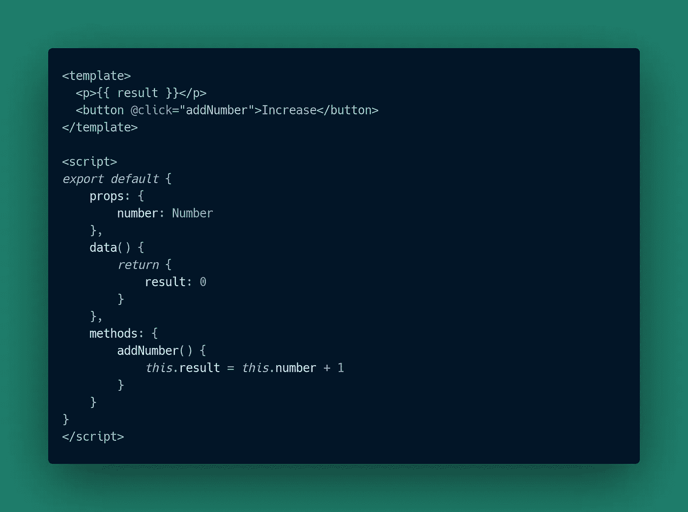
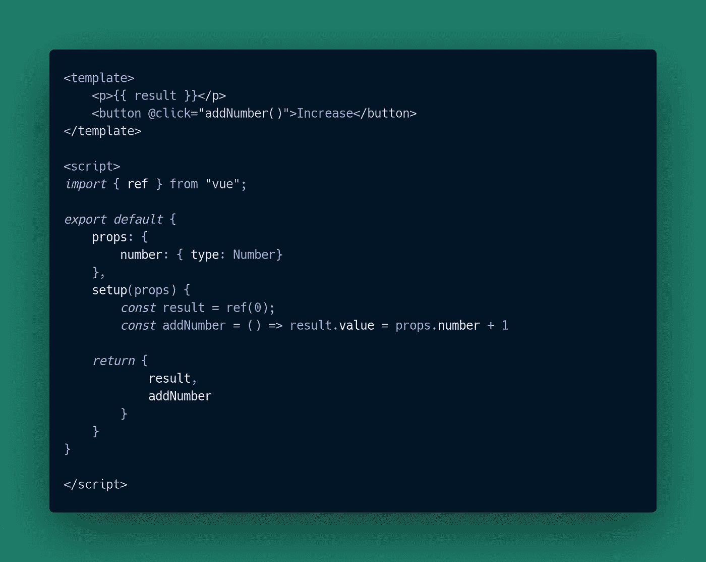
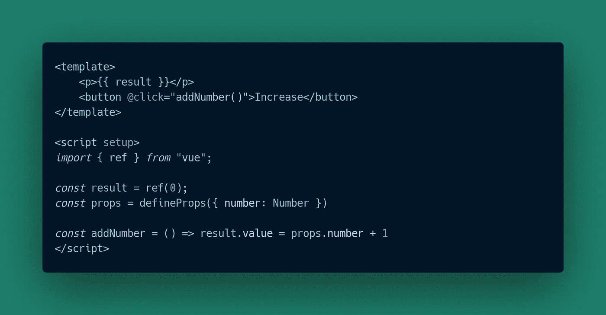
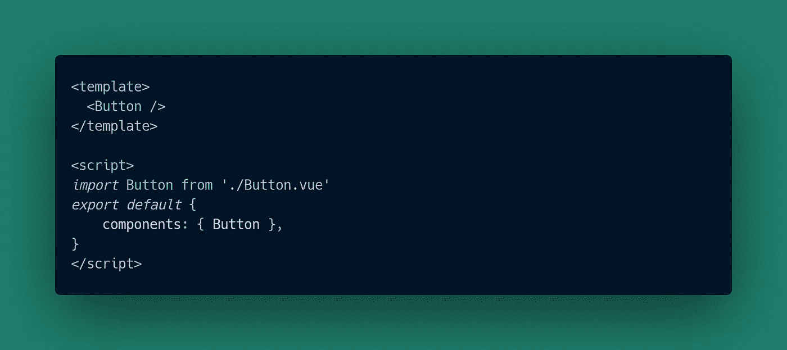
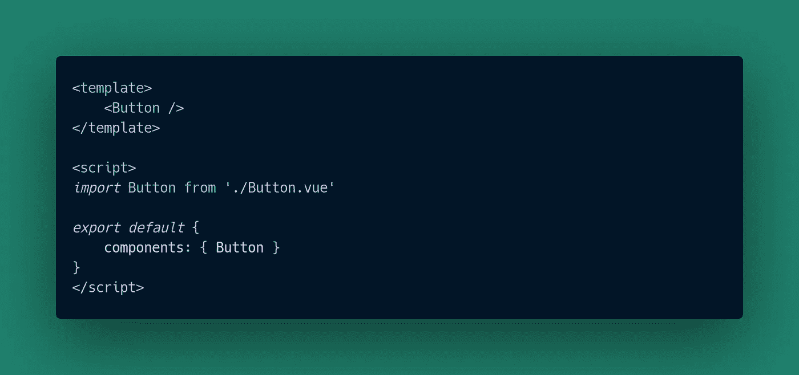
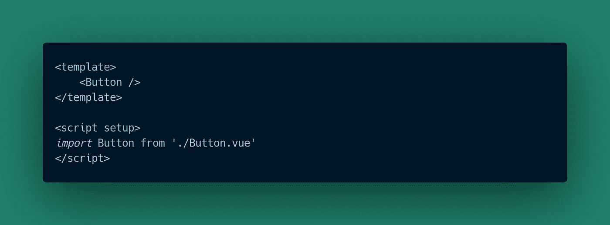

# 使用 Vue 3 让我兴奋的 3 件事

> 原文：<https://itnext.io/3-things-that-makes-me-excited-about-using-vue-3-812c541fa03c?source=collection_archive---------1----------------------->


图片由 ghalex.com 拍摄

Vue 3 在这里，它是框架的未来。如果你来自 React world，你会对 Vue 3 提供的一些概念很熟悉，所以让我们深入了解一下。

我不得不承认，出于某种原因，我推迟了对 Vue 3 的研究，实际上我想原因是 Vue 3 提供了不同的语法，这需要重新连接你的大脑——没有人喜欢这样做，因为你必须走出你的舒适区。

一开始可能会令人望而生畏，但是一旦你开始使用 Vue 3 语法，尤其是使用 Composition API，你就会开始看到好处，一切都会变得更有意义。一个小时后，你只想扔掉你为 Vue 2 付出的所有努力，但是一步一步来——没必要这么着急！

两年多来，我基本上每天都在使用 Vue 2，我很喜欢它。在我花了一些时间测试 Vue 3 之后，版本 3 提供的所有好处变得如此明显。以下是我喜欢 v3 的 3 点。

# **组成 API**

一个简单概念的可怕术语。Compositiono API 让 Vue 更接近 React。你将开始使用更多的常量，减少像方法、计算、观察器等东西。那么有什么区别呢？

这是一个非常基本的应用程序，通过 Vue 2 编写的 props 将父组件提供的数字增加任意数字



如您所见，state 中有一个 result 变量，还有一个 addNumber()方法，它所做的只是将父组件通过 props 提供的值加 1。所有内容都通过结果显示，结果存储在本地状态中。最佳反应:)

现在，这里是用 Vue 3 中的 Composition API 编写的相同代码:



区别很明显。您没有“方法”，而是将所有东西都放在 setup()方法中，所有函数都引用了常量。我们必须从 Vue 导入{ ref }以使我们的变量具有反应性，所以我们不能只使用' result '来访问它们，我们必须使用' result.value '，因为它是一个常量:)。

但是我真正喜欢 Vue 3 的是对相同代码更好的抽象。这是 Vue 的创造者提出的想法，现在正在生产中，你可以在 [RFC](https://github.com/vuejs/rfcs/blob/script-setup-2/active-rfcs/0000-script-setup.md) 中看到更多的细节。



信不信由你，以上三个例子都在做同样的事情。最后一个不是很神奇吗？看看这段代码，就几行代码，一切都那么有表现力。那么这里有什么诀窍呢？

```
<script setup>
```

这一行代码非常重要。它基本上是说:“嘿，Vue，我们将在这里使用设置”。这是做什么的？它删除了不必要的代码，比如不需要编写 setup()方法，没有那个方法你也不必编写 return 语句，因为 Vue 足够聪明，可以看出你在脚本标签中使用 setup 作为指令，它会假设你要导出所有这些函数和常量，所以你不需要编写它们。当你有一堆方法和常量并且你必须导出它们的时候，这非常方便。这难道不令人惊奇吗？

# **模块导入魔法**

使用 Vue 3，您不必手动告诉 Vue 使用导入的模块。让我们看一个例子。



这里，您必须使用 Vue 2 中的 Options API 通过“components: {}”明确定义您正在导入哪些组件。



下面介绍如何用 Vue 3 和 Composition API 导入组件。这是一回事。您必须导入组件并定义它，以便它可以在您的模板中使用。您必须拥有“导出默认值{}”。



神奇的是。Taadaaa…没有更多的*组件:{}。* Vue 3，当使用 *<脚本设置>* 时，足够智能地知道如果你导入组件，它们应该在你的模板中可用。多酷啊。我就是喜欢这个！

# **支持打字稿**

别担心。如果你不想，你不需要写任何类型的脚本，如果你想，它只是一个选项。你只需要声明你想这样使用它。

```
<script lang="ts">
```

就是这样。您现在拥有完整的类型脚本支持。如果你问我，这是非常方便的方法。虽然您没有义务使用 Typescript，但 Vue 3 是用 TS 重写的，所以我们，开发人员，将从使用带有自动完成和建议的 Vue 3 中受益。这意味着你将马上看到什么特定的函数返回，他们期望有什么样的参数，等等。这对我们所有 Vue 开发者来说都是一件非常好的事情。

# **结论**

Vue 3 为您的下一个项目做好了准备。好的一面是，如果你愿意，你可以使用你所有的旧语法，你不需要重写整个应用程序。你可以一点一点地开始重构，或者只是用 Composition API 编写新的组件。这取决于你，这就是这次大更新的全部想法。我鼓励你[观看 Evans 谈论 Vue 3 的设计。关于 Vue 背后的想法，它为什么存在，它解决了什么问题，以及与 Vue 2 相比，Vue 3 是如何使用虚拟 DOM 的。](https://www.youtube.com/watch?v=WLpLYhnGqPA)

我对 Vue 的未来充满期待，尤其是组合 API。你呢？