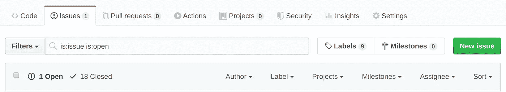
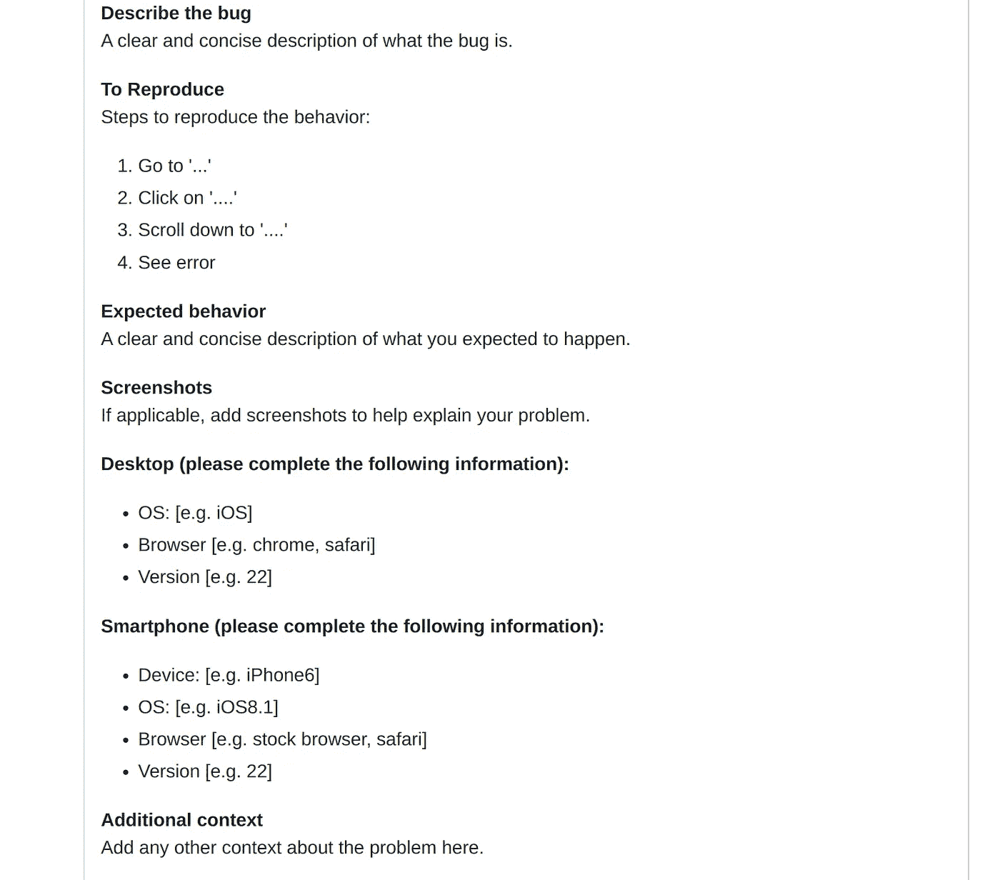

# 在开源项目中快速解决问题应该做的 3 件事

> 原文：<https://itnext.io/3-things-you-should-do-to-quickly-fix-your-problem-in-a-open-source-project-4e3444523023?source=collection_archive---------7----------------------->

作为一名开发人员，利用开源项目来完成您的应用程序是很常见的，更常见的是发现您的需求没有得到满足或者一个错误阻止了您实现目标。

这里有 3 个技巧可以帮助你快速修复开源软件中的问题，这可能很直观，但是如果你以前没有尝试过的话会很有用。

# 检查文档

许多开源项目都有 Wiki、官方网站或存储库中的`doc/`或`docs/`文件夹。这些位置是你应该寻找解决你所面临的问题的线索的第一个地方，大多数开源维护者试图保持这些文档更新，以确保新来者可以找到他们所需要的，而不会有太多的麻烦。

# 搜索问题

大多数时候，如果你的用例很常见，你可能不是第一个面临这个问题的人，所以不要忘记在 Github 或类似平台上搜索这个问题。不要只搜索未解决的问题(Github 的默认选项)，记住要检查已解决的问题。到目前为止，当你的问题还没有被维护者修复时，这是一个快速找到补丁甚至解决问题的方法。

您可以删除的是:打开搜索所有问题

# 打开新问题

打开新问题是你能做的最后一件事，但是我们大多数人可能都有过几天没有回应的经历，感觉我们的问题被维护者忽略了。这很正常，但是一点小小的改变会让故事变得不同。

你必须知道，维护人员和你我一样都是人，所以如果信息不充分，他们就无法解决你的问题。我做开源项目的维护者已经有几年了，有超过 50%的问题没有得到很好的描述，因此如果不多问几个问题，我就无法解决这些问题，而且双方都需要花很多时间等待对方的回复。

要快速修复问题，你必须打开一个好的质量问题，让维护人员不用太多努力就能理解你的情况。好的问题应该包括以下信息:

1.  你想要实现的场景
2.  您面临的问题(包括错误消息)
3.  **代码重现问题(重要！)**
4.  环境(包括操作系统，您使用的版本)

Github 中常见的错误报告模板

有了足够的信息，维护人员就可以开始查找并修复 bug，而不用浪费时间猜测您的情况。虽然这需要你付出更多的努力，但是比起给维护人员留下不充分的信息，这确实节省了很多时间。我认为这是一个“帮助你来帮助我”的概念，我建议你尝试打开一个高质量的问题，你会发现你的问题很快就会被接受和解决。

# 还有一点

如果您仍然不能解决您的问题，不要忘记它是开源的，您可以随时钻研源代码并自己找到解决方案。这将花费更多的时间，但你会在这个过程中学到很多，如果你有一个好的解决方案可以让别人受益，不要忘记创建一个公关。

虽然这三件事看起来很基本，但有时基本的方法是最好的，希望你下次遇到开源项目的问题时会发现它很有用。