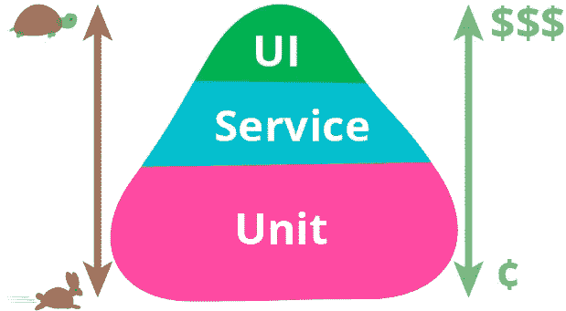
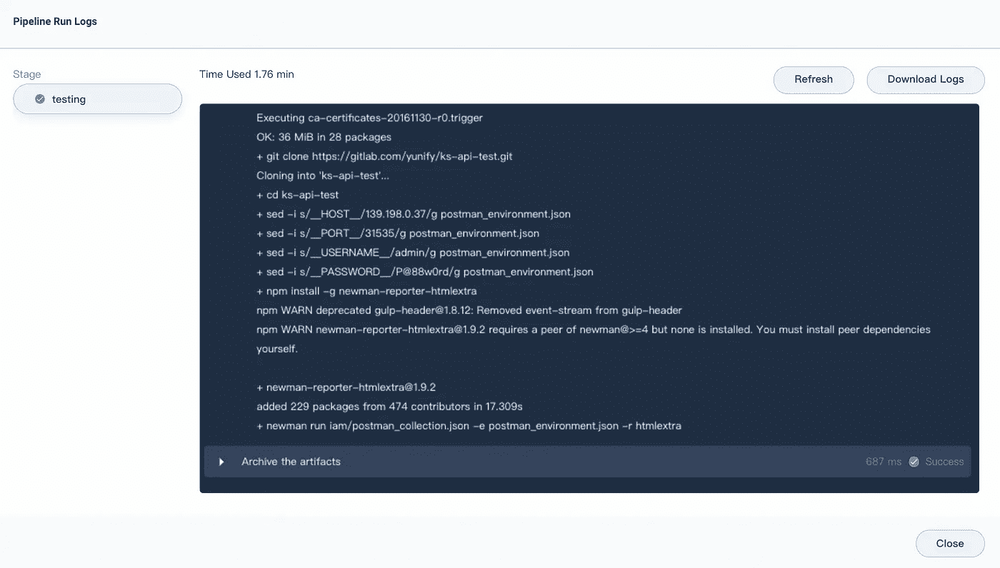
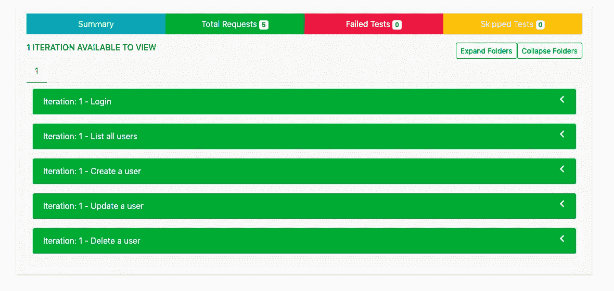
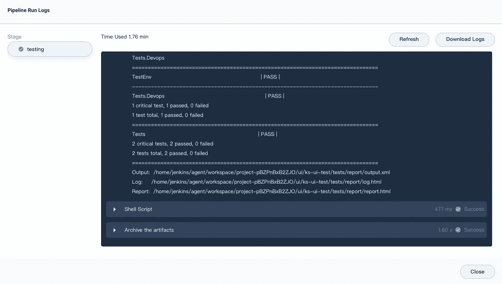
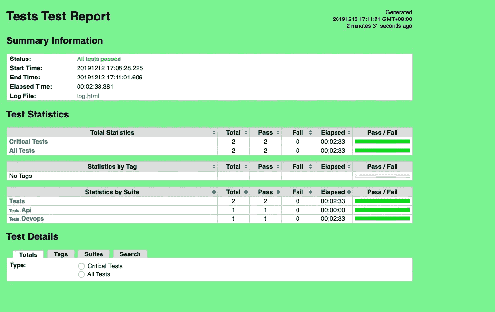
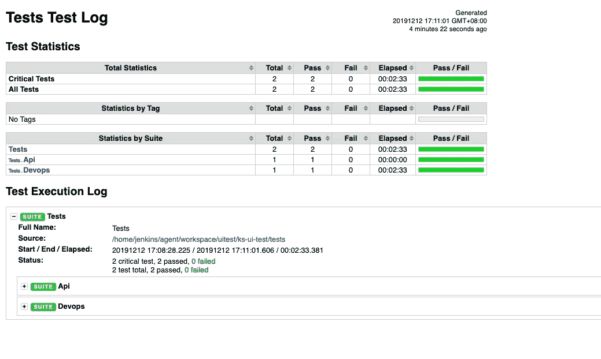

# 您可以构建 3 种类型的自动化测试系统来增强 Kubernetes 中的 DevOps

> 原文：<https://itnext.io/3-types-of-automated-testing-system-you-can-build-to-enhance-devops-in-kubernetes-c5e701560d0e?source=collection_archive---------0----------------------->

# 层层测试

测试的目的是验证预期的功能并发现潜在的缺陷。测试增强了交付合格产品的信心，也带来了敏捷迭代的可能性。可以肯定地说，测试决定了产品的开发进度。

您可能已经知道，在网络中，有 7 层 OSI 模型和 4 层 TCP 模型。在开发中，我们也有不同的模式，如 MTV、MVC、MVP 和 MVVM。这些技术已经变得更加成熟，其特点是高内聚、低耦合以及责任、模块和层的划分。他们帮助我们构建架构和标准。

同样，我们也有不同类型的测试——UI 测试、API 测试和单元测试。测试是一种平衡产出和成本的方法，而不是一种新型技术。



从上图所示的测试金字塔中可以看出，更高层的测试需要更高的成本、更严格的环境要求、更长的实施周期和更仔细的维护。然而，测试的层次越高，就越接近最终用户场景。在《Google 如何测试软件》一书中，Google 建议进行 70/20/10 的划分:70%的单元测试，20%的 API 测试，10%的 UI 测试。

这篇博客分享了如何使用 [**KubeSphere DevOps 系统**](https://kubesphere.io/devops) 为 Kubernetes 驱动的应用程序运行自动化测试的想法。

# 什么是 KubeSphere DevOps

基于 Jenkins， [KubeSphere](https://kubesphere.io) 为 Kubernetes 和容器的用例提供了一站式 [DevOps 系统](https://kubesphere.io/devops)，包括丰富的 CI/CD 管道构建和插件管理功能，二进制到映像(B2I)，以及 Kubernetes 中 DevOps 的源到映像(S2I)。还为管道、S2I 和 B2I 提供了代码依赖缓存支持，以及代码质量管理和管道日志记录等其他功能。

KubeSphere 的内置 D [evOps 系统，将应用开发和自动化发布与容器平台顺利结合。它还支持第三方私有映像注册中心和代码库的集成，这带来了私有场景下改进的 CI/CD 功能，并提供了端到端的用户体验。](https://kubesphere.io/devops)

尽管如此，用户很少知道 KubeSphere DevOps 也可以用来构建自动化测试系统，这样自动化的**单元测试、API 测试、UI 测试**可以有很大的便利性，测试人员的工作也可以更加高效。

# 单元测试

单元测试有很高的运行频率，每次代码提交都应该触发它。由于依赖性很少，单元测试通常只需要一个容器运行时环境。

下面是一个使用 golang:latest 在管道中运行单元测试的示例。

```
pipeline {
  agent {
    node {
      label 'go'
    }
  }
  stages {
    stage('testing') {
      steps {
        container('go') {
          sh '''
          git clone https://github.com/etcd-io/etcd.git
          cd etcd
          make test
          '''
        } }
    }
  }
}
```

您可以看到如下管道日志:


至于其他语言和框架，通过安装某些包和模拟相关的服务，单元测试也可以很容易地在 Kubernetes 上运行。因此，我们应该更加关注如何编写有用的单元测试，而不是沉迷于运行时或单元测试计划。

# API 测试

如果一个团队刚刚开始自动化测试，自动化 API 测试将是一个很好的起点。

单元测试主要是由 R&D 人编写的。在快速迭代过程中，有经验的 R&D 人不会忘记编写单元测试。测试在更快的重构和变更过程中扮演着更重要的角色。如果没有人愿意写单元测试，那么单元测试就会被忽视，并且很难推动一些被实践者忽视的东西，这些东西对管理人员来说好处有限。

此外，自动化 UI 测试通常会被手动测试所取代。同时，自动化 UI 测试的维护带来了很高的成本，这意味着快速迭代过程中的自动化 UI 测试应该合理地进行。

如果团队成员更熟悉 API，那么 API 测试更可取，因为他们在运行测试时有完整的 API 文档和资料作为参考，特别是在前端和后端代码分开的架构中。

下面是一个使用 Postman 在管道中运行自动化 API 测试的示例。

```
pipeline {
  agent {
    kubernetes {
      label 'apitest'
      yaml '''apiVersion: v1
kind: Pod
spec:
  containers:
  - name: newman
    image: postman/newman_alpine33
    command: [\'cat\']
    tty: true
    volumeMounts:
    - name: dockersock
      mountPath: /var/run/docker.sock
    - name: dockerbin
      mountPath: /usr/bin/docker
  volumes:
  - name: dockersock
    hostPath:
      path: /var/run/docker.sock
  - name: dockerbin
    hostPath:
      path: /usr/bin/docker
      '''
      defaultContainer 'newman'
    }
  } parameters {
    string(name: 'HOST', defaultValue: '10.10.10.10', description: '')
    string(name: 'PORT', defaultValue: '8000', description: '')
    string(name: 'USERNAME', defaultValue: 'admin', description: '')
    string(name: 'PASSWORD', defaultValue: 'password', description: '') } stages {
    stage('testing') {
      steps {
          sh '''
          apk add --no-cache bash git openssh
          git clone https://yourdomain.com/ns/ks-api-test.git cd ks-api-test sed -i "s/__HOST__/$HOST/g" postman_environment.json
          sed -i "s/__PORT__/$PORT/g" postman_environment.json
          sed -i "s/__USERNAME__/$USERNAME/g" postman_environment.json
          sed -i "s/__PASSWORD__/$PASSWORD/g" postman_environment.json npm install -g newman-reporter-htmlextra
          newman run iam/postman_collection.json -e postman_environment.json -r htmlextra
          '''
      }
    }
  }
  post {
    always {
        archiveArtifacts 'ks-api-test/newman/*'
    }
  }
}
```

工件将在运行流程后归档:



下载归档的工件并解压缩，以查看测试报告:



自动化 API 测试的框架很容易通过以下功能的实现来建立:

*   接口请求
*   响应断言
*   请求业务流程
*   报表生成

请记住，您需要根据您的 API 测试和交付习惯来选择最适合您的团队的解决方案。例如，您可以开发自己的解决方案，或者只使用现有的工具。以上解决方案选择 Postman 和 Newman 的原因是团队一般使用 Postman 进行 API 测试。

剩下的是如何在团队中组织测试。团队既可以单独向同一个存储库提交文件，也可以使用 Postman 的收费版本共享数据进行集中测试。

# 用户界面测试

自动化 UI 测试的高成本可归因于以下几点:

*   随着前端风格和产品逻辑的变化，测试用例很难维护。
*   稳定的运行环境很难提供，各种超时和脏读会导致很高的失败率。

这里的自动化 UI 测试使用我熟悉的 Robotframework，关键字用于自动化测试。

下面是一个使用 Robotframework 在管道中运行自动化 UI 测试的示例。

```
pipeline {
  agent {
    kubernetes {
      label 'robotframework'
      yaml '''apiVersion: v1
kind: Pod
spec:
  containers:
  - name: robotframework
    image: shaowenchen/docker-robotframework:latest
    tty: true
    volumeMounts:
    - name: dockersock
      mountPath: /var/run/docker.sock
    - name: dockerbin
      mountPath: /usr/bin/docker
  volumes:
  - name: dockersock
    hostPath:
      path: /var/run/docker.sock
  - name: dockerbin
    hostPath:
      path: /usr/bin/docker
      '''
      defaultContainer 'robotframework'
    }
  } parameters {
    string(name: 'HOST', defaultValue: '10.10.10.10', description: '')
    string(name: 'PORT', defaultValue: '8080', description: '')
    string(name: 'USERNAME', defaultValue: 'admin', description: '')
    string(name: 'PASSWORD', defaultValue: 'password', description: '')
  } stages {
    stage('testing') {
      steps {
          sh '''
          curl -s -L https://raw.githubusercontent.com/shaowenchen/scripts/master/kubesphere/preinstall.sh | bash
          git clone https://yourdomain.com/ns/ks-ui-test.git cd ks-ui-test sed -i "s/__USERNAME__/$USERNAME/g" tests/common.robot
          sed -i "s/__PASSWORD__/$PASSWORD/g" tests/common.robot echo "\nTestEnv  http://$HOST:$PORT" >> tests/api.robot
          echo "\nTestEnv  http://$HOST:$PORT" >> tests/devops.robot
          ./start.sh'''
      }
    }
  } post {
    always {
        sh 'tar cvf report-$BUILD_NUMBER.tar ks-ui-test/tests/report'
        archiveArtifacts '*.tar'
    }
  }
}
```

您可以看到如下管道日志:



下载归档的工件并解压缩，以查看测试报告:



# 关于 KubeSphere

KubeSphere 是一个基于 Kubernetes 的开源容器平台，其核心是应用程序。它提供全栈 It 自动化操作和简化的开发运维工作流。

[KubeSphere](https://kubesphere.io/) 已被全球数千家企业采用，如 **Aqara、新浪、奔来、中国太平、华夏银行、国药控股、微众银行、Geko Cloud、VNG 公司、Radore** 。KubeSphere 为运维提供向导界面和各种企业级功能，包括 Kubernetes 资源管理、[、DevOps (CI/CD)](https://kubesphere.io/devops/) 、应用生命周期管理、服务网格、多租户管理、[监控](https://kubesphere.io/observability/)、日志记录、警报、通知、存储和网络管理以及 GPU 支持。有了 KubeSphere，企业能够快速建立一个强大且功能丰富的容器平台。

欲了解更多信息，请访问 [https://kubesphere.io](https://kubesphere.io/)