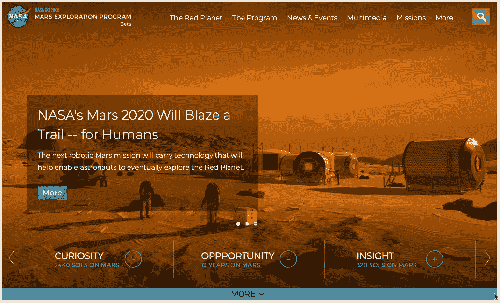
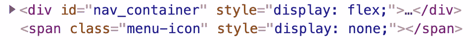
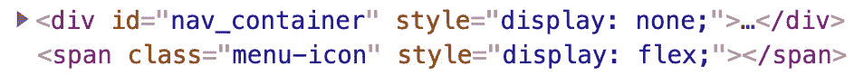
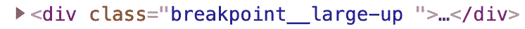
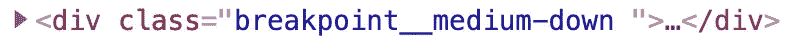

# 在 React 应用中实现响应式设计的 3 种方法

> 原文：<https://itnext.io/3-ways-to-implement-responsive-design-in-your-react-app-bcb6ee7eb424?source=collection_archive---------0----------------------->



## **反应——游戏规则的改变者**

React 真正改变了我们现在开发 web 前端应用程序的方式。组件从一开始就违背了“关注点分离”的经验法则，选择利用 JSX 并将 HTML 和 JS 放在同一个文件中。UI 元素现在通过它们自己的组件呈现，具有可重用性的所有意图和目的。

## 有求必应做了很多方面

响应式设计一直是一项要求，现在我们正在使用“移动优先”的思维模式构建应用程序，这比以往任何时候都更加重要。

使用最基本的方法，使用媒体查询实现了响应式设计，其中更有经验的开发人员可以选择添加响应“resize”事件的事件侦听器，并通过 JS 添加/移除样式。尽管如此，新手和有经验的开发人员都可能使用 Bootstrap 这样的前端框架，或者使用预定义的断点和定制组件来实现这些更改。

## **做出反应并实施响应式设计**

因此，让我们来看看在您的下一个 React 应用程序中实现响应式设计的 3 种不同方法。

1.  媒体查询
2.  内嵌样式
3.  高阶组件—(反应袜)

**流程**

当我们回顾实现响应式设计的不同方法时，我将关注以下几点，无论您采用哪种方法，这些都是必须完成的。

1.  跟踪窗口大小(宽度/高度)的变化
2.  添加/删除/更新必要的 DOM 元素以反映这些更改

**演示版**

app:[https://wpixk.csb.app/](https://wpixk.csb.app/)

***注意:*** 上面的演示使用的是内联式方法

尽管该网站有许多响应功能，但出于演示的目的，我将只关注导航菜单，并进行以下更改:

Mobile: width < 1024 — Removes the top navigation and shows the hamburger icon

Desktop: width > 1023 —显示导航元素并隐藏汉堡包图标

所以让我们开始吧！

## 媒体查询

CSS 的力量永远不会停止给人惊喜和启发。我在 CodePen 上看到了无数的 CSS 艺术作品，几乎每天我都会学到一些关于 CSS 的新东西。因此，不言而喻，实现响应式设计的第一种方法是使用媒体查询。

code sandbox:[https://codesandbox.io/s/mars-media-queries-0wqnv](https://codesandbox.io/s/mars-media-queries-0wqnv)

***注:*** 媒体查询被添加到单独的 **responsive.css** 文件中

**跟踪窗口大小的变化**

使用 [CSS @media 规则](https://www.w3schools.com/cssref/css3_pr_mediaquery.asp)跟踪窗口大小的变化，并将最小宽度设置为 1024px。这实质上说明了此处定义的规则仅在窗口宽度最小为 1024ppx 时适用。

```
@media only screen and (min-width: 1024px) {}
```

**更新 DOM 元素**

在媒体查询规则中，添加了针对特定 DOM 元素的附加 CSS 规则。

```
@media only screen and (min-width: 1024px) {
  .container header .header-nav-area #nav_container  {
    display:flex;
  }
}
```

**利弊**

赞成的意见

*   应用起来相对简单
*   任何具有基本 CSS 技能的人都可以创建和实现媒体查询

骗局

*   React 将呈现被 CSS 隐藏的、从不使用的额外 DOM 元素
*   CSS 在组件的外部
*   CSS 文件需要额外的导入

## 内嵌样式

每当我讲授介绍前端 Web 开发和内联风格的话题时，我总是强调说，“不要这样做”。然后我继续强调样式应该通过 CSS 来定义。直到我们开始学习 JS 和/或 jQuery。风格还是。我们是否打破了规则。

code sandbox:[https://codesandbox.io/s/mars-inline-styles-wpixk](https://codesandbox.io/s/mars-inline-styles-wpixk)

***注意:*** Nav 元素已经被拆分成它们自己的组件，并放置到一个 TopNav 文件夹中

**跟踪窗口大小**

跟踪窗口大小的变化要求我们向窗口对象添加一个事件侦听器来侦听“resize”事件。一旦“resize”事件发生，就会调用一个回调函数从窗口对象中检索当前宽度。

```
window.addEventListener(“resize”, updateDimensions)const updateDimensions = () => {
  const width = window.innerWidth
}
```

既然钩子风靡一时，让我们导入并使用 **useState** 来创建一个宽度变量及其支持的 setWindowWidth()方法，该方法将用于更新 updateDimensions()函数中的宽度。

```
import React, { useState } from 'react'function App() {
  const [width, setWindowWidth] = useState(0); const updateDimensions = () => {
    const width = window.innerWidth
    setWindowWidth(width)
  } //…rest of App.js below…
}
```

然后，我们将创建一个支持函数，负责获取 window.innerWidth 值并更新状态:

**添加事件监听器**

现在必须导入 **useEffect** 挂钩并用于以下操作:

1.  调用 updateDimensions 将初始宽度设置为当前窗口大小
2.  当组件挂载时添加事件监听器
3.  当组件卸载时，删除事件侦听器

useEffect 实质上替换了基于类的 componentDidMount、componentDidUppdate 和 componentWillUnmount 生命周期方法。

```
import React, { useState, useEffect } from 'react'function App() {
  const [width, setWindowWidth] = useState(0) useEffect(() => { 

     updateDimensions();

     window.addEventListener(“resize”, updateDimensions); return () => 
       window.removeEventListener(“resize”,updateDimensions); }, []) const updateDimensions = () => {
      const width = window.innerWidth
      setWindowWidth(width)
    } //…rest of App.js below…
}
```

**更新元素**

我选择创建一个对象，它使用条件逻辑来确定对宽度的任何更改是否需要显示/隐藏顶部导航。这将作为道具传递给**标题**。

```
const responsive = {
  showTopNavMenu: width > 1023
}return (
  <>
    <Header showTopNavMenu={responsive.showTopNavMenu}/>
    <Main />
  </>
)
```

然后,头计算出自己的逻辑来确定将用于显示/隐藏特定 DOM 元素的确切 CSS。在这种情况下，元素的显示属性将设置为“flex”或“none”。

```
const showNav= {
  display: showTopNavMenu ? 'flex' : 'none'
}const showMenuIcon = {
  display: showTopNavMenu ? 'none' : 'flex',
}return (
   <>
     <div id="nav_container" style={showNav}>
       <nav id="navigation">{navMenuItems}</nav>
     </div>
     <span className="menu-icon" style={showMenuIcon}/>
   </>
)
```

下面是这些 DOM 元素在开发人员工具中的样子:

桌面:



平板电脑:



**利弊**

赞成的意见

*   响应式设计不再依赖于外部 CSS 文件
*   该组件更加独立和可重用
*   CSS 被限定在这个组件的范围内，这样就减少了 CSS 冲突的可能性

骗局

*   比媒体查询要多得多的工作要做
*   媒体查询更容易和直观地阅读

## 高阶组件

有相当多的第三方库可供选择，为了这篇文章，我选择了 [React-Socks](https://www.npmjs.com/package/react-socks) 。我争论使用的另一个方法是 [react-use-media](https://www.npmjs.com/package/react-use-media) ，然而，我正在寻找一种更[高阶组件](https://reactjs.org/docs/higher-order-components.html)的方法，这就是我使用 React-Socks 的原因。

code sandbox:[https://codesandbox.io/s/mars-react-socks-xg8z2](https://codesandbox.io/s/mars-react-socks-xg8z2)

使用该库需要通过 npm 或 yarn 安装它。我在这些演示中使用了 CodeSandbox，并通过“添加依赖项”将其导入。

安装完成后，我们导入**断点**和**断点提供者**组件，并用**断点提供者包装顶层组件。**

```
import { Breakpoint, BreakpointProvider } from ‘react-socks’;function App() {//...rest of App.js above....return (
  <BreakpointProvider>
    <Header />
    <Main />
  </BreakpointProvider>}
```

这个更高级的组件现在提供了对层次结构内所有子组件中的**断点**组件的访问。

该库还提供了一些监听常见断点的配置。最简单的方法是使用**小**、**中**和**大**关键字来定位断点，然后将**向上**或**向下**分配给它们应该应用的方向。

nav_container 将只在大桌面和更高的桌面(> 1023)上显示，菜单图标将只在中等和更低的桌面(<767).

```
<Breakpoint large up>
  <div id=”nav_container” ></div>
</Breakpoint><Breakpoint medium down>
  <div className=”menu-icon”></div>
</Breakpoint>
```

Here’s what those settings look like in developer tools when applied. Take note that the class name syntax uses the [BEM](https://www.integralist.co.uk/posts/bem/#4) )上显示。

**桌面:**



**平板电脑:**



**利弊**

赞成的意见

*   易于实施和配置
*   开发工具中的类名是语义性的，反映了变化

骗局

*   注意到删除/添加导航元素时有一点延迟
*   不适用于内联元素，比如 spans，但这可能只是这个库的一个局限
*   需要将内联元素更改为 block 或使用 div 而不是 spans

## 最后的想法

随着 React 的不断发展和推进前端开发的边界，我们也需要重新思考旧的范例。如果你对媒体查询感到舒服，那么尽一切办法继续使用它们，但是随着越来越多的开发人员倾向于使用 CSS-in-JS 方法，你会发现自己很难不朝那个方向前进。

请记住，尽管在本例中不同方法的缺点很小，但在实际生产应用程序中，这些缺点可能会因更高的复杂性而加剧，并导致性能问题。

特别感谢托马斯·尼克尔斯的额外反馈和评论，这些反馈和评论为文章增添了一些收尾工作。