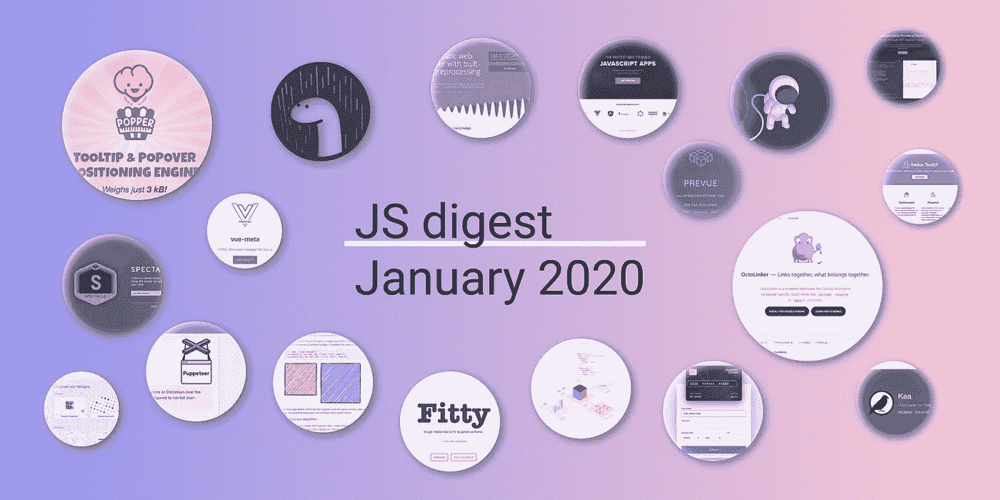

# 2020 年 1 月 GitHub 上最受欢迎的 36 个 JavaScript 库

> 原文：<https://itnext.io/36-most-popular-javascript-repositories-on-github-in-january-2020-fa77eb746890?source=collection_archive---------4----------------------->

*这是 2020 年 1 月收集的 GitHub I 最有趣、最受欢迎的开源 JS 项目列表。*

距离我上一篇 JS 摘要已经有一段时间了，但现在我终于有时间下定决心，用我已经关注了一段时间的 JS 项目创建一个图表。

# 2020 年 1 月最受欢迎的 JS 库

1.  [木偶师](https://github.com/puppeteer/puppeteer)是一个众所周知的节点库，它提供了一个高级 API 来控制 Chrome 或通过 [DevTools 协议](https://chromedevtools.github.io/devtools-protocol/)的 Chrome。默认情况下，木偶师运行无头的[,但是可以配置为运行全(无头)铬或铬。**现在已经有 58405**位明星了。](https://developers.google.com/web/updates/2017/04/headless-chrome)
2.  [Deno](https://github.com/denoland/deno) (你可能早就听说过)是 JavaScript 和 TypeScript 的安全运行时。问题是 Deno 会成为 Node.js 之后的下一个大佬吗？**目前已有 43979 位**明星。
3.  Meteor 是一个构建现代 web 应用程序的超简单环境。**目前已有 41547 位**明星。
4.  [Mocha](https://github.com/mochajs/mocha) 是一个简单、灵活、有趣的浏览器 node . js JavaScript 测试框架。**18960**星星到现在。
5.  [AVA](https://github.com/avajs/ava) 是 Node.js 的测试运行器，它有简洁的 API、详细的错误输出、新语言特性的拥抱以及让你更有效地编写测试的进程隔离。**17510**星星到现在。
6.  popper-core 是一个工具提示和弹出定位引擎，可以自动将工具提示放在按钮附近的正确位置。到现在为止已经有 14074 颗星星了。
7.  [Rough.js](https://github.com/pshihn/rough) 是一个 9kB 的图形库，用于以粗略的、类似手绘的风格绘图。该库定义了绘制直线、曲线、圆弧、多边形、圆和椭圆的图元。它还支持绘制 [SVG 路径](https://developer.mozilla.org/en-US/docs/Web/SVG/Tutorial/Paths)。**现在已经有 12797 位**明星了。
8.  [Proton Native](https://github.com/kusti8/proton-native) 是一个跨平台桌面应用的 React 环境。**9845**星到现在。
9.  [UUID](https://github.com/uuidjs/uuid) 帮助你用 JavaScript 生成符合 RFC 的 UUID。到目前为止已经有 8595 位明星。
10.  [telegraph](https://github.com/FormidableLabs/spectacle)是一个基于 [ReactJS](https://reactjs.org/) 的表示库。**现在已经有 8234 位**明星了。
11.  [Cube.js](https://github.com/cube-js/cube.js) 是一个开源的模块化框架，用于构建分析 web 应用程序。它主要用于构建内部商业智能工具或向现有应用程序添加面向客户的分析。到现在为止已经有 7242 位明星了。
12.  pnpm 是一个快速、节省磁盘空间的包管理器。**7159**明星到现在。
13.  Snowpack 用于构建 web 应用程序，工具更少，迭代速度快 10 倍。不需要捆扎机。到现在为止已经有 6179 颗星星了。
14.  React Cosmos 是一个开发环境，用于构建可伸缩的、高质量的用户界面。到现在为止已经有 5918 位明星了。
15.  Harp 是一个静态的 web 服务器，它也以 HTML、CSS 和 JavaScript 的形式服务于 Jade、Markdown、EJS、Less、Stylus、Sass 和 CoffeeScript，无需任何配置。它支持布局/局部范式，并具有灵活的元数据和全局对象，用于遍历文件系统和将自定义数据注入模板。或者，Harp 还可以将您的项目编译成静态资产，以便托管在任何有效的 HTTP 服务器之后。**现在已经有 4853**颗星星了。
16.  [vue-interactive-pay card](https://github.com/muhammederdem/vue-interactive-paycard)是一种微交互流畅的信用卡形式。包括数字格式化、验证和自动卡类型检测。使用 Vue.js 构建，并且完全响应。到现在为止已经有 4372 位明星了。
17.  OctoLinker 是 GitHub 的一个浏览器扩展，它将特定语言的语句如`include` `require`或`import`转换成链接。到现在为止已经有 4160 位明星。
18.  [react-adaptive-hooks](https://github.com/GoogleChromeLabs/react-adaptive-hooks) 提供最适合用户设备和网络限制的体验。到现在为止已经有 3867 位明星了。
19.  [vue-select](https://github.com/sagalbot/vue-select)——你希望 HTML `<select>`元素能做的一切，打包成一个轻量级、零依赖性、可扩展的 Vue 组件。到现在为止已经有 3179 位明星了。
20.  [大小限制](https://github.com/ai/size-limit)是 JavaScript 的一个性能预算工具。它检查 CI 上的每一次提交，为最终用户计算 JS 的实际成本，如果成本超过限制，就会抛出一个错误。**第 3026 期**群星至此。
21.  Vue Meta 是一个 [Vue.js](https://vuejs.org/) 插件，允许你管理你的应用程序的元数据。它的灵感来自于 ReactJS 的`[react-helmet](https://github.com/nfl/react-helmet)`,工作原理与之类似。然而，不是将数据设置为传递给专有组件的道具，而是使用`metaInfo`属性将其作为组件数据的一部分导出。到现在为止已经有 2999 颗星星了。
22.  [Fitty](https://github.com/rikschennink/fitty) 放大(或缩小)文本，使其完全适合其父容器。到现在为止已经有 2857 位明星了。
23.  [Grant](https://github.com/simov/grant) 是一个用于 Express、Koa 和哈比神的 OAuth 中间件。到现在为止已经有 2588 位明星了。
24.  [Redux Toolkit](https://github.com/reduxjs/redux-toolkit) 是官方的、固执己见的、包含电池的工具集，用于高效的 Redux 开发。到现在为止已经有 2485 位明星了。
25.  [craft.js](https://github.com/prevwong/craft.js) 是一个 React 框架，用于构建可扩展的拖放页面编辑器。**到现在为止已经有 2190 名**星人。
26.  [open](https://github.com/sindresorhus/open) 用于打开 URL、文件、可执行文件之类的东西。跨平台。到现在为止已经有 1855 位明星了。
27.  [字符串相似度](https://github.com/aceakash/string-similarity)基于 Dice 的系数，找到两个字符串之间的相似度，这通常比 Levenshtein 距离更好。到现在为止已经有 1800 位明星了。
28.  [Mirage JS](https://github.com/miragejs/miragejs) 是一个客户端服务器，用于开发、测试和原型化您的 JavaScript 应用程序。到现在为止已经有 1749 位明星了。
29.  [Kea](https://github.com/keajs/kea/) 是 React 的数据层。由 Redux 提供动力。**目前已有 1521 位**明星。
30.  [Postgres.js](https://github.com/porsager/postgres) 是一个全功能的 PostgreSQL 客户端，适用于 Node.js. **1，483** stars。
31.  [scalajs-react](https://github.com/japgolly/scalajs-react) 将脸书的 [React](https://facebook.github.io/react/) 库提升到 [Scala.js](http://www.scala-js.org/) 中，并努力使其尽可能的类型安全和 Scala 友好。为纯函数式编程提供(选择加入)支持。**到现在已经有 1294**颗星星了。
32.  [Craco](https://github.com/gsoft-inc/craco) 代表“Create React App Configuration Override”，是 create-react-app 的一个简单易懂的配置层。到现在为止已经有 1269 位明星了。
33.  [node-youtube-dl](https://github.com/przemyslawpluta/node-youtube-dl) 是 node 的 youtube-dl 驱动。到现在为止已经有 1255 位明星了。
34.  [PreVue](https://github.com/open-source-labs/PreVue) 是一款面向 Vue 开发者的原型开发工具。**1202 位**明星到现在为止。
35.  [pretty-quick](https://github.com/azz/pretty-quick) 在你修改过的文件上运行[pretty](https://prettier.io/)。**到现在为止 1200 位**明星
36.  React Rainbow 是一个组件集合，它将可靠地帮助您快速构建应用程序。**到现在为止有 1135 位**明星。

其中一些你可能已经在你的项目中使用了，但是另外一些是非常新的和有前途的。无论你什么时候试一试，请让我知道你的意见。非常感谢！

感谢您的阅读。我会尽量早点做下一个文摘！