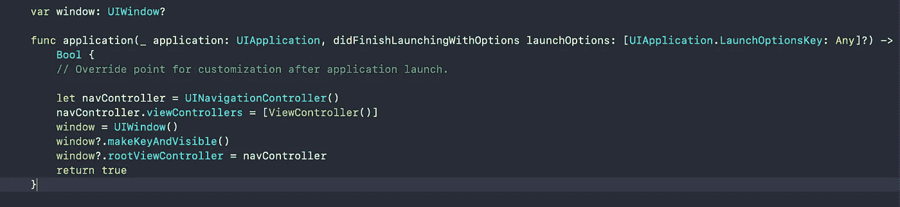
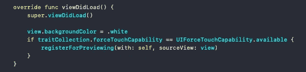
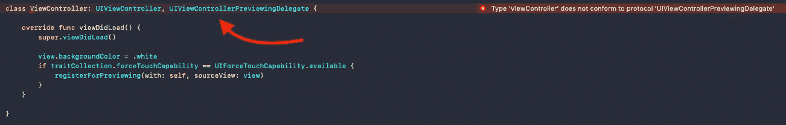
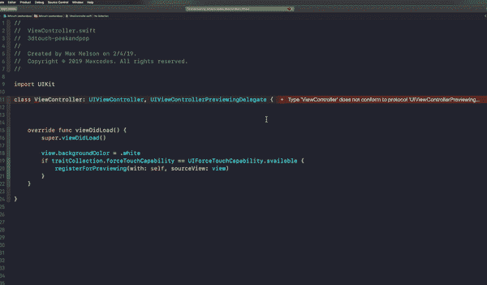
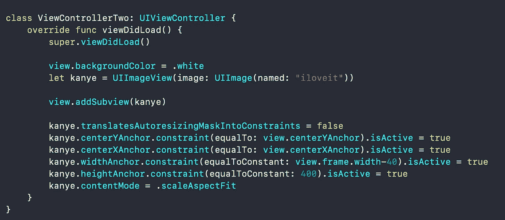
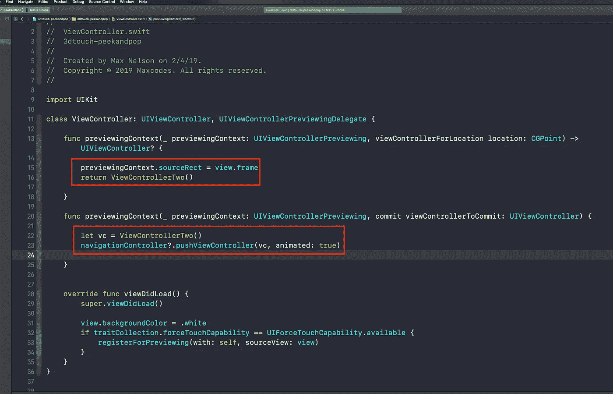

# Swift 中的 3D 触摸 Peek & Pop。和坎耶一起。

> 原文：<https://itnext.io/3d-touch-peek-pop-in-swift-with-kanye-86dad6fb1bcd?source=collection_archive---------3----------------------->

# 今天，您将轻松学习没有故事板的 3D TOUCH PEEK & POP。5 个快速步骤。

首先，确保你正在构建一个真实的设备，它不能在模拟器中工作。如果你以某种方式让原力触摸在模拟器中工作，告诉我，因为你是神。

[如果你喜欢视频格式，我在 YouTube 上为这篇文章制作了一个视频，我在这里把它分解成几个步骤。](https://youtu.be/MLPHGz_Rh8Q)

## 第一步——不要使用故事板，而是把它放在 AppDelegate.swift 中。✅

将这四行代码放在 didFinishLaunchingWithOptions 中。嘭，我们设置好了，本文的其余部分将变得非常清楚。开始编码吧。

app delegate . swift did finishlaunchingwithoptions 方法

## 步骤 2-注册预览✅

为了实现 Peek & Pop，我们需要调用一个名为***registerforpreview 的方法。*** [直接引用 Apple Docs 文章实现 Peek 和 Pop:](https://developer.apple.com/documentation/uikit/peek_and_pop/implementing_peek_and_pop)

> 调用`[registerForPreviewing(with:sourceView:)](https://developer.apple.com/documentation/uikit/uiviewcontroller/1621463-registerforpreviewing)`来注册一个实现`[UIViewControllerPreviewingDelegate](https://developer.apple.com/documentation/uikit/uiviewcontrollerpreviewingdelegate)`协议的类，然后传入一个响应 3D 触摸的视图。

这个方法将允许我们在 ViewController 中使用或者说注册一个要呈现的视图，这个 view controller 实现了来自 UIViewControllerPreviewingDelegate 的 Peek 和 Pop 所需的方法。

如果这没有意义，只要继续阅读并写下我写的代码，运行几次后，它最终会在你的脑海中出现。

把这个放到你的视图控制器里。

## 步骤 3-利用所需的 UIViewControllerPreviewingDelegate 协议方法。✅

让您的 ViewController 采用 UIViewControllerPreviewingDelegate Swift 协议，如下所示。你会得到一个严重的错误。

专业人员/代表

**步骤 3 继续——实施所需的方法**

一旦你做到了这一点，通过实现所需的方法来遵守协议。您可以通过单击红圈或手动输入来完成此操作。无论哪种方式，只要把这些方法放到你的代码中就行了。

## 步骤 4——创建一个视图控制器来呈现。和坎耶一起。✅

现在我们必须创建一个可以呈现的 UIViewController 类。顺便把 Kanye 的 UIImageView 也放进去。我用了一张 Kanye 的照片，我把它命名为“iloveit ”,我把这个文件放在了我的项目的 xcassets 文件夹中。 ***没有图像也可以做到这一点，你只需要一个单独的 UIViewController 来呈现。***

要呈现的 ViewController。

## 步骤 5——使用我们刚刚实现的协议方法呈现视图控制器。✅

将下面的代码放入这些方法中。我们在这里所做的就是告诉 UIViewControllerPreviewingDelegate，正在显示什么视图控制器，以及在屏幕上的什么位置，在本例中，是第一个视图控制器视图的中心，或者是我们之前注册的预览源视图。

# 这是所有的乡亲。😱

继续运行您的代码，它应该工作。[如果它不起作用，看看我在 YouTube 上用同样的代码制作的视频](https://youtu.be/MLPHGz_Rh8Q)。我将带你通过视频格式完成这项工作，视频格式的解释可能比本文对你更有帮助。

如果你想第一个听说有限的免费课程优惠券(每月 10 张)，请随时订阅我的 [**每周开发内容电子邮件列表。**](https://www.maxcodes.io)

# **Outro。🔥**

非常感谢你的支持。一如既往，每一次浏览，阅读，鼓掌，推特和 YouTube 订阅，都帮助我发布这种内容，并帮助世界各地的其他开发者掌握他们的技术，就像我掌握我的一样。

继续吧，把你的要求发推特给我，我会把一个中型故事和 YouTube 视频放在一起。

再次感谢，下次再见！