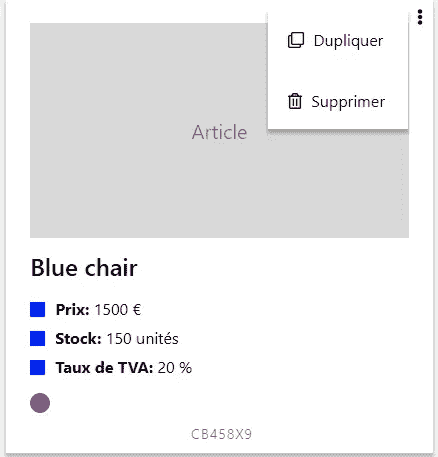

# 4 个 CSS 技巧我已经艰难地学会了

> 原文：<https://itnext.io/4-css-tricks-ive-learnt-the-hard-way-aab1e7e8ff44?source=collection_archive---------1----------------------->

照片由[乔安娜·科辛斯卡](https://unsplash.com/@joannakosinska?utm_source=medium&utm_medium=referral)在 [Unsplash](https://unsplash.com?utm_source=medium&utm_medium=referral) 上拍摄

> 更新 6–13–2018:一位读者把这篇文章翻译成了日文，[在这里找到](https://coliss.com/articles/build-websites/operation/css/4-css-tricks-ive-learnt-the-hard-way.html)。一万名读者和 650 多个掌声之后:谢谢读者和 translators❤️
> 
> 更新 30–6–2021:一位读者已经把这篇文章翻译成了西班牙文，[在这里找到它。](https://www.ibidemgroup.com/edu/trucos-css-web) 36k 的读者和 2500+的掌声之后:谢谢读者和 translators❤️

不管你有多有经验，从头开始一个新项目总是学习新事物的好方法。

最近，我想知道在不使用任何第三方知名框架(如 Bootstrap)的情况下，如何构建一个完整的 web 应用程序。

首先，它会释放编码自由的力量吗(又名**“错误只能来自你自己”**以及**“停止与你的框架对抗！重要规则"**)但它也能教会我 CSS 技巧，我现在很自豪也很乐意与你分享。

# 1.无边框-首选框阴影或框大小

你是否与 borders 合作过，这是你应该考虑的:

实际上，边框占据了页面整体布局的空间。这意味着它给有边界的元素增加了额外的宽度和高度。

**后果:**

*   你必须手动计算元素的宽度和高度，以防止它们扰乱你的布局。
*   在像悬停这样的特定状态上添加边框会使整个布局移动。性能杀手。

**示范:**

通过悬停在第一个 div 上，你应该注意到第二个 div 也在移动。

**解决方法:**

*   您可以使用:`box-sizing: border-box`以便`width`将`border-width`纳入计算。
*   可以用:`box-shadow: /* ... */`来伪造边框。
*   评论中建议:使用透明边框，需要时改变颜色。小心，因为这种方法会使边框在布局中占据额外的空间。

**演示:**

# 2.引起对某一元素的注意

每当你想让用户点击一个特定的按钮时，有多种众所周知的策略来引起注意。

然而，我想和你分享一个流畅简单但可定制的技巧。

**演示:**

**优点:**

*   元素的宽度或高度没有变化，因此布局没有中断。
*   一行程序:`animation: radial-pulse 1s infinite;`
*   你可以改变:颜色，大小，持续时间等。
*   不显眼但引人注目。

> **引用一位读者的话:**如果你的网站需要让视障用户也能访问，这种效果对他们来说就没用了。

# 3.水平和垂直居中元素

CSS 一直在发展，但是我们一直在努力使我们的元素水平和垂直居中。

也许有很多方法可以达到这个目的，但是这些是我每天解决这个经常性需求的方法:

*   **要么使用:** `display:flex`在父元素上+ `margin: auto`在子元素上， **+** `text-align:center`视情况而定。
*   **要么在父元素上使用:**`display:flex`**+**`justify-content:center`**+**`align-items:center`。

**演示:**

# 4.相对于父元素定位元素

这个在处理下拉菜单、工具提示和弹出菜单时非常有用。

它是这样工作的:

*   父元素**不能是静态的** : `position: relative | fixed | absolute`
*   子**必须有:** `position:absolute`

就像这样，使用`top | left | bottom | right`将子元素相对于父元素定位。

**演示:**

请注意，右上角的方块可能是在单击或悬停时出现的弹出设置菜单。

**从我自己的作品中摘出的例子:**

当点击三个点时，菜单被切换

# 感谢阅读

我希望这篇文章对你有价值。

这篇文章是在与读者讨论之后写的，因此我只能鼓励你联系 **david.mellul@outlook.fr😄 ☕️.**

[吴仪](https://unsplash.com/@takeshi2?utm_source=medium&utm_medium=referral)在 [Unsplash](https://unsplash.com?utm_source=medium&utm_medium=referral) 上的“白色马克杯中的卡布奇诺，白色泡沫艺术在木桌上”