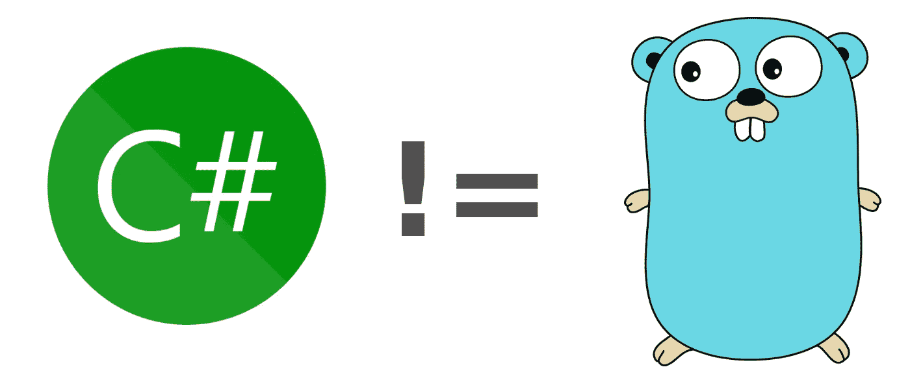

# 4 个会欺骗 C#开发者的 golang 代码片段！

> 原文：<https://itnext.io/4-golang-code-snippets-that-will-deceive-c-developers-6f50a31f0548?source=collection_archive---------0----------------------->

## 学习新的编程语言就像学习一门新的口语。当事情听起来相同，意思相同时，它们之间的相似性就变得非常方便。但是，如果情况不是这样，这一切就会土崩瓦解。

在口语中，这被称为*假同源词，*看起来或听起来一样，但意思完全不同的词。比如英语中的动词*到* ***假装*** 和葡萄牙语中的 ***假装*** *呃*。他们看起来很相似，但后者在英语中翻译成*意为*。当你真的认为你在说你打算做某事，而你实际上说的是你在假装时，这会导致各种尴尬的局面。去过那里，做过那个！:)

编程语言也有同样的问题。例如，C#和 golang 有许多相似之处，这使得 c#开发人员学习 golang 并不困难。然而，当用 C#思维思考时，有一些细微之处会导致意想不到的行为。

下面是 4 个可能会欺骗经验丰富的 c#开发人员的差异:

# 1.带有可重复使用外壳的开关

在 golang 中，`switch`语句不需要在每个`case`后加上`break`或`return`。像在 C#中一样，按顺序处理几个案例将导致只处理最后一个案例:

为了在 C#中获得与您期望的相同的结果，每个`case`处理的不同选项需要用逗号分隔:

这看起来真的很棒！

# 2.int！= int32

在 C#中`int`是`System.Int32`的别名。这些术语经常被互换使用。在 Golang 中，它们是完全不同的类型，这意味着下面的代码无法编译:

在 Golang 中，`int`类型*可能*会根据其运行的 CPU 而变化:

> 在 32 位系统上，`int`、`uint`和`uintptr`类型通常是 32 位宽，在 64 位系统上是 64 位宽。当你需要一个整数值时，你应该使用`int`,除非你有特殊的理由使用一个有大小的或者无符号的整数类型。

# 3.ifs 可以重新定义变量的含义

在 if 语句中使用操作符`:=`将创建新的临时变量，忽略相同上下文中可能存在的同名变量。在下面的例子中，`exists`不会是第三个`if`语句中的`true`。

为了避免这种情况，应该使用操作符`=`，这意味着`exists`和`err`都需要提前声明。相反，您可以通过将整个`fileExists`调用放在`if`语句之前来保留`:=`操作符:

官方文档清楚地表明这是预期的行为:

> 与常规变量声明不同，短变量声明可以*重新声明*变量，前提是它们最初是在同一个块中声明的…
> 
> 在某些上下文中，如用于 ["if"](https://golang.org/ref/spec#If_statements) 、 ["for"](https://golang.org/ref/spec#For_statements) 或 ["switch"](https://golang.org/ref/spec#Switch_statements) 语句的初始值设定项，它们可用于声明局部临时变量。

还要注意，正如上面的引用所阐明的那样，这并不特定于 if 语句。

# 4.不完全是 C#枚举

这是最不相似的片段。但是在 Golang 中，类似 enum 的东西的实现将基于一个新的`type`和新创建的`type`的几个常量。然而，当用 C#思维思考时，编译器不会像您所期望的那样强制这样做:

上面的`type`语句根据表示的*定义了 Weekday，同时将其关联到一个实际类型，在本例中是`string`。在一个没有枚举的世界里，阅读那些特定的字符串*表示*工作日确实会更清楚。然而，编译器不会强制要求`print`只接收`Weekday`对象，而是关注底层类型。*

来自社区的请求([添加 sum 类型](https://github.com/golang/go/issues/19412)，[添加类型化的 enum 支持](https://github.com/golang/go/issues/19814))将 enum 特性引入 golang，但这些讨论仍在进行中。

一般来说，有相当多的东西可以用两种语言以相同的方式编码。但是对于任何一个从 Go 开始的人来说，底线是不要假设一个有效的 c#语法在 golang 中会有相同的行为。

从基础做起，从头开始培养你的技能，你一定会一路走好。:)

图片来源:[雷内·弗伦奇](https://github.com/egonelbre/gophers)