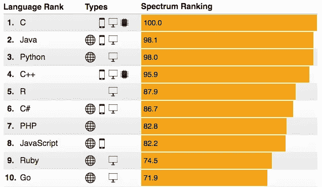

# 大数据项目中最常用的 4 种语言:R

> 原文：<https://itnext.io/4-most-used-languages-in-big-data-projects-r-26c64027da69?source=collection_archive---------0----------------------->

本文是关于大数据项目编程语言系列的第三部分。本系列中发表的其他文章可以在此处找到:

> [#1:大数据项目中使用最多的 4 种语言:Java](https://www.linkit.nl/knowledge-base/177/4_most_used_languages_in_big_data_projects_Java)
> 
> [#2: 4 大数据项目中使用最多的语言:Python](https://www.linkit.nl/knowledge-base/196/4_most_used_languages_in_big_data_projects_Python)
> 
> [#4: 4 大数据项目中使用最多的语言:Scala](https://www.linkit.nl/knowledge-base/255/4_most_used_languages_in_big_data_projects_Scala)

[Java](https://www.oracle.com/java/index.html) 、 [Python](https://www.python.org/) 、 [R](https://www.r-project.org/) 、 [Scala](http://www.scala-lang.org/) 是大数据项目中常用的。在一系列文章中，我将简要描述这些语言以及它们在数据科学家中流行的原因。 [Java](/knowledge-base/177/4_most_used_languages_in_big_data_projects_Java) 和 [Python](/knowledge-base/196/4_most_used_languages_in_big_data_projects_Python) 在之前的文章中有描述。本文关注 R，并提供了这种语言的概述，以及为什么它在大数据项目中很常见。

## 稀有

R 不仅仅是一种编程语言，它还是一种数据操作、计算、模拟和图形显示的环境。尽管 R 主要用于统计分析，但它不仅仅局限于统计学。

在第三届年度 IEEE[2016](http://spectrum.ieee.org/computing/software/the-2016-top-programming-languages)顶级编程语言中排名第五的 r，学习曲线很陡；尤其是对于那些对其他编程语言有一些经验的人来说。

为了开始学习 R，UCLA 提供了一些有趣的资源。此外， [R for Data Science](http://r4ds.had.co.nz/) 介绍了使用 R 进行数据科学研究的必要工具。CRAN 还包含了[提供的文档](https://cran.r-project.org/other-docs.html)，其中包括 R 用户提供的几个手册、教程和参考卡。

下图摘自 IEEE Spectrum 的《2016 年顶级编程语言》。

R 编程语言，可以认为是 S 的不同实现，是一个 [GNU 自由软件项目](http://www.gnu.org/)。值得注意的是，有一些公司提供基于 R 的平台或在其软件中支持 R 的使用，包括[微软 R 服务器](https://www.microsoft.com/en-us/cloud-platform/r-server)，以前被称为 [Revolution R](http://blog.revolutionanalytics.com/2016/01/microsoft-r-open.html) 。

r 是通用的和多范例的。它支持数组、面向对象、命令式、[函数式](http://adv-r.had.co.nz/Functional-programming.html)、过程式和[反射式](https://www.r-bloggers.com/the-method-in-the-mirror-reflection-in-r/)编程。r 也是一种脚本和解释语言，允许使用函数进行分支、循环和模块化编程。R 环境中的命令行脚本允许存储一系列复杂的数据分析步骤，从而简化了对相似数据的分析工作的重用。

此外，R 还包含各种各样的统计过程的功能(包括线性和非线性建模、时间序列分析、分类、聚类、平滑…)以及一组用于创建各种数据表示的功能。这些功能通过包高度可扩展。

如前所述，R 是一种向量(数组)编程语言。R 中的[向量](https://cran.r-project.org/doc/manuals/r-release/R-intro.html#Simple-manipulations-numbers-and-vectors)的概念是 R 区别于大多数其他语言的独特之处。r 允许在单个操作中对向量应用函数，而不需要显式循环。因此，可以用一个命令对一组值执行复杂的操作。一般来说，R 将属性关联到所有的[数据结构](http://adv-r.had.co.nz/Data-structures.html)，因此每个向量、列表或函数都有一个将符号关联到值的隐藏映射。

R 的优势之一是它包含了许多额外的包。包是 R 函数和数据集的集合。这些包类似于 Python 的库，扩展了 R 代码库的核心能力。

## 包装

R 附带了一套[标准软件包](https://stat.ethz.ch/R-manual/R-devel/doc/html/packages.html)，它包含在 R 的安装中。[数千个](http://www.rdocumentation.org/)额外的用户创建的软件包主要可从[综合 R 归档网络(CRAN)](https://cran.r-project.org/web/packages/) 、 [Bioconductor](https://bioconductor.org/packages/3.4/BiocViews.html#___Software) (用于高通量基因组数据的分析和理解)、 [GitHub](https://cran.r-project.org/web/packages/githubinstall/vignettes/githubinstall.html) 和 [Omegahat](http://www.omegahat.net/) 获得。

这些包可以用于非常特殊的目的； [CRAN 任务视图](https://cran.r-project.org/web/views/)列出了广泛的领域，包括:遗传学、机器学习、医学成像分析、计量经济学、金融等等。

如前所述，R 包足够了。[r 文档](http://www.rdocumentation.org/?tap_a=5644-dce66f&tap_s=10907-287229)和 [MRAN](https://mran.microsoft.com/) (按名称浏览[包](https://mran.microsoft.com/packages/)或按主题区浏览[包)有助于搜索这些包。此外，在 r 中管理不同项目的已安装软件包是一个挑战。](https://mran.microsoft.com/taskview/) [Packrat](https://rstudio.github.io/packrat/) (用于管理软件包依赖性— [视频教程](https://www.rstudio.com/resources/webinars/managing-package-dependencies-in-r-with-packrat/))和[检查点](https://mran.revolutionanalytics.com/package/checkpoint/)(用于解决软件包可复制性的问题)非常有帮助。

值得注意的是，RStudio 有一个有用的[推荐包列表](https://support.rstudio.com/hc/en-us/articles/201057987-Quick-list-of-useful-R-packages)。

## 导入数据

可以将[不同类型的数据](https://cran.r-project.org/doc/manuals/r-release/R-data.html#Imports)导入 R:文本文件、平面文件、统计软件文件、数据库和网络数据。(DataCamp 博客有一个将数据导入 R — [第一部分](https://www.datacamp.com/community/tutorials/r-data-import-tutorial)和[第二部分](https://www.datacamp.com/community/tutorials/importing-data-r-part-two)的综合教程)

与 Python 不同，R 在 web 抓取方面并不通用。为了解决这个问题，[已经为 web 数据抽取建立了几个包](https://cran.r-project.org/web/views/WebTechnologies.html)，包括 [Rvest](https://cran.r-project.org/web/packages/rvest/index.html) 和 [RSelenium](https://cran.r-project.org/web/packages/RSelenium/index.html) 。

**一些有用的软件包:**

*   [readr](https://cran.r-project.org/web/packages/readr/index.html) :从磁盘(或连接)读取平面/表格文本文件
*   [xlsx](https://cran.rstudio.com/web/packages/xlsx) 、 [readxl 和](https://cran.r-project.org/web/packages/readxl/index.html) [XLConnect](https://cran.r-project.org/web/packages/XLConnect/) :提供读取、写入和格式化 Excel 数据功能的包
*   [have](https://cran.r-project.org/web/packages/haven/index.html):导入‘SPSS’、‘Stata’和‘SAS’文件
*   [外来](http://www.rdocumentation.org/packages/foreign):读写 Epi Info、Minitab、S、SAS、SPSS、Stata、Systat、Weka 存储的数据，以及读写一些 dBase 文件
*   [Rvest](https://cran.r-project.org/web/packages/rvest/index.html) :一个基本的 web 抓取包，它被设计用来与[magritter](https://cran.r-project.org/web/packages/magrittr/index.html)一起工作，以简化常见 web 抓取任务的表达——这些包几乎类似于 [Beautiful soup](https://pypi.python.org/pypi/beautifulsoup4) ，一个用于从 HTML 和 XML 文件中提取数据的 Python 库。
*   [RMySQL](https://cran.r-project.org/web/packages/RMySQL/) ， [RpostgreSQL](https://cran.r-project.org/web/packages/RPostgreSQL) ， [RODBC](https://cran.rstudio.com/web/packages/RODBC/) 和 [ROracle](https://cran.r-project.org/web/packages/ROracle/index.html) :用于连接关系数据库和从关系数据库导入的包。

## 数据预处理

在任何统计计算之前准备数据是至关重要的，而且需要很长时间。用于数据准备的内置函数非常丰富。然而，它们并不总是直截了当的。有几个软件包可以帮助数据预处理，包括[清理](https://cran.r-project.org/doc/contrib/de_Jonge+van_der_Loo-Introduction_to_data_cleaning_with_R.pdf)、缩放、居中、归一化、转换等等。

**一些有用的软件包:**

*   [整形 2](https://cran.r-project.org/web/packages/reshape2/index.html) :灵活重组和聚合数据
*   tidyr:reshape 2 的一个演化版本，专门用于数据整理(不是一般的整形或聚合)
*   [插入符号](http://topepo.github.io/caret/index.html):分类回归训练
*   [编辑规则](https://cran.r-project.org/web/packages/editrules/index.html):解析、应用和操作数据清理规则
*   [deducorrect](http://cran.r-project.org/web/packages/deducorrect/index.html) :自动数据清理方法的集合，其中记录了所有操作。
*   [MatchIt](http://cran.r-project.org/web/packages/MatchIt/index.html) :参数因果推断的非参数预处理
*   [clusterSim](https://cran.r-project.org/web/packages/clusterSim/index.html) :搜索数据集的最佳聚类过程

## 深入分析

r 无疑是统计、数据分析和机器学习的主要工具之一。根据[KD nuggets Analytics/Data Science 2016 年软件调查](http://www.kdnuggets.com/2016/06/r-python-top-analytics-data-mining-data-science-software.html)，R 仍然是分析和数据科学的领先工具(49%的份额)。

r 包含执行非平凡统计操作的函数，例如:回归、方差分析(ANOVA)、主成分分析(PCA)、神经网络、bootstrap、广义加法模型(GAM)、混合模型等。此外，R 在[统计建模](http://www.statslab.cam.ac.uk/~pat/redwsheets.pdf)中很强大。

r 也普遍用于数据分析；主要是在研究项目和单独的服务器上进行独立分析。虽然 R 函数包含基本的数据分析，但它真正的优势在于它拥有大量用于分析大数据集的包。

除了统计和分析任务，R 通常用于应用机器学习算法。它包含许多预测建模工具。还有几个在机器学习中有用的包。KDnuggets 有一个关于机器学习的下载量最高的 20 个 R 包的列表。

一些有用的软件包:

*   [gam](https://cran.r-project.org/web/packages/gam/index.html) :拟合和使用广义加法模型的函数
*   [dplyr](https://cran.r-project.org/web/packages/dplyr/index.html) 、 [plyr](https://cran.r-project.org/web/packages/plyr/index.html) 和 [data.table](https://cran.r-project.org/web/packages/data.table/index.html) :操作数据集的包
*   stringr :简单、一致的通用字符串操作包装器
*   [Hmisc](https://cran.r-project.org/web/packages/Hmisc/index.html) :包含数据分析、高级图形、实用操作等功能
*   [e1071](https://cran.r-project.org/web/packages/e1071/) :潜在类别分析、短时傅立叶变换、模糊聚类和…
*   [插入符号](https://cran.r-project.org/web/packages/caret/index.html):包含用于训练和绘制分类和回归模型的杂项函数— [使用 R 和插入符号包 Max Kuhn 的预测建模](https://www.r-project.org/nosvn/conferences/useR-2013/Tutorials/kuhn/user_caret_2up.pdf)
*   [igraph](https://cran.r-project.org/web/packages/igraph/index.html) :简单图形和网络分析的例程
*   [nnet](https://cran.r-project.org/web/packages/nnet/index.html) :用于单隐层前馈神经网络，以及多项式对数线性模型
*   [zoo](https://cran.rstudio.com/web/packages/zoo) 、 [xts](https://cran.rstudio.com/web/packages/xts) 和 [quantmod](http://www.quantmod.com/) 和 [lubridate](https://cran.r-project.org/web/packages/lubridate/index.html) :用于处理时间序列数据的包— [使用 lubridate 1.3.0](https://cran.r-project.org/web/packages/lubridate/vignettes/lubridate.html) 对 R 中的日期和时间做更多的事情
*   分类、回归和生存树的递归划分

## 数据后处理

后处理是提高结果可解释性的关键步骤。r 通常用于数据修剪、过滤、转换、合并、重缩放、拆分，甚至数据集成。这些例程改进了从先前阶段获得的不精确和有噪声的数据。

**一些有用的软件包:**

*   [arules](https://cran.r-project.org/web/packages/arules/index.html) :提供了表示、操作和分析交易数据和模式的基础设施
*   值得注意的是，在前面的阶段(预处理和深入分析)中使用的软件包被反复用于后处理。比如 [tidyr](https://cran.r-project.org/web/packages/tidyr/index.html) 、 [caret](https://cran.r-project.org/web/packages/caret/index.html) 、 [dplyr](https://cran.r-project.org/web/packages/dplyr/index.html) 和 [data.table](https://cran.r-project.org/web/packages/data.table/index.html) 等包，举几个例子。

## 数据可视化

数据可视化是后处理的一个组成部分。特别是，R 是为分析和统计任务以及[结果展示](http://faculty.ucr.edu/~tgirke/HTML_Presentations/Manuals/Rgraphics/Rgraphics.pdf)而构建的。r 拥有强大的环境以及广泛的[图形能力](https://cran.r-project.org/doc/contrib/usingR.pdf)，适用于[图形显示、动态图形、图形设备和可视化](https://cran.r-project.org/web/views/Graphics.html)。它还包含几个专门用于图形显示的包。

一些有用的软件包:

*   [ggplot2](https://cran.r-project.org/web/packages/ggplot2/index.html) :图形[语法的一个实现](http://vita.had.co.nz/papers/layered-grammar.pdf)
*   [plotly](https://cran.r-project.org/web/packages/plotly/index.html) :将 ggplot2 图形转换为基于网络的交互式版本和/或创建定制的基于网络的可视化
*   ggvis :基于网络的交互式图形，使用图形语法构建。
*   [rgl](https://cran.r-project.org/web/packages/rgl/index.html) :使用 OpenGL 的 3D 可视化
*   [htmlwidgets](http://www.htmlwidgets.org/) :用于构建交互式(基于 JavaScript)可视化
*   闪亮的:用于构建交互式网络应用
*   [rmarkdown](https://cran.r-project.org/web/packages/rmarkdown/index.html) :用于将 [R Markdown](http://rmarkdown.rstudio.com/) 文档转换成各种格式，包括 HTML、MS Word、PDF 和 Beamer，以创建定制报告
*   [仪表板](https://cran.r-project.org/web/packages/dashboard/index.html):与 D3.js 的交互式数据可视化
*   [googleVis](https://cran.r-project.org/web/packages/googleVis/index.html) : R 接口到 Google Charts API

总而言之，R 的优点和缺点如下:

## 优势

*   独立于平台— R 可以在 Windows、macOS、Linux 和 UNIX 平台上运行
*   广泛的[社区](http://stackoverflow.com/questions/tagged/r)——一个全球性的协作社区，包括支持和维护 R
*   综合文件，如[R 简介](https://cran.r-project.org/doc/manuals/R-intro.html)和 [CRAN 提供的文件](https://cran.r-project.org/other-docs.html)
*   [动态、功能和面向对象](http://r.cs.purdue.edu/pub/ecoop12.pdf)
*   集成:

1.  其他语言如 C、C++、Java、Python — [Rcpp](https://cran.r-project.org/web/packages/Rcpp/index.html) 、 [rJava](https://cran.r-project.org/web/packages/rJava/index.html) 、 [Rserve](https://cran.r-project.org/web/packages/Rserve/index.html) 、 [rPython](https://cran.r-project.org/web/packages/rPython/index.html)
2.  数据源包括 ODBC — [RODBC 包](https://cran.r-project.org/web/packages/RODBC/index.html)
3.  统计软件包，如 SAS、Stata、SPSS 和 Minitab — [RStata](https://cran.r-project.org/web/packages/RStata/index.html) 和 [foreign](https://cran.r-project.org/web/packages/foreign/index.html)

*   高度可扩展—通过函数、[用户定义函数(UDF)](https://www.r-bloggers.com/how-to-write-and-debug-an-r-function/) 、扩展和几个集成桌面环境(ide)
*   开源 IDE 和 GUI 如: [RStudio](https://www.rstudio.com/) ， [StatET](http://www.walware.de/goto/statet) (一个基于 [Eclipse](http://www.eclipse.org/eclipse) 的 IDE)， [Rattle](http://rattle.togaware.com/) ， [Sublime Text](https://www.sublimetext.com/) ， [ESS](http://ess.r-project.org/) ， [JGR](https://www.rforge.net/JGR/) ， [RKWard](https://rkward.kde.org/) ，[推演器](http://www.deducer.org/pmwiki/pmwiki.php?n=Main.DeducerManual)， [Tinn-R](http://nbcgib.uesc.br/lec/software/editores/tinn-r/en) ， [playwith](https://cran.r-project.org/web/packages/playwith/index.html)
*   显式并行性——多个软件包提供了并行计算所需的通信层，参见[高性能和并行计算与 R](https://cran.r-project.org/web/views/HighPerformanceComputing.html)
*   [再现性](http://adv-r.had.co.nz/Reproducibility.html)和分析的可再现性— [可再现包](https://cran.r-project.org/web/views/ReproducibleResearch.html)
*   兼容—支持多种文件格式，并且能够导入多种格式
*   出色的图形可视化技术

## 不足之处

*   r 有非常规的语法，很难理解，特别是对于那些对另一种编程语言有一些经验的人来说。
*   r 是一种解释型语言，因此代码通常比同等的编译代码运行得慢

如果你喜欢这篇文章，你可能也想看看我之前的两篇关于在大数据项目中使用 [Java](https://www.linkit.nl/knowledge-base/177/4_most_used_languages_in_big_data_projects_Java) 和 [Python](https://www.linkit.nl/knowledge-base/196/4_most_used_languages_in_big_data_projects_Python) 的文章。本系列的下一篇文章将讨论编程语言 Scala 在大数据项目中的使用。在 [LinkedIn](https://www.linkedin.com/company/14975) 、 [Twitter](https://twitter.com/LINKITGroup) 上关注我们，或者订阅时事通讯，以便在本系列的下一篇文章发表时得到通知。