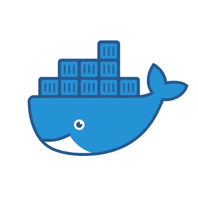

# 4 个同时运行多个 Node.js 或 NPM 命令的解决方案

> 原文：<https://itnext.io/4-solutions-to-run-multiple-node-js-or-npm-commands-simultaneously-9edaa6215a93?source=collection_archive---------0----------------------->

# 在某些时候，每个人都有这个问题…


节点和 NPM:他们就像花生酱和果冻。

# 有趣的是，NPM 并没有提供一个直接的方法来同时运行多个脚本

我们都经历过——你打开一个本地开发的应用程序，你需要同时运行你的 Express/Node.js 后端服务器和你的 React UI 服务器，但是为了做到这一点，你必须打开两个终端(或更多)窗口，通过命令行进入两个不同的文件并运行两个不同的启动命令。

听起来熟悉吗？要是有更好的方法就好了…

# 解决方案

很简单，是更好的方法。就像今天 web 开发中的所有好东西一样，有一千种不同的方法可以达到相同的目的。

> 今天，我将分享同时运行多个 Node.js 命令或 NPM 脚本的四种方法。

准备好了吗？好的，让我们过一遍。

## 选项 1: Bash &&链式命令


好老巴什，打不过命令行。

这个解决方案是最简单的，不需要额外的 NPM 软件包或其他软件——它实际上只是命令行外壳。

有趣的事实:在一个`package.json`文件中的`"scripts”`实际上只是将在一个操作系统的外壳中运行的终端命令(像 Bash)。因此，通过使用标准的 shell 语法，您可以通过调用与这些组合值相关联的键，将 NPM 运行的命令链接在一起——参见下面的例子。

在您的 NPM 脚本中，在`"start"`命令中，或者您想用来运行您的服务器的任何东西中(当然，前提是它们在同一个 repo 中)，就像这样将您的两个启动脚本链接在一起。

```
"scripts": {
    "start": "react-scripts start",
    "dev": "(cd server && npm run start) & npm run start"
  }
```

其工作方式是，在项目的根级别是我的 React 项目(当您在终端中键入`npm run start`时，`"react-scripts start"`命令在 shell 中执行，其中的一个级别是一个名为`server`的文件夹，该文件夹保存用于代理调用所有后端微服务的 Node.js 服务器，并且由于它自己的`package.json`而在根级别启动相同的命令。

下面是一个非常简单的项目结构图，供参考:

```
root/ 
├── package.json 
├── server/ 
| ├── package.json
```

正如您所看到的，项目的两个级别都有单独的`package.json`文件，它们有自己的依赖项和单独的 NPM 启动脚本，但是通过简单地将这两个文件链接在一起并在它们之间放置`&`，两个节点命令都可以运行。

此外，使用`&&`意味着脚本将等到服务器成功启动后再启动客户端 React 应用程序(因为 bash 中的`&&`意味着`&&`两边的值必须为真)。如果服务器由于某种原因不能启动，整个 NPM 命令将会失败，并且如果它的后端服务器没有准备好，UI 将不会启动。

这是在不同文件位置同时运行多个 Node.js 命令的最快、最简单、最内置的方式。

现在，我将继续介绍几个 NPM 包，它们使得这个过程更加简单，并且不需要 Bash 知识。

## 选项 2:同时进行


NPM 套餐#1:并发

我将向你介绍的第一个 NPM 包叫做[兼](https://www.npmjs.com/package/concurrently)。它的名字很简单:它同时运行多个命令。😝

就定制而言，它不如我的下一个 NPM 软件包推荐 NPM-Run-All 强大，但我认为大多数时候(希望如此)所有额外的配置都是不必要的。

在运行`npm i concurrently`来安装它之后，您可以设置您的 NPM 启动脚本来运行多个命令，只需用引号将每个单独的命令分开。

所以在一个`package.json`文件中，你的`"scripts”`命令可能看起来像这样，(注意这里需要转义引号):

```
"scripts": {
    "start": "react-scripts start",
    "dev": "concurrently \"cd server && npm run start\" \"npm run start\""
  }
```

再说一次，你应该去比赛了。同样值得注意的是，在 Concurrently 被全局安装后，您也可以在命令行中运行这些相同类型的命令，并在每个参数周围加上引号。

我还建议查看一下[文档](https://github.com/kimmobrunfeldt/concurrently#readme),了解更多可以用它做的很酷的技巧，比如缩短命令、支持通配符等等。

## 选项 3:NPM-运行-所有


NPM 套餐#2: npm-run-all

接下来，这个套餐是 NPM 的另一个热门选择，叫做 [NPM 全能](https://www.npmjs.com/package/npm-run-all)。

> npm 页面宣称 npm-run-all 是“并行或顺序运行多个 NPM 脚本的 CLI 工具”

这与并发的工作原理类似，但是语法略有不同，npm-run-all 展示了它如何缩短一个很长的单开始命令，例如:`npm run clean && npm run build:css && npm run build:js && npm run build:html`

成:`npm-run-all clean build:*`

安装 npm-run-all CLI 可以通过 npm 或 Yarn: `npm install npm-run-all — save-dev`安装，一旦安装，它拥有三个不同的命令，根据您的需要:

*   [npm-run-all](https://github.com/mysticatea/npm-run-all/blob/HEAD/docs/npm-run-all.md) (主命令，包含所有可以通过命令行传递的标志和附加内容的文档)
*   run-s(顺序运行——当您需要在下一个命令开始之前完成一个命令时)
*   run-p(并行运行——比如当应用程序的 UI 和服务器部分需要并行运行时)。

例如，如果`package.json`脚本如下所示:

```
{
    "scripts": {
        "clean": "rimraf dist",
        "lint":  "eslint src",
        "build": "babel src -o lib"
    }
}
```

那可能成为与 npm-run-all: `npm-run-all clean lint build`。

根据您的需求，并行和顺序运行的组合也可以变得更加有趣。更多详情参见[文档](https://github.com/mysticatea/npm-run-all/blob/HEAD/docs/npm-run-all.md)。

很简单，对吧？

现在，关于一次运行多个 NPM 命令的最后一个选项，Docker。

## 选项 4:Docker-撰写



最终的解决方案——在左边一点的地方:Docker。

Docker 和 Docker-Compose 是完全不同的文章，我已经详细介绍过了，这里的[和这里的](/docker-101-fundamentals-the-dockerfile-b33b59d0f14b)和[在 Medium 上。如果你不熟悉 Docker 这个虚拟集装箱化平台，我建议你去看看这两个网站。如果使用得当，这是一个非常强大和有效的工具。](/docker-102-docker-compose-6bec46f18a0e)

在本文中，我将把 Docker 对话特别集中在`Dockerfile`上，而不是`docker-compose.yml`，这是 Docker 难题的另一部分。

Docker 文件提供了用户可以在命令行上调用的所有指令和命令，以组装 Docker 映像。本质上，它定义了一个应用程序的环境，因此它可以在任何地方复制。

`docker-compose.yml`定义了组成应用的服务，因此它们可以在一个隔离的环境中一起运行。这是一个独立的部分，与本文的重点无关。

**注意:**如果您想更深入地了解如何使用 docker-compose 来改进您在较低生命周期甚至生产中的应用程序开发，请参阅我写的关于这个主题的文章。

你还可以看到我的 [MERN 项目 repo](https://github.com/paigen11/mysql-registration-passport) ，它使用 docker-compose 使自己旋转起来，完成了一个在本地运行的 MySQL 数据库实例。

不过，就 Docker 文件而言，在您的机器上安装了 Docker[之后，编写一个完整的 JavaScript 项目就非常简单了。](https://runnable.com/docker/)

下面是我的 React UI ( `client/`文件夹)和 Node.js 后端(`api/`文件夹)的文件结构，供文件结构参考。

```
root/
├── server/ 
├── client/ 
├── docker/ 
├── docker-compose.yml 
├── Dockerfile
```

这是整个 Dockerfile 文件的内容。

**Dockerfile**

```
FROM node:9
WORKDIR /app
CMD ls -ltr && npm install && npm start
```

下面是上面几行中发生的事情:

*   从 Docker hub 下载 Node.js 版本，
*   定义每个应用程序的工作目录(都在各自容器的根目录下，名为`/app`)，
*   NPM 使用各自的`package.json`文件安装所有的依赖项，一旦下载完依赖项，启动应用程序(两者的`"scripts"`中都有一个`npm start`命令)。

就是这样。这就是所需要的，因为`docker-compose`告诉多个应用程序(`server/`和`client/`)如何构建自己，在哪里安装所需的卷，向外部环境开放端口，获取数据库等所需的 Docker 映像。

我建议查看我的 Docker 驱动的[项目报告](https://github.com/paigen11/mysql-registration-passport),看看我上面描述的更多例子。

从其他解决方案中一次运行多个 NPM 脚本有一点不同，可能会有更多的初始开销，但这是可行的，如果你熟悉 Docker 的许多好处，这是一种非常好的项目运行方式。

# 结论

无论您选择哪种解决方案，这都是每个 JavaScript 开发人员都会遇到的问题。您需要一个配置文件在您的服务器启动之前运行，您需要两台服务器并行运行以处理 UI 视图和 API 调用，您需要 watcher 文件在您更改文件时保持运行——这有一百万个原因。不管具体的场景如何，最终有一天，同时运行多个 Node.js 命令或 NPM 脚本会很有好处。

您可以使用多个打开的终端实例手动完成这项工作，也可以使用我上面建议的解决方案之一。一个是纯 shell 脚本，两个是流行的、稳定的 NPM 包，一个是非常遥远但非常强大的解决方案，使用 Docker 来封装和运行多个应用程序。

过几周再来看看，我会写一些关于 Reactjs 或者其他与 web 开发相关的东西，所以请关注我，这样你就不会错过了。

感谢阅读，我希望这能给你一些新的想法，告诉你如何在需要的时候运行你自己的同步 NPM 脚本。如果你觉得有帮助，请与你的朋友分享！

如果你喜欢读这篇文章，你可能也会喜欢我的其他一些博客:

*   [用最简单的方法保持开发人员之间的代码一致——用更漂亮的& ESLint](/keep-code-consistent-across-developers-the-easy-way-with-prettier-eslint-60bb7e91b76c)
*   [通过设置同步](/settings-sync-with-vs-code-c3d4f126989)，您可以随时随地轻松配置 VS 代码
*   [使用 Docker & Docker Compose 改进您的全栈应用开发](https://medium.com/@paigen11/using-docker-docker-compose-to-improve-your-full-stack-application-development-1e41280748f4)

**参考资料和更多资源:**

*   兼任:[https://www.npmjs.com/package/concurrently](https://www.npmjs.com/package/concurrently)
*   https://www.npmjs.com/package/npm-run-all
*   Docker 撰写文档:[https://docs.docker.com/compose/](https://docs.docker.com/compose/)
*   Docker-Compose 示例 Repo，Github:[https://github.com/paigen11/mysql-registration-passport](https://github.com/paigen11/mysql-registration-passport)