# Android Dot TabItem 的 4 个步骤

> 原文：<https://itnext.io/4-steps-to-android-dot-tabitem-dadeeef44f51?source=collection_archive---------0----------------------->

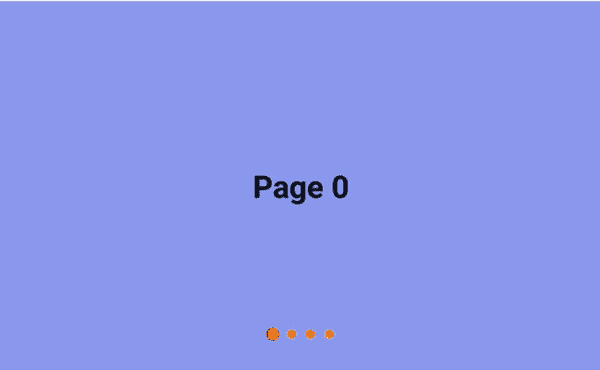

常规表格演示示例

`TabItem`是用于显示当前标签的图标和标题的指示器。它与`ViewPager`或`ViewPager2`一起被广泛使用。它总是被一个`TabLayout`包裹着，它配置了每个`TabItem`的外观。

除了**图标**和**标题**展示外，还有一个**点展示**，需要对可绘制状态列表和[形状可绘制](https://developer.android.com/guide/topics/resources/drawable-resource#Shape)有所了解。

在这篇文章中，我将通过 4 个步骤来演示如何设置以下两种圆点`TabItem`样式。

## 风格 1:

当前选择的`TabItem`被离散高亮显示。

## 风格 2:

当`ViewPager`中选择的页面改变时，点转换是连续的。

# 开始前

假设`TabLayout`已经与`ViewPager`或`ViewPager2`绑定。看看下面的文章，设置一个`ViewPager2`。

 [## Android ViewPager2 和 TabLayout

### ViewPager2 是在今年的 2019 Google I/O 中推出的，它取代了旧的 ViewPager，后者是在…

medium.com](https://medium.com/@myrickchow32/android-viewpager2-tablayout-3099aae2f396) 

# 了解 TabLayout 的设置

TabLayout 是一个`ViewGroup`，它包含一个`TabItem`列表，并配置每个选项卡的位置和外观。

以下属性将被覆盖:

## `1\. app: tabIndicator`

输入一个可绘制的引用来配置选项卡指示器的高度外观。Android OS 默认显示一个`2dp`粗的底部标签指示器。

## 2.app:tabGravity

默认情况下，一个`TabLayout`用`TabItem` s 填充它的整个空间，就像一个`LinearLayout`的所有子节点都有`android:weight="1"`一样。

该属性将被设置为`center`以将所有选项卡分组到 TabLayout 的中心。

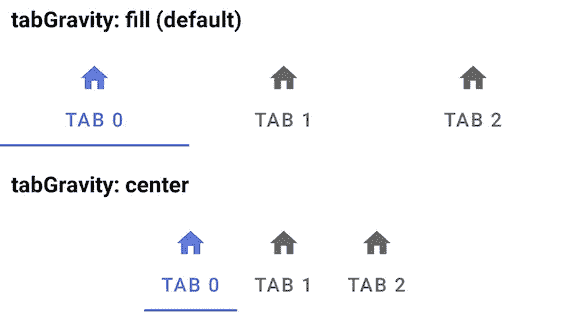

## 3.应用程序:tabPaddingStart &应用程序:tabPaddingEnd

默认情况下，当`app:tabGravity`设置为`center`时，每个`TabItem`中都有`12dp`开始和结束填充。换句话说，最小的标签宽度是`24dp` ( `12dp` x 2)。它将根据每个标签所需的宽度进行设置。

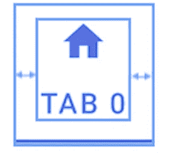

## 4.app:tabBackground

选项卡背景将被设置为一个状态列表，可以用`selected`和`default`状态绘制。请参见下面的示例:

# 逐步—样式 1 表格布局(当前选择的`TabItem`被单独突出显示)

## 1.app:tab background = " @ drawable/selector _ tab _ indicator _ dot "

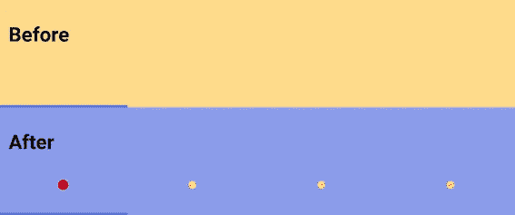

在`selector_tab_indicator_dot.xml,`内有两个形状图，定义了在`selected`和`default`状态下点的外观。

1.  `android:shape=”ring"`:将形状从矩形(默认)改为具有内半径的环形。
2.  `android innerRadius="0dp`:定义环被填满，没有内部空间。
3.  `android:thickness="4dp"`定义了圆点的半径。
4.  `android:useLevel="false"`既然不是`LevelListDrawable`。

## 2.app:tabGravity="center "

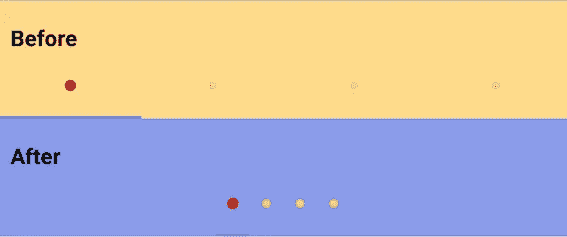

将所有的`TabItem`集中到`TabLayout`的中心。

## 3.app:tabIndicator="@null "

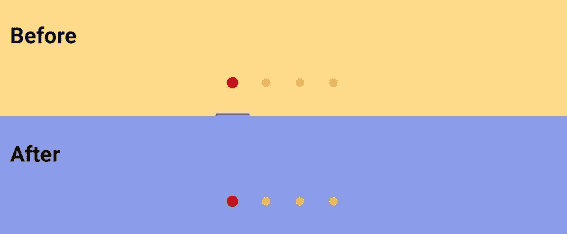

隐藏或禁用制表符指示器。

## 4.app:tabPaddingStart & app:tabpaddingnd = " 6dp "

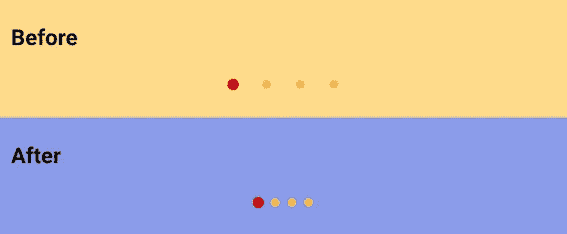

如前所述，在每个`TabItem`中有`12dp`默认开始和结束填充。覆盖这些属性可以改变`TabItem`的宽度。

由于每个点都有`4dp`半径，并且应该有`2dp`水平填充，因此每个`TabItem`的总宽度应该是`12dp` (( `4dp` + `2dp` ) x 2)。

## 搞定了。

# step by step—Style 2 tabulayout(当`ViewPager`中选择的页面改变时，点过渡是连续的。)

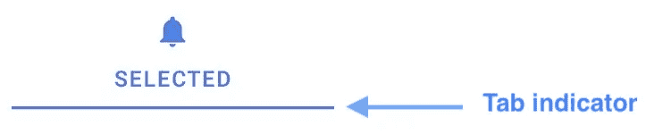

此`TabLayout`的实现与之前的样式类似(当前选中的`TabItem`被离散高亮显示)，基本上依靠 tab 指示器进行点过渡。只有 4 处变化，见下文:

## 1.**app:tabIndicator = " @ drawable/background _ tab _ indicator "**

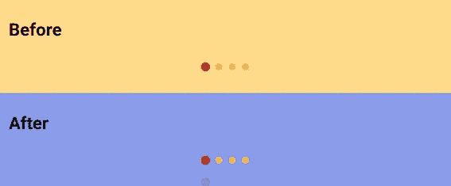

选项卡指示器必须通过设置一个可绘制的引用来重新启用。`<size>`设置了一个高度参数，用来定义标签页指示器的高度。默认是`2dp`。

## 2.app:tab background = " @ drawable/background _ amber _ dot _ 3dp "

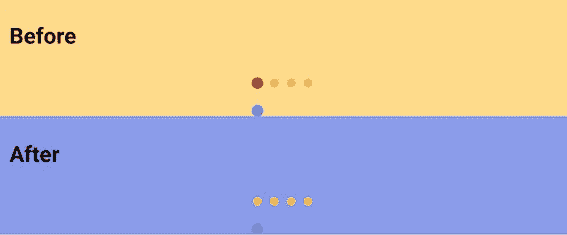

这种风格不需要一个可绘制为`TabItem`背景的状态列表，因为高亮显示的点现在由选项卡指示器处理。

## **3。app:tabindicator color = " @ Android:color/holo _ red _ dark "**

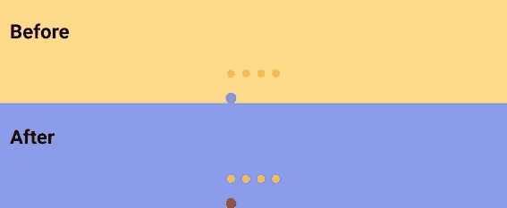

选项卡指示器颜色必须设置在`View`级别，而不是在步骤 1 中可绘制的形状。

## **4。app:tabindicator gravity = " center "**

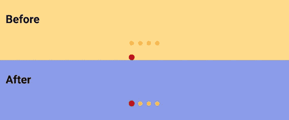

一个`TabLayout`总共有 4 个标签指示器重力。`center`和`stretch`在这种风格下都是可以接受的，因为指示器的高度已经在步骤 1 的可绘制形状中定义。

## 搞定了。

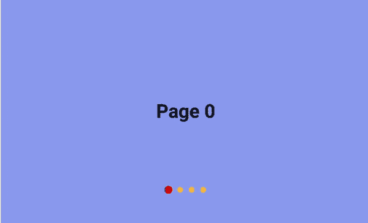

# 结论:

市面上设计的`TabLayout`有很多种。上面说的两种`TabLayout`风格最常见。

## 样式 1 的属性(当前选择的`TabItem`被单独突出显示)

1.  **app:tab background = " @ drawable/selector _ tab _ indicator _ dot "**
    定义`selected`和`default`两种状态的形状可绘制性。
2.  **app:tab gravity = " center "**
    水平居中`TabLayout`内的所有`TabItem`
3.  **app:tabIndicator = " @ null "**
    隐藏标签指示器
4.  **app:tabbaddingstart&app:tabbaddingen = " 6dp "**
    覆盖默认水平填充

## 样式 2 的属性(点过渡添加到当前选项卡)

1.  **app:tabIndicator = " @ drawable/background _ tab _ indicator _ dot _ blue "** 点状可画的形状，无内半径。
2.  **app:tab background = " @ drawable/background _ amber _ dot _ 3dp "** 一个简单的形状可绘制，而不是状态列表可绘制
3.  **app:tabIndicatorColor = " @ Android:color/holo _ red _ dark "** 覆盖标签指示器颜色。
4.  **app:tabindicator gravity = " center "** 在`TabItem`边界内垂直居中标签指示器
5.  **app:tab gravity = " center "**
    水平居中`TabLayout`内的所有`TabItem`
6.  **app:tabbaddingstart&app:tabbaddingnd = " 6dp "**
    覆盖默认水平填充

# 进一步阅读:

1.  [谷歌文档—可绘制形状](https://developer.android.com/guide/topics/resources/drawable-resource#Shape)
2.  [材料设计—表格布局](https://material.io/develop/android/components/tab-layout/)
3.  `TabLayout`和`ViewPager2`之间的设置

 [## Android ViewPager2 和 TabLayout

### ViewPager2 是在今年的 2019 Google I/O 中推出的，它取代了旧的 ViewPager，后者是在…

medium.com](https://medium.com/@myrickchow32/android-viewpager2-tablayout-3099aae2f396) 

4.通常将`ViewPager`设置为水平边距，同时保持上一页和下一页对用户可见。但是`ViewPager2`中缺少该功能，默认情况下缓存机制被禁用。让我们看看如何解决这个问题。

 [## Android ViewPager2，页面空白美观

### ViewPager2 无法直接设置页边距，其内部 RecyclerView 对开发人员是私有的。我们如何绕过…

medium.com](https://medium.com/@myrickchow32/android-viewpager2-with-pretty-page-margin-bfae8dd397a8) 

5.`TabLayout`和`TabItem`的可用属性

 [## Android TabLayout 和 TabItem

### 设计一个 TabLayout 的样式并不像您想象的那么简单。Google 官方文档与材料组件不同步…

medium.com](https://medium.com/@myrickchow32/android-tablayout-and-tabitem-268ac06ba966) 

欢迎您关注我的[Twitter @ my rik _ chow](https://twitter.com/myrick_chow)了解更多信息。感谢您阅读这篇文章。祝您愉快！😄