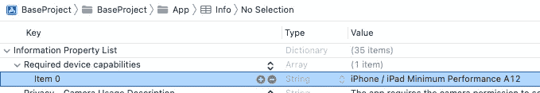
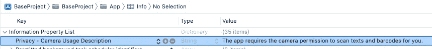
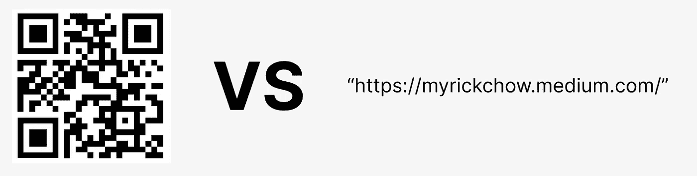
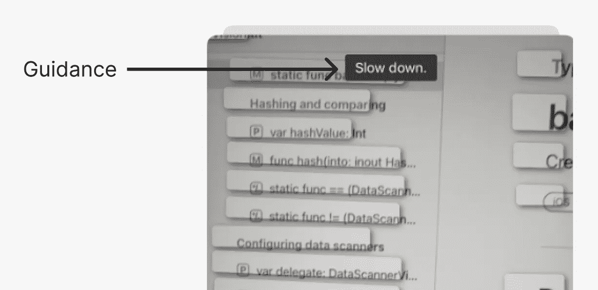
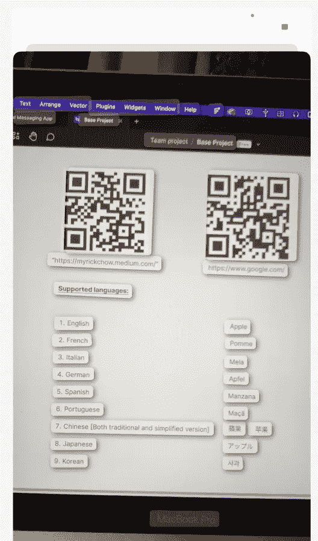

# iOS 文本和二维码识别的 4 个步骤

> 原文：<https://itnext.io/4-steps-to-ios-text-qr-code-recognition-ffb29d1d6c03?source=collection_archive---------1----------------------->

## 9 种语言的文本&支持 1D 和 2D 条形码

2022 年WWDC，苹果发布 [**VisionKit**](https://developer.apple.com/documentation/visionkit) 的`[DataScannerViewController](https://developer.apple.com/documentation/visionkit/datascannerviewcontroller)`。它是一个无需网络连接即可在本地检测文本和条形码的`UIViewController`**。回答率和准确率都很高。它支持以下所有 9 种语言:**

1.  英语
2.  法语
3.  意大利的
4.  德国人
5.  西班牙语
6.  葡萄牙语
7.  中文[繁体及简体版本]
8.  日本人
9.  韩国的

> **注意:**
> 但是，使用该功能有一些限制。例如，iOS 设备**必须**拥有 **A12 或更新的仿生芯片**，并运行 **iOS 16 或更新版本**。
> 参考:[苹果官方文档](https://developer.apple.com/documentation/visionkit/datascannerviewcontroller)

如果你在应用中使用[谷歌云视觉 API](https://cloud.google.com/vision/?utm_source=google&utm_medium=cpc&utm_campaign=japac-HK-all-en-dr-bkwsrmkt-all-all-trial-e-dr-1009882&utm_content=text-ad-none-none-DEV_c-CRE_602321688387-ADGP_Hybrid%20%7C%20BKWS%20-%20EXA%20%7C%20Txt%20~%20AI%20%26%20ML%20~%20Vision%20AI_Vision-google%20ocr%20api-KWID_43700071566052438-aud-1644542956028%3Akwd-39951629344&userloc_9061629-network_g&utm_term=KW_google%20ocr%20api&gclid=Cj0KCQjwwfiaBhC7ARIsAGvcPe6XJN79tCdGqommhiuCEvqJ7OWkoP43rt9glru3NYlJ17w8wsKE0i0aAjV1EALw_wcB&gclsrc=aw.ds) 或[亚马逊认知 API](https://docs.aws.amazon.com/rekognition/latest/dg/text-detection.html) ，你可能会通过实现`[DataScannerViewController](https://developer.apple.com/documentation/visionkit/datascannerviewcontroller)`节省很多钱。你只需要 4 个**步骤**来设置整个功能。让我们一起深入了解最新的技术！

# 4 步设置

## 步骤 1)检查 iOS 设备是否受支持。

如上所述，只有安装了**A12 或更新仿生芯片**的设备才能使用`DataScannerViewController`。我们需要事先检查一下。

以下设备于 2018 年发布，是第一批安装 A12 仿生芯片的设备:

1.  iPhone XS
2.  iPhone XS Max
3.  iPhone XR
4.  iPad Mini(第五代)
5.  iPad Air(第三代)
6.  iPad(第八代)

> **高级提示—应用可用性问题**
> 
> 如果 DataScannerViewController 是您的应用程序的关键功能，您可以通过在 info.plist 的“ **iPhone / iPad 最低性能 A12** ”到“**所需设备功能**”项中包含“**iPhone/iPad 最低性能 A12**

## 步骤 2)请求视频许可。

将`Privacy — Camera Usage Description`键和值添加到`info.plist`，并使用以下代码请求相机许可。

> **注意:**
> 确保在**主线程**中出现 DataScannerViewController，否则会出现运行时错误。

> **温馨提示:如何设置不同语言的权限信息？**
> 您可以通过
> 1 本地化相机使用说明。创造一个`InfoPlist.strings`T24 2。用不同的语言消息本地化`NSCameraUsageDescription`键
> 参考: [**苹果开发者论坛**](https://developer.apple.com/forums/thread/76633)

## 步骤 3)构造 DataScannerViewController

`DataScannerViewController`有 7 个属性，可针对不同目的进行配置。但是，它们在运行时都是不可变的。我们只能在构造函数中设置它们。

1.  `[recognizedDataTypes](https://developer.apple.com/documentation/visionkit/datascannerviewcontroller/3941755-recognizeddatatypes)`

一套`RecognizedDataType`，可包括`[text](https://developer.apple.com/documentation/visionkit/datascannerviewcontroller/recognizeddatatype/3941720-text)`和`[barcode](https://developer.apple.com/documentation/visionkit/datascannerviewcontroller/recognizeddatatype/3941717-barcode) **(both 1D & 2D barcodes)**`选项

2.`[qualityLevel](https://developer.apple.com/documentation/visionkit/datascannerviewcontroller/3941754-qualitylevel)`【默认:`.balanced`
。`balanced`
。`fast` —速度优先于精度
。`accurate`—准确性优先于速度

3.`[recognizesMultipleItems](https://developer.apple.com/documentation/visionkit/datascannerviewcontroller/3941757-recognizesmultipleitems)`【默认:`false`

4.`[isHighFrameRateTrackingEnabled](https://developer.apple.com/documentation/visionkit/datascannerviewcontroller/3941745-ishighframeratetrackingenabled)`【默认:`true` ]

5.`[isPinchToZoomEnabled](https://developer.apple.com/documentation/visionkit/datascannerviewcontroller/3941747-ispinchtozoomenabled)`【默认:`true` ]

6.`[isGuidanceEnabled](https://developer.apple.com/documentation/visionkit/datascannerviewcontroller/3941744-isguidanceenabled)`【默认:`true`

7.`[isHighlightingEnabled](https://developer.apple.com/documentation/visionkit/datascannerviewcontroller/3941746-ishighlightingenabled)`【默认:`false`

## 第 4 步)出示并开始扫描

然后，我们可以呈现`dataScannerViewController`，并在它完全呈现给用户后开始扫描文本和条形码。

## 🎉最后—让我们运行并看看结果

所有的文字和条形码都能正确扫描！

# 高级功能—管理识别的文本和条形码信息

为了获得识别的文本和条形码，我们必须实现`[DataScannerViewControllerDelegate](https://developer.apple.com/documentation/visionkit/datascannerviewcontrollerdelegate)`来监听来自`DataScannerViewController`的事件触发。

一旦 iOS 检测到任何新的识别文本或条形码，就会触发[添加](https://developer.apple.com/documentation/visionkit/datascannerviewcontrollerdelegate/3941769-datascanner)回调:

然而，一旦扫描了任何新的帧，iOS 可以使用新的计算结果更新或删除已识别的文本和条形码。因此，我们还应该实现 [didUpdate](https://developer.apple.com/documentation/visionkit/datascannerviewcontrollerdelegate/3941772-datascanner) 和 [didRemove](https://developer.apple.com/documentation/visionkit/datascannerviewcontrollerdelegate/3941770-datascanner) 回调:

# 结论

`DataScannerViewController`是嵌入在 VisionKit 框架中的免费使用的`UIViewController`。它通过 [Google Cloud Vision API](https://cloud.google.com/vision/?utm_source=google&utm_medium=cpc&utm_campaign=japac-HK-all-en-dr-bkwsrmkt-all-all-trial-e-dr-1009882&utm_content=text-ad-none-none-DEV_c-CRE_602321688387-ADGP_Hybrid%20%7C%20BKWS%20-%20EXA%20%7C%20Txt%20~%20AI%20%26%20ML%20~%20Vision%20AI_Vision-google%20ocr%20api-KWID_43700071566052438-aud-1644542956028%3Akwd-39951629344&userloc_9061629-network_g&utm_term=KW_google%20ocr%20api&gclid=Cj0KCQjwwfiaBhC7ARIsAGvcPe6XJN79tCdGqommhiuCEvqJ7OWkoP43rt9glru3NYlJ17w8wsKE0i0aAjV1EALw_wcB&gclsrc=aw.ds) 和 [Amazon Rekognition API](https://docs.aws.amazon.com/rekognition/latest/dg/text-detection.html) 提供类似的服务。它可以检测 9 种不同语言的文本以及 1D & 2D 条形码。它又快又可靠。

`DataScannerViewController`的唯一限制是只能在 iOS 16+ 上搭载 **A12-bionic 芯片的设备上运行。**

# 你可能会喜欢我关于 iOS 开发的其他文章:

 [## 尽可能深的快速文本到语音转换

### 有没有想过把文字转换成语音供盲人使用 app？AVFoundation 框架可以帮到你很多！

itnext.io](/swift-avfoundation-framework-text-to-speech-tool-f3e3bfc7ecf7)  [## 尽可能快的 Swift CoreNFC

### NFC 代表“近场通信”。当两个电子设备相距很远时，它们可以通过 NFC 传输数据…

itnext.io](/swift-corenfc-as-quick-as-possible-79544796cd0a)  [## Swift iOS 后台任务框架—后台应用程序更新分 4 步进行

### iOS 13 引入了一个全新的框架——background tasks，用于处理 app 发送到…时的后台任务

itnext.io](/swift-ios-13-backgroundtasks-framework-background-app-refresh-in-4-steps-3da32e65bc3d) 

# 参考

1.  VisionKit 文档

 [## Apple 开发者文档

### 视觉套件

developer.apple.com](https://developer.apple.com/documentation/visionkit) 

2.WWDC —使用 VisionKit 捕获机器可读代码和文本

 [## 使用 vision kit-wwdc 22-Videos-Apple Developer 捕获机器可读代码和文本

### 了解 VisionKit 中的数据扫描仪:该框架结合了 AVCapture 和 Vision，能够实时捕捉…

developer.apple.com](https://developer.apple.com/videos/play/wwdc2022/10025)