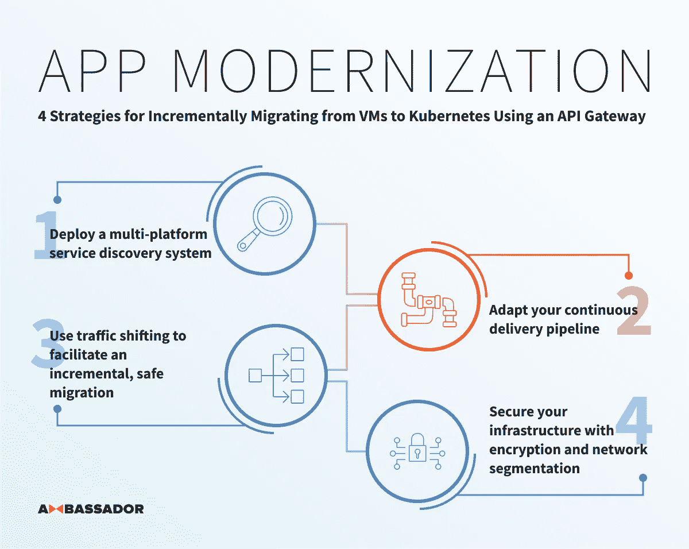

# 使用 API 网关从虚拟机增量迁移到 Kubernetes 的 4 种策略

> 原文：<https://itnext.io/4-strategies-for-incrementally-migrating-from-vms-to-kubernetes-using-an-api-gateway-a82fb6029177?source=collection_archive---------7----------------------->

## 应用现代化

## 规划和实施从虚拟机到云原生平台迁移的策略

越来越多的组织正在从由虚拟机(VM)组成的数据中心迁移到围绕 Docker 和 Kubernetes 等容器技术构建的“下一代”云原生平台。然而，由于这种迁移固有的复杂性，迁移不会在一夜之间发生。相反，一个组织通常会运行一个混合的多基础设施和多平台环境，其中应用程序跨虚拟机和容器。从系统边缘开始迁移，使用云原生 API 网关提供的功能，并向内朝应用程序迁移，这提供了几种策略来最小化痛苦和风险。

在 Datawire Ambassador 博客上最近发表的文章系列中，提出了与这种迁移的规划和实现相关的四种策略:[部署多平台服务发现系统](https://blog.getambassador.io/routing-in-a-multi-platform-data-center-from-vms-to-kubernetes-via-ambassador-47bbe658683c)，该系统能够在高度动态的环境中有效地路由；[调整您的持续交付渠道](https://blog.getambassador.io/incremental-app-migration-from-vms-to-kubernetes-planning-and-tactics-5ffc18c151e)以利用最佳实践，避免网络复杂性带来的隐患；使用[流量转移来促进增量](https://blog.getambassador.io/part-3-incremental-app-migration-from-vms-to-kubernetes-ambassador-and-consul-aacf87eea3e8)和安全迁移；[通过加密和网络分段保护您的基础设施](https://blog.getambassador.io/part-4-incremental-app-migration-from-vms-to-kubernetes-implementing-end-to-end-transport-f597e5536393)从最终用户到服务的所有流量。

# 策略 1:部署多平台服务发现系统

在迁移到云和容器的过程中，通常会看到现有应用被分解为服务，新系统使用微服务架构风格进行设计。业务功能通常是通过一个 API 提供的，该 API 由一个或多个服务的协作提供支持，因此这些组件需要能够[相互定位和通信](https://blog.getambassador.io/routing-in-a-multi-platform-data-center-from-vms-to-kubernetes-via-ambassador-47bbe658683c)。

在多平台和多云环境中，存在两类挑战:

*   跨一系列不同的平台和基础设施有效地路由流量，包括多个 Kubernetes 集群。
*   持续更新部署在动态调度的容器运行时(如 Kubernetes)中的服务的位置，并运行在(短暂的)商用云基础设施上。

系统边缘是解决这两个挑战的好地方，因为所有用户流量都通过某种形式的网关或代理堆栈，并可以相应地进行路由。例如，使用一个 [API 网关与一个多平台服务发现解决方案](https://blog.getambassador.io/routing-in-a-multi-platform-data-center-from-vms-to-kubernetes-via-ambassador-47bbe658683c)的组合。

# 策略 2:调整您的持续交付渠道

一个组织不能指望在一夜之间[将他们现有的应用](https://blog.getambassador.io/incremental-app-migration-from-vms-to-kubernetes-planning-and-tactics-5ffc18c151e)迁移到一个新的平台上。在典型的现有传统/遗产堆栈中，存在太多移动部件和太多复杂性。任何迁移都需要以渐进的方式进行规划和实施，构建和部署应用程序的最佳实践[被编码到一个连续的交付管道中](https://blog.getambassador.io/incremental-app-migration-from-vms-to-kubernetes-planning-and-tactics-5ffc18c151e)。

支持交付渠道适应多平台和多云的关键要求:

*   能够按需为问答创建和初始化 Kubernetes 集群，并能够将流量动态路由到这些集群。
*   能够启动迁移的应用程序进行自动验证，在类似生产(或理想的生产)的环境中运行，而不会将应用程序暴露给最终用户。
*   支持在新平台上逐步推出功能。理想情况下，可以转移或拆分客户流量，以允许少量用户由运行在新基础架构上的应用程序提供服务，因为这将允许迁移的低风险验证。

解耦新功能的部署和发布是连续交付的基础部分，通常这个[的实现从边缘](https://blog.getambassador.io/continuous-delivery-how-can-an-api-gateway-help-or-hinder-1ff15224ec4d)开始。

# 策略 3:使用流量转移来促进安全的增量迁移

一旦组织内部制定并同意了迁移计划，就必须实施该计划。进行迁移的有效策略是在新平台(例如 Kubernetes)上部署 API 网关，并使用该 API 网关将流量路由到现有平台。这种策略允许操作员和工程师熟悉新的目标环境，但不需要实施应用程序从一个平台到另一个平台的“大爆炸”式迁移。一旦部署了 API 网关，该网关就可以用于[逐渐将流量从现有应用转移到新服务](https://blog.getambassador.io/part-3-incremental-app-migration-from-vms-to-kubernetes-ambassador-and-consul-aacf87eea3e8)。

增量迁移应用程序和流量路由时所需的功能:

*   入口(南北向)流量路由的分散式自助配置，使产品、API 和应用团队能够独立规划和实施其迁移。
*   使用金丝雀释放路由和流量阴影等功能实现流量转移的能力。
*   支持跨多种基础设施类型(和云)、平台和集群路由服务到服务(东西向)流量。仅在 Kubernetes 内路由东西向流量的能力不支持这种增量迁移方法。
*   为流量管理提供集中配置的“sane 默认值”的能力，例如全球实施传输加密的要求(包括最低 TLS 版本)、通过第三方 IDP 的身份验证以及防止 DDoS 攻击的速率限制。

使用服务网格来实现高级流量路由正成为一种流行的方法。值得一提的是，虽然乍看起来很相似，但是 [API 网关和服务网格面向不同的用例，并且具有不同的需求](https://blog.getambassador.io/api-gateway-vs-service-mesh-104c01fa4784)。

# 策略 4:通过加密和网络分段保护您的基础设施

在软件交付中实现安全性是一个非常重要的话题，也是一个相当大的话题，但是在迁移到新平台的过程中，理解的重要性只会增加。从设计到编码和打包(包括依赖关系管理)，最终到部署和操作，在流程的所有级别设计安全性是必不可少的。在运行时级别，实施深度防御至关重要。作为任何迁移的一部分，跨基础设施和平台的流量必须是安全的。任何实施都应该包括在边缘适当使用[用户认证，以及对来自边缘和服务之间的流量进行加密。](https://blog.getambassador.io/implementing-authentication-with-the-ambassador-api-gateway-oauth-idps-oidc-oh-my-26a1a6d77bb3)

多平台迁移的安全要求包括:

*   能够向任何目标基础架构、云和平台部署和管理传输加密组件(并能够定期轮换相关证书)。
*   API 网关(执行用户身份验证)能够与服务到服务的传输安全紧密集成的能力，确保从边缘流向服务的流量在加密方面没有间隙。

如前所述，部署服务网格正在成为实现端到端传输安全的常用方法。由于这种实践和相关技术相对较新，工程师们在任何增量迁移过程中“[注意间隙](https://www.cncf.io/webinars/securing-cloud-native-communication/)，并且在实现中的漏洞或裂缝期间不意外地暴露用户流量是很重要的。

# 包扎

本系列文章和[相关的多平台代码/配置](https://github.com/datawire/pro-ref-arch)示例旨在帮助平台运营商和工程师将应用从虚拟机迁移到 Kubernetes。如前所述，迁移不是一项简单的工作，重要的是要相应地进行规划，并安全地逐步实施。

示例代码在不断发展，因此如果您对云供应商或复杂的路由场景有任何特殊要求，请联系 Datawire 团队。

像往常一样，可以通过 Twitter([@ getambassadorio](https://www.twitter.com/getambassadorio))或 [Datawire OSS Slack](http://d6e.co/slack) 提问。