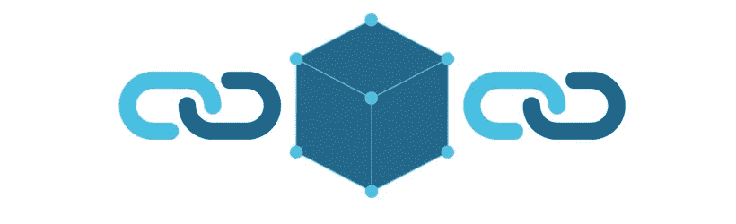

# 4 个工具，用于测试块链技术

> 原文：<https://itnext.io/4-tools-om-zelf-met-blockchain-technologie-te-experimenteren-a693b312c203?source=collection_archive---------1----------------------->

Blockchain 技术涉及到分布式数据库的概念，以防止数据被篡改和伪造。[区块链的精华](https://www.linkit.nl/knowledge-base/237/Wat_is_Blockchain_technologie)就是在她*节点*下的分布。但这样的链条必须从一个地方开始:你如何开始一个区块链？

有数种工具可让您自行启动图块链。计划的实施方式有所不同:从托管的云平台到可在自己的环境中部署和配置的完整开源应用程序。但是，如何在网上找到的教程和文章主要介绍了比特币和其他密码货币的启动和退出，而不是如何使用块链启动其他应用程序。如果您要自行测试区块链(因此不只是使用加密选项)，请参阅下列工具和平台:

**多因子**

其中一个最著名的倡议是开放源码平台 multichain。借助诸如各种授权结构之类的开箱即用功能，快速部署和灵活的数据结构将为您提供核心功能和更高级的功能。使用 linux 机器和简单的[指令](http://www.multichain.com/download-install/)在 multichain 网站上或在[教程](http://www.multichain.com/getting-started/)中(可在 internet 上找到)，您就可以在[90 秒内 t11 获得块链的向上和运行。安装完成后，您还可以配置作为分布式链的创建者的各种情况，例如矿工们因工作而获得的报酬。虽然该工具似乎为块链应用程序提供了一个平台，但该平台的焦点主要集中在安全透明地处理事务和管理令牌所有权(无论以何种形式)。multichain 似乎也是金融机构的理想工具，可以作为区块链冒险的起点。](http://allcoinsnews.com/2015/11/27/with-multichain-create-a-private-blockchain-in-90-seconds/)

**开放式链**

与多点传送类似，Openchain 还提供了一个开源解决方案，用于创建分布式数据库(莱杰)。Openchain 上的分布式数据库启动器还确定了“游戏规则”。与比特币或其他一些区块链平台不同的是，Openchain 有一个中央权威来验证交易。将特定数据放在数据库中的任何人都可以从每个参与者在本地运行的 Openchain 实例中完全控制该数据。想试试吗？[文档](https://docs.openchain.org/en/latest/general/docker-deployment.html)提供了使用坞站快速启动应用程序的应用说明。

【T2 超连结】T3

在 Linux 基金会的支持下，Hyperledger 在大约一年前开始，主要是作为一个集体来整合各种规模较小的莱杰计划。现在，一群开发人员正在专注于开发(通过)超级链接平台，该平台适用于金融和物流领域以及医疗保健领域的业务交易。Hyperledger 社区中的活动存储库之一是最初由英特尔开发的 sawtooth 湖模块化数据块链平台。文档介绍了如何在 sawifez lake 平台上相当容易地启动自己的环境。

**乙烯基**的

ethereum 是一个区块链应用程式平台，让开发人员能够建立使用区块链原则的应用程式，而不需建立自己的区块链。然后，这些应用程序可以通过子链进行交互。它的理念是，平台的功能越来越广泛。应用程序示例包括“smart contracting”应用程序，它允许建立一个称为“分散式自治组织(DAO)”的应用程序。你和伊琳在一起吗？创建[您在 ethereum 的第一个智能合同](https://www.ethereum.org/greeter):hello world 项目。

灵感来源？通过我们的社交渠道与我们分享您的经验。通过链接或 Twitter 响应文章。