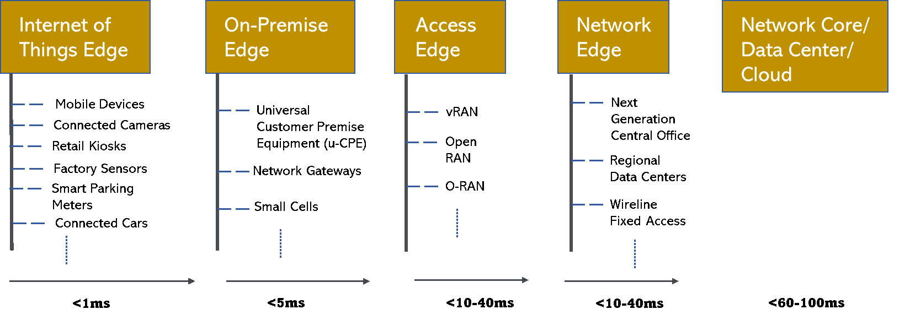

# 边缘计算的 4 种类型——大致分类

> 原文：<https://itnext.io/4-types-of-edge-computing-broadly-categorized-be557f3556ea?source=collection_archive---------0----------------------->

边缘计算被认为是分布式计算的下一个前沿。然而，并不是每个人都知道它是什么或事实上有多种类型的优势！

简而言之，边缘计算通过将计算移动到更靠近最终用户的位置，实现了过多设备(5G 术语中通常称为用户设备 UE)和电信数据中心核心之间的连接。

关键促成因素是 UE 和计算服务器之间的往返通信所需的等待时间，这需要高度分布式的架构。

了解各种类型的边缘计算的一个简单方法是基于它与终端设备的接近程度以及到数据中心核心的往返延迟。延迟是主要因素，边缘计算可以大致分为以下几类:

*   物联网边缘
*   在前提边缘
*   访问边缘
*   网络边缘

延迟是关键因素的 4 种边缘计算

# 物联网边缘:

此边缘的预期延迟通常小于 1 毫秒。

这涵盖了几乎所有连接到私有或公共网络(如互联网)的设备。该设备可以是能够处理数据的智能设备，如移动电话或传递周围信息的简单传感器。

示例包括但不限于零售亭、摄像头、工厂传感器、联网汽车、无人机、联网路灯、智能停车计时器、远程手术设备等。

# 在房屋边缘:

在此边缘的等待时间预期通常小于 5 毫秒。

人们需要一种方法来聚合来自物联网边缘许多设备的数据，以便存储、处理、分析和响应使用这些数据的相关请求。On premise Edge 通过帮助本地化数据处理，在企业内部提供计算资源，并减少数据处理时间。在这个边缘的设备通常连接到网络边缘或数据中心，用于进一步的请求。

大型企业、工业制造车间、大型零售业务等业务。受益于这些类型的部署，能够在接近数据来源的位置处理数据，同时仍然拥有拥有必要硬件的专有权利。

通用客户驻地设备(u-CPE)就是一个例子，它在部署在驻地的单个设备中提供防火墙、WAN 优化器和路由器的组合。

通常利用软件定义广域网(SD-WAN)来满足网络要求，该网络允许企业利用 MPLS 或 LTE 或宽带互联网服务的组合。

5G 使小型蜂窝能够在本地建立，并在许可和未许可的频谱中运行。

# 访问边缘

该边沿的预期延迟通常小于 10–40 毫秒。

曾经作为固定功能设备可用的传统无线接入网络(RAN)现在已经被分解为使用现成服务器的软件中的一组虚拟功能来运行。RAN 是连接无线设备和电信运营商网络核心的关键点。

虚拟 RAN (vRAN)等概念以及 Open-RAN 和 O-RAN 等行业计划使界面能够像管理任何其他边缘设备一样管理这些虚拟化部署。向云迁移 RAN 功能的本机实例化利用 DevOps 模型，通过持续集成(CI)/持续部署(CD)结构简化了一系列 RAN 部署的生命周期管理。

部署和管理软件 RAN 功能所需的一组基础设施可以广义地称为接入边缘。

# 网络边缘

该边沿的预期延迟通常也小于 10–40 毫秒。

来自多个物联网边缘(内部边缘和接入边缘)的数据，为了迎合特定区域，需要在连接到可以跨越大量区域的集中式数据中心之前进行聚合。

相对于服务提供商的核心数据中心，这种类型的部署可以广义地称为“网络边缘”或近边缘。

下一代中心局(NGCO)架构旨在解决网络边缘的需求。这种类型的 Edge 的另一个例子是有线固定接入 Edge，其提供诸如 IPTV、VoIP、互联网服务等宽带服务。

随着固定移动融合的出现，由于架构融合，各种设备类型之间的界限正在变得越来越模糊。

随着各种部署模式的出现，边缘计算正在成为主流。上面共享的 4 种类型提供了一个空间或域，在这个空间或域中，人们可以操作并绘制出接口和交互，以便能够跨边缘类型进行扩展。使用的术语比上面多得多([各种类型的边缘计算](https://sunkur.medium.com/what-are-various-types-of-edge-computing-that-exist-today-2f72b589ffd1))，但当涉及到往返延迟时，它们很可能属于上面的范围。

你是否看到不属于上述范围的图案或边缘类型？请随意评论和留言。

*注:本文首发于快速模式:*[*https://www . thefast Mode . com/expert-opinion/22970-4-types-of-edge-computing-broad-categorized*](https://www.thefastmode.com/expert-opinion/22970-4-types-of-edge-computing-broadly-categorized)