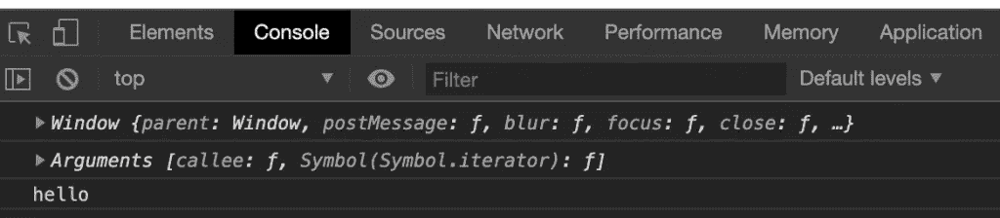
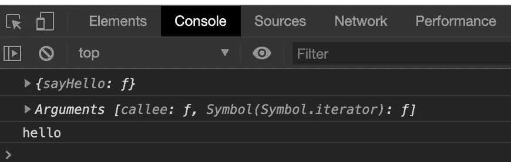
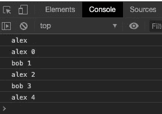

# 在 JavaScript 中调用函数的 4 种方法

> 原文：<https://itnext.io/4-ways-to-call-a-function-in-javascript-19b174678f5a?source=collection_archive---------0----------------------->


沙哈达特·拉赫曼在 [Unsplash](https://unsplash.com?utm_source=medium&utm_medium=referral) 上拍摄的照片

JavaScript 中的函数可以用不同的方式调用。乍一看，这似乎是一个疯狂的声明。调用函数的方法怎么可能不止一种？我们不就叫它？

亲爱的读者，正如我们将在本文中讨论的，在 JavaScript 中有 4 种调用函数的方法。您的特定场景将决定使用哪一个。此外，每个方法都将规定函数中“ *this* ”的值，也称为上下文。

# 要记住的一点

每当在 JavaScript 中调用一个函数时，不管它是如何被调用的，都会向它传递两个隐式参数。这两个隐式参数是 *this* ，函数将在其中执行的上下文和 arguments 参数。arguments 参数是一个类似数组的结构，包含任何传递的参数。它“类似于数组”，但它不是数组。

现在，事不宜迟，让我们介绍调用函数的四种方法。

JavaScript 函数可以被调用:

1.  作为一种功能
2.  作为一种方法
3.  作为一名建筑工人
4.  通过调用()和应用()

让我们来看看每一个。

# 将函数作为函数调用

自从语言诞生以来，这可能是大多数函数被调用的方式:作为一个函数。如果您曾经在网页上放置了一段 JavaScript 代码，并通过单击按钮来调用它，那么您已经将 JavaScript 函数作为一个函数来调用了。让我们看一个代码示例。

```
<button onclick="sayHello()">say hello</button>
  <script>
    function sayHello() {
      console.log(this);
      console.log(arguments);
      console.log('hello');
    }
  </script>
```

在这个简单的代码示例中，我们有一个按钮，当单击它时，调用 sayHello()函数。在这个函数中，我们记录了它的值，后跟参数的值。然后我们打招呼。让我们看看当我们单击按钮时，在控制台中会得到什么。



将函数作为函数调用

可以看到，*这个*的值就是窗口对象。这就是我们漂亮的小函数执行的环境。在这种情况下，您可以选择强制定义*和*的上下文。为此，您只需添加“use strict”；指令添加到代码中。

```
<button onclick="sayHello()">say hello</button>
  <script>
    'use strict';  //force the context to be undefined
    function sayHello() {
      console.log(this);
      console.log(arguments);
      console.log('hello');
    }
  </script>
```

此实例中的 arguments 参数没有任何值，因为没有参数传递给该函数。

# 将函数作为方法调用

为了将函数作为方法调用，必须将其定义为对象的属性。让我们看一些代码。

```
<button onclick="greeter.sayHello()">say hello</button>
  <script>
    greeter = {
      sayHello: function () {
        console.log(this);
        console.log(arguments);
        console.log('hello');
      }
    }
```

在这里，您可以看到我们将 sayHello()函数包装在一个名为 greeter 的对象中，从而使它成为该对象的一个属性。然后，我们更新 onclick 处理程序，使用 object dot 语法调用它:greeter.sayHello()

当我们以这种方式调用函数时，我们在控制台中得到的是:



将函数作为方法调用

这里我们看到*这个*参数的上下文指向了 greeter 对象。这比全局窗口对象更有意义。正如所料，我们仍然可以访问 arguments 参数。

# 将函数作为构造函数调用

在我们看作为构造函数调用函数的代码之前，让我们花点时间考虑一下构造函数的用途。构造函数意味着在一个对象中建立一些初始状态。来建造它。既然如此，这是一个如何调用函数的更特殊的例子。我们调用这个函数的目的是创建一些新的东西并把它拿回来。让我们看一个代码示例。

```
<input type="text" id="name"></input>
  <button onclick="sayHello()">say hello</button>
  <script> function Greeter(name) {
      console.info('begin constructor');
      console.log(this);
      console.log(arguments);
      this.name = name;
      console.info('end constructor')
    } function sayHello() {
      var name = document.getElementById('name').value;
      var grtr = new Greeter(name);
      console.log('hello ' + grtr.name);
    }
  </script>
```

在本例中，我们添加了一个输入文本框，以便用户可以输入他们的姓名。没有名字真的不是一个合适的问候。同样，当我们的按钮被点击时，我们调用 sayHello()函数。在我们的 sayHello 函数中，我们获取文本框中的值，并通过调用 *new Greeter()* 来创建 Greeter 对象的新实例。

*new* 关键字和大写的 G 表明这个函数是作为构造函数被调用的。需要 *new* 关键字。大写的 G 是公认的标准。当以这种方式调用一个函数时，*这个*被设置为新创建的对象。我们向新创建的对象添加一个 name 属性，并将其值设置为传递给构造函数的参数。新创建的对象被传递回调用代码，并保存在 grtr 变量中。最后，在对 console.log 的调用中，我们访问刚刚在 *Greeter* 对象上设置的 *name* 属性，并将其值打印到控制台。

# 通过调用和应用调用函数

在 JavaScript 中使用函数时，有一点要始终牢记在心，那就是它们是一级对象。这意味着函数可以有自己的属性和方法。是的，你没看错。一个函数可以有自己的方法。call 和 apply 方法是其中的两种方法。call 和 apply 方法允许您指定函数将执行的上下文。它们允许你设置*这个*值。让我们来看一个代码示例。

```
<button onclick="go()">GO</button>
  <script>
    var people = [];
    var name = 'alex'; function Person(idx) {
      idx % 2 === 0 ? 
        this.name = 'alex ' + idx : 
        this.name = 'bob ' + idx;
    } function printName() {
      console.log(this.name);
    } function go() {
      //print the name variable defined on the window object
      printName(); //populate the people array with a couple of people
      for (let idx = 0; idx < 5; idx++) {
        people.push(new Person(idx));
      } // lets call the printName for each object that we just created 
     // seting this dynamically
      people.forEach(p => { 
        printName.call(p);
      });
    }
  </script>
```

在这段代码中，我们从定义几个变量开始。一个空数组，我们将用几个 Person 对象和一个名字填充它。然后我们有了 Person 对象的构造函数。它所做的只是根据传递给它的索引选择一个名称。

接下来，我们有 printName()函数。它只是打印出*的名称变量中的任何值，以及设置为当前上下文*的任何对象。最后，我们有当用户按下按钮时执行的 go()函数。

当按钮被点击时，我们做的第一件事是直接调用 printName()。如果你记得在这篇文章的前面，*这是调用一个函数作为一个函数*。因此，上下文是全局窗口对象，名称“alex”被打印到控制台。到目前为止，一切顺利。

接下来，我们建立一个 for 循环，创建 5 个 Person 对象，并将它们放入 people 数组。

然后我们直接进入一个数组。在每次迭代中，我们调用 printName.call() *，将当前对象作为上下文*传递。这意味着我们正在动态地设置函数的上下文。相当酷。这将在控制台中产生以下输出。



输出中的第一个“alex”来自我们之前对 printName()的调用。每一行额外的输出都来自数组的迭代。

这段代码演示了 call()方法在所有函数中都可用。它看起来非常类似于对象点语法，因为它是对象点语法。JavaScript 中的所有函数都是对象。

应用方法非常相似。两者唯一的区别是他们接受的论点。call()接受值列表，而 apply()接受数组，如下所示:

```
//call accepts a list of values
printName.call(valueOfThis, 1, 2, 3);//apply accepts an array of values
printName.apply(valueOfThis, [1, 2, 3]);
```

这就结束了对调用 JavaScript 函数的 4 种方法的快速介绍。我发现我使用了所有这些方法，并且知道引擎盖下发生了什么真的很有帮助。

记住，在 JavaScript 中，*函数是一级对象*。它们可以有自己的属性和方法，可以像其他对象一样传递。如果您来自另一种语言，如 C#或 Java，那么函数作为对象的概念可能需要一点时间来适应。我知道我花了一点时间才明白过来。

感谢阅读。

*原载于*[*http://ritzcovan.com*](http://ritzcovan.com/index.php/2019/12/11/4-ways-to-call-a-function-in-javascript/)*。*