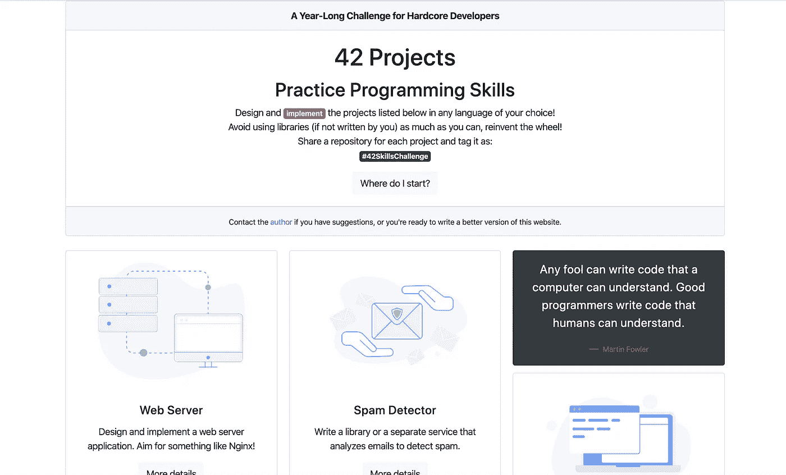
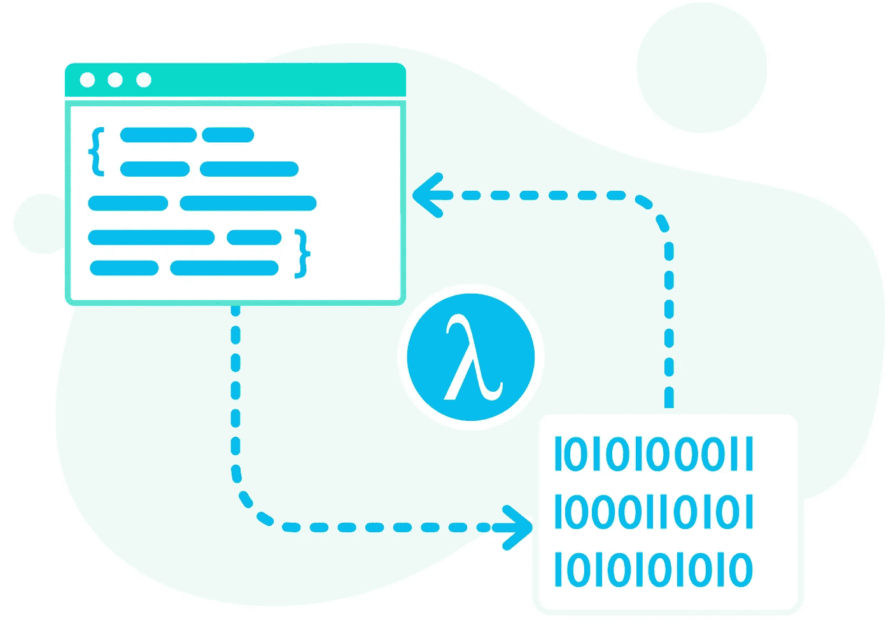

# 42 个练习编程技能的项目

> 原文：<https://itnext.io/42-projects-to-practice-programming-skills-6f5acc10fec0?source=collection_archive---------0----------------------->

## 对于铁杆开发者和那些不怕发明新东西的人来说

在继续之前，请将此网站加入书签:

 [## 程序员练习编程技能的 42 个项目

### 用你选择的任何语言设计和实现下面列出的项目！避免使用库(如果不是由…

42skills.com](http://42skills.com/) 

拥有大量编程项目想法是一件坏事，不与你分享这些想法更糟糕。因此，这是一个长达一年的挑战(Instagram 的孩子们现在很喜欢)，标记为 **#42SkillsChallenge** 。以下是 42 个项目中每个项目如何参加这个极其复杂的挑战:

1.  从列表中选择一个项目。
2.  为项目创建一个 GitHub 存储库。
3.  开始工作，尝试从零开始实现一切，在可能的情况下重新发明轮子(有时你必须这样做)。
4.  完成后，测试它，将标签#42SkillsChallenge 贴在 repo 中的某个地方(自述文件或某个可见的地方)。
5.  与世界分享你的回购。

# 关于项目

有些项目很简单。有些很难。这是练习技能的好方法，尤其是在重要的技术面试之前。

然而，有些项目非常复杂。你可能需要几周或几个月来实现它们。那是真正的摇滚明星生存的地方。第一个完成所有项目的人，会开启一个新的专业水平。看看这些项目，我知道我在说什么。

此外，一些项目可能会成为创业者(那些讨厌工作、喜欢快速致富的人)的好主意。我建议为下面的一些项目(或在[网站](http://42skills.com/))召集一个团队，发布一个非常酷的应用或服务，征服世界。

# 项目列表

## 1.网络服务器

设计并实现一个轻量级 web 服务器，它通过 HTTP 协议处理传入的网络请求。Web 服务器处理网页并将其交付给客户端(通常是浏览器)。页面是 HTTP 文档。虽然主要功能是提供内容，但 HTTP 的完整实现还包括从客户端接收内容的方式。此功能用于提交 web 表单，包括上传文件([来源](https://en.wikipedia.org/wiki/Web_server))。要获得灵感，请尝试模仿 Nginx web 服务器。

## 2.网络数据包窃听软件

数据包嗅探器(数据包分析器)用于通过检查网络上计算机之间流动的数据包流来监控网络流量。从这个项目开始，要好好学习网络协议。然后开始实现一个应用程序，该应用程序跟踪网络数据包并以人类可读的形式解析其内容。

## 3.静态代码分析器

静态代码分析器用于分析(显然)源代码，而不运行它，并发现可能导致正在运行的应用程序中的错误的问题。这样，为您的项目运行静态代码分析器可能会节省大量调试时间。严肃的项目或关键任务系统使用商业静态分析器来检查代码质量。

为您选择的任何语言设计和实现您自己的静态分析器。

## 4.垃圾邮件检测器

实现一个库或服务来分析电子邮件以检测垃圾邮件。你可以自由地将它实现为一个浏览器插件，或者一个 SaaS 产品。尝试使用机器学习算法来改进您的系统。

## 5.象棋引擎

国际象棋引擎分析棋盘，并建议最佳的下一步棋。除此之外，它还可能成为玩电脑的对手。实现下一代人工智能驱动的国际象棋引擎。要获得灵感，请看一下 [Stockfish](https://stockfishchess.org/) 。

## 6.网络搜索引擎

我最喜欢的一个。我一直想实现一个超级网页搜索引擎，与谷歌竞争。你可以猜到，什么都没发生。也许可以实现这样的引擎？

设计并实现一个系统，该系统可以索引全球数十亿个文档，以高效的方式存储它们，并以最相关的文档列表来响应用户的查询。

## 7.命令行终端

这个很好描述。实现一个复制所有主要 Linux 命令的终端应用程序。尽量把界面做的花哨一点。

## 8.网页浏览器

听起来很简单，其实不然。首先，它是一个 GUI 应用程序。接下来，它理解 HTTP 文档，当然，它理解并正确呈现 HTML 和 CSS。是的，它还执行 JavaScript(至少是基本的东西)。

所以，不允许铬发动机。从头开始实现的普通 web 浏览器。这个很难。至少对我来说是这样。你可以跳过一些讨厌的部分，保持简单，但仍然很难。

## 9.内存数据库

我的另一个最爱。这个项目基本上是重新实现 [Redis](https://redis.io/) 。内存数据库将所有内容都保存在内存中。如果你给它加上一个查询语言，肯定会有一些正经的公司雇佣你。

## 10.极简操作系统

许多人的梦想。我认识很多程序员，他们梦想从零开始实现自己的操作系统。这种自杀意图的动机之一是潜入最底层的编码和熟悉金属。人人都爱金属！

您可以保持简单，但至少要为操作系统实现几个关键特性。从头开始，但是你可以看看 Linux 内核。毕竟，Linus 在某些方面确实了解过 Minix。

## 11.视频字幕生成器

实现一个程序，以视频作为输入，分析内容，做一些语音处理，并产生视频字幕。对视频的长度有限制是没问题的(1 或 2 分钟就很好了)。

## 12.自定义密码

还记得那些关于黑客的电影吗？梦想过成为其中一员吗？这是你迈向那个幼稚梦想的机会。

设计一个密码。实现一个基于你的密码对信息进行编码和解码的应用程序。

如果你能写一些自动化测试来验证你的创造的力量，那就太好了。换句话说，黑掉你自己的安全系统。

## 13.P2P 消息应用

实现一个与朋友聊天的应用程序。面临的挑战是以一种省略中央服务器并在两个聊天客户端之间发起直接连接的方式来实现它。

## 14.机器翻译

类似谷歌翻译。设计并实现一个服务(如果你有空闲时间，也可以实现这个应用程序),将一堆文本从一种语言翻译成另一种语言。

选择你想要的两种语言。试着让翻译变得更聪明，训练它或者在途中纠正它。

## 15.自动化新闻节目主持人

你会喜欢这个的。想象一下像 Feedly 这样的普通新闻读者。而现在，画面是 CNN 的新闻主持人，在讲一些突发新闻，冠状病毒等。现在，想象一个卡通人物，像真正的主持人一样给你(用户)读新闻。

设计并实现一个收集新闻的软件(一般来说，订阅用户设置的 RSS 提要)，并像一个动画新闻主持人一样大声朗读出来。

## 16.付酬制度

你可能听说过 PayPal 或 Stripe 或任何其他支付系统。现在，设计一个新的(或下一代？)支付系统类似于其中的一种。模拟金融交易并证明系统不会受到攻击。这个很难实现。

## 17.关系数据库管理系统

想知道数据库是如何工作的吗？现在你有机会建造一个。设计并实现一个类似于 MySQL 或 PostgreSQL 的关系型 DBMS(不一定支持 SQL)。不要忘记索引。有交易当然很好，但这不是强制性的。

## 18.虚拟助手

类似 Siri 的东西，但是没有语音控制。只需键入文本、创建提醒、提问等。功能集由你决定，但是用户必须感觉它是一个可靠的虚拟助理应用程序。

这个项目是为 spartphones 设计的，也就是说，你应该使用一些类似 React Native/Flutter 的东西为 Android 或 iOS 编写这个项目。

## 19.垃圾收集工

快速提问:C++和 C#有什么区别？区别之一是后者有一个垃圾收集器。现在，实现一个垃圾收集器，它既可以作为一个独立的服务使用，也可以作为一个集成的模块使用。语言和目标是你的选择。

## 20.Dropbox 克隆

Dropbox 是一款文件共享应用。包含几乎所有操作系统的客户端，包括 Android 和 iOS。它也有一个巨大的后端。设计并实现您自己版本的文件共享应用程序，该程序至少为 10 个用户工作，并为每个用户提供 100 Mb 的空间。实现服务器和客户端(至少一个操作系统)。

## 21.集装箱管理系统

让我把码头工人的描述。

Docker 是一组平台即服务(PaaS)产品，使用操作系统级虚拟化来交付称为容器的软件包中的软件。容器是相互隔离的，捆绑了它们自己的软件、库和配置文件；他们可以通过明确定义的渠道相互交流。所有容器都由单一操作系统内核运行，因此比虚拟机更轻量级。

实现自己的 Docker。

## 22.容器编排器

越来越难了。完成 Docker 后，设计并实现一个 orchestrator。

要获得灵感，请查看 Docker Swarm 或 Kubernetes。

## 23.防病毒软件

你用 Linux 没关系。因为病毒，到处都被隔离了。实现一个好的反病毒软件，并通过实现几个病毒来测试它。这不是一个简单的任务，但是当你实现了一个极简的操作系统后，解决这个问题应该会更容易。

## 24.防火墙

防火墙监控网络请求，打开或关闭计算机上的端口。他们基本上是防御体系中的第一梯队。设计并实现一个防火墙软件。至少试试 netstat 这样的工具，它也有权限关闭端口或对可疑的网络请求发出警报。

## 25.版本控制系统

您很可能正在使用 Git。你可能用了 SVN 甚至简历。不管怎样，这个想法很简单。实施新的版本控制系统。瞄准比 Git 更好的东西。

另外，请记住，Linus 在两周左右的时间里编写了 Git 的第一个版本。接受挑战，在 13 天内写出你的 VCS。当着你的面，托沃兹！

## 26.UML 图生成器

选择任何你喜欢的支持面向对象的编程语言。实现一个工具，该工具将项目源代码作为输入，并为其生成 UML 图。

## 27.时间序列数据库

这是一个数据库软件，比常规的数据库管理系统更有效地存储和处理时间序列。找出什么是时间序列，然后设计并实现一个时间序列数据库系统。

## 28.无锁数据结构

无锁编程很难掌握。我试过了，只是理解。

将一组无锁数据结构实现为可在编程项目中使用的库。

## 29.交通通知器

实现一个通知用户交通堵塞的应用程序(或服务)。

更重要的是，它建议一个更好的路线到一些目的地(由用户设置)。

这是一个可以作为创业好主意的应用之一。实施真正优质的服务，成功是有保证的。你可以把这个和前面介绍的虚拟助手结合起来，效果会很棒。

## 30.音乐合并

实现一个软件，合并两个或更多的音乐曲目在一起，以产生一个新的。

## 31.配方生成器

应用程序(或服务)生成新的食谱，并通过这种方式进行学习。所以当你按照它的食谱烹饪时，你可以评价它，告诉它它有多好吃。这不是一个新鲜的想法，但仍然是有用的。

## 32.闪存卡浏览器插件

有许多艰难的项目要实施。这个简单一点。实现一个浏览器插件(适用于任何浏览器)，允许存储闪存卡，然后随机向用户展示(可配置)。

## 33.视频通话应用

有几个视频通话应用程序，Zoom，Skype，Google Hangouts。

但是，如果网络连接不好，它们还是会工作得很糟糕。也许你应该发明一种新的压缩算法(见下文)，并将其与该应用程序结合，以实现一种新的高超的视频通话应用程序？不确定。基本上，这个项目代表 PiperChat，设计和实现最好的视频聊天应用程序。

## 34.随机性测试仪

听起来很疯狂，一个朋友推荐了这个。编写一个软件(或者一个工具)，或者设计一个公式(不确定)来测试随机数生成器的结果，并验证这些结果是否真的是随机的。

## 35.微服务框架

设计一个非常简洁的微服务框架，支持基本模式并提供一组现成的实现。确保涵盖服务发现和微服务的沟通。

你添加到框架中的特性越多，赢得挑战的机会就越大。

选择你喜欢的任何编程语言。

## 36.函数式编程语言

发明一种新的函数式编程语言。要简洁，但是要提供用你的语言实现程序的所有环境，并且毫无痛苦地运行它们。

## 37.策略游戏引擎

学习 OOP 的最好方法之一是通过设计游戏。游戏通常基于引擎。

为策略游戏设计并实现一个游戏引擎。最好是实现一个基于引擎的游戏来测试它。

## 38.世界模拟

西部世界要来了。

实现一个允许用不同的初始数据集模拟复杂世界的服务。细节越多，系统越好。这个很难，可能要花很长时间才能完成。当你感到困难时，保持简单。

## 39.电影推荐系统

这是一个谎言，网飞的推荐系统烂透了。除了精选的电影列表，我在任何地方都没有看到一个可靠的电影推荐系统。

拜托，解决这个疯狂的问题。设计并实现最好的电影推荐系统。

你可能需要搜集大量的数据库来收集电影数据。)

## 40.花衣魔笛手

应该有人这么做。设计并实现一个压缩算法，将大文件压缩成小文件。诚然，达到完美的结果是非常困难的，但不要试图限制自己的想法。瞄准不可能的目标，[https://en.wikipedia.org/wiki/Weissman_score](https://en.wikipedia.org/wiki/Weissman_score)

## 41.电话视频流

一个允许视频从一部手机传输到另一部手机的应用和服务。立即与朋友分享视频。选择一个视频文件，在应用程序中选择您朋友的设备，然后单击“流”按钮。就这样，你朋友的智能手机马上播放视频。

## 42.应用建立程序

这可能是最难的一个。设计一个系统，它理解文本，并根据文本描述生成应用程序。听起来不可能。用户描述她需要什么样的应用程序，系统根据需求生成一个全新的应用程序。

就是这样。名单很大；我知道。这个项目并不简单，我也知道。这是一条艰难的道路，它总能带来惊人的结果。从挑选出你更感兴趣的项目开始，然后实施它。此外，不要忘记与你的朋友分享这些，这样比赛会变得更大更有趣。