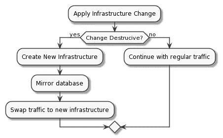

# 代码基础设施中的 5 个常见陷阱

> 原文：<https://itnext.io/5-common-pitfalls-in-infrastructure-as-code-3637ab6b02e0?source=collection_archive---------0----------------------->

图片来自 [Pixabay](https://pixabay.com/?utm_source=link-attribution&utm_medium=referral&utm_campaign=image&utm_content=4280758)

# 介绍

现代的云原生基础架构可以在几分钟内创建和销毁。它可以根据负载和使用模式进行伸缩。

**基础设施即代码(IaC)** 是一种常见的模式，其中虚拟化基础设施和辅助服务可以使用几乎任何语言表达的配置来管理，通常托管在源代码库中。

## 为什么这很重要？

IaC 支持自动、可重复且可靠地创建和维护任何虚拟化基础架构。如果您有兴趣了解更多可用的工具和实践，这里有一个列表供您参考:

Terraform、Pulumi 和 Crossplane 都支持多个提供商，非常适合跨云运营。

Crossplane 采用了一种非常有趣的 IaC 方法，利用了原生的 Kubernetes 结构，并自动“继承”了丰富的 Kubernetes 生态系统和工具。哦，它还有最酷的标志:)。

 [## 介绍 HashiCorp 的 Terraform

### 欢迎来到 Terraform 介绍指南！本指南是从 Terraform 开始的最佳地方。我们涵盖了什么地形…

www.terraform.io](https://www.terraform.io/intro/index.html)  [## Pulumi -作为代码的现代基础设施

### 建立服务于静态网站的基础设施通常比看起来更难——但幸运的是，这是一项任务…

www.pulumi.com](https://www.pulumi.com/)  [## 交叉平面

### Crossplane 将 Kubernetes 风格的声明性和 API 驱动的配置和管理带到了任何一个…

交叉平面. io](https://crossplane.io/) 

还有特定于云供应商的工具和标准

天蓝色:

 [## ARM 模板文档

### 了解如何开发 Azure 资源管理器模板并使用它们来部署 Azure 资源

docs.microsoft.com](https://docs.microsoft.com/en-us/azure/azure-resource-manager/templates/)  [## 农夫:农夫

### Farmer 是一个简单易学的库，用于快速创作和部署整个 Azure 架构…

composition it . github . io](https://compositionalit.github.io/farmer/)  [## 用于 Azure 资源管理器模板的 Bicep 语言

### Bicep 是一种声明式部署 Azure 资源的语言。您可以使用 Bicep 而不是 JSON 来开发您的…

docs.microsoft.com](https://docs.microsoft.com/en-us/azure/azure-resource-manager/templates/bicep-overview#get-started) 

AWS:

 [## AWS CloudFormation -基础设施即代码和 AWS 资源供应

### 通过基础架构加速云配置，因为代码 AWS CloudFormation 为您提供了一种对集合建模的简单方法…

aws.amazon.com](https://aws.amazon.com/cloudformation/) 

GCP:

 [## 云部署管理器|谷歌云

### 使用简单的模板创建和管理云资源。查看该产品的文档。Google 云部署…

cloud.google.com](https://cloud.google.com/deployment-manager) 

# 常见错误

正如每一次新的范式转变一样，在整个行业形成一套模式和采用策略之前，都需要时间。很多时候，许多公司试图在他们的组织中应用 IaC 原则，但由于常见的错误而失败。

几乎所有的错误都来自于组织内思维模式的改变和文化转变的不足。简而言之，当事情变得复杂或不可收拾时，我们都有退回到众所周知的轨道的倾向。

## 排名第一的宠物和牛

当服务器和其他基础设施资产被视为固定资源时，通常会出现这种错误，其名称和 IP 地址位于一个模糊的 excel 文件中。

为了充分利用云原生基础设施，请考虑将您的基础设施视为牲畜。这样，基础设施就变成了一种资产或工件，比物理服务器更像应用程序。

## 排名第二的虚拟化数据中心

如果您以前使用过物理数据中心，您可能会尝试将相同的概念移植到 IaC。这是一个错误，因为云提供商担心的是数据中心。您应该使用的抽象是 100%虚拟化的。

数据中心的心理模型在使用 IaC 完成什么方面非常有限。例如:

*   分成多个提供商
*   缩减计算规模以降低成本
*   将交叉问题转移给第三方服务

## #3 不了解基础架构和数据之间的关系

数据是当今世界最重要的商品，因此保护数据自然成为所有组织关注的焦点。

由于担心丢失/损坏数据，这种错误经常导致 IaC 采用率低。下面是一个非常简单的分步场景，展示了 IaC 如何安全地用于实时生产数据。

理解基础设施随时都可能被创建和破坏是关键的概念。

## #4 突破开发和运营

一旦开发和运营不再是孤岛，而是同一个连续的、不间断的、自动化的过程的一部分，DevOps 移动承诺更快和更可靠的软件交付。

高度监管的业务领域中的公司往往倾向于孤立心态，因为这似乎是在推卸和分配责任，并且在实践中经常在“指责游戏”中给出明确的目标。这显然是逆向思维，不仅适用于 IaC，也适用于其他领域。

在 IaC 中，这通常意味着分离开发团队和操作。

## #5 使用 IaC 作为奇特的部署脚本

不要试图像 PowerShell 或 bash 那样将 IaC 作为一个花哨的脚本来自动创建基础设施。为了获得最大的好处，试着用软件的方式来考虑你的配置文件。它应该有正确的版本，有自己的 CI/CD 管道，应该经过测试并且是安全的。IaC 的最大好处是你可以使用与你习惯的软件开发过程相同的开发人员工作流程。

此外，请尝试将 IaC 代码参数化，以提高可重用性。配置往往会增加复杂性，就像任何其他代码一样，努力应用 DRY 原则(不要重复)。

## #6 加分点:使用 IaC 作为配置管理

这个反模式很可能在 IaC 的第二天操作中出现。一旦配置了基础架构，并且一切正常运行，就会弹出一个请求，要求更改所配置资源的配置。

让我们假设您的基础架构在 Azure 中，并且想要为您的虚拟机向网络安全组(NSG)添加新规则。使用 Terraform 这样的工具很容易实现。乍一看，这可能听起来像是一个好的实践，但实际上围绕状态协调和漂移管理产生了问题。使用 IaC 工具来管理现有基础设施的配置和设置违反了**不变性原则。**相反，请将调配的基础架构视为完全不可变的，您可以调配新的基础架构，也可以销毁它并在其位置上创建新的基础架构。

这种方法极大地简化了对基础设施状态的推理，并有助于维护清晰的操作模型。当然，这并不意味着配置更改是不可能的，而是使用专用的工具集来管理配置更改。像 Ansible 这样的工具与 GitOps 实践(Flux、ArgoCD 等)相结合，将确保正确、等幂的变更过程。

简而言之，使用 IaC 工具将您的基础设施配置到期望的状态。使用 Ansible 或 Consul 等工具来管理现有基础架构的配置，检测和补救配置偏差。

# 最后的想法

IaC 不是银弹，也有自己的挑战，但在云原生计算的现代时代，没有更好的替代方案来管理基础架构。

稳步推进的所有工作负载的容器化和 Kubernetes 等编排器的不断出现，推动大多数组织朝着更复杂的软件和更快的变化率发展。

如果你还在考虑在你的组织中采用一些 IaC 实践，那就是昨天了。